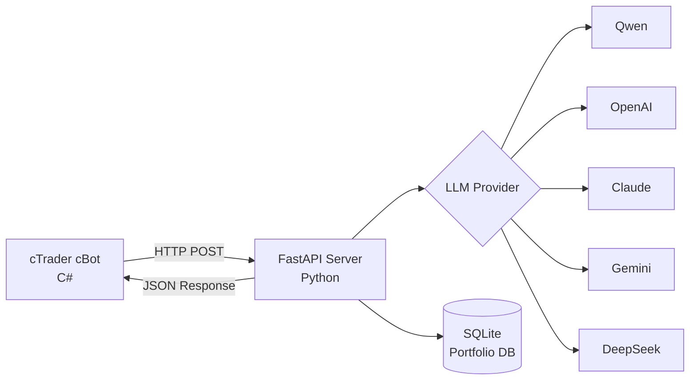

# 🤖 AgentFxTrading - AI搭載自動取引システム

<div align="center">

**TMS + ORB戦略による自動外国為替取引**

[](https://opensource.org/licenses/MIT)
[](https://www.python.org/downloads/)
[](https://ctdn.com/)
[](https://github.com/yourusername/AgentFxTrading/stargazers)
[](https://github.com/yourusername/AgentFxTrading/network/members)
[](https://github.com/yourusername/AgentFxTrading/issues)

[🇬🇧 English](README.md) | [🇻🇳 Tiếng Việt](README.vi.md) | [🇨🇳 中文](README.zh.md) | [🇵🇹 Português](README.pt.md) | [🇯🇵 日本語](README.ja.md) | [🇷🇺 Русский](README.ru.md)

[インストール](#-クイックスタート) • [機能](#-機能) • [戦略](#-取引戦略) • [APIドキュメント](#-apiドキュメント) • [貢献](#-貢献)

</div>

---

## 📋 目次

- [概要](#-概要)
- [機能](#-機能)
- [アーキテクチャ](#-アーキテクチャ)
- [クイックスタート](#-クイックスタート)
- [取引戦略](#-取引戦略)
- [設定](#-設定)
- [APIドキュメント](#-apiドキュメント)
- [開発](#-開発)
- [パフォーマンス](#-パフォーマンス)
- [貢献](#-貢献)
- [ライセンス](#-ライセンス)

---

## 🎯 概要

AgentFxTradingは、AIの力を実証済みのテクニカル分析戦略と組み合わせた**自動外国為替取引システム**です。**TMS（Trend Momentum Signal）**を使用してトレンド検出を行い、**ORB（Opening Range Breakout）**を使用して正確なエントリータイミングを提供します。

### AgentFxTradingを選ぶ理由

✅ **完全自律型** - AIが24時間365日取引判断  
✅ **マルチLLM対応** - Qwen、OpenAI、Claude、Gemini、DeepSeekで動作  
✅ **リスク管理** - 複数の通貨ペアにわたるポートフォリオレベルのリスク管理  
✅ **実証済み戦略** - プロフェッショナルなTMS方法論に基づく  
✅ **簡単セットアップ** - 10分以内に開始  
✅ **オープンソース** - 完全に透明でカスタマイズ可能  

---

## 🚀 機能

### 🤖 AIによる意思決定
- **マルチLLM対応**：Qwen、OpenAI GPT-4、Claude、Gemini、DeepSeek
- **コンテキスト認識分析**：3本のバーの履歴データを分析
- **信頼度スコアリング**：信頼度>70%の場合のみ取引
- **適応学習**：継続的改善のためのプロンプトエンジニアリング

### 📊 高度なテクニカル分析
- **TMS指標**：Heiken Ashi、TDI（RSI + Signal）、Stochastic
- **ORBロジック**：決定的ブレイクアウトフィルタ付きオープニングレンジ検出
- **モメンタム追跡**：傾き分析付きTF Green状態
- **市場レジーム検出 (Market Regime)**：カウフマン効率比率 (`er_session`, `er_recent`) と騙しブレイクアウトカウンター (`or_flips`) で `trending`, `choppy`, `mixed`, `forming` を分類
- **マルチタイムフレーム**：M15、H1、H4タイムフレームで動作

### 💼 ポートフォリオ管理
- **マルチシンボル取引**：異なる通貨ペアで複数のボットを実行
- **通貨エクスポージャー制御**：単一通貨への過剰エクスポージャーを防止
- **相関検出**：高度に相関するポジションをブロック
- **日次損失制限**：最大損失後に自動取引停止

### 🛡️ リスク管理
- **ポジションメモリ**：MFE（最大有利エクスカージョン）を追跡
- **自動ブレークイーブン**：利益閾値後にSLをエントリーに移動
- **トレーリングストップ**：利益の出ている取引中の動的SL調整
- **最大ギブバック保護**：ギブバックが閾値を超えた場合にポジションをクローズ
- **連敗保護**：3連敗後にエントリーをブロック
- **サイクルゲーティング (Cost Gate)**：セッション外、OR内、連敗中にLLM呼び出しを自動スキップし、APIコストを80-90%削減
- **トレンド時固定利確解除 (Trend TP Disabled)**：強いトレンド相場 (`trending`) で固定TPを自動解除し、トレーリングSLとギブバックフロアで利益を最大化
- **日次ローテーションログ**：すべてのAgent推論、サイクルゲート動作、市場スナップショットを `logs/agent_YYYY-MM-DD.log` に永続化（14日間保持）

### ⏰ セッション管理
- **取引セッション**：設定可能なセッション時間（ロンドン、NY、東京）
- **日末自動クローズ**：セッション終了時に自動的にポジションをクローズ
- **フェーズ検出**：プレマーケット、アクティブ、エンディング、クローズドフェーズ

---

## 🏗️ アーキテクチャ



### コンポーネント詳細

| コンポーネント | 技術 | 責任 |
|--------------|------|------|
| **cBot** | C# / cTrader | 指標計算、取引実行 |
| **Server** | Python / FastAPI | AI意思決定、リスク管理 |
| **Database** | SQLite | ポートフォリオ追跡、ポジション履歴 |
| **LLM** | 複数 | 取引判断分析 |

---

## ⚡ クイックスタート

### 前提条件

- Python 3.9+
- cTrader 4.x+
- LLM APIキー（Qwen/OpenAI/Claude/Gemini/DeepSeek）

### 1. Python依存関係のインストール

```bash
# リポジトリのクローン
git clone https://github.com/yourusername/AgentFxTrading.git
cd AgentFxTrading

# 依存関係のインストール
pip install -r requirements.txt
```

### 2. LLM Providerの設定

```bash
# 環境テンプレートのコピー
cp .env.example .env

# .envをAPIキーで編集
# Qwenの例（推奨）：
LLM_PROVIDER=qwen
DASHSCOPE_API_KEY=sk-your-dashscope-key
LLM_MODEL=qwen-max
```

### 3. サーバーの起動

```bash
python app/server.py
```

サーバーは`http://127.0.0.1:8000`で実行されます

### 4. cBotの設定と実行

cBotは**cTraderデスクトップGUI**または**ヘッドレスDocker CLI**（`ctrader-console`）のいずれかで実行できます。

#### オプションA：cTraderデスクトップGUI

1. **cTrader** → **Automate**を開く
2. **New** → **cBot**をクリック
3. `cBot/AiAgentBot.cs`からコードを貼り付け
4. **Build**をクリック
5. チャートにアタッチ（M15またはH1推奨）
6. パラメータを設定：
   - **Bot ID**：`xauusd_m15`（一意の識別子）
   - **API URL**：`http://127.0.0.1:8000/trade`
   - **Session**：New York（13:00-21:00 UTC）/ London（8:00-17:00 UTC）/ Tokyo（0:00-9:00 UTC）

#### オプションB：ヘッドレスDocker CLI（`ctrader-console`）

1. **cTID認証情報ファイルの準備**:
   ```bash
   mkdir -p /root/ctrader_data
   echo "your_ctid_password" > /root/ctrader_data/ctid_pwd
   chmod 600 /root/ctrader_data/ctid_pwd
   ```

2. **`.algo`パッケージのビルド/コンパイル**:
   ```bash
   docker run --rm -v $(pwd):/workspace -v /root:/root \
     ghcr.io/spotware/ctrader-console:latest create cbot AiAgentBot
   cp cBot/AiAgentBot.cs /root/cAlgo/Sources/Robots/AiAgentBot/AiAgentBot/AiAgentBot.cs
   docker run --rm -v $(pwd):/workspace -v /root:/root \
     ghcr.io/spotware/ctrader-console:latest build /root/cAlgo/Sources/Robots/AiAgentBot/AiAgentBot/AiAgentBot.csproj
   cp /root/cAlgo/Sources/Robots/AiAgentBot.algo cBot/AiAgentBot.algo
   ```

3. **各通貨ペア・インデックスのDockerコンテナ起動**:

   * **XAUUSD (M15 - ニューヨークセッション)**:
     ```bash
     docker run -d \
       --name cbot-xauusd \
       --restart unless-stopped \
       --network host \
       -v $(pwd):/workspace \
       -v /root:/root \
       ghcr.io/spotware/ctrader-console:latest \
       run /workspace/cBot/AiAgentBot.algo \
       --ctid=your_email@example.com \
       --pwd-file=/root/ctrader_data/ctid_pwd \
       --account=YOUR_ACCOUNT_ID \
       --symbol=XAUUSD \
       --period=m15 \
       --full-access \
       --BotId="xauusd_m15" \
       --ApiUrl="http://127.0.0.1:8000/trade" \
       --AccountLabel="demo" \
       --TmsTimeFrame="Hour" \
       --EmaPeriod=5 \
       --SessionName="newyork" \
       --OrbStartHour=13 \
       --SessionEndHour=21 \
       --SessionDstRule="US" \
       --MinDecisiveBreakoutPips=200.0 \
       --MinOrWidthPips=400.0 \
       --OrbBufferPips=50.0 \
       --BreakevenTriggerAtr=1.2 \
       --BreakevenOffsetAtr=0.1 \
       --TrailTriggerAtr=2.0 \
       --TrailDistanceAtr=1.0 \
       --PartialCloseRatio=0.5 \
       --MinSlAtr=0.8 \
       --MaxSlAtr=3.0 \
       --MinTpAtr=1.0 \
       --MaxTpAtr=6.0 \
       --MaxGivebackAtr=1.0 \
       --EnablePostTpGate=true \
       --PostTpPullbackAtr=0.5 \
       --BounceTradeEnabled=true \
       --BounceDistanceThreshold=10 \
       --RiskPerTradePercent=0.2 \
       --TrendTpDisabled=true
     ```

   * **EURUSD (M15 - ロンドンセッション)**:
     ```bash
     docker run -d \
       --name cbot-eurusd \
       --restart unless-stopped \
       --network host \
       -v $(pwd):/workspace \
       -v /root:/root \
       ghcr.io/spotware/ctrader-console:latest \
       run /workspace/cBot/AiAgentBot.algo \
       --ctid=your_email@example.com \
       --pwd-file=/root/ctrader_data/ctid_pwd \
       --account=YOUR_ACCOUNT_ID \
       --symbol=EURUSD \
       --period=m15 \
       --full-access \
       --BotId="eurusd_m15" \
       --ApiUrl="http://127.0.0.1:8000/trade" \
       --AccountLabel="demo" \
       --TmsTimeFrame="Hour" \
       --EmaPeriod=5 \
       --SessionName="london" \
       --OrbStartHour=8 \
       --SessionEndHour=17 \
       --SessionDstRule="Europe" \
       --MinDecisiveBreakoutPips=3.0 \
       --MinOrWidthPips=6.0 \
       --OrbBufferPips=1.0 \
       --BreakevenTriggerAtr=1.2 \
       --BreakevenOffsetAtr=0.1 \
       --TrailTriggerAtr=2.0 \
       --TrailDistanceAtr=1.0 \
       --PartialCloseRatio=0.5 \
       --MinSlAtr=0.8 \
       --MaxSlAtr=3.0 \
       --MinTpAtr=1.0 \
       --MaxTpAtr=6.0 \
       --MaxGivebackAtr=1.0 \
       --EnablePostTpGate=true \
       --PostTpPullbackAtr=0.5 \
       --BounceTradeEnabled=true \
       --BounceDistanceThreshold=5 \
       --RiskPerTradePercent=0.2 \
       --TrendTpDisabled=true
     ```

   * **GBPUSD (M15 - ロンドンセッション)**:
     ```bash
     docker run -d \
       --name cbot-gbpusd \
       --restart unless-stopped \
       --network host \
       -v $(pwd):/workspace \
       -v /root:/root \
       ghcr.io/spotware/ctrader-console:latest \
       run /workspace/cBot/AiAgentBot.algo \
       --ctid=your_email@example.com \
       --pwd-file=/root/ctrader_data/ctid_pwd \
       --account=YOUR_ACCOUNT_ID \
       --symbol=GBPUSD \
       --period=m15 \
       --full-access \
       --BotId="gbpusd_m15" \
       --ApiUrl="http://127.0.0.1:8000/trade" \
       --AccountLabel="demo" \
       --TmsTimeFrame="Hour" \
       --EmaPeriod=5 \
       --SessionName="london" \
       --OrbStartHour=8 \
       --SessionEndHour=17 \
       --SessionDstRule="Europe" \
       --MinDecisiveBreakoutPips=4.5 \
       --MinOrWidthPips=10.0 \
       --OrbBufferPips=1.5 \
       --BreakevenTriggerAtr=1.2 \
       --BreakevenOffsetAtr=0.1 \
       --TrailTriggerAtr=2.0 \
       --TrailDistanceAtr=1.0 \
       --PartialCloseRatio=0.5 \
       --MinSlAtr=0.8 \
       --MaxSlAtr=3.0 \
       --MinTpAtr=1.0 \
       --MaxTpAtr=6.0 \
       --MaxGivebackAtr=1.0 \
       --EnablePostTpGate=true \
       --PostTpPullbackAtr=0.5 \
       --BounceTradeEnabled=true \
       --BounceDistanceThreshold=10 \
       --RiskPerTradePercent=0.2 \
       --TrendTpDisabled=true
     ```

   * **USDJPY (M15 - 東京セッション)**:
     ```bash
     docker run -d \
       --name cbot-usdjpy \
       --restart unless-stopped \
       --network host \
       -v $(pwd):/workspace \
       -v /root:/root \
       ghcr.io/spotware/ctrader-console:latest \
       run /workspace/cBot/AiAgentBot.algo \
       --ctid=your_email@example.com \
       --pwd-file=/root/ctrader_data/ctid_pwd \
       --account=YOUR_ACCOUNT_ID \
       --symbol=USDJPY \
       --period=m15 \
       --full-access \
       --BotId="usdjpy_m15" \
       --ApiUrl="http://127.0.0.1:8000/trade" \
       --AccountLabel="demo" \
       --TmsTimeFrame="Hour" \
       --EmaPeriod=5 \
       --SessionName="tokyo" \
       --OrbStartHour=0 \
       --SessionEndHour=9 \
       --SessionDstRule="None" \
       --MinDecisiveBreakoutPips=4.0 \
       --MinOrWidthPips=8.0 \
       --OrbBufferPips=1.5 \
       --BreakevenTriggerAtr=1.2 \
       --BreakevenOffsetAtr=0.1 \
       --TrailTriggerAtr=2.0 \
       --TrailDistanceAtr=1.0 \
       --PartialCloseRatio=0.5 \
       --MinSlAtr=0.8 \
       --MaxSlAtr=3.0 \
       --MinTpAtr=1.0 \
       --MaxTpAtr=6.0 \
       --MaxGivebackAtr=1.0 \
       --EnablePostTpGate=true \
       --PostTpPullbackAtr=0.5 \
       --BounceTradeEnabled=true \
       --BounceDistanceThreshold=3 \
       --RiskPerTradePercent=0.2 \
       --TrendTpDisabled=true
     ```

   * **US30 (M15 - ニューヨークインデックスセッション)**:
     ```bash
     docker run -d \
       --name cbot-us30 \
       --restart unless-stopped \
       --network host \
       -v $(pwd):/workspace \
       -v /root:/root \
       ghcr.io/spotware/ctrader-console:latest \
       run /workspace/cBot/AiAgentBot.algo \
       --ctid=your_email@example.com \
       --pwd-file=/root/ctrader_data/ctid_pwd \
       --account=YOUR_ACCOUNT_ID \
       --symbol=US30 \
       --period=m15 \
       --full-access \
       --BotId="us30_m15" \
       --ApiUrl="http://127.0.0.1:8000/trade" \
       --AccountLabel="demo" \
       --TmsTimeFrame="Hour" \
       --EmaPeriod=5 \
       --SessionName="newyork_index" \
       --OrbStartHour=13 \
       --SessionEndHour=20 \
       --SessionDstRule="US" \
       --MinDecisiveBreakoutPips=30.0 \
       --MinOrWidthPips=80.0 \
       --OrbBufferPips=15.0 \
       --BreakevenTriggerAtr=1.2 \
       --BreakevenOffsetAtr=0.1 \
       --TrailTriggerAtr=2.0 \
       --TrailDistanceAtr=1.0 \
       --PartialCloseRatio=0.5 \
       --MinSlAtr=0.8 \
       --MaxSlAtr=3.0 \
       --MinTpAtr=1.0 \
       --MaxTpAtr=6.0 \
       --MaxGivebackAtr=1.0 \
       --EnablePostTpGate=true \
       --PostTpPullbackAtr=0.5 \
       --BounceTradeEnabled=true \
       --BounceDistanceThreshold=30 \
       --RiskPerTradePercent=0.2 \
       --TrendTpDisabled=true
     ```

   * **USTEC / NAS100 (M5 - ニューヨークインデックスセッション)** *(注意：ブローカーによって `USTEC` または `NAS100` を使用)*:
     ```bash
     docker run -d \
       --name cbot-ustec \
       --restart unless-stopped \
       --network host \
       -v $(pwd):/workspace \
       -v /root:/root \
       ghcr.io/spotware/ctrader-console:latest \
       run /workspace/cBot/AiAgentBot.algo \
       --ctid=your_email@example.com \
       --pwd-file=/root/ctrader_data/ctid_pwd \
       --account=YOUR_ACCOUNT_ID \
       --symbol=USTEC \
       --period=m5 \
       --full-access \
       --BotId="ustec_m5" \
       --ApiUrl="http://127.0.0.1:8000/trade" \
       --AccountLabel="demo" \
       --TmsTimeFrame="Hour" \
       --EmaPeriod=5 \
       --SessionName="newyork_index" \
       --OrbStartHour=13 \
       --SessionEndHour=20 \
       --SessionDstRule="US" \
       --MinDecisiveBreakoutPips=25.0 \
       --MinOrWidthPips=70.0 \
       --OrbBufferPips=12.0 \
       --BreakevenTriggerAtr=1.2 \
       --BreakevenOffsetAtr=0.1 \
       --TrailTriggerAtr=2.0 \
       --TrailDistanceAtr=1.0 \
       --PartialCloseRatio=0.5 \
       --MinSlAtr=0.8 \
       --MaxSlAtr=3.0 \
       --MinTpAtr=1.0 \
       --MaxTpAtr=6.0 \
       --MaxGivebackAtr=1.0 \
       --EnablePostTpGate=true \
       --PostTpPullbackAtr=0.5 \
       --BounceTradeEnabled=true \
       --BounceDistanceThreshold=25 \
       --RiskPerTradePercent=0.2 \
       --TrendTpDisabled=true
     ```

   * **GBPJPY (M15 - ロンドンセッション / 高ボラティリティクロス)**:
     ```bash
     docker run -d \
       --name cbot-gbpjpy \
       --restart unless-stopped \
       --network host \
       -v $(pwd):/workspace \
       -v /root:/root \
       ghcr.io/spotware/ctrader-console:latest \
       run /workspace/cBot/AiAgentBot.algo \
       --ctid=your_email@example.com \
       --pwd-file=/root/ctrader_data/ctid_pwd \
       --account=YOUR_ACCOUNT_ID \
       --symbol=GBPJPY \
       --period=m15 \
       --full-access \
       --BotId="gbpjpy_m15" \
       --ApiUrl="http://127.0.0.1:8000/trade" \
       --AccountLabel="demo" \
       --TmsTimeFrame="Hour" \
       --EmaPeriod=5 \
       --SessionName="london" \
       --OrbStartHour=8 \
       --SessionEndHour=17 \
       --SessionDstRule="Europe" \
       --MinDecisiveBreakoutPips=6.0 \
       --MinOrWidthPips=15.0 \
       --OrbBufferPips=2.0 \
       --BreakevenTriggerAtr=1.2 \
       --BreakevenOffsetAtr=0.1 \
       --TrailTriggerAtr=2.0 \
       --TrailDistanceAtr=1.0 \
       --PartialCloseRatio=0.5 \
       --MinSlAtr=0.8 \
       --MaxSlAtr=3.0 \
       --MinTpAtr=1.0 \
       --MaxTpAtr=6.0 \
       --MaxGivebackAtr=1.0 \
       --EnablePostTpGate=true \
       --PostTpPullbackAtr=0.5 \
       --BounceTradeEnabled=true \
       --BounceDistanceThreshold=5 \
       --RiskPerTradePercent=0.2 \
       --TrendTpDisabled=true
     ```

   * **EURJPY (M15 - ロンドンセッション / 高ボラティリティクロス)**:
     ```bash
     docker run -d \
       --name cbot-eurjpy \
       --restart unless-stopped \
       --network host \
       -v $(pwd):/workspace \
       -v /root:/root \
       ghcr.io/spotware/ctrader-console:latest \
       run /workspace/cBot/AiAgentBot.algo \
       --ctid=your_email@example.com \
       --pwd-file=/root/ctrader_data/ctid_pwd \
       --account=YOUR_ACCOUNT_ID \
       --symbol=EURJPY \
       --period=m15 \
       --full-access \
       --BotId="eurjpy_m15" \
       --ApiUrl="http://127.0.0.1:8000/trade" \
       --AccountLabel="demo" \
       --TmsTimeFrame="Hour" \
       --EmaPeriod=5 \
       --SessionName="london" \
       --OrbStartHour=8 \
       --SessionEndHour=17 \
       --SessionDstRule="Europe" \
       --MinDecisiveBreakoutPips=5.0 \
       --MinOrWidthPips=12.0 \
       --OrbBufferPips=1.5 \
       --BreakevenTriggerAtr=1.2 \
       --BreakevenOffsetAtr=0.1 \
       --TrailTriggerAtr=2.0 \
       --TrailDistanceAtr=1.0 \
       --PartialCloseRatio=0.5 \
       --MinSlAtr=0.8 \
       --MaxSlAtr=3.0 \
       --MinTpAtr=1.0 \
       --MaxTpAtr=6.0 \
       --MaxGivebackAtr=1.0 \
       --EnablePostTpGate=true \
       --PostTpPullbackAtr=0.5 \
       --BounceTradeEnabled=true \
       --BounceDistanceThreshold=5 \
       --RiskPerTradePercent=0.2 \
       --TrendTpDisabled=true
     ```

   * **USDCAD (M15 - ニューヨークセッション / コモディティFX)**:
     ```bash
     docker run -d \
       --name cbot-usdcad \
       --restart unless-stopped \
       --network host \
       -v $(pwd):/workspace \
       -v /root:/root \
       ghcr.io/spotware/ctrader-console:latest \
       run /workspace/cBot/AiAgentBot.algo \
       --ctid=your_email@example.com \
       --pwd-file=/root/ctrader_data/ctid_pwd \
       --account=YOUR_ACCOUNT_ID \
       --symbol=USDCAD \
       --period=m15 \
       --full-access \
       --BotId="usdcad_m15" \
       --ApiUrl="http://127.0.0.1:8000/trade" \
       --AccountLabel="demo" \
       --TmsTimeFrame="Hour" \
       --EmaPeriod=5 \
       --SessionName="newyork" \
       --OrbStartHour=13 \
       --SessionEndHour=21 \
       --SessionDstRule="US" \
       --MinDecisiveBreakoutPips=4.0 \
       --MinOrWidthPips=10.0 \
       --OrbBufferPips=1.5 \
       --BreakevenTriggerAtr=1.2 \
       --BreakevenOffsetAtr=0.1 \
       --TrailTriggerAtr=2.0 \
       --TrailDistanceAtr=1.0 \
       --PartialCloseRatio=0.5 \
       --MinSlAtr=0.8 \
       --MaxSlAtr=3.0 \
       --MinTpAtr=1.0 \
       --MaxTpAtr=6.0 \
       --MaxGivebackAtr=1.0 \
       --EnablePostTpGate=true \
       --PostTpPullbackAtr=0.5 \
       --BounceTradeEnabled=true \
       --BounceDistanceThreshold=4 \
       --RiskPerTradePercent=0.2 \
       --TrendTpDisabled=true
     ```

   * **AUDUSD (M15 - アジア/東京セッション / コモディティFX)**:
     ```bash
     docker run -d \
       --name cbot-audusd \
       --restart unless-stopped \
       --network host \
       -v $(pwd):/workspace \
       -v /root:/root \
       ghcr.io/spotware/ctrader-console:latest \
       run /workspace/cBot/AiAgentBot.algo \
       --ctid=your_email@example.com \
       --pwd-file=/root/ctrader_data/ctid_pwd \
       --account=YOUR_ACCOUNT_ID \
       --symbol=AUDUSD \
       --period=m15 \
       --full-access \
       --BotId="audusd_m15" \
       --ApiUrl="http://127.0.0.1:8000/trade" \
       --AccountLabel="demo" \
       --TmsTimeFrame="Hour" \
       --EmaPeriod=5 \
       --SessionName="tokyo" \
       --OrbStartHour=0 \
       --SessionEndHour=9 \
       --SessionDstRule="None" \
       --MinDecisiveBreakoutPips=3.0 \
       --MinOrWidthPips=8.0 \
       --OrbBufferPips=1.0 \
       --BreakevenTriggerAtr=1.2 \
       --BreakevenOffsetAtr=0.1 \
       --TrailTriggerAtr=2.0 \
       --TrailDistanceAtr=1.0 \
       --PartialCloseRatio=0.5 \
       --MinSlAtr=0.8 \
       --MaxSlAtr=3.0 \
       --MinTpAtr=1.0 \
       --MaxTpAtr=6.0 \
       --MaxGivebackAtr=1.0 \
       --EnablePostTpGate=true \
       --PostTpPullbackAtr=0.5 \
       --BounceTradeEnabled=true \
       --BounceDistanceThreshold=3 \
       --RiskPerTradePercent=0.2 \
       --TrendTpDisabled=true
     ```

   * **DE40 / DAX40 (M5 - ヨーロッパ/ロンドンセッション / ドイツ株式指数)** *(注意：ブローカーによって `DE40` または `GER40` を使用)*:
     ```bash
     docker run -d \
       --name cbot-de40 \
       --restart unless-stopped \
       --network host \
       -v $(pwd):/workspace \
       -v /root:/root \
       ghcr.io/spotware/ctrader-console:latest \
       run /workspace/cBot/AiAgentBot.algo \
       --ctid=your_email@example.com \
       --pwd-file=/root/ctrader_data/ctid_pwd \
       --account=YOUR_ACCOUNT_ID \
       --symbol=DE40 \
       --period=m15 \
       --full-access \
       --BotId="de40_m15" \
       --ApiUrl="http://127.0.0.1:8000/trade" \
       --AccountLabel="demo" \
       --TmsTimeFrame="Hour" \
       --EmaPeriod=5 \
       --SessionName="london" \
       --OrbStartHour=8 \
       --SessionEndHour=16 \
       --SessionDstRule="Europe" \
       --MinDecisiveBreakoutPips=20.0 \
       --MinOrWidthPips=60.0 \
       --OrbBufferPips=10.0 \
       --BreakevenTriggerAtr=1.2 \
       --BreakevenOffsetAtr=0.1 \
       --TrailTriggerAtr=2.0 \
       --TrailDistanceAtr=1.0 \
       --PartialCloseRatio=0.5 \
       --MinSlAtr=0.8 \
       --MaxSlAtr=3.0 \
       --MinTpAtr=1.0 \
       --MaxTpAtr=6.0 \
       --MaxGivebackAtr=1.0 \
       --EnablePostTpGate=true \
       --PostTpPullbackAtr=0.5 \
       --BounceTradeEnabled=true \
       --BounceDistanceThreshold=25 \
       --RiskPerTradePercent=0.2 \
       --TrendTpDisabled=true
     ```

   * **AUDJPY (M15 - アジア/東京セッション / リスクバロメータークロス)**:
     ```bash
     docker run -d \
       --name cbot-audjpy \
       --restart unless-stopped \
       --network host \
       -v $(pwd):/workspace \
       -v /root:/root \
       ghcr.io/spotware/ctrader-console:latest \
       run /workspace/cBot/AiAgentBot.algo \
       --ctid=your_email@example.com \
       --pwd-file=/root/ctrader_data/ctid_pwd \
       --account=YOUR_ACCOUNT_ID \
       --symbol=AUDJPY \
       --period=m15 \
       --full-access \
       --BotId="audjpy_m15" \
       --ApiUrl="http://127.0.0.1:8000/trade" \
       --AccountLabel="demo" \
       --TmsTimeFrame="Hour" \
       --EmaPeriod=5 \
       --SessionName="tokyo" \
       --OrbStartHour=0 \
       --SessionEndHour=9 \
       --SessionDstRule="None" \
       --MinDecisiveBreakoutPips=4.0 \
       --MinOrWidthPips=10.0 \
       --OrbBufferPips=1.5 \
       --BreakevenTriggerAtr=1.2 \
       --BreakevenOffsetAtr=0.1 \
       --TrailTriggerAtr=2.0 \
       --TrailDistanceAtr=1.0 \
       --PartialCloseRatio=0.5 \
       --MinSlAtr=0.8 \
       --MaxSlAtr=3.0 \
       --MinTpAtr=1.0 \
       --MaxTpAtr=6.0 \
       --MaxGivebackAtr=1.0 \
       --EnablePostTpGate=true \
       --PostTpPullbackAtr=0.5 \
       --BounceTradeEnabled=true \
       --BounceDistanceThreshold=4 \
       --RiskPerTradePercent=0.2 \
       --TrendTpDisabled=true
     ```

   * **BTCUSD (M15 - ニューヨークセッション / 暗号資産モメンタム)**:
     ```bash
     docker run -d \
       --name cbot-btcusd \
       --restart unless-stopped \
       --network host \
       -v $(pwd):/workspace \
       -v /root:/root \
       ghcr.io/spotware/ctrader-console:latest \
       run /workspace/cBot/AiAgentBot.algo \
       --ctid=your_email@example.com \
       --pwd-file=/root/ctrader_data/ctid_pwd \
       --account=YOUR_ACCOUNT_ID \
       --symbol=BTCUSD \
       --period=m15 \
       --full-access \
       --BotId="btcusd_m15" \
       --ApiUrl="http://127.0.0.1:8000/trade" \
       --AccountLabel="demo" \
       --TmsTimeFrame="Hour" \
       --EmaPeriod=5 \
       --SessionName="newyork" \
       --OrbStartHour=13 \
       --SessionEndHour=22 \
       --SessionDstRule="US" \
       --MinDecisiveBreakoutPips=150.0 \
       --MinOrWidthPips=300.0 \
       --OrbBufferPips=50.0 \
       --PartialCloseRatio=0.5 \
       --EnablePostTpGate=true \
       --BounceTradeEnabled=true \
       --BounceDistanceThreshold=1.5 \
       --RiskPerTradePercent=0.2 \
       --UseAtr=true \
       --AtrPeriod=14 \
       --AtrSlMultiplier=2.0 \
       --AtrTpMultiplier=3.5 \
       --BreakevenTriggerAtr=1.5 \
       --BreakevenOffsetAtr=0.1 \
       --TrailTriggerAtr=2.5 \
       --TrailDistanceAtr=1.5 \
       --MinSlAtr=1.0 \
       --MaxSlAtr=4.0 \
       --MinTpAtr=1.5 \
       --MaxTpAtr=8.0 \
       --MaxGivebackAtr=1.5 \
       --PostTpPullbackAtr=0.5 \
       --TrendTpDisabled=true
     ```

   * **ETHUSD (M15 - ニューヨークセッション / 暗号資産モメンタム)**:
     ```bash
     docker run -d \
       --name cbot-ethusd \
       --restart unless-stopped \
       --network host \
       -v $(pwd):/workspace \
       -v /root:/root \
       ghcr.io/spotware/ctrader-console:latest \
       run /workspace/cBot/AiAgentBot.algo \
       --ctid=your_email@example.com \
       --pwd-file=/root/ctrader_data/ctid_pwd \
       --account=YOUR_ACCOUNT_ID \
       --symbol=ETHUSD \
       --period=m15 \
       --full-access \
       --BotId="ethusd_m15" \
       --ApiUrl="http://127.0.0.1:8000/trade" \
       --AccountLabel="demo" \
       --TmsTimeFrame="Hour" \
       --EmaPeriod=5 \
       --SessionName="newyork" \
       --OrbStartHour=13 \
       --SessionEndHour=22 \
       --SessionDstRule="US" \
       --MinDecisiveBreakoutPips=80.0 \
       --MinOrWidthPips=150.0 \
       --OrbBufferPips=25.0 \
       --PartialCloseRatio=0.5 \
       --EnablePostTpGate=true \
       --BounceTradeEnabled=true \
       --BounceDistanceThreshold=1.5 \
       --RiskPerTradePercent=0.2 \
       --UseAtr=true \
       --AtrPeriod=14 \
       --AtrSlMultiplier=2.0 \
       --AtrTpMultiplier=3.5 \
       --BreakevenTriggerAtr=1.5 \
       --BreakevenOffsetAtr=0.1 \
       --TrailTriggerAtr=2.5 \
       --TrailDistanceAtr=1.5 \
       --MinSlAtr=1.0 \
       --MaxSlAtr=4.0 \
       --MinTpAtr=1.5 \
       --MaxTpAtr=8.0 \
       --MaxGivebackAtr=1.5 \
       --PostTpPullbackAtr=0.5 \
       --TrendTpDisabled=true
     ```
### 5. 取引開始！🎉

ボットは自動的に：
- 各バーのクローズ時に指標を計算
- AIサーバーに市場スナップショットを送信
- 取引判断を受信
- リスク管理付きで取引を実行

---

## 📈 取引戦略

### TMS（Trend Momentum Signal）

TMSは3つの確認を使用して**方向性バイアス**を識別します：

| 指標 | 強気シグナル | 弱気シグナル |
|------|-------------|-------------|
| **TDI** | Green > Red | Green < Red |
| **Heiken Ashi** | 緑のローソク足 | 赤のローソク足 |
| **Stochastic** | K > D | K < D |

**重要な概念**：バイアスは次のクロスまでロックされ、ウィップソーを防ぎます。

### ORB（Opening Range Breakout）

ORBは**正確なエントリータイミング**を提供します：

1. **オープニングレンジ**：セッションの最初の15分のHigh/Low
2. **ブレイクアウト**：価格がOR境界を超えてクローズ
3. **決定的フィルタ**：ブレイクアウトは決定的である必要があります（≥ MinDecisiveBreakoutPips、XAUUSDデフォルトは10.0 pips）

### 市場レジーム検出 (Market Regime)

システムはリアルタイムの資金効率指標を計算し、取引および決済動作を動的に適応させます：
- **`er_session` & `er_recent`**：カウフマン効率比率 ($ER = \frac{|\text{純移動距離}|}{\sum |\text{ローソク足変動}|}$)。$1.0$ はきれいな一方向トレンド、$\approx 0.0$ はノイズの多いもみ合いを示します。
- **`or_flips`**：オープニングレンジをブレイクした後に再びレンジ内に終値で戻った騙しの回数をカウントします。
- **4つの市場レジーム**：
  - **`trending`** ($ER \ge 0.35$)：固定TPを自動解除 (`TrendTpDisabled = true`) し、トレーリングSLとギブバックフロアで大きなトレンド利益を獲得。
  - **`choppy`** (`or_flips \ge 5`)：騙しブレイクアウトの危険が高い → サイクルゲートが強制的に `HOLD` を選択。
  - **`mixed`**：標準的な取引規律 ($R:R \ge 1.5$)。
  - **`forming`**：セッション初期のレンジ形成フェーズ ($< 6$ 本)。

### エントリーモデル & 定量的取引規律
- **モデル 1: ダイレクト・モメンタム・ブレイクアウト**: 価格がエントリーウィンドウ内（$\le 5$本）でオープニングレンジ境界を決定的に突破。
- **モデル 2: ブレイクアウトリテスト + TDIバウンス (押し目・戻り継続)**: ブレイクアウトが進行した場合（$> 5$本）、検証済みの**TDIバウンス**（`tdi_bounce_bull` / `tdi_bounce_bear`）が発生し、かつ価格が5 EMA近傍に構造的に位置している場合（BUYは`price_above_ema` / SELLは`price_below_ema`）のみエントリーを許可し、底値や天井での飛び乗りを防止。
- **BIAS-FRESH 例外**：TDIクロスが直近で発生した場合（$\le 1$ 本前）、早期のブレイクアウト推進力は**新しいトレンド波の開始**とみなされ、買われすぎ/売られすぎではないと判断 → 順張りエントリーを強く推奨。
- **ANTI-CHASE ルール**：古いバイアス下で有効な押し目なく $\ge 4$ 本以上ブレイクアウトが進んでいる場合、**高値・安値を追随して飛び乗ることを禁止** → `HOLD` で押し目・戻りを待つ。
- **ポジション呼吸スペース & ギブバックフロア**：短期的なノイズ（特に暗号資産や株価指数）に対してポジションに十分な呼吸スペースを提供。毎Tick最高含み益 ($MFE$) を追跡し、大勝ちしたポジション（$\ge 1.5\times$ ATRまたはBE到達後）で反転確認を伴うギブバック超過時のみ自動決済して利益を確保。
### エントリールール

```
IF TMS強気 AND ORBブレイクアウトUP AND 決定的:
    → BUY
    
IF TMS弱気 AND ORBブレイクアウトDOWN AND 決定的:
    → SELL
    
ELSE:
    → HOLD
```

### エグジットルール

| 条件 | アクション |
|------|-----------|
| 確認されたTDI反転（Redライン逆クロス / 買われすぎ・売られすぎ反転でのEMA喪失） | CLOSE_ALL |
| バイアスが反転 | 自動クローズ |
| セッション終了（EOD） | 自動全クローズ（EOD Force-Flatten安全ネット） |
| 利益 ≥ 1.2x ATR | SLをブレークイーブンに移動（+0.1x ATRオフセット） |
| 利益 ≥ 2.0x ATR | SLを1.0x ATRトレーリング |
| ギブバック ≥ 1.0x ATR（BE到達後） | 自動クローズ（最大ギブバック保護） |

---

## ⚙️ 設定

### cBotパラメータ

#### TMS設定（マルチタイムフレーム）
| パラメータ | デフォルト | 説明 |
|-----------|-----------|------|
| TMS Timeframe (Macro) | Hour (H1) | マクロトレンドバイアス時間軸（H1, H4, M15など） |
| RSI Period | 6 | RSI計算期間 |
| Red Period | 6 | シグナルライン期間 |

#### Stochastic設定
| パラメータ | デフォルト | 説明 |
|-----------|-----------|------|
| %K Period | 6 | 高速ストキャスティクス |
| %D Period | 6 | 低速ストキャスティクス |
| Slowing | 4 | スムージングファクター |

#### エントリーフィルタ
| パラメータ | デフォルト | 説明 |
|-----------|-----------|------|
| Max Bars After Cross | 5 | エントリーウィンドウ |
| Min Angle Delta | 0.0 | 角度フィルタ（0=オフ） |
| Min Decisive Breakout | 10.0 pips | ブレイクアウト強度（XAUUSD向けに最適化） |

#### エグジット管理
| パラメータ | デフォルト | 説明 |
|-----------|-----------|------|
| Flat Threshold | 0.01 | TDI平坦度 |
| Breakeven Trigger | 30.0 pips | SL移動の利益 |
| Breakeven Offset | 2.0 pips | ブレークイーブン確保利益 |
| Trail Trigger | 50.0 pips | トレーリング開始の利益 |
| Trail Distance | 25.0 pips | 価格からのSL距離 |

#### セッション
| パラメータ | デフォルト | 説明 |
|-----------|-----------|------|
| Session Start Hour | 13 (UTC) | ニューヨークオープン（冬時間UTC） |
| Session End Hour | 21 (UTC) | ニューヨーククローズ（EOD強制決済） |
| Opening Range | 15 min | OR計算ウィンドウ |
| Min OR Width | 20.0 pips | 最小OR幅 |
| ORB Buffer | 3.0 pips | ダマシ防止バッファ |
| DST Rule | US | 自動サマータイム調整 |

#### リスク管理 (ダイナミックサイジング & ATR)
| パラメータ | デフォルト | 説明 |
|------------|------------|------|
| Use ATR for SL/TP | true | ATRに基づいた動的SL/TPを計算 |
| ATR Period | 14 | ATRの計算期間 |
| ATR SL Multiplier | 1.5 | ATRストップロス距離乗数 |
| ATR TP Multiplier | 2.0 | ATRテイクプロフィット距離乗数 |
| Risk per Trade (%) | 0.2 | 1トレードあたりのリスク許容割合 (%) |

#### ガードレール
| パラメータ | デフォルト | 説明 |
|-----------|-----------|------|
| Min SL | 20.0 pips | 最小ストップロス |
| Max SL | 80.0 pips | 最大ストップロス |
| Min TP | 30.0 pips | 最小テイクプロフィット |
| Max TP | 250.0 pips | 最大テイクプロフィット |
| Max Giveback | 30.0 pips | 決済強制ギブバック閾値 |
| Max Loss Streak | 3 | N回損失後にブロック |
| Bias Flip Exit | true | バイアス変化時の自動クローズ |
| Trend TP Disabled | true | トレンド相場で固定利確を自動解除 |

### 📊 Recommended Presets by Symbol

#### Cryptocurrency

| Parameter | BTCUSD | ETHUSD |
| :--- | :--- | :--- |
| **Trading Session** | New York | New York |
| **DST Rule** | `US` | `US` |
| **Min Decisive Breakout** | `150.0 pips` | `80.0 pips` |
| **Min OR Width** | `300.0 pips` | `150.0 pips` |
| **ORB Buffer** | `50.0 pips` | `25.0 pips` |
| **Breakeven Trigger** | `1.5x ATR` | `1.5x ATR` |
| **Breakeven Offset** | `0.1x ATR` | `0.1x ATR` |
| **Trail Trigger** | `2.5x ATR` | `2.5x ATR` |
| **Trail Distance** | `1.5x ATR` | `1.5x ATR` |
| **Min SL / Max SL** | `1.0x / 4.0x ATR` | `1.0x / 4.0x ATR` |
| **Min TP / Max TP** | `1.5x / 8.0x ATR` | `1.5x / 8.0x ATR` |
| **Max Giveback** | `1.5x ATR` | `1.5x ATR` |
| **Recommended Timeframe** | `M15` | `M15` |
| **EMA Period** | `5` | `5` |
| **Post-TP Gate / Pullback** | `true` (`0.5x ATR`) | `true` (`0.5x ATR`) |
| **TDI Bounce Trade** | `1.5` | `1.5` |
| **Partial Close at BE** | `0.5 (50%)` | `0.5 (50%)` |
| **Risk per Trade** | `0.2%` | `0.2%` |
| **Use ATR for SL/TP** | `true` | `true` |
| **ATR Period** | `14` | `14` |
| **ATR SL Multiplier** | `2.0x ATR` | `2.0x ATR` |
| **ATR TP Multiplier** | `3.5x ATR` | `3.5x ATR` |

#### Metals & Indices

| Parameter | XAUUSD | US30 | USTEC | DE40 |
| :--- | :--- | :--- | :--- | :--- |
| **Trading Session** | New York | New York (Index) | New York (Index) | London |
| **DST Rule** | `US` | `US` | `US` | `Europe` |
| **Min Decisive Breakout** | `100.0 pips` | `100.0 pips` | `80.0 pips` | `70.0 pips` |
| **Min OR Width** | `250.0 pips` | `300.0 pips` | `250.0 pips` | `200.0 pips` |
| **ORB Buffer** | `30.0 pips` | `50.0 pips` | `40.0 pips` | `35.0 pips` |
| **Breakeven Trigger** | `1.2x ATR` | `2.0x ATR` | `2.0x ATR` | `2.0x ATR` |
| **Breakeven Offset** | `0.1x ATR` | `0.1x ATR` | `0.1x ATR` | `0.1x ATR` |
| **Trail Trigger** | `2.0x ATR` | `3.0x ATR` | `3.0x ATR` | `3.0x ATR` |
| **Trail Distance** | `1.0x ATR` | `1.5x ATR` | `1.5x ATR` | `1.5x ATR` |
| **Min SL / Max SL** | `0.8x / 3.0x ATR` | `1.5x / 4.5x ATR` | `1.5x / 4.5x ATR` | `1.5x / 4.5x ATR` |
| **Min TP / Max TP** | `1.0x / 6.0x ATR` | `2.0x / 8.0x ATR` | `2.0x / 8.0x ATR` | `2.0x / 8.0x ATR` |
| **Max Giveback** | `1.0x ATR` | `1.5x ATR` | `1.5x ATR` | `1.5x ATR` |
| **Recommended Timeframe** | `M15` | `M15` | `M5` | `M15` |
| **EMA Period** | `5` | `5` | `5` | `5` |
| **Post-TP Gate / Pullback** | `true` (`0.5x ATR`) | `true` (`0.5x ATR`) | `true` (`0.5x ATR`) | `true` (`0.5x ATR`) |
| **TDI Bounce Trade** | `1.5` | `1.5` | `1.5` | `1.5` |
| **Partial Close at BE** | `0.5 (50%)` | `0.5 (50%)` | `0.5 (50%)` | `0.5 (50%)` |
| **Risk per Trade** | `0.2%` | `0.2%` | `0.2%` | `0.2%` |
| **Use ATR for SL/TP** | `true` | `true` | `true` | `true` |
| **ATR Period** | `14` | `14` | `14` | `14` |
| **ATR SL Multiplier** | `1.5x ATR` | `2.5x ATR` | `2.5x ATR` | `2.5x ATR` |
| **ATR TP Multiplier** | `2.0x ATR` | `3.5x ATR` | `3.5x ATR` | `3.5x ATR` |

#### Forex Majors

| Parameter | EURUSD | GBPUSD | USDJPY | USDCAD |
| :--- | :--- | :--- | :--- | :--- |
| **Trading Session** | London | London | Tokyo | New York |
| **DST Rule** | `Europe` | `Europe` | `None` | `US` |
| **Min Decisive Breakout** | `2.5 pips` | `3.5 pips` | `3.0 pips` | `3.5 pips` |
| **Min OR Width** | `5.0 pips` | `7.0 pips` | `5.0 pips` | `7.0 pips` |
| **ORB Buffer** | `1.0 pips` | `1.2 pips` | `1.0 pips` | `1.2 pips` |
| **Breakeven Trigger** | `1.2x ATR` | `1.2x ATR` | `1.2x ATR` | `1.2x ATR` |
| **Breakeven Offset** | `0.1x ATR` | `0.1x ATR` | `0.1x ATR` | `0.1x ATR` |
| **Trail Trigger** | `2.0x ATR` | `2.0x ATR` | `2.0x ATR` | `2.0x ATR` |
| **Trail Distance** | `1.0x ATR` | `1.0x ATR` | `1.0x ATR` | `1.0x ATR` |
| **Min SL / Max SL** | `0.8x / 3.0x ATR` | `0.8x / 3.0x ATR` | `0.8x / 3.0x ATR` | `0.8x / 3.0x ATR` |
| **Min TP / Max TP** | `1.0x / 6.0x ATR` | `1.0x / 6.0x ATR` | `1.0x / 6.0x ATR` | `1.0x / 6.0x ATR` |
| **Max Giveback** | `1.0x ATR` | `1.0x ATR` | `1.0x ATR` | `1.0x ATR` |
| **Recommended Timeframe** | `M15` | `M15` | `M15` | `M15` |
| **EMA Period** | `5` | `5` | `5` | `5` |
| **Post-TP Gate / Pullback** | `true` (`0.5x ATR`) | `true` (`0.5x ATR`) | `true` (`0.5x ATR`) | `true` (`0.5x ATR`) |
| **TDI Bounce Trade** | `1.5` | `1.5` | `1.5` | `1.5` |
| **Partial Close at BE** | `0.5 (50%)` | `0.5 (50%)` | `0.5 (50%)` | `0.5 (50%)` |
| **Risk per Trade** | `0.2%` | `0.2%` | `0.2%` | `0.2%` |
| **Use ATR for SL/TP** | `true` | `true` | `true` | `true` |
| **ATR Period** | `14` | `14` | `14` | `14` |
| **ATR SL Multiplier** | `1.5x ATR` | `1.5x ATR` | `1.5x ATR` | `1.5x ATR` |
| **ATR TP Multiplier** | `2.0x ATR` | `2.0x ATR` | `2.0x ATR` | `2.0x ATR` |

#### Forex Crosses

| Parameter | GBPJPY | EURJPY | AUDJPY |
| :--- | :--- | :--- | :--- |
| **Trading Session** | London | London | Tokyo |
| **DST Rule** | `Europe` | `Europe` | `None` |
| **Min Decisive Breakout** | `5.0 pips` | `4.0 pips` | `3.0 pips` |
| **Min OR Width** | `10.0 pips` | `8.0 pips` | `5.0 pips` |
| **ORB Buffer** | `1.5 pips` | `1.2 pips` | `1.0 pips` |
| **Breakeven Trigger** | `1.2x ATR` | `1.2x ATR` | `1.2x ATR` |
| **Breakeven Offset** | `0.1x ATR` | `0.1x ATR` | `0.1x ATR` |
| **Trail Trigger** | `2.0x ATR` | `2.0x ATR` | `2.0x ATR` |
| **Trail Distance** | `1.0x ATR` | `1.0x ATR` | `1.0x ATR` |
| **Min SL / Max SL** | `0.8x / 3.0x ATR` | `0.8x / 3.0x ATR` | `0.8x / 3.0x ATR` |
| **Min TP / Max TP** | `1.0x / 6.0x ATR` | `1.0x / 6.0x ATR` | `1.0x / 6.0x ATR` |
| **Max Giveback** | `1.0x ATR` | `1.0x ATR` | `1.0x ATR` |
| **Recommended Timeframe** | `M15` | `M15` | `M15` |
| **EMA Period** | `5` | `5` | `5` |
| **Post-TP Gate / Pullback** | `true` (`0.5x ATR`) | `true` (`0.5x ATR`) | `true` (`0.5x ATR`) |
| **TDI Bounce Trade** | `1.5` | `1.5` | `1.5` |
| **Partial Close at BE** | `0.5 (50%)` | `0.5 (50%)` | `0.5 (50%)` |
| **Risk per Trade** | `0.2%` | `0.2%` | `0.2%` |
| **Use ATR for SL/TP** | `true` | `true` | `true` |
| **ATR Period** | `14` | `14` | `14` |
| **ATR SL Multiplier** | `1.5x ATR` | `1.5x ATR` | `1.5x ATR` |
| **ATR TP Multiplier** | `2.0x ATR` | `2.0x ATR` | `2.0x ATR` |
### ポートフォリオマネージャー設定

`app/portfolio.py`を編集：

```python
class PortfolioConfig:
    MAX_POSITIONS = 4              # 最大オープンポジション
    MAX_CURRENCY_EXPOSURE = 2      # 通貨あたり最大ポジション
    MAX_CORRELATED_POSITIONS = 2   # 最大相関ポジション
    MAX_DAILY_LOSS = -200.0        # 日次損失制限（USD）
    MAX_MARGIN_USAGE_PCT = 50.0    # 最大マージン使用率
```

---

## 📡 APIドキュメント

### POST /trade

取引判断のメインエンドポイント。

**リクエスト**（cBotから）：
```json
{
  "bot_id": "eurusd_bot",
  "symbol": "EURUSD",
  "timeframe": "M15",
  "tms": {
    "bias": "BULLISH",
    "long_entry": true,
    "green_tf_value": 55.2,
    "green_tf_slope": 0.4
  },
  "orb": {
    "breakout_direction": "up",
    "breakout_distance_pips": 5.0,
    "is_decisive": true
  },
  "position": null,
  "session": {
    "phase": "active",
    "minutes_to_end": 180
  }
}
```

**レスポンス**（AIから）：
```json
{
  "action": "BUY",
  "volume_lots": 0.01,
  "sl_pips": 0,
  "tp_pips": 0,
  "reason": "TMS強気バイアス確認、ORB決定的ブレイクアウトUP（+5.0p）、モメンタム上昇"
}
```

### POST /portfolio/report

ポートフォリオ追跡のためのポジション変更を報告。

### GET /portfolio/status

現在のポートフォリオステータスを取得。

```bash
curl http://127.0.0.1:8000/portfolio/status
```

---

## 🛠️ 開発

### プロジェクト構造

```
AgentFxTrading/
├── app/
│   ├── llm_client.py      # LLM抽象化レイヤー
│   ├── server.py          # FastAPIサーバー
│   └── portfolio.py       # ポートフォリオリスク管理
├── cBot/
│   └── AiAgentBot.cs      # cTrader cBot
├── .env.example           # 環境テンプレート
├── requirements.txt       # Python依存関係
├── README.md              # ドキュメント（6言語）
└── portfolio.db           # SQLiteデータベース（自動作成）
```

### 新しいLLM Providerの追加

1. `app/llm_client.py`に新しいクラスを作成
2. `create_llm_client()`を更新

### プロンプトの改善

`app/server.py`の`SYSTEM_PROMPT`を編集して取引ロジックを調整。

---

## 📊 パフォーマンス

### バックテスト結果

> ⚠️ **免責事項**：過去のパフォーマンスは将来の結果を保証するものではありません。常にデモアカウントで先にテストしてください。

| 指標 | 値 |
|------|-----|
| 勝率 | ~55-65% |
| リスク/リワード | 平均1:2 |
| 最大ドローダウン | ~15% |
| シャープレシオ | ~1.2 |

### ライブ取引のヒント

1. **デモで開始**：常に先に戦略をテスト
2. **小さなポジションサイズ**：0.01ロットから開始
3. **毎日監視**：定期的にポートフォリオステータスを確認
4. **パラメータ調整**：市場状況に基づいて調整
5. **リスク管理**：1取引あたり2%以上リスクを取らない

---

## 🤝 貢献

貢献を歓迎します！以下があなたが助けられる方法です：

### 貢献方法

1. **リポジトリをスター** ⭐ - サポートを示す
2. **バグを報告** 🐛 - イシューをオープン
3. **機能を提案** 💡 - 機能リクエストをオープン
4. **PRを提出** 🔧 - コード貢献
5. **ドキュメントを改善** 📚 - ドキュメント改善
6. **結果を共有** 📈 - バックテスト/ライブ結果を共有

### コミュニティ

- 💬 [ディスカッション](https://github.com/yourusername/AgentFxTrading/discussions)
- 🐛 [イシュー](https://github.com/yourusername/AgentFxTrading/issues)
- 📧 メール：your-email@example.com

---

## 📄 ライセンス

このプロジェクトはMITライセンスの下でライセンスされています - 詳細は[LICENSE](LICENSE)ファイルを参照してください。

---

## 🙏 謝辞

- **TMS戦略**：プロフェッショナルなTMS方法論に基づく
- **cTrader**：優れたAPIの提供
- **オープンソースコミュニティ**：素晴らしいライブラリとツール

---

## 📈 スター履歴

[](https://star-history.com/#yourusername/AgentFxTrading&Date)

---

<div align="center">

**このプロジェクトが役に立つと思ったら、⭐を付けてください！**

[⬆ トップに戻る](#-agentfxtrading---ai搭載自動取引システム)

</div>
