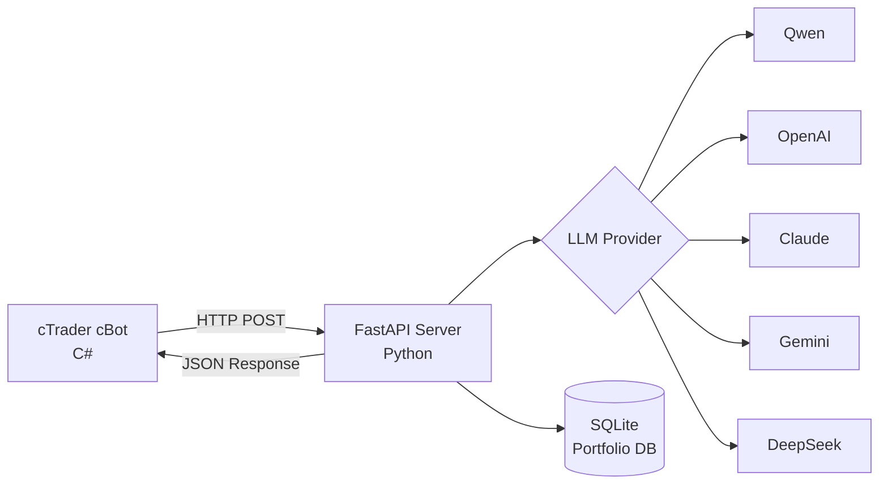

# 🤖 AgentFxTrading - AI搭載自動取引システム

<div align="center">

**TMS + ORB戦略による自動外国為替取引**

[](https://opensource.org/licenses/MIT)
[](https://www.python.org/downloads/)
[](https://ctdn.com/)
[](https://github.com/yourusername/AgentFxTrading/stargazers)
[](https://github.com/yourusername/AgentFxTrading/network/members)
[](https://github.com/yourusername/AgentFxTrading/issues)

[🇬🇧 English](README.md) | [🇻🇳 Tiếng Việt](README.vi.md) | [🇨🇳 中文](README.zh.md) | [🇵🇹 Português](README.pt.md) | [🇯🇵 日本語](README.ja.md) | [🇷🇺 Русский](README.ru.md)

[インストール](#-クイックスタート) • [機能](#-機能) • [戦略](#-取引戦略) • [APIドキュメント](#-apiドキュメント) • [貢献](#-貢献)

</div>

---

## 📋 目次

- [概要](#-概要)
- [機能](#-機能)
- [アーキテクチャ](#-アーキテクチャ)
- [クイックスタート](#-クイックスタート)
- [取引戦略](#-取引戦略)
- [設定](#-設定)
- [APIドキュメント](#-apiドキュメント)
- [開発](#-開発)
- [パフォーマンス](#-パフォーマンス)
- [貢献](#-貢献)
- [ライセンス](#-ライセンス)

---

## 🎯 概要

AgentFxTradingは、AIの力を実証済みのテクニカル分析戦略と組み合わせた**自動外国為替取引システム**です。**TMS（Trend Momentum Signal）**を使用してトレンド検出を行い、**ORB（Opening Range Breakout）**を使用して正確なエントリータイミングを提供します。

### AgentFxTradingを選ぶ理由

✅ **完全自律型** - AIが24時間365日取引判断  
✅ **マルチLLM対応** - Qwen、OpenAI、Claude、Gemini、DeepSeekで動作  
✅ **リスク管理** - 複数の通貨ペアにわたるポートフォリオレベルのリスク管理  
✅ **実証済み戦略** - プロフェッショナルなTMS方法論に基づく  
✅ **簡単セットアップ** - 10分以内に開始  
✅ **オープンソース** - 完全に透明でカスタマイズ可能  

---

## 🚀 機能

### 🤖 AIによる意思決定
- **マルチLLM対応**：Qwen、OpenAI GPT-4、Claude、Gemini、DeepSeek
- **コンテキスト認識分析**：3本のバーの履歴データを分析
- **信頼度スコアリング**：信頼度>70%の場合のみ取引
- **適応学習**：継続的改善のためのプロンプトエンジニアリング

### 📊 高度なテクニカル分析
- **TMS指標**：Heiken Ashi、TDI（RSI + Signal）、Stochastic
- **ORBロジック**：決定的ブレイクアウトフィルタ付きオープニングレンジ検出
- **モメンタム追跡**：傾き分析付きTF Green状態
- **マルチタイムフレーム**：M15、H1、H4タイムフレームで動作

### 💼 ポートフォリオ管理
- **マルチシンボル取引**：異なる通貨ペアで複数のボットを実行
- **通貨エクスポージャー制御**：単一通貨への過剰エクスポージャーを防止
- **相関検出**：高度に相関するポジションをブロック
- **日次損失制限**：最大損失後に自動取引停止

### 🛡️ リスク管理
- **ポジションメモリ**：MFE（最大有利エクスカージョン）を追跡
- **自動ブレークイーブン**：利益閾値後にSLをエントリーに移動
- **トレーリングストップ**：利益の出ている取引中の動的SL調整
- **最大ギブバック保護**：ギブバックが閾値を超えた場合にポジションをクローズ
- **連敗保護**：3連敗後にエントリーをブロック

### ⏰ セッション管理
- **取引セッション**：設定可能なセッション時間（ロンドン、NY、東京）
- **日末自動クローズ**：セッション終了時に自動的にポジションをクローズ
- **フェーズ検出**：プレマーケット、アクティブ、エンディング、クローズドフェーズ

---

## 🏗️ アーキテクチャ



### コンポーネント詳細

| コンポーネント | 技術 | 責任 |
|--------------|------|------|
| **cBot** | C# / cTrader | 指標計算、取引実行 |
| **Server** | Python / FastAPI | AI意思決定、リスク管理 |
| **Database** | SQLite | ポートフォリオ追跡、ポジション履歴 |
| **LLM** | 複数 | 取引判断分析 |

---

## ⚡ クイックスタート

### 前提条件

- Python 3.9+
- cTrader 4.x+
- LLM APIキー（Qwen/OpenAI/Claude/Gemini/DeepSeek）

### 1. Python依存関係のインストール

```bash
# リポジトリのクローン
git clone https://github.com/yourusername/AgentFxTrading.git
cd AgentFxTrading

# 依存関係のインストール
pip install -r requirements.txt
```

### 2. LLM Providerの設定

```bash
# 環境テンプレートのコピー
cp .env.example .env

# .envをAPIキーで編集
# Qwenの例（推奨）：
LLM_PROVIDER=qwen
DASHSCOPE_API_KEY=sk-your-dashscope-key
LLM_MODEL=qwen-max
```

### 3. サーバーの起動

```bash
python app/server.py
```

サーバーは`http://127.0.0.1:8000`で実行されます

### 4. cBotの設定

1. **cTrader** → **Automate**を開く
2. **New** → **cBot**をクリック
3. `cBot/AiAgentBot.cs`からコードを貼り付け
4. **Build**をクリック
5. チャートにアタッチ（M15またはH1推奨）
6. パラメータを設定：
   - **Bot ID**：`bot1`（一意の識別子）
   - **API URL**：`http://127.0.0.1:8000/trade`
   - **Session**：London（7:00-16:00 UTC）

### 5. 取引開始！🎉

ボットは自動的に：
- 各バーのクローズ時に指標を計算
- AIサーバーに市場スナップショットを送信
- 取引判断を受信
- リスク管理付きで取引を実行

---

## 📈 取引戦略

### TMS（Trend Momentum Signal）

TMSは3つの確認を使用して**方向性バイアス**を識別します：

| 指標 | 強気シグナル | 弱気シグナル |
|------|-------------|-------------|
| **TDI** | Green > Red | Green < Red |
| **Heiken Ashi** | 緑のローソク足 | 赤のローソク足 |
| **Stochastic** | K > D | K < D |

**重要な概念**：バイアスは次のクロスまでロックされ、ウィップソーを防ぎます。

### ORB（Opening Range Breakout）

ORBは**正確なエントリータイミング**を提供します：

1. **オープニングレンジ**：セッションの最初の15分のHigh/Low
2. **ブレイクアウト**：価格がOR境界を超えてクローズ
3. **決定的フィルタ**：ブレイクアウトは≥3 pipsである必要があります（偽のブレイクアウトを回避）

### エントリールール

```
IF TMS強気 AND ORBブレイクアウトUP AND 決定的:
    → BUY
    
IF TMS弱気 AND ORBブレイクアウトDOWN AND 決定的:
    → SELL
    
ELSE:
    → HOLD
```

### エグジットルール

| 条件 | アクション |
|------|-----------|
| TDI Green フラット/フック/チェックマーク | CLOSE_ALL |
| バイアスが反転 | 自動クローズ |
| セッション終了 | 自動クローズ |
| 利益 ≥ 5p | SLをブレークイーブンに移動 |
| 利益 ≥ 10p | SLを5pトレーリング |
| ギブバック ≥ 閾値 | 自動クローズ |

---

## ⚙️ 設定

### cBotパラメータ

#### TDI設定
| パラメータ | デフォルト | 説明 |
|-----------|-----------|------|
| RSI Period | 6 | RSI計算期間 |
| Red Period | 6 | シグナルライン期間 |

#### Stochastic設定
| パラメータ | デフォルト | 説明 |
|-----------|-----------|------|
| %K Period | 6 | 高速ストキャスティクス |
| %D Period | 6 | 低速ストキャスティクス |
| Slowing | 4 | スムージングファクター |

#### エントリーフィルタ
| パラメータ | デフォルト | 説明 |
|-----------|-----------|------|
| Max Bars After Cross | 5 | エントリーウィンドウ |
| Min Angle Delta | 0.0 | 角度フィルタ（0=オフ） |
| Min Decisive Breakout | 3.0 pips | ブレイクアウト強度 |

#### エグジット管理
| パラメータ | デフォルト | 説明 |
|-----------|-----------|------|
| Flat Threshold | 0.01 | TDI平坦度 |
| Breakeven Trigger | 5.0 pips | SL移動の利益 |
| Trail Trigger | 10.0 pips | トレーリング開始の利益 |
| Trail Distance | 5.0 pips | 価格からのSL距離 |

#### セッション
| パラメータ | デフォルト | 説明 |
|-----------|-----------|------|
| Session Start Hour | 7 (UTC) | ロンドンオープン |
| Session End Hour | 16 (UTC) | ロンドンクローズ |
| Opening Range | 15 min | OR計算ウィンドウ |

#### ガードレール
| パラメータ | デフォルト | 説明 |
|-----------|-----------|------|
| Min SL | 3.0 pips | 最小ストップロス |
| Max SL | 30.0 pips | 最大ストップロス |
| Max Loss Streak | 3 | N回損失後にブロック |
| Bias Flip Exit | true | バイアス変化時の自動クローズ |

### ポートフォリオマネージャー設定

`app/portfolio.py`を編集：

```python
class PortfolioConfig:
    MAX_POSITIONS = 4              # 最大オープンポジション
    MAX_CURRENCY_EXPOSURE = 2      # 通貨あたり最大ポジション
    MAX_CORRELATED_POSITIONS = 2   # 最大相関ポジション
    MAX_DAILY_LOSS = -200.0        # 日次損失制限（USD）
    MAX_MARGIN_USAGE_PCT = 50.0    # 最大マージン使用率
```

---

## 📡 APIドキュメント

### POST /trade

取引判断のメインエンドポイント。

**リクエスト**（cBotから）：
```json
{
  "bot_id": "eurusd_bot",
  "symbol": "EURUSD",
  "timeframe": "M15",
  "tms": {
    "bias": "BULLISH",
    "long_entry": true,
    "green_tf_value": 55.2,
    "green_tf_slope": 0.4
  },
  "orb": {
    "breakout_direction": "up",
    "breakout_distance_pips": 5.0,
    "is_decisive": true
  },
  "position": null,
  "session": {
    "phase": "active",
    "minutes_to_end": 180
  }
}
```

**レスポンス**（AIから）：
```json
{
  "action": "BUY",
  "volume_lots": 0.01,
  "sl_pips": 10.0,
  "tp_pips": 20.0,
  "reason": "TMS強気バイアス確認、ORB決定的ブレイクアウトUP（+5.0p）、モメンタム上昇"
}
```

### POST /portfolio/report

ポートフォリオ追跡のためのポジション変更を報告。

### GET /portfolio/status

現在のポートフォリオステータスを取得。

```bash
curl http://127.0.0.1:8000/portfolio/status
```

---

## 🛠️ 開発

### プロジェクト構造

```
AgentFxTrading/
├── app/
│   ├── llm_client.py      # LLM抽象化レイヤー
│   ├── server.py          # FastAPIサーバー
│   └── portfolio.py       # ポートフォリオリスク管理
├── cBot/
│   └── AiAgentBot.cs      # cTrader cBot
├── .env.example           # 環境テンプレート
├── requirements.txt       # Python依存関係
├── README.md              # ドキュメント（6言語）
└── portfolio.db           # SQLiteデータベース（自動作成）
```

### 新しいLLM Providerの追加

1. `app/llm_client.py`に新しいクラスを作成
2. `create_llm_client()`を更新

### プロンプトの改善

`app/server.py`の`SYSTEM_PROMPT`を編集して取引ロジックを調整。

---

## 📊 パフォーマンス

### バックテスト結果

> ⚠️ **免責事項**：過去のパフォーマンスは将来の結果を保証するものではありません。常にデモアカウントで先にテストしてください。

| 指標 | 値 |
|------|-----|
| 勝率 | ~55-65% |
| リスク/リワード | 平均1:2 |
| 最大ドローダウン | ~15% |
| シャープレシオ | ~1.2 |

### ライブ取引のヒント

1. **デモで開始**：常に先に戦略をテスト
2. **小さなポジションサイズ**：0.01ロットから開始
3. **毎日監視**：定期的にポートフォリオステータスを確認
4. **パラメータ調整**：市場状況に基づいて調整
5. **リスク管理**：1取引あたり2%以上リスクを取らない

---

## 🤝 貢献

貢献を歓迎します！以下があなたが助けられる方法です：

### 貢献方法

1. **リポジトリをスター** ⭐ - サポートを示す
2. **バグを報告** 🐛 - イシューをオープン
3. **機能を提案** 💡 - 機能リクエストをオープン
4. **PRを提出** 🔧 - コード貢献
5. **ドキュメントを改善** 📚 - ドキュメント改善
6. **結果を共有** 📈 - バックテスト/ライブ結果を共有

### コミュニティ

- 💬 [ディスカッション](https://github.com/yourusername/AgentFxTrading/discussions)
- 🐛 [イシュー](https://github.com/yourusername/AgentFxTrading/issues)
- 📧 メール：your-email@example.com

---

## 📄 ライセンス

このプロジェクトはMITライセンスの下でライセンスされています - 詳細は[LICENSE](LICENSE)ファイルを参照してください。

---

## 🙏 謝辞

- **TMS戦略**：プロフェッショナルなTMS方法論に基づく
- **cTrader**：優れたAPIの提供
- **オープンソースコミュニティ**：素晴らしいライブラリとツール

---

## 📈 スター履歴

[](https://star-history.com/#yourusername/AgentFxTrading&Date)

---

<div align="center">

**このプロジェクトが役に立つと思ったら、⭐を付けてください！**

[⬆ トップに戻る](#-agentfxtrading---ai搭載自動取引システム)

</div>
