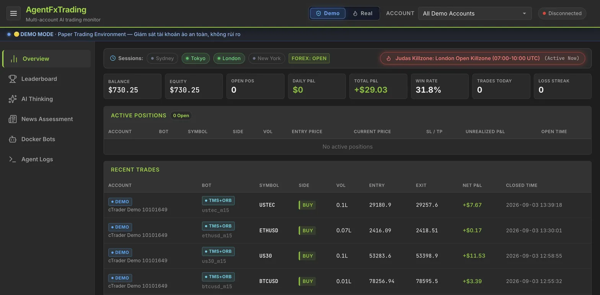
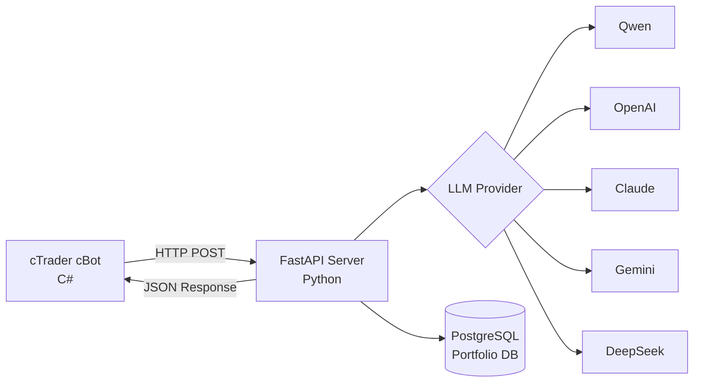
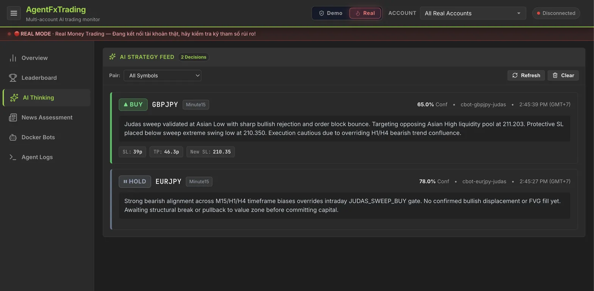
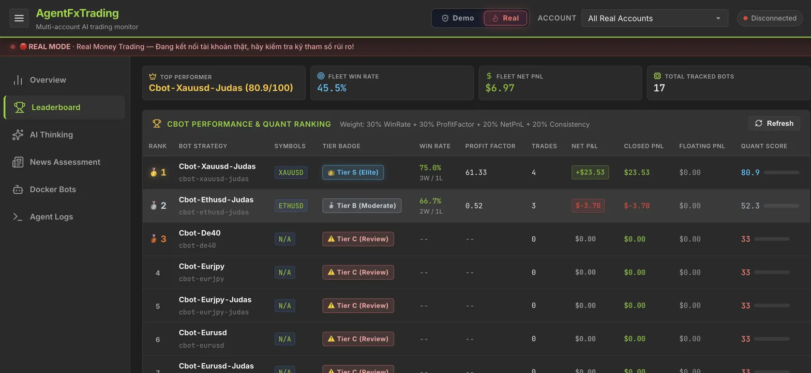
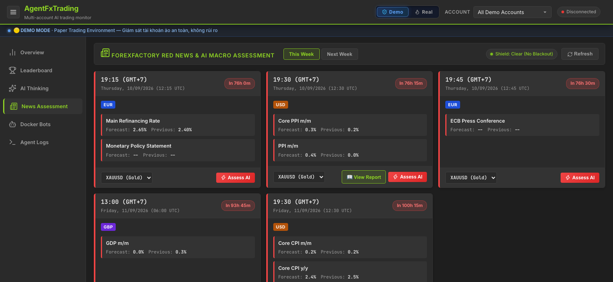

# 🤖 AgentFxTrading - AI-Powered Automated Trading System

<div align="center">

**Autonomous Forex Trading with TMS + ORB Strategy**

[](https://opensource.org/licenses/MIT)
[](https://www.python.org/downloads/)
[](https://ctdn.com/)
[](https://github.com/kienphan/AgentFxTrading/stargazers)
[](https://github.com/kienphan/AgentFxTrading/network/members)
[](https://github.com/kienphan/AgentFxTrading/issues)
[](https://buymeacoffee.com/kaz126)

[🇬🇧 English](README.md) | [🇻🇳 Tiếng Việt](README.vi.md) | [🇨🇳 中文](README.zh.md) | [🇵🇹 Português](README.pt.md) | [🇯🇵 日本語](README.ja.md) | [🇷🇺 Русский](README.ru.md)

[Installation](#-quick-start) • [Features](#-features) • [Strategy](#-trading-strategy) • [API Docs](#-api-documentation) • [Support](#-support--broker) • [Contributing](#-contributing)

<br/>

<a href="#-dashboard">
  
</a>

*Real-time multi-account AI trading monitor with live session killzones, account KPIs, active positions, and trade telemetry.*

</div>

---

## 📋 Table of Contents

- [Overview](#-overview)
- [Features](#-features)
- [Architecture](#-architecture)
- [Quick Start](#-quick-start)
- [Docker Instances (all 45)](docs/docker-instances.md)
- [Trading Strategy](#-trading-strategy)
- [Configuration](#-configuration)
- [API Documentation](#-api-documentation)
- [Development](#-development)
- [Performance](#-performance)
- [Support & Broker](#-support--broker)
- [Contributing](#-contributing)
- [License](#-license)

---

## 🎯 Overview

AgentFxTrading is an **autonomous forex trading system** that combines the power of AI with proven technical analysis strategies. It uses **TMS (Trend Momentum Signal)** for trend detection and **ORB (Opening Range Breakout)** for precise entry timing.

### Why AgentFxTrading?

✅ **Fully Autonomous** - AI makes trading decisions 24/7  
✅ **Multi-LLM Support** - Works with Qwen, OpenAI, Claude, Gemini, DeepSeek  
✅ **Risk Management** - Portfolio-level risk control across multiple pairs  
✅ **Proven Strategy** - Based on professional TMS methodology  
✅ **Easy Setup** - Get started in under 10 minutes  
✅ **Open Source** - Fully transparent and customizable  

---

## 🚀 Features

### 🤖 Multi-Engine AI Strategy Framework (3 Engines)
- **1. TMS + ORB Engine (`AiAgentBot`)**: Trend Momentum Signal (Heikin Ashi + TDI + Stochastic) combined with Opening Range Breakout and dynamic Kaufman Efficiency Regimes.
- **2. Asian Range Judas Sweep Engine (`AsianRangeJudasSweepBot`)**: ICT Smart Money Concepts capturing liquidity sweeps of Asian Session High/Low (00:00–06:00 UTC) during London (07:00–10:00 UTC) and New York (12:30–16:00 UTC) Killzones with Order Block/FVG confirmation.
- **3. FlowRSI / Nested RSI SMC Engine (`FlowRsiBot`)**: Multi-timeframe momentum convergence combining Fast RSI (7) and Slow RSI (14) crossovers with ICT Smart Money Concepts (Fair Value Gap - FVG, Premium/Discount Equilibrium zones, and Swing Liquidity Sweeps). Features integrated dynamic SL/TP, true zero-loss break-even, gated trailing stop, and direct AI agent bridge validation.
- **Multi-LLM Support**: Qwen, OpenAI GPT-4o, Claude 3.5 Sonnet, Gemini 2.0 Flash, DeepSeek V3/R1.
- **Context-Aware Analysis**: Multi-timeframe trend alignment (M15 + H1 + H4), swing structure, and real-time news filter.
- **Multi-Symbol Trading**: Run multiple bots on different pairs
- **Currency Exposure Control**: Prevents over-exposure to single currency
- **Correlation Detection**: Blocks highly correlated positions
- **Daily Loss Limits**: Automatic trading halt after max loss
- **Dynamic Multi-Asset Precision**: Real-time decimal scaling (5 decimals for Forex, 3 for JPY pairs, 2 for Gold, Indices, and Crypto) preventing flatline prompt distortion
- **True ATR Scaling**: Automated normalization of raw volatility units to pips across all symbols for precise LLM evaluation
- **Multi-Asset Cycle Gate**: Smart overextension filtering for Crypto (`BTC`, `ETH`, `SOL`, `XRP`), Gold, Indices, and Forex
- **Adaptive Asian Range Filter**: Symbol-specific bounds (`[200p, 8000p]` for Gold, `[12p, 100p]` for Forex, `[15p, 200p]` for JPY crosses, `[10000p, 400000p]` for BTC, `[800p, 35000p]` for ETH) with idle polling suppression
- **Guardrail Telemetry Integration**: Client-side cBot event telemetry reporting blocked trades and internal guardrail states back to the FastAPI server via `/api/cbot_event`
### 🛡️ Risk Management
- **Position Memory**: Tracks MFE (Maximum Favorable Excursion) on every tick
- **Auto Breakeven**: Moves SL to entry (+0.1x ATR offset) when profit reaches $\ge 0.8\times$ ATR
- **Trailing Stop**: Dynamic SL adjustment starting at $1.2\times$ ATR (trailing by $0.7\times$ ATR)
- **Profit Lock-in & Giveback Protection**: Closes position if profit gives back $\ge 40\%$ of peak MFE (Forex/Metals) or $\ge 55\%$ of peak MFE with $\ge 1.5\times$ ATR activation (Indices: US30, USTEC, DE40), preventing premature exit on 50–300 pt index swings
- **Anti-Overextension Guard**: Blocks chasing breakouts extended beyond $2.5\times$ ATR from the OR boundary
- **Max Dollar Risk Cap**: Hard cap preventing single-trade losses from exceeding risk limits on minimum volume assets
- **Loss Streak Protection**: Blocks entries after 3 consecutive losses
- **Cycle Gating (Cost Gate)**: Deterministically bypasses LLM calls when outside session, inside OR, overextended, or during loss streak — saving 80-90% API tokens
- **Trend TP Disabled**: Automatically disables fixed TP during trending regimes to ride the full move with Trailing SL & Giveback Floor
- **Daily Rotating Logs**: Persists all agent reasoning, cycle gate actions, and market snapshots to `logs/agent_YYYY-MM-DD.log` (14-day retention)

### ⏰ Session Management
- **Trading Sessions**: Configurable session times (London, NY, Tokyo)
- **EOD Auto-Close**: Automatically closes positions at session end
- **Phase Detection**: Pre-market, active, ending, closed phases

---

## 🏗️ Architecture



### Component Breakdown

| Component | Technology | Responsibility |
|-----------|-----------|----------------|
| **cBot** | C# / cTrader | Calculate indicators, execute trades |
| **Server** | Python / FastAPI | AI decision making, risk management |
| **Database** | PostgreSQL / SQLite | Portfolio tracking, position history (PostgreSQL in production, SQLite fallback) |
| **LLM** | Multiple | Trading decision analysis |

---

## 📊 Dashboard

Monitor your trading system in real-time through the web dashboard.

### 🖥️ Dashboard Showcase

| 📈 Live Overview & Market Sessions | 🧠 AI Strategy & Decision Feed |
| :---: | :---: |
| [](docs/screenshots/overview.png) | [](docs/screenshots/ai-thinking.png) |
| *Real-time KPI metrics, active positions, recent trades, and killzones* | *Multi-timeframe reasoning, LLM confidence scores, and SL/TP guidance* |

| 🏆 Quant Performance Leaderboard | 📰 ForexFactory Red News & AI Assessment |
| :---: | :---: |
| [](docs/screenshots/leaderboard.png) | [](docs/screenshots/news-assessment.png) |
| *Composite quantitative ranking, win rates, and Tier S/A/B/C badges* | *High-impact economic calendar, currency impact, and macro volatility* |

### Access Dashboard

After starting the server, open your browser:

| Mode | URL Route | Description |
| :--- | :--- | :--- |
| **Demo** | `http://127.0.0.1:8000/demo/dashboard` *(or `/demo`)* | Isolated Paper Trading dashboard & telemetry |
| **Real / Live** | `http://127.0.0.1:8000/real/dashboard` *(or `/real`, `/live`)* | Isolated Real Money trading dashboard & execution telemetry |
| **Auto-Redirect** | `http://127.0.0.1:8000/` *(or `/dashboard`)* | Auto-routes to your last active mode (Demo or Real) |

### Features

- **Strict Mode Isolation**: Pure binary switching (`Demo | Real`) eliminates accidental mixing of paper and real capital.
- **Last-Mode Persistence**: The system remembers your active trading mode via server persistence & cookies; accessing `/` or `/dashboard` automatically takes you to the mode you last used.
- **Complete Data Isolation**: URL-based routing isolates KPI metrics, open positions, trade history, Docker bot configurations, and reasoning logs between Demo and Real accounts.
- **Real-time Updates**: WebSocket connection for live position tracking and P&L sync.
- **Active Positions Table**: Strategy badges (`Judas SMC` vs `TMS+ORB`), Bot ID, symbol, side, volume, entry price, live market price, SL/TP, and unrealized P&L.
- **Trade History**: Recent closed trades with strategy classification, account badge (`DEMO` / `LIVE`), and P&L.
- **P&L Chart**: Visual representation of daily performance.
- **Bot Guardrail Telemetry**: Live tracking of cBot guardrail events, market regimes, and execution blocks.

### API Endpoints

```
GET  /demo/dashboard           # Demo web dashboard (isolated)
GET  /real/dashboard           # Real/Live web dashboard (isolated)
GET  /                         # Auto-redirects to last active mode
GET  /dashboard                # Auto-redirects to last active mode
GET  /api/dashboard/positions  # Active positions (supports ?account_id=demo|live|all|<id>)
GET  /api/dashboard/history    # Closed trade history, paginated 10/page (?account_id=demo|live|all|<id>&page=N&page_size=N)
GET  /api/dashboard/pnl-history# Daily P&L history (supports ?account_id=demo|live|all|<id>)
GET  /api/dashboard/logs       # Server & agent reasoning logs (supports ?mode=demo|live|all)
GET  /api/bots                 # Docker bot configurations & statuses (with account_type)
POST /api/tick                 # Direct tick telemetry from cBots (HTTP fallback)
WS   /ws/cbot                  # cBot tick stream: bid/ask + broker P&L (--TickStreamMs, 0=off)
POST /api/cbot_event           # cBot guardrail blocks & event telemetry
POST /portfolio/report         # Position open/close lifecycle reporting
WS   /ws/dashboard             # WebSocket for real-time dashboard updates
```
---

## ⚡ Quick Start

### Prerequisites

- Python 3.9+
- cTrader 4.x+ (Need an account? Sign up at [IC Markets cTrader](https://ic.com/?camp=95400) for Raw Spreads & low latency)
- LLM API key (Qwen/OpenAI/Claude/Gemini/DeepSeek)

### 🚀 One-line VPS install (Ubuntu 22.04 / 24.04 / 26.04)

On a fresh VPS, as root, run:

```bash
curl -fsSL https://raw.githubusercontent.com/kienphan/AgentFxTrading/main/scripts/install.sh | sudo bash
```

It asks for one thing — the SSH public key that will log in as the `forge` user — and then creates a swap file (2×RAM under 2 GiB, =RAM up to 8 GiB, RAM/2 above), installs PostgreSQL 17, Docker, the FastAPI server as a systemd service (`agentfx.service`, user `forge`, bound to `127.0.0.1:8000`), compiles the three cBot `.algo` packages, and enables a daily database backup. Password SSH login is disabled.

**Before closing your root session**, confirm the key works from another terminal: `ssh forge@YOUR_VPS_IP 'sudo -n true && echo LOGIN_OK'`. Password login (including root) is disabled once the installer finishes.

Afterwards open the dashboard through a tunnel:

```bash
ssh -N -L 8000:127.0.0.1:8000 forge@YOUR_VPS_IP
```

then browse `http://127.0.0.1:8000`, put your LLM key in `/home/forge/AgentFxTrading/.env`, and `sudo systemctl restart agentfx`.

Re-running the same command later is safe — it pulls the latest code and rebuilds the bots.

To skip the prompt, export the key and let `sudo` pass it through:

```bash
export FORGE_SSH_KEY="ssh-ed25519 AAAA... you@laptop"
curl -fsSL https://raw.githubusercontent.com/kienphan/AgentFxTrading/main/scripts/install.sh | sudo -E bash
```

The same applies to the optional `AGENTFX_REPO` / `AGENTFX_BRANCH` overrides.

> The installer keeps the cTrader home at `/home/forge/ctrader` (mounted as `/root` inside containers). If you copy a `docker run` command from the sections below onto an installed VPS, replace `-v /root:/root` with `-v /home/forge/ctrader:/root`.

### 1. Install Python Dependencies

```bash
# Clone repository
git clone https://github.com/kienphan/AgentFxTrading.git
cd AgentFxTrading

# Install dependencies
pip install -r requirements.txt
```

### 2. Configure LLM Provider

```bash
# Copy environment template
cp .env.example .env

# Edit .env with your API key
# Example for Qwen (recommended):
LLM_PROVIDER=qwen
DASHSCOPE_API_KEY=sk-your-dashscope-key
LLM_MODEL=qwen-max
```

### 3. Start the Server

```bash
python app/server.py
```

Server will run at `http://127.0.0.1:8000`

### 4. Setup & Run cBot

You can run the cBot either via **cTrader Desktop GUI** or **Headless Docker CLI** (`ctrader-console`).

#### Option A: cTrader Desktop GUI

1. Open **cTrader** → **Automate**
2. Click **New** → **cBot**
3. Paste code from `cBot/AiAgentBot.cs`
4. Click **Build**
5. Attach to chart (M15 or H1 recommended)
6. Configure parameters:
   - **Bot ID**: `xauusd_m15` (unique identifier)
   - **API URL**: `http://127.0.0.1:8000/trade`
   - **Session**: New York (13:00-21:00 UTC) / London (8:00-17:00 UTC) / Tokyo (0:00-9:00 UTC)

#### Option B: Headless Docker CLI (`ctrader-console`)

1. **Prepare Credentials File**:
   ```bash
   mkdir -p /root/ctrader_data
   echo "your_ctid_password" > /root/ctrader_data/ctid_pwd
   chmod 600 /root/ctrader_data/ctid_pwd
   ```

2. **Build/Compile the `.algo` packages**:
   ```bash
   # 1. Build TMS+ORB Bot (AiAgentBot)
   docker run --rm -v $(pwd):/workspace -v /root:/root \
     ghcr.io/spotware/ctrader-console:latest create cbot AiAgentBot
   cp cBot/AiAgentBot.cs /root/cAlgo/Sources/Robots/AiAgentBot/AiAgentBot/AiAgentBot.cs
   docker run --rm -v $(pwd):/workspace -v /root:/root \
     ghcr.io/spotware/ctrader-console:latest build /root/cAlgo/Sources/Robots/AiAgentBot/AiAgentBot/AiAgentBot.csproj
   cp /root/cAlgo/Sources/Robots/AiAgentBot.algo cBot/AiAgentBot.algo

   # 2. Build Asian Range Judas Sweep Bot (AsianRangeJudasSweepBot)
   docker run --rm -v $(pwd):/workspace -v /root:/root \
     ghcr.io/spotware/ctrader-console:latest create cbot AsianRangeJudasSweepBot
   cp cBot/AsianRangeJudasSweepBot.cs /root/cAlgo/Sources/Robots/AsianRangeJudasSweepBot/AsianRangeJudasSweepBot/AsianRangeJudasSweepBot.cs
   docker run --rm -v $(pwd):/workspace -v /root:/root \
     ghcr.io/spotware/ctrader-console:latest build /root/cAlgo/Sources/Robots/AsianRangeJudasSweepBot/AsianRangeJudasSweepBot/AsianRangeJudasSweepBot.csproj
   cp /root/cAlgo/Sources/Robots/AsianRangeJudasSweepBot.algo cBot/AsianRangeJudasSweepBot.algo

   # 3. Build FlowRSI SMC Bot (FlowRsiBot)
   docker run --rm -v $(pwd):/workspace -v /root:/root \
     ghcr.io/spotware/ctrader-console:latest create cbot FlowRsiBot
   cp cBot/FlowRsiBot.cs /root/cAlgo/Sources/Robots/FlowRsiBot/FlowRsiBot/FlowRsiBot.cs
   docker run --rm -v $(pwd):/workspace -v /root:/root \
     ghcr.io/spotware/ctrader-console:latest build /root/cAlgo/Sources/Robots/FlowRsiBot/FlowRsiBot/FlowRsiBot.csproj
   cp /root/cAlgo/Sources/Robots/FlowRsiBot.algo cBot/FlowRsiBot.algo
   ```
3. **Multi-Account Deployment Guidelines (Running Demo &amp; Live Simultaneously)**:

   When deploying Live account bots alongside Demo bots, customize the command flags to prevent collisions:
   - **Container Name (`--name`)**: Must be unique on the host. Use `cbot-live-<symbol>` vs `cbot-demo-<symbol>`.
   - **Account Number (`--account`)**: Set to your real cTrader live account number (e.g. `88888888`).
   - **Account Label (`--AccountLabel`)**: Set to `"live"` (or `"live-main"`). cBot sends this to tag trades and route data to `/real/dashboard`.
   - **Bot Identifier (`--BotId`)**: Use distinct IDs such as `live_xauusd_m15` vs `demo_xauusd_m15`.
   - **Risk Management**: Configure stricter risk parameters for real capital (e.g. `--RiskPerTradePercent=0.1` or `0.2`).
   - **Credentials (`--pwd-file`)**: If using a separate cTID, mount a dedicated password file (e.g. `/root/ctrader_data/ctid_live_pwd`).
   - **Environment Configuration (`.env`)**:
     ```bash
     DASHBOARD_ACCOUNTS=demo-10101649|10101649|demo|Demo Account;live-88888888|88888888|live|Live Main
     ```

   > 💡 **Prefer clicking?** Open the dashboard → **Docker Bot Management** → **Setup Instances**. Pick (or create) a cTrader account, tick the symbol × strategy cells you want, and click **Create instances**. The screen generates exactly the commands listed in [docs/docker-instances.md](docs/docker-instances.md), saves them as bot configs and starts the containers. The cTID password is written to `$CTRADER_HOME/ctrader_data/ctid_<slug>_pwd` (mode 0600) and never stored in the database.

4. **Run Multi-Instance Docker Containers**:

   All **45** ready-to-run commands — 15 symbols × 3 strategies — now live in a file of their own:

   **📖 [docs/docker-instances.md](docs/docker-instances.md)**

   It spells out every cell of the Setup Instances grid in full — TMS+ORB, Asian Range Judas Sweep and FlowRSI on
   XAUUSD, EURUSD, GBPUSD, USDJPY, GBPJPY, EURJPY, USDCAD, AUDUSD, AUDJPY, US30, USTEC, DE40, UK100, BTCUSD and
   ETHUSD — along with the placeholders to replace, the container-naming scheme and how to run demo and live
   side by side.

   One example, XAUUSD TMS+ORB on the New York session:

   ```bash
   docker run -d \
     --name cbot-demo-xauusd-newyork \
     --restart unless-stopped \
     --network host \
     -v $(pwd):/workspace \
     -v /root:/root \
     ghcr.io/spotware/ctrader-console:latest \
     run /workspace/cBot/AiAgentBot.algo \
     --ctid=your_email@example.com \
     --pwd-file=/root/ctrader_data/ctid_pwd \
     --account=YOUR_ACCOUNT_ID \
     --symbol=XAUUSD \
     --period=m15 \
     --full-access \
     --BotId="cbot-demo-xauusd-newyork" \
     --ApiUrl="http://127.0.0.1:8000/trade" \
     --AccountLabel="demo" \
     --OrbStartHour=13 \
     --SessionEndHour=21 \
     --SessionDstRule="US" \
     --MinDecisiveBreakoutPips=200.0 \
     --MinOrWidthPips=400.0 \
     --OrbBufferPips=50.0 \
     --BreakevenTriggerAtr=1.2 \
     --BreakevenOffsetAtr=0.1 \
     --TrailTriggerAtr=2.0 \
     --TrailDistanceAtr=1.0 \
     --PartialCloseRatio=0.5 \
     --MinSlAtr=0.8 \
     --MaxSlAtr=3.0 \
     --MinTpAtr=1.0 \
     --MaxTpAtr=6.0 \
     --MaxGivebackAtr=1.0 \
     --GivebackArmMinPips=150.0 \
     --MinAdjustBeProfitPips=300.0 \
     --EnablePostTpGate=true \
     --PostTpPullbackAtr=0.5 \
     --BounceTradeEnabled=true \
     --BounceDistanceThreshold=10 \
     --RiskPerTradePercent=0.2 \
     --TrendTpDisabled=true
   ```

### 5. Start Trading! 🎉

The bot will automatically:
- Calculate indicators on each bar close
- Send market snapshot to AI server
- Receive trading decision
- Execute trades with risk management

---

## 📈 Trading Strategy

### TMS (Trend Momentum Signal)

TMS identifies the **directional bias** using three confirmations:

| Indicator | Bullish Signal | Bearish Signal |
|-----------|----------------|----------------|
| **TDI** | Green > Red | Green < Red |
| **Heiken Ashi** | Green candle | Red candle |
| **Stochastic** | K > D | K < D |

**Key Concept**: Bias is locked until next cross, preventing whipsaws.

### ORB (Opening Range Breakout)

ORB provides **precise entry timing**:

1. **Opening Range**: High/Low of first 15 minutes of session
2. **Breakout**: Price closes beyond OR boundary
3. **Decisive Filter**: Breakout must be decisive (≥ MinDecisiveBreakoutPips, default 10.0 pips on XAUUSD)

### Market Regime (Kaufman Efficiency Ratio)

The system computes real-time efficiency metrics to adapt its trading and exit behavior:
- **`er_session` & `er_recent`**: Kaufman Efficiency Ratio ($ER = \frac{|\text{Net Move}|}{\sum |\text{Bar Moves}|}$). $1.0$ represents a clean directional move, while $\approx 0.0$ indicates chop.
- **`or_flips`**: Counts failed breakouts outside the Opening Range that close back inside (indicates chop day).
- **Regimes**:
  - **`trending`** ($ER \ge 0.35$): Disables fixed TP (`TrendTpDisabled = true`), lets Trailing SL and Giveback Floor capture the full trend run.
  - **`choppy`** (`or_flips \ge 5`): High risk of stop-hunting traps → Cycle Gate forces `HOLD`.
  - **`mixed`**: Standard trading discipline; entries only on confirmed setups.
  - **`forming`**: Early session range formation ($< 6$ bars).

### Entry Models & Quantitative Discipline
- **Model 1: Direct Momentum Breakout**: Price closes decisively beyond Opening Range boundary with strong momentum within entry window ($\le 5$ bars) and distance is not overextended ($\le 2.5\times$ ATR).
- **Model 2: Breakout Retest + TDI Bounce (Pullback Continuation)**: When a breakout is aged ($5 < \text{bars} \le 10$), entry is only permitted if a verified **TDI Bounce** occurs (`tdi_bounce_bull` / `tdi_bounce_bear`), price is structurally confirmed near EMA5 (`price_above_ema` for BUY / `price_below_ema` for SELL), and distance is not overextended. Prevents entries at exhaustion points.
- **Anti-Overextension Rule**: NEVER buy or sell when price is already overextended ($> 2.5\times$ ATR, or $> 1500$ pips on Gold / $\$15.00$, $> 30,000$ pips on BTC, $> 1500$ pips on Indices, $> 50$ pips on Forex) from the OR boundary. Chasing extreme exhaustion moves is strictly prohibited.
- **BIAS-FRESH Exception**: When a TDI cross just occurred ($\le 1$ bar ago), early momentum is treated as the **start of a fresh trend leg**, not an extended move → Favors entering immediately.
- **Anti-Chase Rule**: When price broke out $\ge 4$ bars ago under an old bias without a valid pullback/bounce, **DO NOT chase** at extremes → Holds and waits for a structured retest.
- **Post-TP Gate (Anti-FOMO)**: Once a trade hits TP or closes after a major win, re-entry in the same direction is strictly blocked until a genuine structural pullback ($\ge 0.5\times$ ATR), OR touch, or bias flip occurs.
- **Profit Lock-In & Giveback Floor**: Provides breathing room for normal intraday fluctuations. Tracks Peak Profit ($MFE$) on every tick. Giveback protection activates on winning trades ($MFE \ge 0.8\times$ ATR for Forex/Metals; $MFE \ge 1.5\times$ ATR / min 100 points for Indices) to lock in gains if giveback reaches $\ge 40\%$ (Forex/Metals) or $\ge 55\%$ (Indices) of peak MFE with momentum stall/reversal.

### 🏹 Asian Range Judas Sweep Strategy (ICT Smart Money Concepts)

The **Asian Range Judas Sweep AI Bot** implements an institutional liquidity-hunting reversal model on **XAUUSD (Gold M15)**:

1. **Asian Range Tracking (`00:00 – 06:00 UTC`)**:
   - Establishes the liquidity boundaries: `Asian High` (Buy-Side Liquidity / BSL) and `Asian Low` (Sell-Side Liquidity / SSL).
   - Validates that Asian Range width is within acceptable limits (`50` to `350` pips).
2. **Golden Killzones**:
   - **London Open Killzone**: `07:00 – 10:00 UTC` (Peak liquidity sweep window).
   - **New York Overlap Killzone**: `12:30 – 16:00 UTC` (US institutional entry).
3. **Pre-Filter Gate (Judas Swing Detection)**:
   - **SELL Sweep Trigger (`JUDAS_SWEEP_SELL`)**: Price wicks above `Asian High + sweepBufferPips (15 pips)` to trap breakout buyers, then closes back *inside* the Asian Range.
   - **BUY Sweep Trigger (`JUDAS_SWEEP_BUY`)**: Price wicks below `Asian Low - sweepBufferPips (15 pips)` to trap breakout sellers, then closes back *inside* the Asian Range.
4. **AI Agent Sniper Decision**:
   - Evaluates Order Block (OB), Fair Value Gap (FVG), multi-timeframe swing structure (M15 + H1 + H4), and 50 chronological OHLCV bars.
   - Places Stop Loss behind the sweep spike (minimum floor `200 pips` / $2.00 USD on Gold) and Take Profit at the opposing Asian boundary.
### Entry Rules

```
IF TMS_BULLISH AND ORB_BREAKOUT_UP AND DECISIVE:
    → BUY
    
IF TMS_BEARISH AND ORB_BREAKOUT_DOWN AND DECISIVE:
    → SELL
    
ELSE:
    → HOLD
```

### Exit Rules

| Condition | Action |
|-----------|--------|
| Confirmed TDI Reversal (Cross opposite Red / Severe OB-OS reversal losing EMA) | CLOSE_ALL |
| Bias reverses | Auto close |
| Session ends (EOD) | Auto close (EOD Force-Flatten safety net) |
| Profit $\ge 0.8\times$ ATR | Move SL to breakeven (+0.1x ATR offset) |
| Profit $\ge 1.2\times$ ATR | Trail SL by 0.7x ATR |
| Giveback $\ge 40\%$ (Forex) / $\ge 55\%$ (Indices) of peak MFE or $\ge 0.6\times$ ATR | Auto close (Profit lock-in protection) |
---

## ⚙️ Configuration

### cBot Parameters

#### TMS Settings (Multi-Timeframe)
| Parameter | Default | Description |
|-----------|---------|-------------|
| TMS Timeframe (Macro) | Hour (H1) | Macro trend bias timeframe (H1, H4, M15, etc.) |
| RSI Period | 6 | RSI calculation period |
| Red Period | 6 | Signal line period |

#### Stochastic Settings
| Parameter | Default | Description |
|-----------|---------|-------------|
| %K Period | 6 | Fast stochastic |
| %D Period | 6 | Slow stochastic |
| Slowing | 4 | Smoothing factor |

#### Entry Filters
| Parameter | Default | Description |
|-----------|---------|-------------|
| Max Bars After Cross | 5 | Entry window |
| Min Angle Delta | 0.0 | Angle filter (0=off) |
| Min Decisive Breakout | 10.0 pips | Breakout strength (default tuned for XAUUSD) |

#### Exit Management
| Parameter | Default | Description |
|-----------|---------|-------------|
| Flat Threshold | 0.01 | TDI flatness |
| Breakeven Trigger | 0.8x ATR | Profit to move SL to breakeven |
| Breakeven Offset | 0.1x ATR | Profit locked at breakeven |
| Trail Trigger | 1.2x ATR | Profit to start trailing |
| Trail Distance | 0.7x ATR | SL distance from price |
#### Session
| Parameter | Default | Description |
|-----------|---------|-------------|
| Session Start Hour | 13 (UTC) | New York open (Winter UTC) |
| Session End Hour | 21 (UTC) | New York close (EOD force-flatten) |
| Opening Range | 15 min | OR calculation window |
| Min OR Width | 20.0 pips | Minimum OR width |
| ORB Buffer | 3.0 pips | Buffer to avoid fakeouts |
| DST Rule | US | Auto daylight saving adjustment |

#### Risk Management (Dynamic Sizing & ATR)
| Parameter | Default | Description |
|-----------|---------|-------------|
| Use ATR for SL/TP | true | Calculate dynamic SL/TP based on ATR |
| ATR Period | 14 | Period for ATR calculation |
| ATR SL Multiplier | 1.5 | Multiplier for ATR Stop Loss distance |
| ATR TP Multiplier | 2.0 | Multiplier for ATR Take Profit distance |
| Risk per Trade (%) | 0.2 | Percentage of balance risked per trade |

#### Guardrails
| Parameter | Default | Description |
|-----------|---------|-------------|
| Min SL | 0.8x ATR | Minimum stop loss multiplier |
| Max SL | 3.0x ATR | Maximum stop loss multiplier |
| Min TP | 1.0x ATR | Minimum take profit multiplier |
| Max TP | 6.0x ATR | Maximum take profit multiplier |
| Max Giveback (ATR) | 0.6x ATR | Giveback threshold (in ATR) to force close |
| Max Giveback (% MFE) | 0.40 (40%) | Maximum allowed profit giveback from peak MFE |
| Max Breakout Dist | 2.5x ATR | Maximum distance beyond OR to permit entry |
| Max Dollar Risk | $12.00 | Hard cap on dollar risk per trade |
| Max Loss Streak | 3 | Block after N consecutive losses |
| Bias Flip Exit | true | Auto close on bias change |
| Trend TP Disabled | true | Disable fixed TP in trending regime |

### Asian Range Judas Sweep Parameters

| Parameter | Default | Description |
|:---|:---:|:---|
| `UseDirectAiApi` | `false` | `false` = Local Server Hub (`http://127.0.0.1:8000`), `true` = Direct Cloud API |
| `UseAiGateMode` | `true` | Two-tier gate: Judas Sweep triggers gate → AI Agent confirms entry |
| `enableIndicatorCloseInAiMode` | `false` | Disable premature legacy EMA 9/21 cross-close in AI Gate Mode, allowing position lifecycle to be fully managed by TP/SL, Breakeven, Trailing SL, and AI decisions (`CLOSE_ALL` / `ADJUST`) |
| `AiConfidenceThreshold` | `70.0%` | Minimum AI confidence score required to execute BUY/SELL |
| `AiSlMinFloorPips` | `200.0` | Minimum SL floor ($2.00 on XAUUSD) to prevent noise stop-outs |
| `asianStartHour` | `0` | Asian Session Start Hour (UTC) |
| `asianEndHour` | `6` | Asian Session End Hour (UTC) |
| `minAsianRangePips` | `50.0` | Minimum Asian Range width to consider valid setup |
| `maxAsianRangePips` | `350.0` | Maximum Asian Range width (skips overextended Asian sessions) |
| `londonStartHour` | `7` | London Open Killzone Start Hour (UTC) |
| `londonEndHour` | `10` | London Open Killzone End Hour (UTC) |
| `nyStartHour` | `12` | New York Overlap Killzone Start Hour (UTC) |
| `nyEndHour` | `16` | New York Overlap Killzone End Hour (UTC) |
| `sweepBufferPips` | `15.0` | Minimum wick penetration beyond Asian High/Low (pips) |
| `enableNewsFilter` | `true` | Active ForexFactory News Shield with automated currency matching (USD for Gold/Indices/Crypto, EUR/USD/GBP/JPY for Forex) |
| `pauseBeforeNewsMins` | `30` | Minutes to pause sweep detection and new trade entries before High-Impact news |
| `pauseAfterNewsMins` | `30` | Minutes to pause sweep detection and new trade entries after High-Impact news |
| `highImpactOnly` | `true` | Filter Red Folder / High Impact news events only |
| `closePositionsBeforeNews` | `false` | Close open positions before high-impact news |
| `riskFactor` | `1.0` | Account risk allocation factor (%) (Recommended: 0.5% – 1.0%) |
| `enableBreakEvenPrice` | `true` | Move SL to breakeven after trigger |
| `breakEvenMode` | `Risk_Reward_Ratio` | Which trigger is read: `Risk_Reward_Ratio` (default) or `Fixed_Pips` |
| `breakEvenRrTrigger` | `1.5 R` | Moves SL to breakeven once profit reaches 1.5x the initial SL distance — **this is the trigger in force by default** |
| `breakEvenTrigger` | `250.0 pips` | Pip trigger, read **only** when `breakEvenMode = Fixed_Pips`; ignored in the default R:R mode |

### 🏹 Recommended Presets for Asian Range Judas Sweep

| Parameter | XAUUSD | GBPUSD | EURUSD | GBPJPY | EURJPY | BTCUSD | ETHUSD |
| :--- | :--- | :--- | :--- | :--- | :--- | :--- | :--- |
| **Recommended Timeframe** | `M15` | `M15` | `M15` | `M15` | `M15` | `M15` | `M15` |
| **Asian Session (UTC)** | `00:00 - 06:00` | `00:00 - 06:00` | `00:00 - 06:00` | `00:00 - 06:00` | `00:00 - 06:00` | `00:00 - 06:00` | `00:00 - 06:00` |
| **Killzones (UTC)** | `07-10h & 12:30-16h` | `07-10h & 12:30-16h` | `07-10h & 12:30-16h` | `07-10h & 12:30-16h` | `07-10h & 12:30-16h` | `07-10h & 12:30-16h` | `07-10h & 12:30-16h` |
| **Min / Max Asian Range** | `200.0 / 8000.0 pips` | `15.0 / 45.0 pips` | `15.0 / 45.0 pips` | `25.0 / 70.0 pips` | `25.0 / 70.0 pips` | `10000.0 / 400000.0 pips` | `800.0 / 35000.0 pips` |
| **Judas Sweep Buffer** | `500.0 pips` | `3.5 pips` | `3.5 pips` | `5.0 pips` | `5.0 pips` | `1500.0 pips` | `150.0 pips` |
| **AI SL Minimum Floor** | `200.0 pips` | `15.0 pips` | `15.0 pips` | `25.0 pips` | `25.0 pips` | `20000.0 pips` | `1500.0 pips` |
| **Default Stop Loss** | `200.0 pips` | `15.0 pips` | `15.0 pips` | `25.0 pips` | `25.0 pips` | `25000.0 pips` | `2000.0 pips` |
| **Default Take Profit** | `450.0 pips` | `35.0 pips` | `35.0 pips` | `50.0 pips` | `50.0 pips` | `60000.0 pips` | `5000.0 pips` |
| **Breakeven Trigger (R:R)** | `1.5 R` | `1.5 R` | `1.5 R` | `1.5 R` | `1.5 R` | `1.5 R` | `1.5 R` |
| **AI Confidence Threshold** | `70.0%` | `70.0%` | `70.0%` | `70.0%` | `70.0%` | `70.0%` | `70.0%` |
| **Risk per Trade** | `1.0%` | `1.0%` | `1.0%` | `1.0%` | `1.0%` | `0.2%` | `0.2%` |

### 📊 Recommended Presets for TMS + ORB (by Symbol)
#### Metals & Indices

| Parameter | XAUUSD | US30 | USTEC | DE40 |
| :--- | :--- | :--- | :--- | :--- |
| **Trading Session** | New York | New York (Index) | New York (Index) | London |
| **DST Rule** | `US` | `US` | `US` | `Europe` |
| **Min Decisive Breakout** | `100.0 pips` | `100.0 pips` | `80.0 pips` | `70.0 pips` |
| **Min OR Width** | `250.0 pips` | `300.0 pips` | `250.0 pips` | `200.0 pips` |
| **ORB Buffer** | `30.0 pips` | `50.0 pips` | `40.0 pips` | `35.0 pips` |
| **Breakeven Trigger** | `1.2x ATR` | `2.0x ATR` | `2.0x ATR` | `2.0x ATR` |
| **Breakeven Offset** | `0.1x ATR` | `0.1x ATR` | `0.1x ATR` | `0.1x ATR` |
| **Trail Trigger** | `2.0x ATR` | `3.0x ATR` | `3.0x ATR` | `3.0x ATR` |
| **Trail Distance** | `1.0x ATR` | `1.5x ATR` | `1.5x ATR` | `1.5x ATR` |
| **Min SL / Max SL** | `0.8x / 3.0x ATR` | `1.5x / 4.5x ATR` | `1.5x / 4.5x ATR` | `1.5x / 4.5x ATR` |
| **Min TP / Max TP** | `1.0x / 6.0x ATR` | `2.0x / 8.0x ATR` | `2.0x / 8.0x ATR` | `2.0x / 8.0x ATR` |
| **Max Giveback** | `1.0x ATR` | `1.5x ATR` | `1.5x ATR` | `1.5x ATR` |
| **Recommended Timeframe** | `M15` | `M15` | `M15` | `M15` |
| **EMA Period** | `5` | `5` | `5` | `5` |
| **Post-TP Gate / Pullback** | `true` (`0.5x ATR`) | `true` (`0.5x ATR`) | `true` (`0.5x ATR`) | `true` (`0.5x ATR`) |
| **TDI Bounce Trade** | `1.5` | `1.5` | `1.5` | `1.5` |
| **Partial Close at BE** | `0.5 (50%)` | `0.5 (50%)` | `0.5 (50%)` | `0.5 (50%)` |
| **Risk per Trade** | `0.2%` | `0.2%` | `0.2%` | `0.2%` |
| **Use ATR for SL/TP** | `true` | `true` | `true` | `true` |
| **ATR Period** | `14` | `14` | `14` | `14` |
| **ATR SL Multiplier** | `1.5x ATR` | `2.5x ATR` | `2.5x ATR` | `2.5x ATR` |
| **ATR TP Multiplier** | `2.0x ATR` | `3.5x ATR` | `3.5x ATR` | `3.5x ATR` |

#### Forex Majors

| Parameter | EURUSD | GBPUSD | USDJPY | USDCAD |
| :--- | :--- | :--- | :--- | :--- |
| **Trading Session** | London | London | Tokyo | New York |
| **DST Rule** | `Europe` | `Europe` | `None` | `US` |
| **Min Decisive Breakout** | `2.5 pips` | `3.5 pips` | `3.0 pips` | `3.5 pips` |
| **Min OR Width** | `5.0 pips` | `7.0 pips` | `5.0 pips` | `7.0 pips` |
| **ORB Buffer** | `1.0 pips` | `1.2 pips` | `1.0 pips` | `1.2 pips` |
| **Breakeven Trigger** | `1.2x ATR` | `1.2x ATR` | `1.2x ATR` | `1.2x ATR` |
| **Breakeven Offset** | `0.1x ATR` | `0.1x ATR` | `0.1x ATR` | `0.1x ATR` |
| **Trail Trigger** | `2.0x ATR` | `2.0x ATR` | `2.0x ATR` | `2.0x ATR` |
| **Trail Distance** | `1.0x ATR` | `1.0x ATR` | `1.0x ATR` | `1.0x ATR` |
| **Min SL / Max SL** | `0.8x / 3.0x ATR` | `0.8x / 3.0x ATR` | `0.8x / 3.0x ATR` | `0.8x / 3.0x ATR` |
| **Min TP / Max TP** | `1.0x / 6.0x ATR` | `1.0x / 6.0x ATR` | `1.0x / 6.0x ATR` | `1.0x / 6.0x ATR` |
| **Max Giveback** | `1.0x ATR` | `1.0x ATR` | `1.0x ATR` | `1.0x ATR` |
| **Recommended Timeframe** | `M15` | `M15` | `M15` | `M15` |
| **EMA Period** | `5` | `5` | `5` | `5` |
| **Post-TP Gate / Pullback** | `true` (`0.5x ATR`) | `true` (`0.5x ATR`) | `true` (`0.5x ATR`) | `true` (`0.5x ATR`) |
| **TDI Bounce Trade** | `1.5` | `1.5` | `1.5` | `1.5` |
| **Partial Close at BE** | `0.5 (50%)` | `0.5 (50%)` | `0.5 (50%)` | `0.5 (50%)` |
| **Risk per Trade** | `0.2%` | `0.2%` | `0.2%` | `0.2%` |
| **Use ATR for SL/TP** | `true` | `true` | `true` | `true` |
| **ATR Period** | `14` | `14` | `14` | `14` |
| **ATR SL Multiplier** | `1.5x ATR` | `1.5x ATR` | `1.5x ATR` | `1.5x ATR` |
| **ATR TP Multiplier** | `2.0x ATR` | `2.0x ATR` | `2.0x ATR` | `2.0x ATR` |

#### Forex Crosses

| Parameter | GBPJPY | EURJPY | AUDJPY |
| :--- | :--- | :--- | :--- |
| **Trading Session** | London | London | Tokyo |
| **DST Rule** | `Europe` | `Europe` | `None` |
| **Min Decisive Breakout** | `5.0 pips` | `4.0 pips` | `3.0 pips` |
| **Min OR Width** | `10.0 pips` | `8.0 pips` | `5.0 pips` |
| **ORB Buffer** | `1.5 pips` | `1.2 pips` | `1.0 pips` |
| **Breakeven Trigger** | `1.2x ATR` | `1.2x ATR` | `1.2x ATR` |
| **Breakeven Offset** | `0.1x ATR` | `0.1x ATR` | `0.1x ATR` |
| **Trail Trigger** | `2.0x ATR` | `2.0x ATR` | `2.0x ATR` |
| **Trail Distance** | `1.0x ATR` | `1.0x ATR` | `1.0x ATR` |
| **Min SL / Max SL** | `0.8x / 3.0x ATR` | `0.8x / 3.0x ATR` | `0.8x / 3.0x ATR` |
| **Min TP / Max TP** | `1.0x / 6.0x ATR` | `1.0x / 6.0x ATR` | `1.0x / 6.0x ATR` |
| **Max Giveback** | `1.0x ATR` | `1.0x ATR` | `1.0x ATR` |
| **Recommended Timeframe** | `M15` | `M15` | `M15` |
| **EMA Period** | `5` | `5` | `5` |
| **Post-TP Gate / Pullback** | `true` (`0.5x ATR`) | `true` (`0.5x ATR`) | `true` (`0.5x ATR`) |
| **TDI Bounce Trade** | `1.5` | `1.5` | `1.5` |
| **Partial Close at BE** | `0.5 (50%)` | `0.5 (50%)` | `0.5 (50%)` |
| **Risk per Trade** | `0.2%` | `0.2%` | `0.2%` |
| **Use ATR for SL/TP** | `true` | `true` | `true` |
| **ATR Period** | `14` | `14` | `14` |
| **ATR SL Multiplier** | `1.5x ATR` | `1.5x ATR` | `1.5x ATR` |
| **ATR TP Multiplier** | `2.0x ATR` | `2.0x ATR` | `2.0x ATR` |

### 🧩 Derived Presets (Setup Instances screen)

The dashboard's **Setup Instances** grid offers every strategy on every symbol (15 × 3 = 45 cells), and [docs/docker-instances.md](docs/docker-instances.md) writes all 45 `docker run` commands out in full. 22 of those cells are tuned per symbol; the remaining 23 are derived from the nearest tuned cell, scaled by pip size (indices `0.1`, XAU/BTC/ETH/JPY `0.01`, forex `0.0001`). The tables below list only the flags that differ from the source cell — everything else is identical to it.

**TMS + ORB** (from XAUUSD `$2 / $4 / $0.5`, New York session, M15)

| Symbol | Min Decisive Breakout | Min OR Width | ORB Buffer | Scale |
| :--- | :--- | :--- | :--- | :--- |
| BTCUSD | `10000 pips` ($100) | `20000 pips` ($200) | `2500 pips` ($25) | XAUUSD ×50 |
| ETHUSD | `800 pips` ($8) | `1600 pips` ($16) | `200 pips` ($2) | XAUUSD ×4 |

**Asian Range Judas Sweep** (M15, London + NY killzones)

| Symbol | Min / Max Asian Range | Sweep Buffer | AI SL Floor | SL / TP | Risk | Source |
| :--- | :--- | :--- | :--- | :--- | :--- | :--- |
| USDJPY, USDCAD, AUDUSD | `15.0 / 45.0` | `3.5` | `15.0` | `15.0 / 35.0` | default | = EURUSD / GBPUSD |
| AUDJPY | `25.0 / 70.0` | `5.0` | `25.0` | `25.0 / 50.0` | default | = GBPJPY / EURJPY |
| US30 | `600 / 4000` (60 / 400 pt) | `150` | `750` | `750 / 1750` | `0.2%` | UK100 ×5 |
| USTEC | `500 / 3000` (50 / 300 pt) | `120` | `600` | `600 / 1400` | `0.2%` | UK100 ×4 |
| DE40 | `350 / 2500` (35 / 250 pt) | `90` | `450` | `450 / 1000` | `0.2%` | UK100 ×3 |

**FlowRSI** (from the EURUSD block: RSI 7/14, SMC + FVG + Premium/Discount filters, 0.2% / $50 risk, RR 1.5, AI gate)

The RSI and risk flags do not depend on the symbol, so forex pairs (GBPUSD, USDJPY, GBPJPY, EURJPY, USDCAD, AUDUSD, AUDJPY) run the EURUSD block unchanged, with the cBot's pip defaults (`FvgMinPips=2`, `MaxSpreadPips=30`, `TrailingStopDistancePips=15`, `BreakEvenExtraPips=0.5`). Gold, indices and crypto override those four:

| Symbol | `FvgMinPips` | `MaxSpreadPips` | `TrailingStopDistancePips` | `BreakEvenExtraPips` |
| :--- | :--- | :--- | :--- | :--- |
| XAUUSD | `50` ($0.5) | `50` ($0.5) | `300` ($3) | `20` ($0.2) |
| US30 | `100` (10 pt) | `60` (6 pt) | `300` (30 pt) | `10` (1 pt) |
| USTEC | `80` (8 pt) | `50` (5 pt) | `250` (25 pt) | `10` (1 pt) |
| DE40 | `50` (5 pt) | `40` (4 pt) | `200` (20 pt) | `10` (1 pt) |
| UK100 | `30` (3 pt) | `30` (3 pt) | `100` (10 pt) | `5` (0.5 pt) |
| BTCUSD | `5000` ($50) | `5000` ($50) | `30000` ($300) | `1000` ($10) |
| ETHUSD | `300` ($3) | `500` ($5) | `2000` ($20) | `100` ($1) |

### Portfolio Manager Settings

Edit `app/portfolio.py`:

```python
class PortfolioConfig:
    MAX_POSITIONS = 4              # Max open positions
    MAX_CURRENCY_EXPOSURE = 2      # Max positions per currency
    MAX_CORRELATED_POSITIONS = 2   # Max correlated positions
    MAX_DAILY_LOSS = -200.0        # Daily loss limit (USD)
    MAX_MARGIN_USAGE_PCT = 50.0    # Max margin usage
```

---

## 📡 API Documentation

### POST /trade

Main endpoint for trading decisions.

**Request** (from cBot):
```json
{
  "bot_id": "eurusd_bot",
  "symbol": "EURUSD",
  "timeframe": "M15",
  "ask": 1.0850,
  "bid": 1.0848,
  "bars": [
    {"ha_color": "Green", "tdi_green": 55.2, "tdi_red": 52.1, "stoch_k": 75.0, "stoch_d": 70.0},
    {"ha_color": "Green", "tdi_green": 54.8, "tdi_red": 51.9, "stoch_k": 72.0, "stoch_d": 68.0},
    {"ha_color": "Red", "tdi_green": 53.5, "tdi_red": 52.5, "stoch_k": 65.0, "stoch_d": 62.0}
  ],
  "tms": {
    "bias": "BULLISH",
    "bars_since_cross": 2,
    "long_entry": true,
    "short_entry": false,
    "green_tf_value": 55.2,
    "green_tf_slope": 0.4
  },
  "orb": {
    "or_high": 1.0845,
    "or_low": 1.0830,
    "breakout_direction": "up",
    "breakout_distance_pips": 5.0,
    "is_decisive": true,
    "bars_since_breakout": 1
  },
  "position": null,
  "session": {
    "phase": "active",
    "minutes_to_end": 180
  }
}
```

**Response** (from AI):
```json
{
  "action": "BUY",
  "volume_lots": 0.01,
  "sl_pips": 0,
  "tp_pips": 0,
  "reason": "TMS BULLISH bias confirmed, ORB decisive breakout UP (+5.0p), momentum rising"
}
```

> **Note**: `sl_pips` / `tp_pips` returned by the LLM are **ignored** by the cBot when
> `UseAtr = true` (default). The cBot computes SL/TP dynamically from ATR
> (`SL = AtrSlMultiplier × ATR`, `TP = AtrTpMultiplier × ATR`, clamped by ATR-based
> Min/Max guardrails), then applies risk-based position sizing. The LLM decides
> direction (`action`), timing, and a relative `volume_lots` suggestion only.

### POST /portfolio/report

Report position changes for portfolio tracking.

```json
{
  "bot_id": "eurusd_bot",
  "action": "open",
  "symbol": "EURUSD",
  "side": "BUY",
  "volume": 0.01,
  "entry_price": 1.0850,
  "sl_pips": 10.0,
  "tp_pips": 20.0
}
```

### GET /portfolio/status

Get current portfolio status.

```bash
curl http://127.0.0.1:8000/portfolio/status
```

---

## 🛠️ Development

### Project Structure

```
AgentFxTrading/
├── app/
│   ├── llm_client.py      # LLM abstraction layer
│   ├── server.py          # FastAPI server
│   ├── portfolio.py       # Portfolio risk management
│   └── db.py              # Database layer (PostgreSQL / SQLite)
├── cBot/
│   ├── AiAgentBot.cs               # TMS + ORB Strategy cBot
│   ├── AsianRangeJudasSweepBot.cs # ICT Asian Range Judas Sweep cBot
│   └── FlowRsiBot.cs              # Nested RSI & SMC Flow cBot
├── scripts/
│   ├── backup_postgres.sh # Automated daily backup (03:00 AM)
│   └── migrate_sqlite_to_pg.py # SQLite to PG migration
├── .env.example           # Environment template
├── requirements.txt       # Python dependencies
├── README.md              # Documentation (6 languages)
└── portfolio.db           # SQLite database (testing / fallback)
```

### Adding New LLM Provider

1. Create new class in `app/llm_client.py`:

```python
class NewProviderClient(LLMClient):
    def __init__(self, api_key: str, model: str):
        # Initialize client
        pass
    
    async def chat(self, messages: List[Dict[str, str]], **kwargs) -> str:
        # Implement chat logic
        pass
```

2. Update `create_llm_client()`:

```python
elif provider == "newprovider":
    return NewProviderClient(
        api_key=os.getenv("NEWPROVIDER_API_KEY"),
        model=os.getenv("LLM_MODEL")
    )
```

### Improving the Prompt

Edit `SYSTEM_PROMPT` in `app/server.py` to adjust trading logic.


---

## 📊 Performance

### Backtest Results

> ⚠️ **Disclaimer**: Past performance does not guarantee future results. Always test with demo account first.

| Metric | Value |
|--------|-------|
| Win Rate | ~55-65% |
| Risk/Reward | 1:2 average |
| Max Drawdown | ~15% |
| Sharpe Ratio | ~1.2 |

### Live Trading Tips

1. **Start with Demo**: Always test strategy first
2. **Small Position Size**: Start with 0.01 lots
3. **Monitor Daily**: Check portfolio status regularly
4. **Adjust Parameters**: Tune based on market conditions
5. **Risk Management**: Never risk more than 2% per trade

---

## ☕ Support & Broker

If you find **AgentFxTrading** helpful for your automated trading, consider supporting the project:

- ☕ **Buy Me a Coffee**: Support ongoing development, model testing, and maintenance via [buymeacoffee.com/kaz126](https://buymeacoffee.com/kaz126).

  [](https://buymeacoffee.com/kaz126)

- 📈 **Recommended cTrader Broker**:  
  Looking for a top-tier broker to run cTrader and automated bots? Register via our partner link: **[Open an IC Markets cTrader Account](https://ic.com/?camp=95400)**.  
  *Features: Raw spread pricing from 0.0 pips, institutional-grade liquidity, ultra-low latency execution, and full cTrader / cBot support.*

---
## 🤝 Contributing

Contributions are welcome! Here's how you can help:

### Ways to Contribute

1. **Star the repo** ⭐ - Shows support
2. **Report bugs** 🐛 - Open an issue
3. **Suggest features** 💡 - Open a feature request
4. **Submit PRs** 🔧 - Code contributions
5. **Improve docs** 📚 - Documentation improvements
6. **Share results** 📈 - Share your backtest/live results

### Development Guidelines

- Follow existing code style
- Write tests for new features
- Update documentation
- Keep PRs focused and small

### Community

- 💬 [Discussions](https://github.com/kienphan/AgentFxTrading/discussions)
- 🐛 [Issues](https://github.com/kienphan/AgentFxTrading/issues)
- 📧 Email: senior1206@gmail.com

---

## 📄 License

This project is licensed under the MIT License - see the [LICENSE](LICENSE) file for details.

---

## 🙏 Acknowledgments

- **TMS Strategy**: Based on professional TMS methodology
- **cTrader**: For providing excellent API
- **Open Source Community**: For amazing libraries and tools

---

## 📈 Star History

[](https://star-history.com/#kienphan/AgentFxTrading&Date)

---

<div align="center">

**If you find this project useful, please consider giving it a ⭐ and [buying me a coffee](https://buymeacoffee.com/kaz126)!**

[⬆ Back to Top](#-agentfxtrading---ai-powered-automated-trading-system)

</div>
