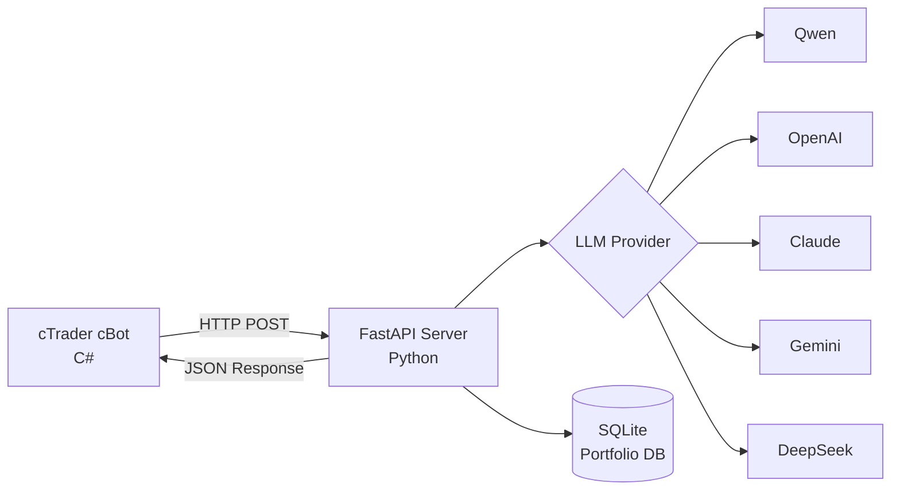

# 🤖 AgentFxTrading - AI-Powered Automated Trading System

<div align="center">

**Autonomous Forex Trading with TMS + ORB Strategy**

[](https://opensource.org/licenses/MIT)
[](https://www.python.org/downloads/)
[](https://ctdn.com/)
[](https://github.com/yourusername/AgentFxTrading/stargazers)
[](https://github.com/yourusername/AgentFxTrading/network/members)
[](https://github.com/yourusername/AgentFxTrading/issues)

[🇬🇧 English](README.md) | [🇻🇳 Tiếng Việt](README.vi.md) | [🇨🇳 中文](README.zh.md) | [🇵🇹 Português](README.pt.md) | [🇯🇵 日本語](README.ja.md) | [🇷🇺 Русский](README.ru.md)

[Installation](#-quick-start) • [Features](#-features) • [Strategy](#-trading-strategy) • [API Docs](#-api-documentation) • [Contributing](#-contributing)

</div>

---

## 📋 Table of Contents

- [Overview](#-overview)
- [Features](#-features)
- [Architecture](#-architecture)
- [Quick Start](#-quick-start)
- [Trading Strategy](#-trading-strategy)
- [Configuration](#-configuration)
- [API Documentation](#-api-documentation)
- [Development](#-development)
- [Performance](#-performance)
- [Contributing](#-contributing)
- [License](#-license)

---

## 🎯 Overview

AgentFxTrading is an **autonomous forex trading system** that combines the power of AI with proven technical analysis strategies. It uses **TMS (Trend Momentum Signal)** for trend detection and **ORB (Opening Range Breakout)** for precise entry timing.

### Why AgentFxTrading?

✅ **Fully Autonomous** - AI makes trading decisions 24/7  
✅ **Multi-LLM Support** - Works with Qwen, OpenAI, Claude, Gemini, DeepSeek  
✅ **Risk Management** - Portfolio-level risk control across multiple pairs  
✅ **Proven Strategy** - Based on professional TMS methodology  
✅ **Easy Setup** - Get started in under 10 minutes  
✅ **Open Source** - Fully transparent and customizable  

---

## 🚀 Features

### 🤖 AI-Powered Decision Making
- **Multi-LLM Support**: Qwen, OpenAI GPT-4, Claude, Gemini, DeepSeek
- **Context-Aware Analysis**: Analyzes 3 bars of historical data
- **Confidence Scoring**: Only trades when confidence > 70%
- **Adaptive Learning**: Prompt engineering for continuous improvement

### 📊 Advanced Technical Analysis
- **TMS Indicators**: Heiken Ashi, TDI (RSI + Signal), Stochastic
- **ORB Logic**: Opening Range detection with decisive breakout filter
- **Momentum Tracking**: TF Green State with slope analysis
- **Market Regime Detection**: Kaufman Efficiency Ratio (`er_session`, `er_recent`) & failed breakout counter (`or_flips`) to classify market into `trending`, `choppy`, `mixed`, `forming`

### 💼 Portfolio Management
- **Multi-Symbol Trading**: Run multiple bots on different pairs
- **Currency Exposure Control**: Prevents over-exposure to single currency
- **Correlation Detection**: Blocks highly correlated positions
- **Daily Loss Limits**: Automatic trading halt after max loss

### 🛡️ Risk Management
- **Position Memory**: Tracks MFE (Maximum Favorable Excursion)
- **Auto Breakeven**: Moves SL to entry after profit threshold
- **Trailing Stop**: Dynamic SL adjustment during profitable trades
- **Max Giveback Protection**: Closes position if giveback exceeds threshold
- **Loss Streak Protection**: Blocks entries after 3 consecutive losses
- **Cycle Gating (Cost Gate)**: Deterministically bypasses LLM calls when outside session, inside OR, or during loss streak — saving 80-90% API tokens
- **Trend TP Disabled**: Automatically disables fixed TP during trending regimes to ride the full move with Trailing SL & Giveback Floor
- **Daily Rotating Logs**: Persists all agent reasoning, cycle gate actions, and market snapshots to `logs/agent_YYYY-MM-DD.log` (14-day retention)

### ⏰ Session Management
- **Trading Sessions**: Configurable session times (London, NY, Tokyo)
- **EOD Auto-Close**: Automatically closes positions at session end
- **Phase Detection**: Pre-market, active, ending, closed phases

---

## 🏗️ Architecture



### Component Breakdown

| Component | Technology | Responsibility |
|-----------|-----------|----------------|
| **cBot** | C# / cTrader | Calculate indicators, execute trades |
| **Server** | Python / FastAPI | AI decision making, risk management |
| **Database** | SQLite | Portfolio tracking, position history |
| **LLM** | Multiple | Trading decision analysis |

---

## 📊 Dashboard

Monitor your trading system in real-time through the web dashboard.

### Access Dashboard

After starting the server, open your browser:
```
http://127.0.0.1:8000/dashboard
```

### Features

- **Real-time Updates**: WebSocket connection for live position tracking
- **Portfolio Overview**: Open positions, daily P&L, win rate, loss streak
- **Active Positions Table**: Bot ID, symbol, side, volume, entry price, SL/TP
- **Trade History**: Recent closed trades with P&L
- **P&L Chart**: Visual representation of daily performance

### API Endpoints

```
GET /dashboard              # Web interface
GET /api/dashboard/summary  # Portfolio summary (JSON)
GET /api/dashboard/positions # Active positions (JSON)
GET /api/dashboard/history  # Trade history (JSON)
WS  /ws/dashboard           # WebSocket for real-time updates
```
---

## ⚡ Quick Start

### Prerequisites

- Python 3.9+
- cTrader 4.x+
- LLM API key (Qwen/OpenAI/Claude/Gemini/DeepSeek)

### 1. Install Python Dependencies

```bash
# Clone repository
git clone https://github.com/yourusername/AgentFxTrading.git
cd AgentFxTrading

# Install dependencies
pip install -r requirements.txt
```

### 2. Configure LLM Provider

```bash
# Copy environment template
cp .env.example .env

# Edit .env with your API key
# Example for Qwen (recommended):
LLM_PROVIDER=qwen
DASHSCOPE_API_KEY=sk-your-dashscope-key
LLM_MODEL=qwen-max
```

### 3. Start the Server

```bash
python app/server.py
```

Server will run at `http://127.0.0.1:8000`

### 4. Setup & Run cBot

You can run the cBot either via **cTrader Desktop GUI** or **Headless Docker CLI** (`ctrader-console`).

#### Option A: cTrader Desktop GUI

1. Open **cTrader** → **Automate**
2. Click **New** → **cBot**
3. Paste code from `cBot/AiAgentBot.cs`
4. Click **Build**
5. Attach to chart (M15 or H1 recommended)
6. Configure parameters:
   - **Bot ID**: `xauusd_m15` (unique identifier)
   - **API URL**: `http://127.0.0.1:8000/trade`
   - **Session**: New York (13:00-21:00 UTC) / London (8:00-17:00 UTC) / Tokyo (0:00-9:00 UTC)

#### Option B: Headless Docker CLI (`ctrader-console`)

1. **Prepare Credentials File**:
   ```bash
   mkdir -p /root/ctrader_data
   echo "your_ctid_password" > /root/ctrader_data/ctid_pwd
   chmod 600 /root/ctrader_data/ctid_pwd
   ```

2. **Build/Compile the `.algo` package**:
   ```bash
   docker run --rm -v $(pwd):/workspace -v /root:/root \
     ghcr.io/spotware/ctrader-console:latest create cbot AiAgentBot
   cp cBot/AiAgentBot.cs /root/cAlgo/Sources/Robots/AiAgentBot/AiAgentBot/AiAgentBot.cs
   docker run --rm -v $(pwd):/workspace -v /root:/root \
     ghcr.io/spotware/ctrader-console:latest build /root/cAlgo/Sources/Robots/AiAgentBot/AiAgentBot/AiAgentBot.csproj
   cp /root/cAlgo/Sources/Robots/AiAgentBot.algo cBot/AiAgentBot.algo
   ```

3. **Run Multi-Instance Docker Containers**:

   * **XAUUSD (M15 - New York Session)**:
     ```bash
     docker run -d \
       --name cbot-xauusd \
       --restart unless-stopped \
       --network host \
       -v $(pwd):/workspace \
       -v /root:/root \
       ghcr.io/spotware/ctrader-console:latest \
       run /workspace/cBot/AiAgentBot.algo \
       --ctid=your_email@example.com \
       --pwd-file=/root/ctrader_data/ctid_pwd \
       --account=YOUR_ACCOUNT_ID \
       --symbol=XAUUSD \
       --period=m15 \
       --full-access \
       --BotId="xauusd_m15" \
       --ApiUrl="http://127.0.0.1:8000/trade" \
       --AccountLabel="demo" \
       --TmsTimeFrame="Hour" \
       --EmaPeriod=5 \
       --SessionName="newyork" \
       --OrbStartHour=13 \
       --SessionEndHour=21 \
       --SessionDstRule="US" \
       --MinDecisiveBreakoutPips=10.0 \
       --MinOrWidthPips=20.0 \
       --OrbBufferPips=3.0 \
       --BreakevenTriggerPips=30.0 \
       --BreakevenOffsetPips=2.0 \
       --TrailTriggerPips=50.0 \
       --TrailDistancePips=25.0 \
       --PartialCloseRatio=0.5 \
       --MinSlPips=20.0 \
       --MaxSlPips=80.0 \
       --MinTpPips=30.0 \
       --MaxTpPips=250.0 \
       --MaxGivebackPips=30.0 \
       --EnablePostTpGate=true \
       --PostTpPullbackPips=10.0 \
       --BounceTradeEnabled=true \
       --BounceDistanceThreshold=10 \
       --RiskPerTradePercent=0.2 \
       --TrendTpDisabled=true
     ```

   * **EURUSD (M15 - London Session)**:
     ```bash
     docker run -d \
       --name cbot-eurusd \
       --restart unless-stopped \
       --network host \
       -v $(pwd):/workspace \
       -v /root:/root \
       ghcr.io/spotware/ctrader-console:latest \
       run /workspace/cBot/AiAgentBot.algo \
       --ctid=your_email@example.com \
       --pwd-file=/root/ctrader_data/ctid_pwd \
       --account=YOUR_ACCOUNT_ID \
       --symbol=EURUSD \
       --period=m15 \
       --full-access \
       --BotId="eurusd_m15" \
       --ApiUrl="http://127.0.0.1:8000/trade" \
       --AccountLabel="demo" \
       --TmsTimeFrame="Hour" \
       --EmaPeriod=5 \
       --SessionName="london" \
       --OrbStartHour=8 \
       --SessionEndHour=17 \
       --SessionDstRule="Europe" \
       --MinDecisiveBreakoutPips=3.0 \
       --MinOrWidthPips=6.0 \
       --OrbBufferPips=1.0 \
       --BreakevenTriggerPips=8.0 \
       --BreakevenOffsetPips=1.0 \
       --TrailTriggerPips=15.0 \
       --TrailDistancePips=8.0 \
       --PartialCloseRatio=0.5 \
       --MinSlPips=6.0 \
       --MaxSlPips=20.0 \
       --MinTpPips=10.0 \
       --MaxTpPips=50.0 \
       --MaxGivebackPips=8.0 \
       --EnablePostTpGate=true \
       --PostTpPullbackPips=3.0 \
       --BounceTradeEnabled=true \
       --BounceDistanceThreshold=5 \
       --RiskPerTradePercent=0.2 \
       --TrendTpDisabled=true
     ```

   * **GBPUSD (M15 - London Session)**:
     ```bash
     docker run -d \
       --name cbot-gbpusd \
       --restart unless-stopped \
       --network host \
       -v $(pwd):/workspace \
       -v /root:/root \
       ghcr.io/spotware/ctrader-console:latest \
       run /workspace/cBot/AiAgentBot.algo \
       --ctid=your_email@example.com \
       --pwd-file=/root/ctrader_data/ctid_pwd \
       --account=YOUR_ACCOUNT_ID \
       --symbol=GBPUSD \
       --period=m15 \
       --full-access \
       --BotId="gbpusd_m15" \
       --ApiUrl="http://127.0.0.1:8000/trade" \
       --AccountLabel="demo" \
       --TmsTimeFrame="Hour" \
       --EmaPeriod=5 \
       --SessionName="london" \
       --OrbStartHour=8 \
       --SessionEndHour=17 \
       --SessionDstRule="Europe" \
       --MinDecisiveBreakoutPips=4.5 \
       --MinOrWidthPips=10.0 \
       --OrbBufferPips=1.5 \
       --BreakevenTriggerPips=12.0 \
       --BreakevenOffsetPips=1.5 \
       --TrailTriggerPips=20.0 \
       --TrailDistancePips=10.0 \
       --PartialCloseRatio=0.5 \
       --MinSlPips=8.0 \
       --MaxSlPips=25.0 \
       --MinTpPips=15.0 \
       --MaxTpPips=60.0 \
       --MaxGivebackPips=10.0 \
       --EnablePostTpGate=true \
       --PostTpPullbackPips=5.0 \
       --BounceTradeEnabled=true \
       --BounceDistanceThreshold=10 \
       --RiskPerTradePercent=0.2 \
       --TrendTpDisabled=true
     ```

   * **USDJPY (M15 - Tokyo Session)**:
     ```bash
     docker run -d \
       --name cbot-usdjpy \
       --restart unless-stopped \
       --network host \
       -v $(pwd):/workspace \
       -v /root:/root \
       ghcr.io/spotware/ctrader-console:latest \
       run /workspace/cBot/AiAgentBot.algo \
       --ctid=your_email@example.com \
       --pwd-file=/root/ctrader_data/ctid_pwd \
       --account=YOUR_ACCOUNT_ID \
       --symbol=USDJPY \
       --period=m15 \
       --full-access \
       --BotId="usdjpy_m15" \
       --ApiUrl="http://127.0.0.1:8000/trade" \
       --AccountLabel="demo" \
       --TmsTimeFrame="Hour" \
       --EmaPeriod=5 \
       --SessionName="tokyo" \
       --OrbStartHour=0 \
       --SessionEndHour=9 \
       --SessionDstRule="None" \
       --MinDecisiveBreakoutPips=4.0 \
       --MinOrWidthPips=8.0 \
       --OrbBufferPips=1.5 \
       --BreakevenTriggerPips=12.0 \
       --BreakevenOffsetPips=1.5 \
       --TrailTriggerPips=25.0 \
       --TrailDistancePips=12.0 \
       --PartialCloseRatio=0.5 \
       --MinSlPips=8.0 \
       --MaxSlPips=25.0 \
       --MinTpPips=15.0 \
       --MaxTpPips=70.0 \
       --MaxGivebackPips=12.0 \
       --EnablePostTpGate=true \
       --PostTpPullbackPips=4.0 \
       --BounceTradeEnabled=true \
       --BounceDistanceThreshold=3 \
       --RiskPerTradePercent=0.2 \
       --TrendTpDisabled=true
     ```

   * **US30 (M5 - New York Index Session)**:
     ```bash
     docker run -d \
       --name cbot-us30 \
       --restart unless-stopped \
       --network host \
       -v $(pwd):/workspace \
       -v /root:/root \
       ghcr.io/spotware/ctrader-console:latest \
       run /workspace/cBot/AiAgentBot.algo \
       --ctid=your_email@example.com \
       --pwd-file=/root/ctrader_data/ctid_pwd \
       --account=YOUR_ACCOUNT_ID \
       --symbol=US30 \
       --period=m5 \
       --full-access \
       --BotId="us30_m5" \
       --ApiUrl="http://127.0.0.1:8000/trade" \
       --AccountLabel="demo" \
       --TmsTimeFrame="Hour" \
       --EmaPeriod=5 \
       --SessionName="newyork_index" \
       --OrbStartHour=13 \
       --SessionEndHour=20 \
       --SessionDstRule="US" \
       --MinDecisiveBreakoutPips=15.0 \
       --MinOrWidthPips=30.0 \
       --OrbBufferPips=5.0 \
       --BreakevenTriggerPips=50.0 \
       --BreakevenOffsetPips=5.0 \
       --TrailTriggerPips=80.0 \
       --TrailDistancePips=40.0 \
       --PartialCloseRatio=0.5 \
       --MinSlPips=30.0 \
       --MaxSlPips=120.0 \
       --MinTpPips=50.0 \
       --MaxTpPips=400.0 \
       --MaxGivebackPips=50.0 \
       --EnablePostTpGate=true \
       --PostTpPullbackPips=20.0 \
       --BounceTradeEnabled=true \
       --BounceDistanceThreshold=10 \
       --RiskPerTradePercent=0.2 \
       --TrendTpDisabled=true
     ```

   * **NAS100 (M5 - New York Index Session)**:
     ```bash
     docker run -d \
       --name cbot-nas100 \
       --restart unless-stopped \
       --network host \
       -v $(pwd):/workspace \
       -v /root:/root \
       ghcr.io/spotware/ctrader-console:latest \
       run /workspace/cBot/AiAgentBot.algo \
       --ctid=your_email@example.com \
       --pwd-file=/root/ctrader_data/ctid_pwd \
       --account=YOUR_ACCOUNT_ID \
       --symbol=NAS100 \
       --period=m5 \
       --full-access \
       --BotId="nas100_m5" \
       --ApiUrl="http://127.0.0.1:8000/trade" \
       --AccountLabel="demo" \
       --TmsTimeFrame="Hour" \
       --EmaPeriod=5 \
       --SessionName="newyork_index" \
       --OrbStartHour=13 \
       --SessionEndHour=20 \
       --SessionDstRule="US" \
       --MinDecisiveBreakoutPips=15.0 \
       --MinOrWidthPips=35.0 \
       --OrbBufferPips=5.0 \
       --BreakevenTriggerPips=60.0 \
       --BreakevenOffsetPips=5.0 \
       --TrailTriggerPips=100.0 \
       --TrailDistancePips=50.0 \
       --PartialCloseRatio=0.5 \
       --MinSlPips=35.0 \
       --MaxSlPips=150.0 \
       --MinTpPips=60.0 \
       --MaxTpPips=500.0 \
       --MaxGivebackPips=60.0 \
       --EnablePostTpGate=true \
       --PostTpPullbackPips=25.0 \
       --BounceTradeEnabled=true \
       --BounceDistanceThreshold=10 \
       --RiskPerTradePercent=0.2 \
       --TrendTpDisabled=true
     ```
### 5. Start Trading! 🎉

The bot will automatically:
- Calculate indicators on each bar close
- Send market snapshot to AI server
- Receive trading decision
- Execute trades with risk management

---

## 📈 Trading Strategy

### TMS (Trend Momentum Signal)

TMS identifies the **directional bias** using three confirmations:

| Indicator | Bullish Signal | Bearish Signal |
|-----------|----------------|----------------|
| **TDI** | Green > Red | Green < Red |
| **Heiken Ashi** | Green candle | Red candle |
| **Stochastic** | K > D | K < D |

**Key Concept**: Bias is locked until next cross, preventing whipsaws.

### ORB (Opening Range Breakout)

ORB provides **precise entry timing**:

1. **Opening Range**: High/Low of first 15 minutes of session
2. **Breakout**: Price closes beyond OR boundary
3. **Decisive Filter**: Breakout must be decisive (≥ MinDecisiveBreakoutPips, default 10.0 pips on XAUUSD)

### Market Regime (Kaufman Efficiency Ratio)

The system computes real-time efficiency metrics to adapt its trading and exit behavior:
- **`er_session` & `er_recent`**: Kaufman Efficiency Ratio ($ER = \frac{|\text{Net Move}|}{\sum |\text{Bar Moves}|}$). $1.0$ represents a clean directional move, while $\approx 0.0$ indicates chop.
- **`or_flips`**: Counts failed breakouts outside the Opening Range that close back inside (indicates chop day).
- **Regimes**:
  - **`trending`** ($ER \ge 0.35$): Disables fixed TP (`TrendTpDisabled = true`), lets Trailing SL and Giveback Floor capture the full trend run.
  - **`choppy`** (`or_flips \ge 5`): High risk of stop-hunting traps → Cycle Gate forces `HOLD`.
  - **`mixed`**: Standard trading discipline ($R:R \ge 1.5$).
  - **`forming`**: Early session range formation ($< 6$ bars).

### Quantitative Edge-Case Rules
- **BIAS-FRESH Exception**: When a TDI cross just occurred ($\le 1$ bar ago), early momentum is treated as the **start of a fresh trend leg**, not an extended move → Favors entering immediately.
- **Anti-Chase Rule**: When price broke out $\ge 4$ bars ago under an old bias without a pullback, **DO NOT chase** at extremes → Holds and waits for a pullback.
- **Position Memory & Giveback Floor**: Tracks Peak Profit ($MFE$) on every tick. If floating profit drops below the maximum giveback threshold, the position is closed immediately to lock in gains.

### Entry Rules

```
IF TMS_BULLISH AND ORB_BREAKOUT_UP AND DECISIVE:
    → BUY
    
IF TMS_BEARISH AND ORB_BREAKOUT_DOWN AND DECISIVE:
    → SELL
    
ELSE:
    → HOLD
```

### Exit Rules

| Condition | Action |
|-----------|--------|
| TDI Green flat/hook/checkmark | CLOSE_ALL |
| Bias reverses | Auto close |
| Session ends (EOD) | Auto close (EOD Force-Flatten safety net) |
| Profit ≥ 30p | Move SL to breakeven (+2p offset) |
| Profit ≥ 50p | Trail SL by 25p |
| Giveback ≥ 30p | Auto close (Max giveback protection) |

---

## ⚙️ Configuration

### cBot Parameters

#### TMS Settings (Multi-Timeframe)
| Parameter | Default | Description |
|-----------|---------|-------------|
| TMS Timeframe (Macro) | Hour (H1) | Macro trend bias timeframe (H1, H4, M15, etc.) |
| RSI Period | 6 | RSI calculation period |
| Red Period | 6 | Signal line period |

#### Stochastic Settings
| Parameter | Default | Description |
|-----------|---------|-------------|
| %K Period | 6 | Fast stochastic |
| %D Period | 6 | Slow stochastic |
| Slowing | 4 | Smoothing factor |

#### Entry Filters
| Parameter | Default | Description |
|-----------|---------|-------------|
| Max Bars After Cross | 5 | Entry window |
| Min Angle Delta | 0.0 | Angle filter (0=off) |
| Min Decisive Breakout | 10.0 pips | Breakout strength (default tuned for XAUUSD) |

#### Exit Management
| Parameter | Default | Description |
|-----------|---------|-------------|
| Flat Threshold | 0.01 | TDI flatness |
| Breakeven Trigger | 30.0 pips | Profit to move SL |
| Breakeven Offset | 2.0 pips | Profit locked at breakeven |
| Trail Trigger | 50.0 pips | Profit to start trailing |
| Trail Distance | 25.0 pips | SL distance from price |

#### Session
| Parameter | Default | Description |
|-----------|---------|-------------|
| Session Start Hour | 13 (UTC) | New York open (Winter UTC) |
| Session End Hour | 21 (UTC) | New York close (EOD force-flatten) |
| Opening Range | 15 min | OR calculation window |
| Min OR Width | 20.0 pips | Minimum OR width |
| ORB Buffer | 3.0 pips | Buffer to avoid fakeouts |
| DST Rule | US | Auto daylight saving adjustment |

#### Guardrails
| Parameter | Default | Description |
|-----------|---------|-------------|
| Min SL | 20.0 pips | Minimum stop loss |
| Max SL | 80.0 pips | Maximum stop loss |
| Min TP | 30.0 pips | Minimum take profit |
| Max TP | 250.0 pips | Maximum take profit |
| Max Giveback | 30.0 pips | Giveback threshold to force close |
| Max Loss Streak | 3 | Block after N losses |
| Bias Flip Exit | true | Auto close on bias change |
| Trend TP Disabled | true | Disable fixed TP in trending regime |

### 📊 Recommended Presets by Symbol

| Parameter | XAUUSD (Gold) | EURUSD | GBPUSD | USDJPY |
| :--- | :--- | :--- | :--- | :--- |
| **Trading Session** | New York (`13:00 - 21:00 UTC`) | London (`08:00 - 17:00 UTC`) | London (`08:00 - 17:00 UTC`) | Tokyo / NY (`00:00 - 09:00` / `13:00 - 21:00 UTC`) |
| **DST Rule** | `US` | `Europe` | `Europe` | `None` (Tokyo) / `US` (NY) |
| **Min Decisive Breakout** | `10.0 pips` | `3.0 pips` | `4.5 pips` | `4.0 pips` |
| **Min OR Width** | `20.0 pips` | `6.0 pips` | `10.0 pips` | `8.0 pips` |
| **ORB Buffer** | `3.0 pips` | `1.0 pips` | `1.5 pips` | `1.5 pips` |
| **Breakeven Trigger** | `30.0 pips` | `8.0 pips` | `12.0 pips` | `12.0 pips` |
| **Breakeven Offset** | `2.0 pips` | `1.0 pips` | `1.5 pips` | `1.5 pips` |
| **Trail Trigger** | `50.0 pips` | `15.0 pips` | `25.0 pips` | `25.0 pips` |
| **Trail Distance** | `25.0 pips` | `8.0 pips` | `12.0 pips` | `12.0 pips` |
| **Min SL / Max SL** | `20.0 / 80.0 pips` | `6.0 / 20.0 pips` | `8.0 / 30.0 pips` | `8.0 / 25.0 pips` |
| **Min TP / Max TP** | `30.0 / 250.0 pips` | `10.0 / 50.0 pips` | `15.0 / 80.0 pips` | `15.0 / 70.0 pips` |
| **Max Giveback** | `30.0 pips` | `8.0 pips` | `12.0 pips` | `12.0 pips` |
| **Recommended Timeframe** | `M5` or `M15` | `M15` | `M15` | `M15` |
| **EMA Period** | `5` | `5` | `5` | `5` |
| **Post-TP Gate / Pullback** | `true` (`10.0 pips`) | `true` (`3.0 pips`) | `true` (`5.0 pips`) | `true` (`4.0 pips`) |
| **TDI Bounce Trade** | `true` (`1.5`) | `true` (`1.5`) | `true` (`1.5`) | `true` (`1.5`) |
| **Partial Close at BE** | `0.5 (50%)` | `0.5 (50%)` | `0.5 (50%)` | `0.5 (50%)` |
| **Risk per Trade** | `0.2%` | `0.2%` | `0.2%` | `0.2%` |
### Portfolio Manager Settings

Edit `app/portfolio.py`:

```python
class PortfolioConfig:
    MAX_POSITIONS = 4              # Max open positions
    MAX_CURRENCY_EXPOSURE = 2      # Max positions per currency
    MAX_CORRELATED_POSITIONS = 2   # Max correlated positions
    MAX_DAILY_LOSS = -200.0        # Daily loss limit (USD)
    MAX_MARGIN_USAGE_PCT = 50.0    # Max margin usage
```

---

## 📡 API Documentation

### POST /trade

Main endpoint for trading decisions.

**Request** (from cBot):
```json
{
  "bot_id": "eurusd_bot",
  "symbol": "EURUSD",
  "timeframe": "M15",
  "ask": 1.0850,
  "bid": 1.0848,
  "bars": [
    {"ha_color": "Green", "tdi_green": 55.2, "tdi_red": 52.1, "stoch_k": 75.0, "stoch_d": 70.0},
    {"ha_color": "Green", "tdi_green": 54.8, "tdi_red": 51.9, "stoch_k": 72.0, "stoch_d": 68.0},
    {"ha_color": "Red", "tdi_green": 53.5, "tdi_red": 52.5, "stoch_k": 65.0, "stoch_d": 62.0}
  ],
  "tms": {
    "bias": "BULLISH",
    "bars_since_cross": 2,
    "long_entry": true,
    "short_entry": false,
    "green_tf_value": 55.2,
    "green_tf_slope": 0.4
  },
  "orb": {
    "or_high": 1.0845,
    "or_low": 1.0830,
    "breakout_direction": "up",
    "breakout_distance_pips": 5.0,
    "is_decisive": true,
    "bars_since_breakout": 1
  },
  "position": null,
  "session": {
    "phase": "active",
    "minutes_to_end": 180
  }
}
```

**Response** (from AI):
```json
{
  "action": "BUY",
  "volume_lots": 0.01,
  "sl_pips": 10.0,
  "tp_pips": 20.0,
  "reason": "TMS BULLISH bias confirmed, ORB decisive breakout UP (+5.0p), momentum rising"
}
```

### POST /portfolio/report

Report position changes for portfolio tracking.

```json
{
  "bot_id": "eurusd_bot",
  "action": "open",
  "symbol": "EURUSD",
  "side": "BUY",
  "volume": 0.01,
  "entry_price": 1.0850,
  "sl_pips": 10.0,
  "tp_pips": 20.0
}
```

### GET /portfolio/status

Get current portfolio status.

```bash
curl http://127.0.0.1:8000/portfolio/status
```

---

## 🛠️ Development

### Project Structure

```
AgentFxTrading/
├── app/
│   ├── llm_client.py      # LLM abstraction layer
│   ├── server.py          # FastAPI server
│   └── portfolio.py       # Portfolio risk management
├── cBot/
│   └── AiAgentBot.cs      # cTrader cBot
├── .env.example           # Environment template
├── requirements.txt       # Python dependencies
├── README.md              # Documentation (6 languages)
└── portfolio.db           # SQLite database (auto-created)
```

### Adding New LLM Provider

1. Create new class in `app/llm_client.py`:

```python
class NewProviderClient(LLMClient):
    def __init__(self, api_key: str, model: str):
        # Initialize client
        pass
    
    async def chat(self, messages: List[Dict[str, str]], **kwargs) -> str:
        # Implement chat logic
        pass
```

2. Update `create_llm_client()`:

```python
elif provider == "newprovider":
    return NewProviderClient(
        api_key=os.getenv("NEWPROVIDER_API_KEY"),
        model=os.getenv("LLM_MODEL")
    )
```

### Improving the Prompt

Edit `SYSTEM_PROMPT` in `app/server.py` to adjust trading logic.


---

## 📊 Performance

### Backtest Results

> ⚠️ **Disclaimer**: Past performance does not guarantee future results. Always test with demo account first.

| Metric | Value |
|--------|-------|
| Win Rate | ~55-65% |
| Risk/Reward | 1:2 average |
| Max Drawdown | ~15% |
| Sharpe Ratio | ~1.2 |

### Live Trading Tips

1. **Start with Demo**: Always test strategy first
2. **Small Position Size**: Start with 0.01 lots
3. **Monitor Daily**: Check portfolio status regularly
4. **Adjust Parameters**: Tune based on market conditions
5. **Risk Management**: Never risk more than 2% per trade

---

## 🤝 Contributing

Contributions are welcome! Here's how you can help:

### Ways to Contribute

1. **Star the repo** ⭐ - Shows support
2. **Report bugs** 🐛 - Open an issue
3. **Suggest features** 💡 - Open a feature request
4. **Submit PRs** 🔧 - Code contributions
5. **Improve docs** 📚 - Documentation improvements
6. **Share results** 📈 - Share your backtest/live results

### Development Guidelines

- Follow existing code style
- Write tests for new features
- Update documentation
- Keep PRs focused and small

### Community

- 💬 [Discussions](https://github.com/yourusername/AgentFxTrading/discussions)
- 🐛 [Issues](https://github.com/yourusername/AgentFxTrading/issues)
- 📧 Email: your-email@example.com

---

## 📄 License

This project is licensed under the MIT License - see the [LICENSE](LICENSE) file for details.

---

## 🙏 Acknowledgments

- **TMS Strategy**: Based on professional TMS methodology
- **cTrader**: For providing excellent API
- **Open Source Community**: For amazing libraries and tools

---

## 📈 Star History

[](https://star-history.com/#yourusername/AgentFxTrading&Date)

---

<div align="center">

**If you find this project useful, please consider giving it a ⭐!**

[⬆ Back to Top](#-agentfxtrading---ai-powered-automated-trading-system)

</div>
