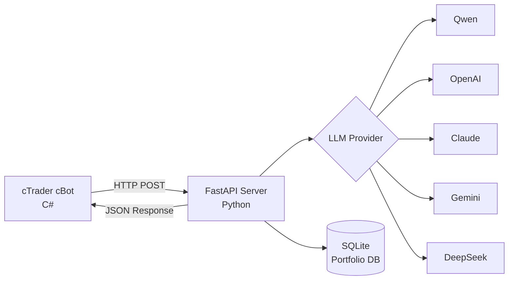

# 🤖 AgentFxTrading - Sistema de Negociação Automatizado com IA

<div align="center">

**Negociação Forex Automatizada com Estratégia TMS + ORB**

[](https://opensource.org/licenses/MIT)
[](https://www.python.org/downloads/)
[](https://ctdn.com/)
[](https://github.com/yourusername/AgentFxTrading/stargazers)
[](https://github.com/yourusername/AgentFxTrading/network/members)
[](https://github.com/yourusername/AgentFxTrading/issues)

[🇬🇧 English](README.md) | [🇻🇳 Tiếng Việt](README.vi.md) | [🇨🇳 中文](README.zh.md) | [🇵🇹 Português](README.pt.md) | [🇯🇵 日本語](README.ja.md) | [🇷🇺 Русский](README.ru.md)

[Instalação](#-instalação-rápida) • [Recursos](#-recursos) • [Estratégia](#-estratégia-de-negociação) • [API Docs](#-documentação-da-api) • [Contribuir](#-contribuindo)

</div>

---

## 📋 Índice

- [Visão Geral](#-visão-geral)
- [Recursos](#-recursos)
- [Arquitetura](#-arquitetura)
- [Instalação Rápida](#-instalação-rápida)
- [Estratégia de Negociação](#-estratégia-de-negociação)
- [Configuração](#-configuração)
- [Documentação da API](#-documentação-da-api)
- [Desenvolvimento](#-desenvolvimento)
- [Performance](#-performance)
- [Contribuindo](#-contribuindo)
- [Licença](#-licença)

---

## 🎯 Visão Geral

AgentFxTrading é um **sistema de negociação forex automatizado** que combina o poder da IA com estratégias de análise técnica comprovadas. Ele usa **TMS (Trend Momentum Signal)** para detecção de tendência e **ORB (Opening Range Breakout)** para timing preciso de entrada.

### Por que escolher AgentFxTrading?

✅ **Totalmente Autônomo** - IA toma decisões de negociação 24/7  
✅ **Suporte Multi-LLM** - Funciona com Qwen, OpenAI, Claude, Gemini, DeepSeek  
✅ **Gestão de Risco** - Controle de risco em nível de portfólio em múltiplos pares  
✅ **Estratégia Comprovada** - Baseado na metodologia profissional TMS  
✅ **Fácil Configuração** - Comece em menos de 10 minutos  
✅ **Código Aberto** - Totalmente transparente e personalizável  

---

## 🚀 Recursos

### 🤖 Motores Duplos de Estratégia de IA
- **1. Motor TMS + ORB (`AiAgentBot`)**: Sinais de Momentum de Tendência (Heikin Ashi + TDI + Stochastic) combinados com rompimento de Opening Range e regimes dinâmicos de eficiência de Kaufman.
- **2. Motor Asian Range Judas Sweep (`AsianRangeJudasSweepBot`)**: Conceito de Smart Money (SMC) capturando caçadas de liquidez (Judas Swing) nas máximas e mínimas da sessão asiática (00:00–06:00 UTC) durante os Killzones de Londres (07:00–10:00 UTC) e Nova York (12:30–16:00 UTC) com confirmação em Order Block / FVG.
- **Suporte Multi-LLM**: Qwen, OpenAI GPT-4o, Claude 3.5 Sonnet, Gemini 2.0 Flash, DeepSeek V3/R1.
- **Análise Multi-Timeframe**: Alinhamento de tendência M15 + H1 + H4, estrutura de swing e filtro de notícias em tempo real.
### 💼 Gestão de Portfólio
- **Negociação Multi-Símbolo**: Execute múltiplos bots em diferentes pares
- **Controle de Exposição em Moeda**: Previne sobre-exposição a uma única moeda
- **Detecção de Correlação**: Bloqueia posições altamente correlacionadas
- **Limites de Perda Diária**: Parada automática de negociação após perda máxima

- **Memória de Posição**: Rastreia MFE (Maximum Favorable Excursion) a cada tick
- **Breakeven Automático**: Move SL para o zero (+0.1x ATR offset) quando o lucro atinge $\ge 0.8\times$ ATR
- **Trailing Stop**: Ajuste dinâmico de SL iniciando em $1.2\times$ ATR (distância de trailing $0.7\times$ ATR)
- **Trava de Lucro e Proteção de Giveback**: Fecha posição se o giveback atingir $\ge 40\%$ do pico de lucro (MFE) ou $\ge 0.6\times$ ATR
- **Filtro Anti-Sobre-extensão (Anti-Overextension Guard)**: Bloqueia rompimentos esticados além de $2.5\times$ ATR da borda do Opening Range
- **Teto de Risco em Dólares (Max Dollar Risk Cap)**: Limite rígido de perda máxima ($12.00) por operação em ativos com volume mínimo
- **Proteção de Sequência de Perdas**: Bloqueia entradas após 3 perdas consecutivas
- **Cycle Gating (Cost Gate)**: Ignora chamadas LLM fora da sessão, dentro do OR, sobre-estendido ou em sequência de perdas — economizando 80-90% de custos de API
- **Trend TP Disabled**: Desativa o TP fixo em forte tendência (`trending`) para maximizar ganhos com Trailing SL & Giveback Floor
- **Precisão Dinâmica Multi-Ativo (Dynamic Precision)**: Ajusta casas decimais dinamicamente (5 para Forex, 3 para pares JPY, 2 para ouro, índices e cripto), prevenindo distorção de velas nos prompts
- **Normalização Real de Pips ATR (True ATR Scaling)**: Conversão automática da volatilidade bruta para pips reais para avaliação precisa do LLM
- **Cycle Gate Adaptativo para Cripto**: Classificação correta de criptoativos (`BTC`, `ETH`, `SOL`, `XRP`) com limites de rompimento de até 60.000 pips
- **Filtro Adaptativo de Range Asiático**: Limites sob medida por ativo (`[200p, 8000p]` para ouro, `[12p, 100p]` para Forex) e supressão de requisições ociosas sem posições
- **Integração de Telemetria do cBot**: cBot envia notificações de bloqueios de guardrail ao servidor FastAPI via `/api/cbot_event`
### ⏰ Gestão de Sessão
- **Sessões de Negociação**: Tempos de sessão configuráveis (Londres, NY, Tóquio)
- **Fechamento Automático no Fim do Dia**: Fecha posições automaticamente no fim da sessão
- **Detecção de Fase**: Fases pré-mercado, ativa, finalizando, fechada

---

## 🏗️ Arquitetura



### Detalhamento dos Componentes

| Componente | Tecnologia | Responsabilidade |
|-----------|-----------|------------------|
| **cBot** | C# / cTrader | Calcular indicadores, executar negociações |
| **Server** | Python / FastAPI | Tomada de decisão IA, gestão de risco |
| **Database** | SQLite | Rastreamento de portfólio, histórico de posições |
| **LLM** | Múltiplos | Análise de decisão de negociação |


---

## 📊 Painel de Controle (Dashboard)

Monitore e gerencie o sistema de negociação em tempo real através da interface web moderna:
```
http://127.0.0.1:8000/dashboard
```

### Recursos do Dashboard

- **Atualizações em Tempo Real**: WebSocket bidirecional para sincronização instantânea
- **Visão Geral do Portfólio**: Posições abertas, P&L diário, taxa de acerto (Win Rate), sequência de perdas e patrimônio
- **Tabela de Posições Ativas (Active Positions)**: Distinção visual de estratégia (`Judas SMC` roxo vs `TMS+ORB` ciano), identificador cBot, símbolo, volume, preço de entrada e PnL flutuante
- **Histórico de Negociações (Recent Trades)**: Ordens fechadas com rótulos de estratégia e P&L líquido
- **Gráfico de P&L Diário**: Visualização de barras do desempenho histórico
- **Monitoramento de Guardrails**: Acompanhamento em tempo real dos bloqueios de segurança do cBot

### Endpoints da API

```
GET  /dashboard                # Interface web do dashboard
GET  /api/dashboard/summary    # Resumo de KPIs do portfólio (JSON)
GET  /api/dashboard/positions  # Lista de posições ativas abertas (JSON)
GET  /api/dashboard/history    # Histórico de ordens fechadas (JSON)
GET  /api/dashboard/pnl-history # Histórico diário de P&L (JSON)
GET  /api/dashboard/logs       # Fluxo de logs em tempo real (JSON)
POST /api/tick                 # Telemetria de cotação e saldo dos cBots
POST /api/cbot_event           # Telemetria de eventos e bloqueios dos cBots
POST /portfolio/report         # Relatório de ciclo de vida de ordens
WS   /ws/dashboard             # Transmissão WebSocket em tempo real
```
---

## ⚡ Instalação Rápida

### Pré-requisitos

- Python 3.9+
- cTrader 4.x+
- Chave API LLM (Qwen/OpenAI/Claude/Gemini/DeepSeek)

### 1. Instalar Dependências Python

```bash
# Clonar repositório
git clone https://github.com/yourusername/AgentFxTrading.git
cd AgentFxTrading

# Instalar dependências
pip install -r requirements.txt
```

### 2. Configurar LLM Provider

```bash
# Copiar template de ambiente
cp .env.example .env

# Editar .env com sua chave API
# Exemplo para Qwen (recomendado):
LLM_PROVIDER=qwen
DASHSCOPE_API_KEY=sk-your-dashscope-key
LLM_MODEL=qwen-max
```

### 3. Iniciar o Servidor

```bash
python app/server.py
```

O servidor será executado em `http://127.0.0.1:8000`

### 4. Configurar e Executar o cBot

Você pode executar o cBot através da **Interface Gráfica cTrader Desktop (GUI)** ou pelo **Headless Docker CLI** (`ctrader-console`).

#### Opção A: cTrader Desktop GUI

1. Abrir **cTrader** → **Automate**
2. Clicar em **New** → **cBot**
3. Colar código de `cBot/AiAgentBot.cs`
4. Clicar em **Build**
5. Anexar ao gráfico (M15 ou H1 recomendado)
6. Configurar parâmetros:
   - **Bot ID**: `xauusd_m15` (identificador único)
   - **API URL**: `http://127.0.0.1:8000/trade`
   - **Session**: New York (13:00-21:00 UTC) / London (8:00-17:00 UTC) / Tokyo (0:00-9:00 UTC)

#### Opção B: Headless Docker CLI (`ctrader-console`)

1. **Preparar Arquivo de Credenciais cTID**:
   ```bash
   mkdir -p /root/ctrader_data
   echo "sua_senha_ctid" > /root/ctrader_data/ctid_pwd
   chmod 600 /root/ctrader_data/ctid_pwd
   ```

2. **Compilar os Pacotes `.algo`**:
   ```bash
   # 1. Compilar o bot TMS+ORB (AiAgentBot)
   docker run --rm -v $(pwd):/workspace -v /root:/root \
     ghcr.io/spotware/ctrader-console:latest create cbot AiAgentBot
   cp cBot/AiAgentBot.cs /root/cAlgo/Sources/Robots/AiAgentBot/AiAgentBot/AiAgentBot.cs
   docker run --rm -v $(pwd):/workspace -v /root:/root \
     ghcr.io/spotware/ctrader-console:latest build /root/cAlgo/Sources/Robots/AiAgentBot/AiAgentBot/AiAgentBot.csproj
   cp /root/cAlgo/Sources/Robots/AiAgentBot.algo cBot/AiAgentBot.algo

   # 2. Compilar o bot Asian Range Judas Sweep (AsianRangeJudasSweepBot)
   docker run --rm -v $(pwd):/workspace -v /root:/root \
     ghcr.io/spotware/ctrader-console:latest create cbot AsianRangeJudasSweepBot
   cp cBot/AsianRangeJudasSweepBot.cs /root/cAlgo/Sources/Robots/AsianRangeJudasSweepBot/AsianRangeJudasSweepBot/AsianRangeJudasSweepBot.cs
   docker run --rm -v $(pwd):/workspace -v /root:/root \
     ghcr.io/spotware/ctrader-console:latest build /root/cAlgo/Sources/Robots/AsianRangeJudasSweepBot/AsianRangeJudasSweepBot/AsianRangeJudasSweepBot.csproj
   cp /root/cAlgo/Sources/Robots/AsianRangeJudasSweepBot.algo cBot/AsianRangeJudasSweepBot.algo
   ```
3. **Executar Containers Docker para cada par/índice**:

   * **XAUUSD Caçada de Liquidez Asiática (M15 - ICT Judas Sweep)**:
     ```bash
     docker run -d \
       --name cbot-xauusd-judas \
       --restart unless-stopped \
       --network host \
       -v $(pwd):/workspace \
       -v /root:/root \
       ghcr.io/spotware/ctrader-console:latest \
       run /workspace/cBot/AsianRangeJudasSweepBot.algo \
       --ctid=seu_email@example.com \
       --pwd-file=/root/ctrader_data/ctid_pwd \
       --account=ID_DA_CONTA \
       --symbol=XAUUSD \
       --period=m15 \
       --full-access \
       --BotId="cbot-xauusd-judas" \
       --label="cbot-xauusd-judas" \
       --DashboardServerUrl="http://127.0.0.1:8000" \
       --ApiUrl="http://127.0.0.1:8000/trade" \
       --AccountLabel="demo" \
       --UseDirectAiApi=false \
       --UseAiGateMode=true \
       --minAsianRangePips=200.0 \
       --maxAsianRangePips=8000.0 \
       --sweepBufferPips=30.0 \
       --AiSlMinFloorPips=200.0 \
       --breakEvenTrigger=250.0 \
       --stoplossPip=200.0 \
       --takeprofitPip=450.0 \
       --enableBreakEvenPrice=true

   * **GBPUSD Caçada de Liquidez Asiática (M15 - ICT Judas Sweep)**:
     ```bash
     docker run -d \
       --name cbot-gbpusd-judas \
       --restart unless-stopped \
       --network host \
       -v $(pwd):/workspace \
       -v /root:/root \
       ghcr.io/spotware/ctrader-console:latest \
       run /workspace/cBot/AsianRangeJudasSweepBot.algo \
       --ctid=seu_email@example.com \
       --pwd-file=/root/ctrader_data/ctid_pwd \
       --account=ID_DA_CONTA \
       --symbol=GBPUSD \
       --period=m15 \
       --full-access \
       --BotId="cbot-gbpusd-judas" \
       --label="cbot-gbpusd-judas" \
       --DashboardServerUrl="http://127.0.0.1:8000" \
       --ApiUrl="http://127.0.0.1:8000/trade" \
       --AccountLabel="demo" \
       --UseDirectAiApi=false \
       --UseAiGateMode=true \
       --minAsianRangePips=15.0 \
       --maxAsianRangePips=45.0 \
       --sweepBufferPips=3.5 \
       --AiSlMinFloorPips=15.0 \
       --breakEvenTrigger=20.0 \
       --stoplossPip=15.0 \
       --takeprofitPip=35.0 \
       --enableBreakEvenPrice=true
     ```

   * **EURUSD Caçada de Liquidez Asiática (M15 - ICT Judas Sweep)**:
     ```bash
     docker run -d \
       --name cbot-eurusd-judas \
       --restart unless-stopped \
       --network host \
       -v $(pwd):/workspace \
       -v /root:/root \
       ghcr.io/spotware/ctrader-console:latest \
       run /workspace/cBot/AsianRangeJudasSweepBot.algo \
       --ctid=seu_email@example.com \
       --pwd-file=/root/ctrader_data/ctid_pwd \
       --account=ID_DA_CONTA \
       --symbol=EURUSD \
       --period=m15 \
       --full-access \
       --BotId="cbot-eurusd-judas" \
       --label="cbot-eurusd-judas" \
       --DashboardServerUrl="http://127.0.0.1:8000" \
       --ApiUrl="http://127.0.0.1:8000/trade" \
       --AccountLabel="demo" \
       --UseDirectAiApi=false \
       --UseAiGateMode=true \
       --minAsianRangePips=15.0 \
       --maxAsianRangePips=45.0 \
       --sweepBufferPips=3.5 \
       --AiSlMinFloorPips=15.0 \
       --breakEvenTrigger=20.0 \
       --stoplossPip=15.0 \
       --takeprofitPip=35.0 \
       --enableBreakEvenPrice=true
     ```

   * **GBPJPY Caçada de Liquidez Asiática (M15 - ICT Judas Sweep)**:
     ```bash
     docker run -d \
       --name cbot-gbpjpy-judas \
       --restart unless-stopped \
       --network host \
       -v $(pwd):/workspace \
       -v /root:/root \
       ghcr.io/spotware/ctrader-console:latest \
       run /workspace/cBot/AsianRangeJudasSweepBot.algo \
       --ctid=seu_email@example.com \
       --pwd-file=/root/ctrader_data/ctid_pwd \
       --account=ID_DA_CONTA \
       --symbol=GBPJPY \
       --period=m15 \
       --full-access \
       --BotId="cbot-gbpjpy-judas" \
       --label="cbot-gbpjpy-judas" \
       --DashboardServerUrl="http://127.0.0.1:8000" \
       --ApiUrl="http://127.0.0.1:8000/trade" \
       --AccountLabel="demo" \
       --UseDirectAiApi=false \
       --UseAiGateMode=true \
       --minAsianRangePips=25.0 \
       --maxAsianRangePips=70.0 \
       --sweepBufferPips=5.0 \
       --AiSlMinFloorPips=25.0 \
       --breakEvenTrigger=30.0 \
       --stoplossPip=25.0 \
       --takeprofitPip=50.0 \
       --enableBreakEvenPrice=true
     ```

   * **EURJPY Caçada de Liquidez Asiática (M15 - ICT Judas Sweep)**:
     ```bash
     docker run -d \
       --name cbot-eurjpy-judas \
       --restart unless-stopped \
       --network host \
       -v $(pwd):/workspace \
       -v /root:/root \
       ghcr.io/spotware/ctrader-console:latest \
       run /workspace/cBot/AsianRangeJudasSweepBot.algo \
       --ctid=seu_email@example.com \
       --pwd-file=/root/ctrader_data/ctid_pwd \
       --account=ID_DA_CONTA \
       --symbol=EURJPY \
       --period=m15 \
       --full-access \
       --BotId="cbot-eurjpy-judas" \
       --label="cbot-eurjpy-judas" \
       --DashboardServerUrl="http://127.0.0.1:8000" \
       --ApiUrl="http://127.0.0.1:8000/trade" \
       --AccountLabel="demo" \
       --UseDirectAiApi=false \
       --UseAiGateMode=true \
       --minAsianRangePips=25.0 \
       --maxAsianRangePips=70.0 \
       --sweepBufferPips=5.0 \
       --AiSlMinFloorPips=25.0 \
       --breakEvenTrigger=30.0 \
       --stoplossPip=25.0 \
       --takeprofitPip=50.0 \
       --enableBreakEvenPrice=true
     ```

   * **XAUUSD TMS+ORB (M15 - Sessão de Nova York)**:
     ```bash
     docker run -d \
       --name cbot-xauusd \
       --restart unless-stopped \
       --network host \
       -v $(pwd):/workspace \
       -v /root:/root \
       ghcr.io/spotware/ctrader-console:latest \
       run /workspace/cBot/AiAgentBot.algo \
       --ctid=seu_email@example.com \
       --pwd-file=/root/ctrader_data/ctid_pwd \
       --account=ID_DA_CONTA \
       --symbol=XAUUSD \
       --period=m15 \
       --full-access \
       --BotId="xauusd_m15" \
       --ApiUrl="http://127.0.0.1:8000/trade" \
       --AccountLabel="demo" \
       --SessionName="newyork" \
       --OrbStartHour=13 \
       --SessionEndHour=21 \
       --SessionDstRule="US" \
       --MinDecisiveBreakoutPips=200.0 \
       --MinOrWidthPips=400.0 \
       --OrbBufferPips=50.0 \
       --BreakevenTriggerAtr=1.2 \
       --BreakevenOffsetAtr=0.1 \
       --TrailTriggerAtr=2.0 \
       --TrailDistanceAtr=1.0 \
       --PartialCloseRatio=0.5 \
       --MinSlAtr=0.8 \
       --MaxSlAtr=3.0 \
       --MinTpAtr=1.0 \
       --MaxTpAtr=6.0 \
       --MaxGivebackAtr=1.0 \
       --EnablePostTpGate=true \
       --PostTpPullbackAtr=0.5 \
       --BounceTradeEnabled=true \
       --BounceDistanceThreshold=10 \
       --RiskPerTradePercent=0.2 \
       --TrendTpDisabled=true
     ```

   * **EURUSD (M15 - Sessão de Londres)**:
     ```bash
     docker run -d \
       --name cbot-eurusd \
       --restart unless-stopped \
       --network host \
       -v $(pwd):/workspace \
       -v /root:/root \
       ghcr.io/spotware/ctrader-console:latest \
       run /workspace/cBot/AiAgentBot.algo \
       --ctid=seu_email@example.com \
       --pwd-file=/root/ctrader_data/ctid_pwd \
       --account=ID_DA_CONTA \
       --symbol=EURUSD \
       --period=m15 \
       --full-access \
       --BotId="eurusd_m15" \
       --ApiUrl="http://127.0.0.1:8000/trade" \
       --AccountLabel="demo" \
       --TmsTimeFrame="Hour" \
       --EmaPeriod=5 \
       --SessionName="london" \
       --OrbStartHour=8 \
       --SessionEndHour=17 \
       --SessionDstRule="Europe" \
       --MinDecisiveBreakoutPips=3.0 \
       --MinOrWidthPips=6.0 \
       --OrbBufferPips=1.0 \
       --BreakevenTriggerAtr=1.2 \
       --BreakevenOffsetAtr=0.1 \
       --TrailTriggerAtr=2.0 \
       --TrailDistanceAtr=1.0 \
       --PartialCloseRatio=0.5 \
       --MinSlAtr=0.8 \
       --MaxSlAtr=3.0 \
       --MinTpAtr=1.0 \
       --MaxTpAtr=6.0 \
       --MaxGivebackAtr=1.0 \
       --EnablePostTpGate=true \
       --PostTpPullbackAtr=0.5 \
       --BounceTradeEnabled=true \
       --BounceDistanceThreshold=5 \
       --RiskPerTradePercent=0.2 \
       --TrendTpDisabled=true
     ```

   * **GBPUSD (M15 - Sessão de Londres)**:
     ```bash
     docker run -d \
       --name cbot-gbpusd \
       --restart unless-stopped \
       --network host \
       -v $(pwd):/workspace \
       -v /root:/root \
       ghcr.io/spotware/ctrader-console:latest \
       run /workspace/cBot/AiAgentBot.algo \
       --ctid=seu_email@example.com \
       --pwd-file=/root/ctrader_data/ctid_pwd \
       --account=ID_DA_CONTA \
       --symbol=GBPUSD \
       --period=m15 \
       --full-access \
       --BotId="gbpusd_m15" \
       --ApiUrl="http://127.0.0.1:8000/trade" \
       --AccountLabel="demo" \
       --TmsTimeFrame="Hour" \
       --EmaPeriod=5 \
       --SessionName="london" \
       --OrbStartHour=8 \
       --SessionEndHour=17 \
       --SessionDstRule="Europe" \
       --MinDecisiveBreakoutPips=4.5 \
       --MinOrWidthPips=10.0 \
       --OrbBufferPips=1.5 \
       --BreakevenTriggerAtr=1.2 \
       --BreakevenOffsetAtr=0.1 \
       --TrailTriggerAtr=2.0 \
       --TrailDistanceAtr=1.0 \
       --PartialCloseRatio=0.5 \
       --MinSlAtr=0.8 \
       --MaxSlAtr=3.0 \
       --MinTpAtr=1.0 \
       --MaxTpAtr=6.0 \
       --MaxGivebackAtr=1.0 \
       --EnablePostTpGate=true \
       --PostTpPullbackAtr=0.5 \
       --BounceTradeEnabled=true \
       --BounceDistanceThreshold=10 \
       --RiskPerTradePercent=0.2 \
       --TrendTpDisabled=true
     ```

   * **USDJPY (M15 - Sessão de Tóquio)**:
     ```bash
     docker run -d \
       --name cbot-usdjpy \
       --restart unless-stopped \
       --network host \
       -v $(pwd):/workspace \
       -v /root:/root \
       ghcr.io/spotware/ctrader-console:latest \
       run /workspace/cBot/AiAgentBot.algo \
       --ctid=seu_email@example.com \
       --pwd-file=/root/ctrader_data/ctid_pwd \
       --account=ID_DA_CONTA \
       --symbol=USDJPY \
       --period=m15 \
       --full-access \
       --BotId="usdjpy_m15" \
       --ApiUrl="http://127.0.0.1:8000/trade" \
       --AccountLabel="demo" \
       --TmsTimeFrame="Hour" \
       --EmaPeriod=5 \
       --SessionName="tokyo" \
       --OrbStartHour=0 \
       --SessionEndHour=9 \
       --SessionDstRule="None" \
       --MinDecisiveBreakoutPips=4.0 \
       --MinOrWidthPips=8.0 \
       --OrbBufferPips=1.5 \
       --BreakevenTriggerAtr=1.2 \
       --BreakevenOffsetAtr=0.1 \
       --TrailTriggerAtr=2.0 \
       --TrailDistanceAtr=1.0 \
       --PartialCloseRatio=0.5 \
       --MinSlAtr=0.8 \
       --MaxSlAtr=3.0 \
       --MinTpAtr=1.0 \
       --MaxTpAtr=6.0 \
       --MaxGivebackAtr=1.0 \
       --EnablePostTpGate=true \
       --PostTpPullbackAtr=0.5 \
       --BounceTradeEnabled=true \
       --BounceDistanceThreshold=3 \
       --RiskPerTradePercent=0.2 \
       --TrendTpDisabled=true
     ```

   * **US30 (M15 - Sessão de Índices de Nova York)**:
     ```bash
     docker run -d \
       --name cbot-us30 \
       --restart unless-stopped \
       --network host \
       -v $(pwd):/workspace \
       -v /root:/root \
       ghcr.io/spotware/ctrader-console:latest \
       run /workspace/cBot/AiAgentBot.algo \
       --ctid=seu_email@example.com \
       --pwd-file=/root/ctrader_data/ctid_pwd \
       --account=ID_DA_CONTA \
       --symbol=US30 \
       --period=m15 \
       --full-access \
       --BotId="us30_m15" \
       --ApiUrl="http://127.0.0.1:8000/trade" \
       --AccountLabel="demo" \
       --TmsTimeFrame="Hour" \
       --EmaPeriod=5 \
       --SessionName="newyork_index" \
       --OrbStartHour=13 \
       --SessionEndHour=20 \
       --SessionDstRule="US" \
       --MinDecisiveBreakoutPips=30.0 \
       --MinOrWidthPips=80.0 \
       --OrbBufferPips=15.0 \
       --BreakevenTriggerAtr=1.2 \
       --BreakevenOffsetAtr=0.1 \
       --TrailTriggerAtr=2.0 \
       --TrailDistanceAtr=1.0 \
       --PartialCloseRatio=0.5 \
       --MinSlAtr=0.8 \
       --MaxSlAtr=3.0 \
       --MinTpAtr=1.0 \
       --MaxTpAtr=6.0 \
       --MaxGivebackAtr=1.0 \
       --EnablePostTpGate=true \
       --PostTpPullbackAtr=0.5 \
       --BounceTradeEnabled=true \
       --BounceDistanceThreshold=30 \
       --RiskPerTradePercent=0.2 \
       --TrendTpDisabled=true
     ```

   * **USTEC / NAS100 (M5 - Sessão de Índices de Nova York)** *(Nota: Use `USTEC` ou `NAS100` dependendo da sua corretora)*:
     ```bash
     docker run -d \
       --name cbot-ustec \
       --restart unless-stopped \
       --network host \
       -v $(pwd):/workspace \
       -v /root:/root \
       ghcr.io/spotware/ctrader-console:latest \
       run /workspace/cBot/AiAgentBot.algo \
       --ctid=seu_email@example.com \
       --pwd-file=/root/ctrader_data/ctid_pwd \
       --account=ID_DA_CONTA \
       --symbol=USTEC \
       --period=m5 \
       --full-access \
       --BotId="ustec_m5" \
       --ApiUrl="http://127.0.0.1:8000/trade" \
       --AccountLabel="demo" \
       --TmsTimeFrame="Hour" \
       --EmaPeriod=5 \
       --SessionName="newyork_index" \
       --OrbStartHour=13 \
       --SessionEndHour=20 \
       --SessionDstRule="US" \
       --MinDecisiveBreakoutPips=25.0 \
       --MinOrWidthPips=70.0 \
       --OrbBufferPips=12.0 \
       --BreakevenTriggerAtr=1.2 \
       --BreakevenOffsetAtr=0.1 \
       --TrailTriggerAtr=2.0 \
       --TrailDistanceAtr=1.0 \
       --PartialCloseRatio=0.5 \
       --MinSlAtr=0.8 \
       --MaxSlAtr=3.0 \
       --MinTpAtr=1.0 \
       --MaxTpAtr=6.0 \
       --MaxGivebackAtr=1.0 \
       --EnablePostTpGate=true \
       --PostTpPullbackAtr=0.5 \
       --BounceTradeEnabled=true \
       --BounceDistanceThreshold=25 \
       --RiskPerTradePercent=0.2 \
       --TrendTpDisabled=true
     ```

   * **GBPJPY (M15 - Sessão de Londres / Cruzamento de Alta Volatilidade)**:
     ```bash
     docker run -d \
       --name cbot-gbpjpy \
       --restart unless-stopped \
       --network host \
       -v $(pwd):/workspace \
       -v /root:/root \
       ghcr.io/spotware/ctrader-console:latest \
       run /workspace/cBot/AiAgentBot.algo \
       --ctid=seu_email@example.com \
       --pwd-file=/root/ctrader_data/ctid_pwd \
       --account=ID_DA_CONTA \
       --symbol=GBPJPY \
       --period=m15 \
       --full-access \
       --BotId="gbpjpy_m15" \
       --ApiUrl="http://127.0.0.1:8000/trade" \
       --AccountLabel="demo" \
       --TmsTimeFrame="Hour" \
       --EmaPeriod=5 \
       --SessionName="london" \
       --OrbStartHour=8 \
       --SessionEndHour=17 \
       --SessionDstRule="Europe" \
       --MinDecisiveBreakoutPips=6.0 \
       --MinOrWidthPips=15.0 \
       --OrbBufferPips=2.0 \
       --BreakevenTriggerAtr=1.2 \
       --BreakevenOffsetAtr=0.1 \
       --TrailTriggerAtr=2.0 \
       --TrailDistanceAtr=1.0 \
       --PartialCloseRatio=0.5 \
       --MinSlAtr=0.8 \
       --MaxSlAtr=3.0 \
       --MinTpAtr=1.0 \
       --MaxTpAtr=6.0 \
       --MaxGivebackAtr=1.0 \
       --EnablePostTpGate=true \
       --PostTpPullbackAtr=0.5 \
       --BounceTradeEnabled=true \
       --BounceDistanceThreshold=5 \
       --RiskPerTradePercent=0.2 \
       --TrendTpDisabled=true
     ```

   * **EURJPY (M15 - Sessão de Londres / Cruzamento de Alta Volatilidade)**:
     ```bash
     docker run -d \
       --name cbot-eurjpy \
       --restart unless-stopped \
       --network host \
       -v $(pwd):/workspace \
       -v /root:/root \
       ghcr.io/spotware/ctrader-console:latest \
       run /workspace/cBot/AiAgentBot.algo \
       --ctid=seu_email@example.com \
       --pwd-file=/root/ctrader_data/ctid_pwd \
       --account=ID_DA_CONTA \
       --symbol=EURJPY \
       --period=m15 \
       --full-access \
       --BotId="eurjpy_m15" \
       --ApiUrl="http://127.0.0.1:8000/trade" \
       --AccountLabel="demo" \
       --TmsTimeFrame="Hour" \
       --EmaPeriod=5 \
       --SessionName="london" \
       --OrbStartHour=8 \
       --SessionEndHour=17 \
       --SessionDstRule="Europe" \
       --MinDecisiveBreakoutPips=5.0 \
       --MinOrWidthPips=12.0 \
       --OrbBufferPips=1.5 \
       --BreakevenTriggerAtr=1.2 \
       --BreakevenOffsetAtr=0.1 \
       --TrailTriggerAtr=2.0 \
       --TrailDistanceAtr=1.0 \
       --PartialCloseRatio=0.5 \
       --MinSlAtr=0.8 \
       --MaxSlAtr=3.0 \
       --MinTpAtr=1.0 \
       --MaxTpAtr=6.0 \
       --MaxGivebackAtr=1.0 \
       --EnablePostTpGate=true \
       --PostTpPullbackAtr=0.5 \
       --BounceTradeEnabled=true \
       --BounceDistanceThreshold=5 \
       --RiskPerTradePercent=0.2 \
       --TrendTpDisabled=true
     ```

   * **USDCAD (M15 - Sessão de Nova York / FX de Commodities)**:
     ```bash
     docker run -d \
       --name cbot-usdcad \
       --restart unless-stopped \
       --network host \
       -v $(pwd):/workspace \
       -v /root:/root \
       ghcr.io/spotware/ctrader-console:latest \
       run /workspace/cBot/AiAgentBot.algo \
       --ctid=seu_email@example.com \
       --pwd-file=/root/ctrader_data/ctid_pwd \
       --account=ID_DA_CONTA \
       --symbol=USDCAD \
       --period=m15 \
       --full-access \
       --BotId="usdcad_m15" \
       --ApiUrl="http://127.0.0.1:8000/trade" \
       --AccountLabel="demo" \
       --TmsTimeFrame="Hour" \
       --EmaPeriod=5 \
       --SessionName="newyork" \
       --OrbStartHour=13 \
       --SessionEndHour=21 \
       --SessionDstRule="US" \
       --MinDecisiveBreakoutPips=4.0 \
       --MinOrWidthPips=10.0 \
       --OrbBufferPips=1.5 \
       --BreakevenTriggerAtr=1.2 \
       --BreakevenOffsetAtr=0.1 \
       --TrailTriggerAtr=2.0 \
       --TrailDistanceAtr=1.0 \
       --PartialCloseRatio=0.5 \
       --MinSlAtr=0.8 \
       --MaxSlAtr=3.0 \
       --MinTpAtr=1.0 \
       --MaxTpAtr=6.0 \
       --MaxGivebackAtr=1.0 \
       --EnablePostTpGate=true \
       --PostTpPullbackAtr=0.5 \
       --BounceTradeEnabled=true \
       --BounceDistanceThreshold=4 \
       --RiskPerTradePercent=0.2 \
       --TrendTpDisabled=true
     ```

   * **AUDUSD (M15 - Sessão Asiática/Tóquio / FX de Commodities)**:
     ```bash
     docker run -d \
       --name cbot-audusd \
       --restart unless-stopped \
       --network host \
       -v $(pwd):/workspace \
       -v /root:/root \
       ghcr.io/spotware/ctrader-console:latest \
       run /workspace/cBot/AiAgentBot.algo \
       --ctid=seu_email@example.com \
       --pwd-file=/root/ctrader_data/ctid_pwd \
       --account=ID_DA_CONTA \
       --symbol=AUDUSD \
       --period=m15 \
       --full-access \
       --BotId="audusd_m15" \
       --ApiUrl="http://127.0.0.1:8000/trade" \
       --AccountLabel="demo" \
       --TmsTimeFrame="Hour" \
       --EmaPeriod=5 \
       --SessionName="tokyo" \
       --OrbStartHour=0 \
       --SessionEndHour=9 \
       --SessionDstRule="None" \
       --MinDecisiveBreakoutPips=3.0 \
       --MinOrWidthPips=8.0 \
       --OrbBufferPips=1.0 \
       --BreakevenTriggerAtr=1.2 \
       --BreakevenOffsetAtr=0.1 \
       --TrailTriggerAtr=2.0 \
       --TrailDistanceAtr=1.0 \
       --PartialCloseRatio=0.5 \
       --MinSlAtr=0.8 \
       --MaxSlAtr=3.0 \
       --MinTpAtr=1.0 \
       --MaxTpAtr=6.0 \
       --MaxGivebackAtr=1.0 \
       --EnablePostTpGate=true \
       --PostTpPullbackAtr=0.5 \
       --BounceTradeEnabled=true \
       --BounceDistanceThreshold=3 \
       --RiskPerTradePercent=0.2 \
       --TrendTpDisabled=true
     ```

   * **DE40 / DAX40 (M5 - Sessão Europeia/Londres / Índice Alemão)** *(Nota: Use `DE40` ou `GER40` dependendo da sua corretora)*:
     ```bash
     docker run -d \
       --name cbot-de40 \
       --restart unless-stopped \
       --network host \
       -v $(pwd):/workspace \
       -v /root:/root \
       ghcr.io/spotware/ctrader-console:latest \
       run /workspace/cBot/AiAgentBot.algo \
       --ctid=seu_email@example.com \
       --pwd-file=/root/ctrader_data/ctid_pwd \
       --account=ID_DA_CONTA \
       --symbol=DE40 \
       --period=m15 \
       --full-access \
       --BotId="de40_m15" \
       --ApiUrl="http://127.0.0.1:8000/trade" \
       --AccountLabel="demo" \
       --TmsTimeFrame="Hour" \
       --EmaPeriod=5 \
       --SessionName="london" \
       --OrbStartHour=8 \
       --SessionEndHour=16 \
       --SessionDstRule="Europe" \
       --MinDecisiveBreakoutPips=20.0 \
       --MinOrWidthPips=60.0 \
       --OrbBufferPips=10.0 \
       --BreakevenTriggerAtr=1.2 \
       --BreakevenOffsetAtr=0.1 \
       --TrailTriggerAtr=2.0 \
       --TrailDistanceAtr=1.0 \
       --PartialCloseRatio=0.5 \
       --MinSlAtr=0.8 \
       --MaxSlAtr=3.0 \
       --MinTpAtr=1.0 \
       --MaxTpAtr=6.0 \
       --MaxGivebackAtr=1.0 \
       --EnablePostTpGate=true \
       --PostTpPullbackAtr=0.5 \
       --BounceTradeEnabled=true \
       --BounceDistanceThreshold=25 \
       --RiskPerTradePercent=0.2 \
       --TrendTpDisabled=true
     ```

   * **AUDJPY (M15 - Sessão Asiática/Tóquio / Cruzamento Barômetro de Risco)**:
     ```bash
     docker run -d \
       --name cbot-audjpy \
       --restart unless-stopped \
       --network host \
       -v $(pwd):/workspace \
       -v /root:/root \
       ghcr.io/spotware/ctrader-console:latest \
       run /workspace/cBot/AiAgentBot.algo \
       --ctid=seu_email@example.com \
       --pwd-file=/root/ctrader_data/ctid_pwd \
       --account=ID_DA_CONTA \
       --symbol=AUDJPY \
       --period=m15 \
       --full-access \
       --BotId="audjpy_m15" \
       --ApiUrl="http://127.0.0.1:8000/trade" \
       --AccountLabel="demo" \
       --TmsTimeFrame="Hour" \
       --EmaPeriod=5 \
       --SessionName="tokyo" \
       --OrbStartHour=0 \
       --SessionEndHour=9 \
       --SessionDstRule="None" \
       --MinDecisiveBreakoutPips=4.0 \
       --MinOrWidthPips=10.0 \
       --OrbBufferPips=1.5 \
       --BreakevenTriggerAtr=1.2 \
       --BreakevenOffsetAtr=0.1 \
       --TrailTriggerAtr=2.0 \
       --TrailDistanceAtr=1.0 \
       --PartialCloseRatio=0.5 \
       --MinSlAtr=0.8 \
       --MaxSlAtr=3.0 \
       --MinTpAtr=1.0 \
       --MaxTpAtr=6.0 \
       --MaxGivebackAtr=1.0 \
       --EnablePostTpGate=true \
       --PostTpPullbackAtr=0.5 \
       --BounceTradeEnabled=true \
       --BounceDistanceThreshold=4 \
       --RiskPerTradePercent=0.2 \
       --TrendTpDisabled=true
     ```

   * **BTCUSD (M15 - Sessão de Nova York / Momentum de Cripto)**:
     ```bash
     docker run -d \
       --name cbot-btcusd \
       --restart unless-stopped \
       --network host \
       -v $(pwd):/workspace \
       -v /root:/root \
       ghcr.io/spotware/ctrader-console:latest \
       run /workspace/cBot/AiAgentBot.algo \
       --ctid=your_email@example.com \
       --pwd-file=/root/ctrader_data/ctid_pwd \
       --account=YOUR_ACCOUNT_ID \
       --symbol=BTCUSD \
       --period=m15 \
       --full-access \
       --BotId="btcusd_m15" \
       --ApiUrl="http://127.0.0.1:8000/trade" \
       --AccountLabel="demo" \
       --TmsTimeFrame="Hour" \
       --EmaPeriod=5 \
       --SessionName="newyork" \
       --OrbStartHour=13 \
       --SessionEndHour=22 \
       --SessionDstRule="US" \
       --MinDecisiveBreakoutPips=150.0 \
       --MinOrWidthPips=300.0 \
       --OrbBufferPips=50.0 \
       --PartialCloseRatio=0.5 \
       --EnablePostTpGate=true \
       --BounceTradeEnabled=true \
       --BounceDistanceThreshold=1.5 \
       --RiskPerTradePercent=0.2 \
       --UseAtr=true \
       --AtrPeriod=14 \
       --AtrSlMultiplier=2.0 \
       --AtrTpMultiplier=3.5 \
       --BreakevenTriggerAtr=1.5 \
       --BreakevenOffsetAtr=0.1 \
       --TrailTriggerAtr=2.5 \
       --TrailDistanceAtr=1.5 \
       --MinSlAtr=1.0 \
       --MaxSlAtr=4.0 \
       --MinTpAtr=1.5 \
       --MaxTpAtr=8.0 \
       --MaxGivebackAtr=1.5 \
       --PostTpPullbackAtr=0.5 \
       --TrendTpDisabled=true
     ```

   * **ETHUSD (M15 - Sessão de Nova York / Momentum de Cripto)**:
     ```bash
     docker run -d \
       --name cbot-ethusd \
       --restart unless-stopped \
       --network host \
       -v $(pwd):/workspace \
       -v /root:/root \
       ghcr.io/spotware/ctrader-console:latest \
       run /workspace/cBot/AiAgentBot.algo \
       --ctid=your_email@example.com \
       --pwd-file=/root/ctrader_data/ctid_pwd \
       --account=YOUR_ACCOUNT_ID \
       --symbol=ETHUSD \
       --period=m15 \
       --full-access \
       --BotId="ethusd_m15" \
       --ApiUrl="http://127.0.0.1:8000/trade" \
       --AccountLabel="demo" \
       --TmsTimeFrame="Hour" \
       --EmaPeriod=5 \
       --SessionName="newyork" \
       --OrbStartHour=13 \
       --SessionEndHour=22 \
       --SessionDstRule="US" \
       --MinDecisiveBreakoutPips=80.0 \
       --MinOrWidthPips=150.0 \
       --OrbBufferPips=25.0 \
       --PartialCloseRatio=0.5 \
       --EnablePostTpGate=true \
       --BounceTradeEnabled=true \
       --BounceDistanceThreshold=1.5 \
       --RiskPerTradePercent=0.2 \
       --UseAtr=true \
       --AtrPeriod=14 \
       --AtrSlMultiplier=2.0 \
       --AtrTpMultiplier=3.5 \
       --BreakevenTriggerAtr=1.5 \
       --BreakevenOffsetAtr=0.1 \
       --TrailTriggerAtr=2.5 \
       --TrailDistanceAtr=1.5 \
       --MinSlAtr=1.0 \
       --MaxSlAtr=4.0 \
       --MinTpAtr=1.5 \
       --MaxTpAtr=8.0 \
       --MaxGivebackAtr=1.5 \
       --PostTpPullbackAtr=0.5 \
       --TrendTpDisabled=true
     ```
### 5. Começar a Negociar! 🎉

O bot irá automaticamente:
- Calcular indicadores em cada fechamento de barra
- Enviar snapshot de mercado para o servidor IA
- Receber decisão de negociação
- Executar negociações com gestão de risco

---

## 📈 Estratégia de Negociação

### TMS (Trend Momentum Signal)

TMS identifica o **viés direcional** usando três confirmações:

| Indicador | Sinal de Alta | Sinal de Baixa |
|-----------|---------------|----------------|
| **TDI** | Green > Red | Green < Red |
| **Heiken Ashi** | Vela verde | Vela vermelha |
| **Stochastic** | K > D | K < D |

**Conceito Chave**: O viés é travado até o próximo cruzamento, prevenindo whipsaws.

### ORB (Opening Range Breakout)

ORB fornece **timing preciso de entrada**:

1. **Opening Range**: High/Low dos primeiros 15 minutos da sessão
2. **Breakout**: Preço fecha além do limite OR
3. **Filtro Decisivo**: Breakout deve ser decisivo (≥ MinDecisiveBreakoutPips, padrão 10.0 pips no XAUUSD)

### Detecção de Regime de Mercado (Market Regime)

O sistema calcula métricas de eficiência em tempo real para adaptar o comportamento de negociação e saída:
- **`er_session` e `er_recent`**: Razão de Eficiência de Kaufman ($ER = \frac{|\text{Deslocamento Líquido}|}{\sum |\text{Variação dos Candles}|}$). $1.0$ representa uma tendência limpa e direcional, enquanto $\approx 0.0$ indica consolidação.
- **`or_flips`**: Conta rompimentos falsos fora do Opening Range que fecharam de volta para dentro.
- **4 Regimes de Mercado**:
  - **`trending`** ($ER \ge 0.35$): Desativa o TP fixo (`TrendTpDisabled = true`), permitindo que o Trailing SL e o Giveback Floor capturem todo o movimento da tendência.
  - **`choppy`** (`or_flips \ge 5`): Alto risco de armadilhas de rompimento falso → Cycle Gate força `HOLD`.
  - **`mixed`**: Disciplina padrão de negociação ($R:R \ge 1.5$).
  - **`forming`**: Fase inicial de formação do range ($< 6$ candles).

### Modelos de Entrada e Disciplina Quantitativa
- **Modelo 1: Rompimento Direto por Momentum (Direct Breakout)**: Preço fecha decisivamente além do Opening Range dentro da janela de entrada ($\le 5$ candles) sem estar sobre-estendido ($\le 2.5\times$ ATR).
- **Modelo 2: Reteste de Rompimento + TDI Bounce (Pullback Continuation)**: Quando o rompimento tem idade intermediária ($5 < \text{candles} \le 10$), a entrada só é permitida se ocorrer um **TDI Bounce** verificado (`tdi_bounce_bull` / `tdi_bounce_bear`), alinhado à EMA5 e sem sobre-extensão extrema.
- **Regra ANTI-OVEREXTENSION**: NUNCA compre ou venda quando o preço já estiver excessivamente esticado ($> 2.5\times$ ATR, ou $> 1500$ pips no Ouro / $\$15.00$, $> 30,000$ pips no BTC, $> 1500$ pips em Índices, $> 50$ pips no Forex) da borda do OR.
- **Exceção BIAS-FRESH**: Quando um cruzamento TDI acabou de ocorrer ($\le 1$ candle atrás), o impulso inicial de rompimento é tratado como o **início de uma nova onda de tendência**, e não como esticado → Favorece a entrada imediata.
- **Regra ANTI-CHASE**: Quando o preço já rompeu há $\ge 4$ candles sob um viés antigo sem pullback/bounce válido, **NÃO persiga nos extremos** → Mantenha `HOLD` e aguarde uma retração estruturada.
- **Portão Pós-TP (Post-TP Gate Anti-FOMO)**: Após atingir o TP ou fechar um grande lucro, a reentrada na mesma direção é bloqueada até ocorrer um pullback genuíno ($\ge 0.5\times$ ATR), toque no OR ou reversão de viés.
- **Trava de Lucro e Giveback Floor**: Dá espaço para a posição respirar. Ao atingir lucro $\ge 0.8\times$ ATR, um giveback de $\ge 40\%$ do MFE máximo ou perda de momentum aciona o fechamento imediato para garantir os ganhos.

### 🏹 Estratégia Asian Range Judas Sweep (ICT Smart Money Concepts)

O **Asian Range Judas Sweep AI Bot** executa um modelo institucional de caçada de liquidez no **XAUUSD (Ouro M15)**:

1. **Rastreamento da Sessão Asiática (`00:00 – 06:00 UTC`)**:
   - Define os limites de liquidez: `Asian High` (Liquidez de Compra / BSL) e `Asian Low` (Liquidez de Venda / SSL).
   - Valida se a amplitude do range asiático está nos padrões (`50` a `350` pips).
2. **Killzones de Ouro (Golden Killzones)**:
   - **London Open Killzone**: `07:00 – 10:00 UTC` (Janela máxima de caçada de liquidez).
   - **New York Overlap Killzone**: `12:30 – 16:00 UTC` (Entrada do volume institucional americano).
3. **Portão Pré-Filtro (Detecção de Judas Swing)**:
   - **Gatilho de VENDA (`JUDAS_SWEEP_SELL`)**: Pavio ultrapassa `Asian High + sweepBufferPips (15 pips)` para capturar compradores e fecha de volta *dentro* do range asiático.
   - **Gatilho de COMPRA (`JUDAS_SWEEP_BUY`)**: Pavio rompe abaixo de `Asian Low - sweepBufferPips (15 pips)` para capturar vendedores e fecha de volta *dentro* do range asiático.
4. **Decisão Sniper do AI Agent**:
   - Analisa Order Block (OB), Fair Value Gap (FVG), estrutura multi-timeframe (M15 + H1 + H4) e as últimas 50 barras OHLCV.
   - Posiciona o Stop Loss atrás da máxima/mínima do pavio de varredura (piso mínimo de segurança `200 pips` / $2.00 USD no Ouro) e Take Profit na borda oposta da Ásia.
### Regras de Entrada

```
IF TMS_ALTA AND ORB_BREAKOUT_UP AND DECISIVO:
    → BUY
    
IF TMS_BAIXA AND ORB_BREAKOUT_DOWN AND DECISIVO:
    → SELL
    
ELSE:
    → HOLD
```

### Regras de Saída

| Condição | Ação |
|----------|------|
| Reversão TDI Confirmada (Cruzamento oposto à linha Vermelha / Reversão de Sobrecompra-Sobrevenda perdendo EMA) | CLOSE_ALL |
| Viés reverte | Fechamento automático |
| Sessão termina (EOD) | Fechamento automático total (Rede de segurança EOD Force-Flatten) |
| Lucro $\ge 0.8\times$ ATR | Mover SL para breakeven (+0.1x ATR offset) |
| Lucro $\ge 1.2\times$ ATR | Trail SL $0.7\times$ ATR |
| Giveback $\ge 40\%$ do MFE de pico ou $\ge 0.6\times$ ATR | Fechamento automático (Trava de lucro e proteção de giveback) |
---

## ⚙️ Configuração

### Parâmetros do cBot

#### Configurações TMS (Multi-Timeframe)
| Parâmetro | Padrão | Descrição |
|-----------|--------|-----------|
| TMS Timeframe (Macro) | Hour (H1) | Timeframe da tendência macro (H1, H4, M15, etc.) |
| RSI Period | 6 | Período de cálculo RSI |
| Red Period | 6 | Período da linha de sinal |

#### Configurações Stochastic
| Parâmetro | Padrão | Descrição |
|-----------|--------|-----------|
| %K Period | 6 | Stochastic rápido |
| %D Period | 6 | Stochastic lento |
| Slowing | 4 | Fator de suavização |

#### Filtros de Entrada
| Parâmetro | Padrão | Descrição |
|-----------|--------|-----------|
| Max Bars After Cross | 5 | Janela de entrada |
| Min Angle Delta | 0.0 | Filtro de ângulo (0=off) |
| Min Decisive Breakout | 10.0 pips | Força do breakout (ajustado por padrão para XAUUSD) |

#### Gerenciamento de Saída
| Parâmetro | Padrão | Descrição |
|-----------|--------|-----------|
| Flat Threshold | 0.01 | Nível de achatamento do TDI |
| Breakeven Trigger | 0.8x ATR | Lucro em ATR para mover SL para o zero |
| Breakeven Offset | 0.1x ATR | Lucro protegido no breakeven (ATR) |
| Trail Trigger | 1.2x ATR | Lucro em ATR para ativar Trailing Stop |
| Trail Distance | 0.7x ATR | Distância de trailing atrás do preço (ATR) |
#### Sessão
| Parâmetro | Padrão | Descrição |
|-----------|--------|-----------|
| Session Start Hour | 13 (UTC) | Abertura Nova York (UTC Inverno) |
| Session End Hour | 21 (UTC) | Fechamento Nova York (EOD force-flatten) |
| Opening Range | 15 min | Janela de cálculo OR |
| Min OR Width | 20.0 pips | Largura mínima do OR |
| ORB Buffer | 3.0 pips | Buffer contra falsos breakouts |
| DST Rule | US | Ajuste automático de horário de verão |

#### Gerenciamento de Risco (Dynamic Sizing & ATR)
| Parâmetro | Padrão | Descrição |
|-----------|--------|-----------|
| Use ATR for SL/TP | true | Calcula SL/TP dinâmico baseado no ATR |
| ATR Period | 14 | Período de cálculo do ATR |
| ATR SL Multiplier | 1.5 | Multiplicador de distância de Stop Loss por ATR |
| ATR TP Multiplier | 2.0 | Multiplicador de distância de Take Profit por ATR |
| Risk per Trade (%) | 0.2 | Porcentagem do saldo em risco por operação |

#### Guardrails
| Parâmetro | Padrão | Descrição |
|-----------|--------|-----------|
| Min SL | 0.8x ATR | Multiplicador de Stop Loss mínimo |
| Max SL | 3.0x ATR | Multiplicador de Stop Loss máximo |
| Min TP | 1.0x ATR | Multiplicador de Take Profit mínimo |
| Max TP | 6.0x ATR | Multiplicador de Take Profit máximo |
| Max Giveback (ATR) | 0.6x ATR | Limite de giveback em ATR para forçar fechamento |
| Max Giveback (% MFE) | 0.40 (40%) | Porcentagem máxima permitida de giveback do pico MFE |
| Max Breakout Dist | 2.5x ATR | Distância máxima de rompimento para permitir entrada |
| Max Dollar Risk | $12.00 | Limite máximo rígido de risco em dólares por trade |
| Max Loss Streak | 3 | Bloquear após N perdas consecutivas |
| Bias Flip Exit | true | Fechamento automático na mudança de viés |
| Trend TP Disabled | true | Desativa TP fixo em regime de tendência |

### Tabela de Parâmetros Asian Range Judas Sweep

| Parâmetro | Padrão | Descrição |
|:---|:---:|:---|
| `UseDirectAiApi` | `false` | `false` = Hub de Servidor Local (`http://127.0.0.1:8000`), `true` = Cloud API Direta |
| `UseAiGateMode` | `true` | Portão de 2 camadas: Judas Sweep direciona → AI Agent confirma entrada |
| `enableIndicatorCloseInAiMode` | `false` | Desativa fechamento prematuro por cruzamento de EMA 9/21 no modo AI, delegando controle total da posição para TP/SL, Breakeven, Trailing SL e decisões da IA (`CLOSE_ALL` / `ADJUST`) |
| `AiConfidenceThreshold` | `70.0%` | Pontuação mínima de confiança da IA para executar ordens BUY/SELL |
| `AiSlMinFloorPips` | `200.0` | Piso de segurança de SL ($2.00 no Ouro) contra ruídos e spreads |
| `asianStartHour` | `0` | Hora de início da sessão asiática (UTC) |
| `asianEndHour` | `6` | Hora de término da sessão asiática (UTC) |
| `minAsianRangePips` | `50.0` | Amplitude mínima do range asiático para setup válido |
| `maxAsianRangePips` | `350.0` | Amplitude máxima do range asiático (ignora dias atípicos) |
| `londonStartHour` | `7` | Hora de início do Killzone de Londres (UTC) |
| `londonEndHour` | `10` | Hora de término do Killzone de Londres (UTC) |
| `nyStartHour` | `12` | Hora de início do Killzone de Nova York (UTC) |
| `nyEndHour` | `16` | Hora de término do Killzone de Nova York (UTC) |
| `sweepBufferPips` | `15.0` | Penetração mínima do pavio além das máximas/mínimas asiáticas (pips) |
| `enableNewsFilter` | `true` | Escudo de notícias de alto impacto do ForexFactory com correspondência automática de moedas (USD para Ouro/Índices/Cripto, EUR/USD/GBP/JPY para Forex) |
| `pauseBeforeNewsMins` | `30` | Minutos para pausar detecção de sweep e novas entradas antes de notícias de alto impacto |
| `pauseAfterNewsMins` | `30` | Minutos para pausar detecção de sweep e novas entradas após notícias de alto impacto |
| `highImpactOnly` | `true` | Filtrar apenas eventos de notícias vermelhas (High Impact) |
| `closePositionsBeforeNews` | `false` | Fechar posições abertas antes de notícias de alto impacto |
| `riskFactor` | `1.0` | Fator de alocação de risco da conta por operação (%) (Recomendado: 0.5% – 1.0%) |
| `enableBreakEvenPrice` | `true` | Move automaticamente o SL para o zero ao atingir a meta |
| `breakEvenTrigger` | `250.0 pips` | Distância de lucro para acionar o breakeven ($2.50 no Ouro) |
### 🏹 Tabela de Parâmetros Recomendados para Asian Range Judas Sweep

| Parâmetro | XAUUSD | GBPUSD | EURUSD | GBPJPY | EURJPY |
| :--- | :--- | :--- | :--- | :--- | :--- |
| **Timeframe Recomendado** | `M15` | `M15` | `M15` | `M15` | `M15` |
| **Sessão Asiática (UTC)** | `00:00 - 06:00` | `00:00 - 06:00` | `00:00 - 06:00` | `00:00 - 06:00` | `00:00 - 06:00` |
| **Killzones (UTC)** | `07-10h & 12:30-16h` | `07-10h & 12:30-16h` | `07-10h & 12:30-16h` | `07-10h & 12:30-16h` | `07-10h & 12:30-16h` |
| **Range Asiático (Min/Max)** | `200.0 / 8000.0 pips` | `15.0 / 45.0 pips` | `15.0 / 45.0 pips` | `25.0 / 70.0 pips` | `25.0 / 70.0 pips` |
| **Profundidade do Pavio (Buffer)**| `30.0 pips` | `3.5 pips` | `3.5 pips` | `5.0 pips` | `5.0 pips` |
| **Piso de SL AI (Floor)** | `200.0 pips` | `15.0 pips` | `15.0 pips` | `25.0 pips` | `25.0 pips` |
| **Stop Loss Padrão** | `350.0 pips` | `15.0 pips` | `15.0 pips` | `25.0 pips` | `25.0 pips` |
| **Take Profit Padrão** | `700.0 pips` | `35.0 pips` | `35.0 pips` | `50.0 pips` | `50.0 pips` |
| **Gatilho de Breakeven (BE)** | `250.0 pips` | `20.0 pips` | `20.0 pips` | `30.0 pips` | `30.0 pips` |
| **Confiança Mínima da IA** | `70.0%` | `70.0%` | `70.0%` | `70.0%` | `70.0%` |
| **Risco por Operação** | `1.0%` | `1.0%` | `1.0%` | `1.0%` | `1.0%` |

### 📊 Presets Recomendados para TMS + ORB (Por Símbolo)
#### Cryptocurrency

| Parameter | BTCUSD | ETHUSD |
| :--- | :--- | :--- |
| **Trading Session** | New York | New York |
| **DST Rule** | `US` | `US` |
| **Min Decisive Breakout** | `150.0 pips` | `80.0 pips` |
| **Min OR Width** | `300.0 pips` | `150.0 pips` |
| **ORB Buffer** | `50.0 pips` | `25.0 pips` |
| **Breakeven Trigger** | `1.5x ATR` | `1.5x ATR` |
| **Breakeven Offset** | `0.1x ATR` | `0.1x ATR` |
| **Trail Trigger** | `2.5x ATR` | `2.5x ATR` |
| **Trail Distance** | `1.5x ATR` | `1.5x ATR` |
| **Min SL / Max SL** | `1.0x / 4.0x ATR` | `1.0x / 4.0x ATR` |
| **Min TP / Max TP** | `1.5x / 8.0x ATR` | `1.5x / 8.0x ATR` |
| **Max Giveback** | `1.5x ATR` | `1.5x ATR` |
| **Recommended Timeframe** | `M15` | `M15` |
| **EMA Period** | `5` | `5` |
| **Post-TP Gate / Pullback** | `true` (`0.5x ATR`) | `true` (`0.5x ATR`) |
| **TDI Bounce Trade** | `1.5` | `1.5` |
| **Partial Close at BE** | `0.5 (50%)` | `0.5 (50%)` |
| **Risk per Trade** | `0.2%` | `0.2%` |
| **Use ATR for SL/TP** | `true` | `true` |
| **ATR Period** | `14` | `14` |
| **ATR SL Multiplier** | `2.0x ATR` | `2.0x ATR` |
| **ATR TP Multiplier** | `3.5x ATR` | `3.5x ATR` |

#### Metals & Indices

| Parameter | XAUUSD | US30 | USTEC | DE40 |
| :--- | :--- | :--- | :--- | :--- |
| **Trading Session** | New York | New York (Index) | New York (Index) | London |
| **DST Rule** | `US` | `US` | `US` | `Europe` |
| **Min Decisive Breakout** | `100.0 pips` | `100.0 pips` | `80.0 pips` | `70.0 pips` |
| **Min OR Width** | `250.0 pips` | `300.0 pips` | `250.0 pips` | `200.0 pips` |
| **ORB Buffer** | `30.0 pips` | `50.0 pips` | `40.0 pips` | `35.0 pips` |
| **Breakeven Trigger** | `1.2x ATR` | `2.0x ATR` | `2.0x ATR` | `2.0x ATR` |
| **Breakeven Offset** | `0.1x ATR` | `0.1x ATR` | `0.1x ATR` | `0.1x ATR` |
| **Trail Trigger** | `2.0x ATR` | `3.0x ATR` | `3.0x ATR` | `3.0x ATR` |
| **Trail Distance** | `1.0x ATR` | `1.5x ATR` | `1.5x ATR` | `1.5x ATR` |
| **Min SL / Max SL** | `0.8x / 3.0x ATR` | `1.5x / 4.5x ATR` | `1.5x / 4.5x ATR` | `1.5x / 4.5x ATR` |
| **Min TP / Max TP** | `1.0x / 6.0x ATR` | `2.0x / 8.0x ATR` | `2.0x / 8.0x ATR` | `2.0x / 8.0x ATR` |
| **Max Giveback** | `1.0x ATR` | `1.5x ATR` | `1.5x ATR` | `1.5x ATR` |
| **Recommended Timeframe** | `M15` | `M15` | `M15` | `M15` |
| **EMA Period** | `5` | `5` | `5` | `5` |
| **Post-TP Gate / Pullback** | `true` (`0.5x ATR`) | `true` (`0.5x ATR`) | `true` (`0.5x ATR`) | `true` (`0.5x ATR`) |
| **TDI Bounce Trade** | `1.5` | `1.5` | `1.5` | `1.5` |
| **Partial Close at BE** | `0.5 (50%)` | `0.5 (50%)` | `0.5 (50%)` | `0.5 (50%)` |
| **Risk per Trade** | `0.2%` | `0.2%` | `0.2%` | `0.2%` |
| **Use ATR for SL/TP** | `true` | `true` | `true` | `true` |
| **ATR Period** | `14` | `14` | `14` | `14` |
| **ATR SL Multiplier** | `1.5x ATR` | `2.5x ATR` | `2.5x ATR` | `2.5x ATR` |
| **ATR TP Multiplier** | `2.0x ATR` | `3.5x ATR` | `3.5x ATR` | `3.5x ATR` |

#### Forex Majors

| Parameter | EURUSD | GBPUSD | USDJPY | USDCAD |
| :--- | :--- | :--- | :--- | :--- |
| **Trading Session** | London | London | Tokyo | New York |
| **DST Rule** | `Europe` | `Europe` | `None` | `US` |
| **Min Decisive Breakout** | `2.5 pips` | `3.5 pips` | `3.0 pips` | `3.5 pips` |
| **Min OR Width** | `5.0 pips` | `7.0 pips` | `5.0 pips` | `7.0 pips` |
| **ORB Buffer** | `1.0 pips` | `1.2 pips` | `1.0 pips` | `1.2 pips` |
| **Breakeven Trigger** | `1.2x ATR` | `1.2x ATR` | `1.2x ATR` | `1.2x ATR` |
| **Breakeven Offset** | `0.1x ATR` | `0.1x ATR` | `0.1x ATR` | `0.1x ATR` |
| **Trail Trigger** | `2.0x ATR` | `2.0x ATR` | `2.0x ATR` | `2.0x ATR` |
| **Trail Distance** | `1.0x ATR` | `1.0x ATR` | `1.0x ATR` | `1.0x ATR` |
| **Min SL / Max SL** | `0.8x / 3.0x ATR` | `0.8x / 3.0x ATR` | `0.8x / 3.0x ATR` | `0.8x / 3.0x ATR` |
| **Min TP / Max TP** | `1.0x / 6.0x ATR` | `1.0x / 6.0x ATR` | `1.0x / 6.0x ATR` | `1.0x / 6.0x ATR` |
| **Max Giveback** | `1.0x ATR` | `1.0x ATR` | `1.0x ATR` | `1.0x ATR` |
| **Recommended Timeframe** | `M15` | `M15` | `M15` | `M15` |
| **EMA Period** | `5` | `5` | `5` | `5` |
| **Post-TP Gate / Pullback** | `true` (`0.5x ATR`) | `true` (`0.5x ATR`) | `true` (`0.5x ATR`) | `true` (`0.5x ATR`) |
| **TDI Bounce Trade** | `1.5` | `1.5` | `1.5` | `1.5` |
| **Partial Close at BE** | `0.5 (50%)` | `0.5 (50%)` | `0.5 (50%)` | `0.5 (50%)` |
| **Risk per Trade** | `0.2%` | `0.2%` | `0.2%` | `0.2%` |
| **Use ATR for SL/TP** | `true` | `true` | `true` | `true` |
| **ATR Period** | `14` | `14` | `14` | `14` |
| **ATR SL Multiplier** | `1.5x ATR` | `1.5x ATR` | `1.5x ATR` | `1.5x ATR` |
| **ATR TP Multiplier** | `2.0x ATR` | `2.0x ATR` | `2.0x ATR` | `2.0x ATR` |

#### Forex Crosses

| Parameter | GBPJPY | EURJPY | AUDJPY |
| :--- | :--- | :--- | :--- |
| **Trading Session** | London | London | Tokyo |
| **DST Rule** | `Europe` | `Europe` | `None` |
| **Min Decisive Breakout** | `5.0 pips` | `4.0 pips` | `3.0 pips` |
| **Min OR Width** | `10.0 pips` | `8.0 pips` | `5.0 pips` |
| **ORB Buffer** | `1.5 pips` | `1.2 pips` | `1.0 pips` |
| **Breakeven Trigger** | `1.2x ATR` | `1.2x ATR` | `1.2x ATR` |
| **Breakeven Offset** | `0.1x ATR` | `0.1x ATR` | `0.1x ATR` |
| **Trail Trigger** | `2.0x ATR` | `2.0x ATR` | `2.0x ATR` |
| **Trail Distance** | `1.0x ATR` | `1.0x ATR` | `1.0x ATR` |
| **Min SL / Max SL** | `0.8x / 3.0x ATR` | `0.8x / 3.0x ATR` | `0.8x / 3.0x ATR` |
| **Min TP / Max TP** | `1.0x / 6.0x ATR` | `1.0x / 6.0x ATR` | `1.0x / 6.0x ATR` |
| **Max Giveback** | `1.0x ATR` | `1.0x ATR` | `1.0x ATR` |
| **Recommended Timeframe** | `M15` | `M15` | `M15` |
| **EMA Period** | `5` | `5` | `5` |
| **Post-TP Gate / Pullback** | `true` (`0.5x ATR`) | `true` (`0.5x ATR`) | `true` (`0.5x ATR`) |
| **TDI Bounce Trade** | `1.5` | `1.5` | `1.5` |
| **Partial Close at BE** | `0.5 (50%)` | `0.5 (50%)` | `0.5 (50%)` |
| **Risk per Trade** | `0.2%` | `0.2%` | `0.2%` |
| **Use ATR for SL/TP** | `true` | `true` | `true` |
| **ATR Period** | `14` | `14` | `14` |
| **ATR SL Multiplier** | `1.5x ATR` | `1.5x ATR` | `1.5x ATR` |
| **ATR TP Multiplier** | `2.0x ATR` | `2.0x ATR` | `2.0x ATR` |
### Configurações do Portfolio Manager

Editar `app/portfolio.py`:

```python
class PortfolioConfig:
    MAX_POSITIONS = 4              # Máximo de posições abertas
    MAX_CURRENCY_EXPOSURE = 2      # Máximo de posições por moeda
    MAX_CORRELATED_POSITIONS = 2   # Máximo de posições correlacionadas
    MAX_DAILY_LOSS = -200.0        # Limite de perda diária (USD)
    MAX_MARGIN_USAGE_PCT = 50.0    # Uso máximo de margem
```

---

## 📡 Documentação da API

### POST /trade

Endpoint principal para decisões de negociação.

**Request** (do cBot):
```json
{
  "bot_id": "eurusd_bot",
  "symbol": "EURUSD",
  "timeframe": "M15",
  "tms": {
    "bias": "BULLISH",
    "long_entry": true,
    "green_tf_value": 55.2,
    "green_tf_slope": 0.4
  },
  "orb": {
    "breakout_direction": "up",
    "breakout_distance_pips": 5.0,
    "is_decisive": true
  },
  "position": null,
  "session": {
    "phase": "active",
    "minutes_to_end": 180
  }
}
```

**Response** (da IA):
```json
{
  "action": "BUY",
  "volume_lots": 0.01,
  "sl_pips": 0,
  "tp_pips": 0,
  "reason": "Viés TMS ALTA confirmado, breakout ORB decisivo UP (+5.0p), momentum subindo"
}
```

### POST /portfolio/report

Reportar mudanças de posição para rastreamento de portfólio.

### GET /portfolio/status

Obter status atual do portfólio.

```bash
curl http://127.0.0.1:8000/portfolio/status
```

---

## 🛠️ Desenvolvimento

### Estrutura do Projeto

```
AgentFxTrading/
├── app/
│   ├── llm_client.py      # Camada de abstração LLM
│   ├── server.py          # Servidor FastAPI
│   └── portfolio.py       # Gestão de risco de portfólio
├── cBot/
│   └── AiAgentBot.cs      # cTrader cBot
├── .env.example           # Template de ambiente
├── requirements.txt       # Dependências Python
├── README.md              # Documentação (6 idiomas)
└── portfolio.db           # Banco de dados SQLite (auto-criado)
```

### Adicionar Novo LLM Provider

1. Criar nova classe em `app/llm_client.py`
2. Atualizar `create_llm_client()`

### Melhorar o Prompt

Editar `SYSTEM_PROMPT` em `app/server.py` para ajustar lógica de negociação.

---

## 📊 Performance

### Resultados de Backtest

> ⚠️ **Aviso**: Performance passada não garante resultados futuros. Sempre teste com conta demo primeiro.

| Métrica | Valor |
|---------|-------|
| Taxa de Acerto | ~55-65% |
| Risco/Recompensa | 1:2 média |
| Drawdown Máximo | ~15% |
| Sharpe Ratio | ~1.2 |

### Dicas de Negociação ao Vivo

1. **Comece com Demo**: Sempre teste a estratégia primeiro
2. **Tamanho de Posição Pequeno**: Comece com 0.01 lots
3. **Monitore Diariamente**: Verifique status do portfólio regularmente
4. **Ajuste Parâmetros**: Ajuste baseado nas condições de mercado
5. **Gestão de Risco**: Nunca arrisque mais de 2% por negociação

---

## 🤝 Contribuindo

Contribuições são bem-vindas! Aqui está como você pode ajudar:

### Maneiras de Contribuir

1. **Star o repo** ⭐ - Mostra apoio
2. **Reportar bugs** 🐛 - Abra uma issue
3. **Sugerir features** 💡 - Abra um feature request
4. **Enviar PRs** 🔧 - Contribuições de código
5. **Melhorar docs** 📚 - Melhorias de documentação
6. **Compartilhar resultados** 📈 - Compartilhe seus resultados de backtest/live

### Comunidade

- 💬 [Discussões](https://github.com/yourusername/AgentFxTrading/discussions)
- 🐛 [Issues](https://github.com/yourusername/AgentFxTrading/issues)
- 📧 Email: your-email@example.com

---

## 📄 Licença

Este projeto está licenciado sob a Licença MIT - veja o arquivo [LICENSE](LICENSE) para detalhes.

---

## 🙏 Agradecimentos

- **Estratégia TMS**: Baseado na metodologia profissional TMS
- **cTrader**: Por fornecer excelente API
- **Comunidade Open Source**: Por bibliotecas e ferramentas incríveis

---

## 📈 Star History

[](https://star-history.com/#yourusername/AgentFxTrading&Date)

---

<div align="center">

**Se você acha este projeto útil, considere dar uma ⭐!**

[⬆ Voltar ao Topo](#-agentfxtrading---sistema-de-negociação-automatizado-com-ia)

</div>
