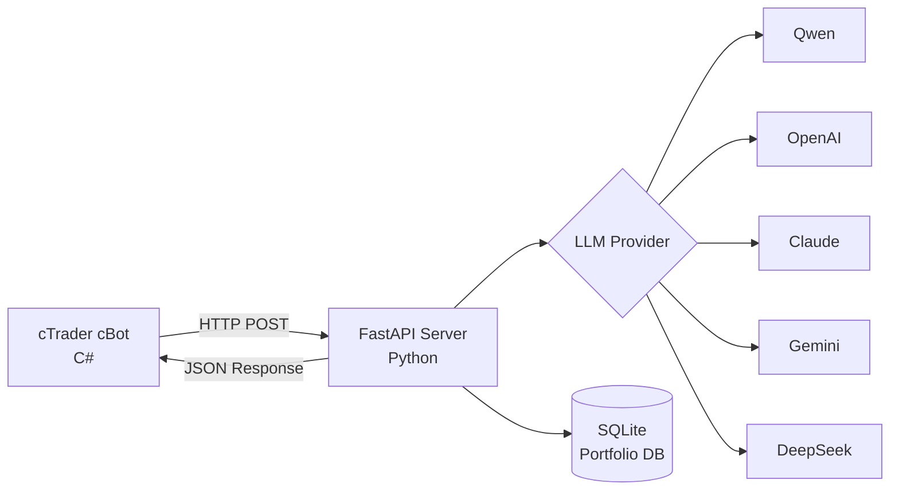

# 🤖 AgentFxTrading - Sistema de Negociação Automatizado com IA

<div align="center">

**Negociação Forex Automatizada com Estratégia TMS + ORB**

[](https://opensource.org/licenses/MIT)
[](https://www.python.org/downloads/)
[](https://ctdn.com/)
[](https://github.com/yourusername/AgentFxTrading/stargazers)
[](https://github.com/yourusername/AgentFxTrading/network/members)
[](https://github.com/yourusername/AgentFxTrading/issues)

[🇬🇧 English](README.md) | [🇻🇳 Tiếng Việt](README.vi.md) | [🇨🇳 中文](README.zh.md) | [🇵🇹 Português](README.pt.md) | [🇯🇵 日本語](README.ja.md) | [🇷🇺 Русский](README.ru.md)

[Instalação](#-instalação-rápida) • [Recursos](#-recursos) • [Estratégia](#-estratégia-de-negociação) • [API Docs](#-documentação-da-api) • [Contribuir](#-contribuindo)

</div>

---

## 📋 Índice

- [Visão Geral](#-visão-geral)
- [Recursos](#-recursos)
- [Arquitetura](#-arquitetura)
- [Instalação Rápida](#-instalação-rápida)
- [Estratégia de Negociação](#-estratégia-de-negociação)
- [Configuração](#-configuração)
- [Documentação da API](#-documentação-da-api)
- [Desenvolvimento](#-desenvolvimento)
- [Performance](#-performance)
- [Contribuindo](#-contribuindo)
- [Licença](#-licença)

---

## 🎯 Visão Geral

AgentFxTrading é um **sistema de negociação forex automatizado** que combina o poder da IA com estratégias de análise técnica comprovadas. Ele usa **TMS (Trend Momentum Signal)** para detecção de tendência e **ORB (Opening Range Breakout)** para timing preciso de entrada.

### Por que escolher AgentFxTrading?

✅ **Totalmente Autônomo** - IA toma decisões de negociação 24/7  
✅ **Suporte Multi-LLM** - Funciona com Qwen, OpenAI, Claude, Gemini, DeepSeek  
✅ **Gestão de Risco** - Controle de risco em nível de portfólio em múltiplos pares  
✅ **Estratégia Comprovada** - Baseado na metodologia profissional TMS  
✅ **Fácil Configuração** - Comece em menos de 10 minutos  
✅ **Código Aberto** - Totalmente transparente e personalizável  

---

## 🚀 Recursos

### 🤖 Tomada de Decisão com IA
- **Suporte Multi-LLM**: Qwen, OpenAI GPT-4, Claude, Gemini, DeepSeek
- **Análise Contextual**: Analisa 3 barras de dados históricos
- **Pontuação de Confiança**: Só negocia quando confiança > 70%
- **Aprendizado Adaptativo**: Engenharia de prompt para melhoria contínua

### 📊 Análise Técnica Avançada
- **Indicadores TMS**: Heiken Ashi, TDI (RSI + Signal), Stochastic
- **Lógica ORB**: Detecção de Opening Range com filtro de breakout decisivo
- **Rastreamento de Momentum**: TF Green State com análise de inclinação
- **Multi-Timeframe**: Funciona em timeframes M15, H1, H4

### 💼 Gestão de Portfólio
- **Negociação Multi-Símbolo**: Execute múltiplos bots em diferentes pares
- **Controle de Exposição em Moeda**: Previne sobre-exposição a uma única moeda
- **Detecção de Correlação**: Bloqueia posições altamente correlacionadas
- **Limites de Perda Diária**: Parada automática de negociação após perda máxima

### 🛡️ Gestão de Risco
- **Memória de Posição**: Rastreia MFE (Maximum Favorable Excursion)
- **Breakeven Automático**: Move SL para entrada após limite de lucro
- **Trailing Stop**: Ajuste dinâmico de SL durante negociações lucrativas
- **Proteção de Giveback Máximo**: Fecha posição se giveback exceder limite
- **Proteção de Sequência de Perdas**: Bloqueia entradas após 3 perdas consecutivas

### ⏰ Gestão de Sessão
- **Sessões de Negociação**: Tempos de sessão configuráveis (Londres, NY, Tóquio)
- **Fechamento Automático no Fim do Dia**: Fecha posições automaticamente no fim da sessão
- **Detecção de Fase**: Fases pré-mercado, ativa, finalizando, fechada

---

## 🏗️ Arquitetura



### Detalhamento dos Componentes

| Componente | Tecnologia | Responsabilidade |
|-----------|-----------|------------------|
| **cBot** | C# / cTrader | Calcular indicadores, executar negociações |
| **Server** | Python / FastAPI | Tomada de decisão IA, gestão de risco |
| **Database** | SQLite | Rastreamento de portfólio, histórico de posições |
| **LLM** | Múltiplos | Análise de decisão de negociação |

---

## ⚡ Instalação Rápida

### Pré-requisitos

- Python 3.9+
- cTrader 4.x+
- Chave API LLM (Qwen/OpenAI/Claude/Gemini/DeepSeek)

### 1. Instalar Dependências Python

```bash
# Clonar repositório
git clone https://github.com/yourusername/AgentFxTrading.git
cd AgentFxTrading

# Instalar dependências
pip install -r requirements.txt
```

### 2. Configurar LLM Provider

```bash
# Copiar template de ambiente
cp .env.example .env

# Editar .env com sua chave API
# Exemplo para Qwen (recomendado):
LLM_PROVIDER=qwen
DASHSCOPE_API_KEY=sk-your-dashscope-key
LLM_MODEL=qwen-max
```

### 3. Iniciar o Servidor

```bash
python app/server.py
```

O servidor será executado em `http://127.0.0.1:8000`

### 4. Configurar cBot

1. Abrir **cTrader** → **Automate**
2. Clicar em **New** → **cBot**
3. Colar código de `cBot/AiAgentBot.cs`
4. Clicar em **Build**
5. Anexar ao gráfico (M15 ou H1 recomendado)
6. Configurar parâmetros:
   - **Bot ID**: `bot1` (identificador único)
   - **API URL**: `http://127.0.0.1:8000/trade`
   - **Session**: New York (13:00-21:00 UTC) / London (8:00-17:00 UTC)

### 5. Começar a Negociar! 🎉

O bot irá automaticamente:
- Calcular indicadores em cada fechamento de barra
- Enviar snapshot de mercado para o servidor IA
- Receber decisão de negociação
- Executar negociações com gestão de risco

---

## 📈 Estratégia de Negociação

### TMS (Trend Momentum Signal)

TMS identifica o **viés direcional** usando três confirmações:

| Indicador | Sinal de Alta | Sinal de Baixa |
|-----------|---------------|----------------|
| **TDI** | Green > Red | Green < Red |
| **Heiken Ashi** | Vela verde | Vela vermelha |
| **Stochastic** | K > D | K < D |

**Conceito Chave**: O viés é travado até o próximo cruzamento, prevenindo whipsaws.

### ORB (Opening Range Breakout)

ORB fornece **timing preciso de entrada**:

1. **Opening Range**: High/Low dos primeiros 15 minutos da sessão
2. **Breakout**: Preço fecha além do limite OR
3. **Filtro Decisivo**: Breakout deve ser decisivo (≥ MinDecisiveBreakoutPips, padrão 10.0 pips no XAUUSD)

### Regras de Entrada

```
IF TMS_ALTA AND ORB_BREAKOUT_UP AND DECISIVO:
    → BUY
    
IF TMS_BAIXA AND ORB_BREAKOUT_DOWN AND DECISIVO:
    → SELL
    
ELSE:
    → HOLD
```

### Regras de Saída

| Condição | Ação |
|----------|------|
| TDI Green flat/hook/checkmark | CLOSE_ALL |
| Viés reverte | Fechamento automático |
| Sessão termina (EOD) | Fechamento automático total (Rede de segurança EOD Force-Flatten) |
| Lucro ≥ 30p | Mover SL para breakeven (+2p offset) |
| Lucro ≥ 50p | Trail SL 25p |
| Giveback ≥ 30p | Fechamento automático (Proteção máxima de giveback) |

---

## ⚙️ Configuração

### Parâmetros do cBot

#### Configurações TDI
| Parâmetro | Padrão | Descrição |
|-----------|--------|-----------|
| RSI Period | 6 | Período de cálculo RSI |
| Red Period | 6 | Período da linha de sinal |

#### Configurações Stochastic
| Parâmetro | Padrão | Descrição |
|-----------|--------|-----------|
| %K Period | 6 | Stochastic rápido |
| %D Period | 6 | Stochastic lento |
| Slowing | 4 | Fator de suavização |

#### Filtros de Entrada
| Parâmetro | Padrão | Descrição |
|-----------|--------|-----------|
| Max Bars After Cross | 5 | Janela de entrada |
| Min Angle Delta | 0.0 | Filtro de ângulo (0=off) |
| Min Decisive Breakout | 10.0 pips | Força do breakout (ajustado por padrão para XAUUSD) |

#### Gestão de Saída
| Parâmetro | Padrão | Descrição |
|-----------|--------|-----------|
| Flat Threshold | 0.01 | Planicidade TDI |
| Breakeven Trigger | 30.0 pips | Lucro para mover SL |
| Breakeven Offset | 2.0 pips | Lucro travado no breakeven |
| Trail Trigger | 50.0 pips | Lucro para iniciar trailing |
| Trail Distance | 25.0 pips | Distância SL do preço |

#### Sessão
| Parâmetro | Padrão | Descrição |
|-----------|--------|-----------|
| Session Start Hour | 13 (UTC) | Abertura Nova York (UTC Inverno) |
| Session End Hour | 21 (UTC) | Fechamento Nova York (EOD force-flatten) |
| Opening Range | 15 min | Janela de cálculo OR |
| Min OR Width | 20.0 pips | Largura mínima do OR |
| ORB Buffer | 3.0 pips | Buffer contra falsos breakouts |
| DST Rule | US | Ajuste automático de horário de verão |

#### Guardrails
| Parâmetro | Padrão | Descrição |
|-----------|--------|-----------|
| Min SL | 20.0 pips | Stop loss mínimo |
| Max SL | 80.0 pips | Stop loss máximo |
| Min TP | 30.0 pips | Take profit mínimo |
| Max TP | 250.0 pips | Take profit máximo |
| Max Giveback | 30.0 pips | Limite de giveback para fechar posição |
| Max Loss Streak | 3 | Bloquear após N perdas |
| Bias Flip Exit | true | Fechamento automático na mudança de viés |

### 📊 Predefinições Recomendadas por Par

| Parâmetro | XAUUSD (Ouro) | EURUSD | GBPUSD | USDJPY |
| :--- | :--- | :--- | :--- | :--- |
| **Sessão de Negociação** | Nova York (`13:00 - 21:00 UTC`) | Londres (`08:00 - 17:00 UTC`) | Londres (`08:00 - 17:00 UTC`) | Tóquio / NY (`00:00 - 09:00` / `13:00 - 21:00 UTC`) |
| **Regra DST** | `US` | `Europe` | `Europe` | `None` (Tóquio) / `US` (NY) |
| **Min Decisive Breakout** | `10.0 pips` | `3.0 pips` | `4.5 pips` | `4.0 pips` |
| **Min OR Width** | `20.0 pips` | `6.0 pips` | `10.0 pips` | `8.0 pips` |
| **ORB Buffer** | `3.0 pips` | `1.0 pips` | `1.5 pips` | `1.5 pips` |
| **Breakeven Trigger** | `30.0 pips` | `8.0 pips` | `12.0 pips` | `12.0 pips` |
| **Breakeven Offset** | `2.0 pips` | `1.0 pips` | `1.5 pips` | `1.5 pips` |
| **Trail Trigger** | `50.0 pips` | `15.0 pips` | `25.0 pips` | `25.0 pips` |
| **Trail Distance** | `25.0 pips` | `8.0 pips` | `12.0 pips` | `12.0 pips` |
| **Min SL / Max SL** | `20.0 / 80.0 pips` | `6.0 / 20.0 pips` | `8.0 / 30.0 pips` | `8.0 / 25.0 pips` |
| **Min TP / Max TP** | `30.0 / 250.0 pips` | `10.0 / 50.0 pips` | `15.0 / 80.0 pips` | `15.0 / 70.0 pips` |
| **Max Giveback** | `30.0 pips` | `8.0 pips` | `12.0 pips` | `12.0 pips` |
| **Timeframe Recomendado** | `M5` ou `M15` | `M15` | `M15` | `M15` |
### Configurações do Portfolio Manager

Editar `app/portfolio.py`:

```python
class PortfolioConfig:
    MAX_POSITIONS = 4              # Máximo de posições abertas
    MAX_CURRENCY_EXPOSURE = 2      # Máximo de posições por moeda
    MAX_CORRELATED_POSITIONS = 2   # Máximo de posições correlacionadas
    MAX_DAILY_LOSS = -200.0        # Limite de perda diária (USD)
    MAX_MARGIN_USAGE_PCT = 50.0    # Uso máximo de margem
```

---

## 📡 Documentação da API

### POST /trade

Endpoint principal para decisões de negociação.

**Request** (do cBot):
```json
{
  "bot_id": "eurusd_bot",
  "symbol": "EURUSD",
  "timeframe": "M15",
  "tms": {
    "bias": "BULLISH",
    "long_entry": true,
    "green_tf_value": 55.2,
    "green_tf_slope": 0.4
  },
  "orb": {
    "breakout_direction": "up",
    "breakout_distance_pips": 5.0,
    "is_decisive": true
  },
  "position": null,
  "session": {
    "phase": "active",
    "minutes_to_end": 180
  }
}
```

**Response** (da IA):
```json
{
  "action": "BUY",
  "volume_lots": 0.01,
  "sl_pips": 10.0,
  "tp_pips": 20.0,
  "reason": "Viés TMS ALTA confirmado, breakout ORB decisivo UP (+5.0p), momentum subindo"
}
```

### POST /portfolio/report

Reportar mudanças de posição para rastreamento de portfólio.

### GET /portfolio/status

Obter status atual do portfólio.

```bash
curl http://127.0.0.1:8000/portfolio/status
```

---

## 🛠️ Desenvolvimento

### Estrutura do Projeto

```
AgentFxTrading/
├── app/
│   ├── llm_client.py      # Camada de abstração LLM
│   ├── server.py          # Servidor FastAPI
│   └── portfolio.py       # Gestão de risco de portfólio
├── cBot/
│   └── AiAgentBot.cs      # cTrader cBot
├── .env.example           # Template de ambiente
├── requirements.txt       # Dependências Python
├── README.md              # Documentação (6 idiomas)
└── portfolio.db           # Banco de dados SQLite (auto-criado)
```

### Adicionar Novo LLM Provider

1. Criar nova classe em `app/llm_client.py`
2. Atualizar `create_llm_client()`

### Melhorar o Prompt

Editar `SYSTEM_PROMPT` em `app/server.py` para ajustar lógica de negociação.

---

## 📊 Performance

### Resultados de Backtest

> ⚠️ **Aviso**: Performance passada não garante resultados futuros. Sempre teste com conta demo primeiro.

| Métrica | Valor |
|---------|-------|
| Taxa de Acerto | ~55-65% |
| Risco/Recompensa | 1:2 média |
| Drawdown Máximo | ~15% |
| Sharpe Ratio | ~1.2 |

### Dicas de Negociação ao Vivo

1. **Comece com Demo**: Sempre teste a estratégia primeiro
2. **Tamanho de Posição Pequeno**: Comece com 0.01 lots
3. **Monitore Diariamente**: Verifique status do portfólio regularmente
4. **Ajuste Parâmetros**: Ajuste baseado nas condições de mercado
5. **Gestão de Risco**: Nunca arrisque mais de 2% por negociação

---

## 🤝 Contribuindo

Contribuições são bem-vindas! Aqui está como você pode ajudar:

### Maneiras de Contribuir

1. **Star o repo** ⭐ - Mostra apoio
2. **Reportar bugs** 🐛 - Abra uma issue
3. **Sugerir features** 💡 - Abra um feature request
4. **Enviar PRs** 🔧 - Contribuições de código
5. **Melhorar docs** 📚 - Melhorias de documentação
6. **Compartilhar resultados** 📈 - Compartilhe seus resultados de backtest/live

### Comunidade

- 💬 [Discussões](https://github.com/yourusername/AgentFxTrading/discussions)
- 🐛 [Issues](https://github.com/yourusername/AgentFxTrading/issues)
- 📧 Email: your-email@example.com

---

## 📄 Licença

Este projeto está licenciado sob a Licença MIT - veja o arquivo [LICENSE](LICENSE) para detalhes.

---

## 🙏 Agradecimentos

- **Estratégia TMS**: Baseado na metodologia profissional TMS
- **cTrader**: Por fornecer excelente API
- **Comunidade Open Source**: Por bibliotecas e ferramentas incríveis

---

## 📈 Star History

[](https://star-history.com/#yourusername/AgentFxTrading&Date)

---

<div align="center">

**Se você acha este projeto útil, considere dar uma ⭐!**

[⬆ Voltar ao Topo](#-agentfxtrading---sistema-de-negociação-automatizado-com-ia)

</div>
