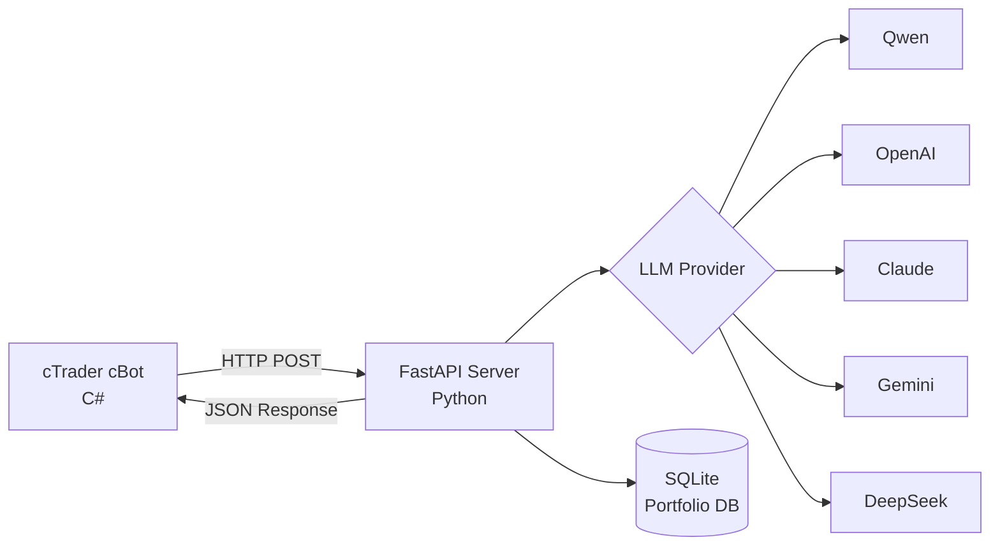

# 🤖 AgentFxTrading - Автоматизированная Торговая Система с ИИ

<div align="center">

**Автоматическая Торговля на Форекс со Стратегией TMS + ORB**

[](https://opensource.org/licenses/MIT)
[](https://www.python.org/downloads/)
[](https://ctdn.com/)
[](https://github.com/yourusername/AgentFxTrading/stargazers)
[](https://github.com/yourusername/AgentFxTrading/network/members)
[](https://github.com/yourusername/AgentFxTrading/issues)

[🇬🇧 English](README.md) | [🇻🇳 Tiếng Việt](README.vi.md) | [🇨🇳 中文](README.zh.md) | [🇵🇹 Português](README.pt.md) | [🇯🇵 日本語](README.ja.md) | [🇷🇺 Русский](README.ru.md)

[Установка](#-быстрый-старт) • [Возможности](#-возможности) • [Стратегия](#-торговая-стратегия) • [API Документация](#-api-документация) • [Вклад](#-вклад)

</div>

---

## 📋 Содержание

- [Обзор](#-обзор)
- [Возможности](#-возможности)
- [Архитектура](#-архитектура)
- [Быстрый Старт](#-быстрый-старт)
- [Торговая Стратегия](#-торговая-стратегия)
- [Конфигурация](#-конфигурация)
- [API Документация](#-api-документация)
- [Разработка](#-разработка)
- [Производительность](#-производительность)
- [Вклад](#-вклад)
- [Лицензия](#-лицензия)

---

## 🎯 Обзор

AgentFxTrading - это **автоматизированная система торговли на форекс**, которая сочетает мощность ИИ с проверенными стратегиями технического анализа. Она использует **TMS (Trend Momentum Signal)** для обнаружения тренда и **ORB (Opening Range Breakout)** для точного определения времени входа.

### Почему выбрать AgentFxTrading?

✅ **Полностью Автономный** - ИИ принимает торговые решения 24/7  
✅ **Мульти-LLM Поддержка** - Работает с Qwen, OpenAI, Claude, Gemini, DeepSeek  
✅ **Управление Рисками** - Контроль рисков на уровне портфеля для нескольких валютных пар  
✅ **Проверенная Стратегия** - Основана на профессиональной методологии TMS  
✅ **Простая Настройка** - Начните менее чем за 10 минут  
✅ **Открытый Исходный Код** - Полностью прозрачный и настраиваемый  

---

## 🚀 Возможности

### 🤖 Принятие Решений с Помощью ИИ
- **Мульти-LLM Поддержка**: Qwen, OpenAI GPT-4, Claude, Gemini, DeepSeek
- **Контекстный Анализ**: Анализирует 3 бара исторических данных
- **Оценка Уверенности**: Торговля только при уверенности > 70%
- **Адаптивное Обучение**: Инженерия промптов для непрерывного улучшения

### 📊 Продвинутый Технический Анализ
- **Индикаторы TMS**: Heiken Ashi, TDI (RSI + Signal), Stochastic
- **Логика ORB**: Обнаружение Opening Range с фильтром решающего прорыва
- **Отслеживание Импульса**: TF Green State с анализом наклона
- **Определение Режима Рынка (Market Regime)**: Коэффициент эффективности Кауфмана (`er_session`, `er_recent`) и счетчик ложных пробоев (`or_flips`) для классификации `trending`, `choppy`, `mixed`, `forming`
- **Мультитаймфрейм**: Работает на таймфреймах M15, H1, H4

### 💼 Управление Портфелем
- **Мультивалютная Торговля**: Запуск нескольких ботов на разных парах
- **Контроль Валютного Экспозиции**: Предотвращение чрезмерной экспозиции к одной валюте
- **Обнаружение Корреляции**: Блокировка высококоррелированных позиций
- **Дневные Лимиты Убытков**: Автоматическая остановка торговли после максимального убытка

### 🛡️ Управление Рисками
- **Память Позиций**: Отслеживание MFE (Maximum Favorable Excursion)
- **Автоматический Breakeven**: Перемещение SL на entry после порога прибыли
- **Trailing Stop**: Динамическая корректировка SL во время прибыльных сделок
- **Защита от Максимального Отката**: Закрытие позиции, если откат превышает порог
- **Защита от Серии Убытков**: Блокировка входов после 3 последовательных убытков
- **Cycle Gating (Cost Gate)**: Автоматически пропускает вызовы LLM вне сессии, внутри OR или при серии убытков — экономя 80-90% расходов на API
- **Trend TP Disabled**: Автоматическое отключение фиксированного TP в трендовом режиме (`trending`) для максимизации прибыли с помощью Trailing SL и Giveback Floor
- **Ежедневная Ротация Логов**: Сохраняет все рассуждения Agent, действия cycle gate и снимки рынка в `logs/agent_YYYY-MM-DD.log` (хранение 14 дней)

### ⏰ Управление Сессиями
- **Торговые Сессии**: Настраиваемое время сессий (Лондон, Нью-Йорк, Токио)
- **Автозакрытие в Конце Дня**: Автоматическое закрытие позиций в конце сессии
- **Обнаружение Фаз**: Фазы pre-market, active, ending, closed

---

## 🏗️ Архитектура



### Детализация Компонентов

| Компонент | Технология | Ответственность |
|-----------|-----------|-----------------|
| **cBot** | C# / cTrader | Расчет индикаторов, выполнение сделок |
| **Server** | Python / FastAPI | Принятие решений ИИ, управление рисками |
| **Database** | SQLite | Отслеживание портфеля, история позиций |
| **LLM** | Несколько | Анализ торговых решений |

---

## ⚡ Быстрый Старт

### Предварительные Требования

- Python 3.9+
- cTrader 4.x+
- API ключ LLM (Qwen/OpenAI/Claude/Gemini/DeepSeek)

### 1. Установка Зависимостей Python

```bash
# Клонирование репозитория
git clone https://github.com/yourusername/AgentFxTrading.git
cd AgentFxTrading

# Установка зависимостей
pip install -r requirements.txt
```

### 2. Настройка LLM Provider

```bash
# Копирование шаблона окружения
cp .env.example .env

# Редактирование .env с вашим API ключом
# Пример для Qwen (рекомендуется):
LLM_PROVIDER=qwen
DASHSCOPE_API_KEY=sk-your-dashscope-key
LLM_MODEL=qwen-max
```

### 3. Запуск Сервера

```bash
python app/server.py
```

Сервер будет работать на `http://127.0.0.1:8000`

### 4. Настройка и Запуск cBot

Вы можете запускать cBot либо через **cTrader Desktop GUI**, либо через **Headless Docker CLI** (`ctrader-console`).

#### Вариант A: cTrader Desktop GUI

1. Открыть **cTrader** → **Automate**
2. Нажать **New** → **cBot**
3. Вставить код из `cBot/AiAgentBot.cs`
4. Нажать **Build**
5. Прикрепить к графику (рекомендуется M15 или H1)
6. Настроить параметры:
   - **Bot ID**: `xauusd_m15` (уникальный идентификатор)
   - **API URL**: `http://127.0.0.1:8000/trade`
   - **Session**: New York (13:00-21:00 UTC) / London (8:00-17:00 UTC) / Tokyo (0:00-9:00 UTC)

#### Вариант B: Headless Docker CLI (`ctrader-console`)

1. **Подготовка файла учетных данных cTID**:
   ```bash
   mkdir -p /root/ctrader_data
   echo "your_ctid_password" > /root/ctrader_data/ctid_pwd
   chmod 600 /root/ctrader_data/ctid_pwd
   ```

2. **Сборка/Компиляция пакета `.algo`**:
   ```bash
   docker run --rm -v $(pwd):/workspace -v /root:/root \
     ghcr.io/spotware/ctrader-console:latest create cbot AiAgentBot
   cp cBot/AiAgentBot.cs /root/cAlgo/Sources/Robots/AiAgentBot/AiAgentBot/AiAgentBot.cs
   docker run --rm -v $(pwd):/workspace -v /root:/root \
     ghcr.io/spotware/ctrader-console:latest build /root/cAlgo/Sources/Robots/AiAgentBot/AiAgentBot/AiAgentBot.csproj
   cp /root/cAlgo/Sources/Robots/AiAgentBot.algo cBot/AiAgentBot.algo
   ```

3. **Запуск Docker-контейнеров для каждой пары/индекса**:

   * **XAUUSD (M15 - Нью-Йоркская сессия)**:
     ```bash
     docker run -d \
       --name cbot-xauusd \
       --restart unless-stopped \
       --network host \
       -v $(pwd):/workspace \
       -v /root:/root \
       ghcr.io/spotware/ctrader-console:latest \
       run /workspace/cBot/AiAgentBot.algo \
       --ctid=your_email@example.com \
       --pwd-file=/root/ctrader_data/ctid_pwd \
       --account=YOUR_ACCOUNT_ID \
       --symbol=XAUUSD \
       --period=m15 \
       --full-access \
       --BotId="xauusd_m15" \
       --ApiUrl="http://127.0.0.1:8000/trade" \
       --AccountLabel="demo" \
       --TmsTimeFrame="Hour" \
       --EmaPeriod=5 \
       --SessionName="newyork" \
       --OrbStartHour=13 \
       --SessionEndHour=21 \
       --SessionDstRule="US" \
       --MinDecisiveBreakoutPips=10.0 \
       --MinOrWidthPips=20.0 \
       --OrbBufferPips=3.0 \
       --BreakevenTriggerPips=30.0 \
       --BreakevenOffsetPips=2.0 \
       --TrailTriggerPips=50.0 \
       --TrailDistancePips=25.0 \
       --PartialCloseRatio=0.5 \
       --MinSlPips=20.0 \
       --MaxSlPips=80.0 \
       --MinTpPips=30.0 \
       --MaxTpPips=250.0 \
       --MaxGivebackPips=30.0 \
       --EnablePostTpGate=true \
       --PostTpPullbackPips=10.0 \
       --BounceTradeEnabled=true \
       --BounceDistanceThreshold=10 \
       --RiskPerTradePercent=0.2 \
       --TrendTpDisabled=true
     ```

   * **EURUSD (M15 - Лондонская сессия)**:
     ```bash
     docker run -d \
       --name cbot-eurusd \
       --restart unless-stopped \
       --network host \
       -v $(pwd):/workspace \
       -v /root:/root \
       ghcr.io/spotware/ctrader-console:latest \
       run /workspace/cBot/AiAgentBot.algo \
       --ctid=your_email@example.com \
       --pwd-file=/root/ctrader_data/ctid_pwd \
       --account=YOUR_ACCOUNT_ID \
       --symbol=EURUSD \
       --period=m15 \
       --full-access \
       --BotId="eurusd_m15" \
       --ApiUrl="http://127.0.0.1:8000/trade" \
       --AccountLabel="demo" \
       --TmsTimeFrame="Hour" \
       --EmaPeriod=5 \
       --SessionName="london" \
       --OrbStartHour=8 \
       --SessionEndHour=17 \
       --SessionDstRule="Europe" \
       --MinDecisiveBreakoutPips=3.0 \
       --MinOrWidthPips=6.0 \
       --OrbBufferPips=1.0 \
       --BreakevenTriggerPips=8.0 \
       --BreakevenOffsetPips=1.0 \
       --TrailTriggerPips=15.0 \
       --TrailDistancePips=8.0 \
       --PartialCloseRatio=0.5 \
       --MinSlPips=6.0 \
       --MaxSlPips=20.0 \
       --MinTpPips=10.0 \
       --MaxTpPips=50.0 \
       --MaxGivebackPips=8.0 \
       --EnablePostTpGate=true \
       --PostTpPullbackPips=3.0 \
       --BounceTradeEnabled=true \
       --BounceDistanceThreshold=5 \
       --RiskPerTradePercent=0.2 \
       --TrendTpDisabled=true
     ```

   * **GBPUSD (M15 - Лондонская сессия)**:
     ```bash
     docker run -d \
       --name cbot-gbpusd \
       --restart unless-stopped \
       --network host \
       -v $(pwd):/workspace \
       -v /root:/root \
       ghcr.io/spotware/ctrader-console:latest \
       run /workspace/cBot/AiAgentBot.algo \
       --ctid=your_email@example.com \
       --pwd-file=/root/ctrader_data/ctid_pwd \
       --account=YOUR_ACCOUNT_ID \
       --symbol=GBPUSD \
       --period=m15 \
       --full-access \
       --BotId="gbpusd_m15" \
       --ApiUrl="http://127.0.0.1:8000/trade" \
       --AccountLabel="demo" \
       --TmsTimeFrame="Hour" \
       --EmaPeriod=5 \
       --SessionName="london" \
       --OrbStartHour=8 \
       --SessionEndHour=17 \
       --SessionDstRule="Europe" \
       --MinDecisiveBreakoutPips=4.5 \
       --MinOrWidthPips=10.0 \
       --OrbBufferPips=1.5 \
       --BreakevenTriggerPips=12.0 \
       --BreakevenOffsetPips=1.5 \
       --TrailTriggerPips=20.0 \
       --TrailDistancePips=10.0 \
       --PartialCloseRatio=0.5 \
       --MinSlPips=8.0 \
       --MaxSlPips=25.0 \
       --MinTpPips=15.0 \
       --MaxTpPips=60.0 \
       --MaxGivebackPips=10.0 \
       --EnablePostTpGate=true \
       --PostTpPullbackPips=5.0 \
       --BounceTradeEnabled=true \
       --BounceDistanceThreshold=10 \
       --RiskPerTradePercent=0.2 \
       --TrendTpDisabled=true
     ```

   * **USDJPY (M15 - Токийская сессия)**:
     ```bash
     docker run -d \
       --name cbot-usdjpy \
       --restart unless-stopped \
       --network host \
       -v $(pwd):/workspace \
       -v /root:/root \
       ghcr.io/spotware/ctrader-console:latest \
       run /workspace/cBot/AiAgentBot.algo \
       --ctid=your_email@example.com \
       --pwd-file=/root/ctrader_data/ctid_pwd \
       --account=YOUR_ACCOUNT_ID \
       --symbol=USDJPY \
       --period=m15 \
       --full-access \
       --BotId="usdjpy_m15" \
       --ApiUrl="http://127.0.0.1:8000/trade" \
       --AccountLabel="demo" \
       --TmsTimeFrame="Hour" \
       --EmaPeriod=5 \
       --SessionName="tokyo" \
       --OrbStartHour=0 \
       --SessionEndHour=9 \
       --SessionDstRule="None" \
       --MinDecisiveBreakoutPips=4.0 \
       --MinOrWidthPips=8.0 \
       --OrbBufferPips=1.5 \
       --BreakevenTriggerPips=12.0 \
       --BreakevenOffsetPips=1.5 \
       --TrailTriggerPips=25.0 \
       --TrailDistancePips=12.0 \
       --PartialCloseRatio=0.5 \
       --MinSlPips=8.0 \
       --MaxSlPips=25.0 \
       --MinTpPips=15.0 \
       --MaxTpPips=70.0 \
       --MaxGivebackPips=12.0 \
       --EnablePostTpGate=true \
       --PostTpPullbackPips=4.0 \
       --BounceTradeEnabled=true \
       --BounceDistanceThreshold=3 \
       --RiskPerTradePercent=0.2 \
       --TrendTpDisabled=true
     ```

   * **US30 (M5 - Нью-Йоркская индексная сессия)**:
     ```bash
     docker run -d \
       --name cbot-us30 \
       --restart unless-stopped \
       --network host \
       -v $(pwd):/workspace \
       -v /root:/root \
       ghcr.io/spotware/ctrader-console:latest \
       run /workspace/cBot/AiAgentBot.algo \
       --ctid=your_email@example.com \
       --pwd-file=/root/ctrader_data/ctid_pwd \
       --account=YOUR_ACCOUNT_ID \
       --symbol=US30 \
       --period=m5 \
       --full-access \
       --BotId="us30_m5" \
       --ApiUrl="http://127.0.0.1:8000/trade" \
       --AccountLabel="demo" \
       --TmsTimeFrame="Hour" \
       --EmaPeriod=5 \
       --SessionName="newyork_index" \
       --OrbStartHour=13 \
       --SessionEndHour=20 \
       --SessionDstRule="US" \
       --MinDecisiveBreakoutPips=30.0 \
       --MinOrWidthPips=80.0 \
       --OrbBufferPips=15.0 \
       --BreakevenTriggerPips=200.0 \
       --BreakevenOffsetPips=20.0 \
       --TrailTriggerPips=350.0 \
       --TrailDistancePips=180.0 \
       --PartialCloseRatio=0.5 \
       --MinSlPips=200.0 \
       --MaxSlPips=500.0 \
       --MinTpPips=400.0 \
       --MaxTpPips=1200.0 \
       --MaxGivebackPips=200.0 \
       --EnablePostTpGate=true \
       --PostTpPullbackPips=80.0 \
       --BounceTradeEnabled=true \
       --BounceDistanceThreshold=30 \
       --RiskPerTradePercent=0.2 \
       --TrendTpDisabled=true
     ```

   * **USTEC / NAS100 (M5 - Нью-Йоркская индексная сессия)** *(Примечание: используйте `USTEC` или `NAS100` в зависимости от брокера)*:
     ```bash
     docker run -d \
       --name cbot-ustec \
       --restart unless-stopped \
       --network host \
       -v $(pwd):/workspace \
       -v /root:/root \
       ghcr.io/spotware/ctrader-console:latest \
       run /workspace/cBot/AiAgentBot.algo \
       --ctid=your_email@example.com \
       --pwd-file=/root/ctrader_data/ctid_pwd \
       --account=YOUR_ACCOUNT_ID \
       --symbol=USTEC \
       --period=m5 \
       --full-access \
       --BotId="ustec_m5" \
       --ApiUrl="http://127.0.0.1:8000/trade" \
       --AccountLabel="demo" \
       --TmsTimeFrame="Hour" \
       --EmaPeriod=5 \
       --SessionName="newyork_index" \
       --OrbStartHour=13 \
       --SessionEndHour=20 \
       --SessionDstRule="US" \
       --MinDecisiveBreakoutPips=25.0 \
       --MinOrWidthPips=70.0 \
       --OrbBufferPips=12.0 \
       --BreakevenTriggerPips=180.0 \
       --BreakevenOffsetPips=15.0 \
       --TrailTriggerPips=300.0 \
       --TrailDistancePips=150.0 \
       --PartialCloseRatio=0.5 \
       --MinSlPips=180.0 \
       --MaxSlPips=450.0 \
       --MinTpPips=350.0 \
       --MaxTpPips=1000.0 \
       --MaxGivebackPips=180.0 \
       --EnablePostTpGate=true \
       --PostTpPullbackPips=70.0 \
       --BounceTradeEnabled=true \
       --BounceDistanceThreshold=25 \
       --RiskPerTradePercent=0.2 \
       --TrendTpDisabled=true
     ```

   * **GBPJPY (M15 - Лондонская сессия / Высоковолатильный кросс)**:
     ```bash
     docker run -d \
       --name cbot-gbpjpy \
       --restart unless-stopped \
       --network host \
       -v $(pwd):/workspace \
       -v /root:/root \
       ghcr.io/spotware/ctrader-console:latest \
       run /workspace/cBot/AiAgentBot.algo \
       --ctid=your_email@example.com \
       --pwd-file=/root/ctrader_data/ctid_pwd \
       --account=YOUR_ACCOUNT_ID \
       --symbol=GBPJPY \
       --period=m15 \
       --full-access \
       --BotId="gbpjpy_m15" \
       --ApiUrl="http://127.0.0.1:8000/trade" \
       --AccountLabel="demo" \
       --TmsTimeFrame="Hour" \
       --EmaPeriod=5 \
       --SessionName="london" \
       --OrbStartHour=8 \
       --SessionEndHour=17 \
       --SessionDstRule="Europe" \
       --MinDecisiveBreakoutPips=6.0 \
       --MinOrWidthPips=15.0 \
       --OrbBufferPips=2.0 \
       --BreakevenTriggerPips=18.0 \
       --BreakevenOffsetPips=2.0 \
       --TrailTriggerPips=30.0 \
       --TrailDistancePips=15.0 \
       --PartialCloseRatio=0.5 \
       --MinSlPips=15.0 \
       --MaxSlPips=35.0 \
       --MinTpPips=25.0 \
       --MaxTpPips=80.0 \
       --MaxGivebackPips=15.0 \
       --EnablePostTpGate=true \
       --PostTpPullbackPips=6.0 \
       --BounceTradeEnabled=true \
       --BounceDistanceThreshold=5 \
       --RiskPerTradePercent=0.2 \
       --TrendTpDisabled=true
     ```

   * **EURJPY (M15 - Лондонская сессия / Высоковолатильный кросс)**:
     ```bash
     docker run -d \
       --name cbot-eurjpy \
       --restart unless-stopped \
       --network host \
       -v $(pwd):/workspace \
       -v /root:/root \
       ghcr.io/spotware/ctrader-console:latest \
       run /workspace/cBot/AiAgentBot.algo \
       --ctid=your_email@example.com \
       --pwd-file=/root/ctrader_data/ctid_pwd \
       --account=YOUR_ACCOUNT_ID \
       --symbol=EURJPY \
       --period=m15 \
       --full-access \
       --BotId="eurjpy_m15" \
       --ApiUrl="http://127.0.0.1:8000/trade" \
       --AccountLabel="demo" \
       --TmsTimeFrame="Hour" \
       --EmaPeriod=5 \
       --SessionName="london" \
       --OrbStartHour=8 \
       --SessionEndHour=17 \
       --SessionDstRule="Europe" \
       --MinDecisiveBreakoutPips=5.0 \
       --MinOrWidthPips=12.0 \
       --OrbBufferPips=1.5 \
       --BreakevenTriggerPips=15.0 \
       --BreakevenOffsetPips=1.5 \
       --TrailTriggerPips=25.0 \
       --TrailDistancePips=12.0 \
       --PartialCloseRatio=0.5 \
       --MinSlPips=12.0 \
       --MaxSlPips=30.0 \
       --MinTpPips=20.0 \
       --MaxTpPips=70.0 \
       --MaxGivebackPips=12.0 \
       --EnablePostTpGate=true \
       --PostTpPullbackPips=5.0 \
       --BounceTradeEnabled=true \
       --BounceDistanceThreshold=5 \
       --RiskPerTradePercent=0.2 \
       --TrendTpDisabled=true
     ```

   * **USDCAD (M15 - Нью-Йоркская сессия / Сырьевой FX)**:
     ```bash
     docker run -d \
       --name cbot-usdcad \
       --restart unless-stopped \
       --network host \
       -v $(pwd):/workspace \
       -v /root:/root \
       ghcr.io/spotware/ctrader-console:latest \
       run /workspace/cBot/AiAgentBot.algo \
       --ctid=your_email@example.com \
       --pwd-file=/root/ctrader_data/ctid_pwd \
       --account=YOUR_ACCOUNT_ID \
       --symbol=USDCAD \
       --period=m15 \
       --full-access \
       --BotId="usdcad_m15" \
       --ApiUrl="http://127.0.0.1:8000/trade" \
       --AccountLabel="demo" \
       --TmsTimeFrame="Hour" \
       --EmaPeriod=5 \
       --SessionName="newyork" \
       --OrbStartHour=13 \
       --SessionEndHour=21 \
       --SessionDstRule="US" \
       --MinDecisiveBreakoutPips=4.0 \
       --MinOrWidthPips=10.0 \
       --OrbBufferPips=1.5 \
       --BreakevenTriggerPips=12.0 \
       --BreakevenOffsetPips=1.5 \
       --TrailTriggerPips=20.0 \
       --TrailDistancePips=10.0 \
       --PartialCloseRatio=0.5 \
       --MinSlPips=10.0 \
       --MaxSlPips=25.0 \
       --MinTpPips=15.0 \
       --MaxTpPips=50.0 \
       --MaxGivebackPips=10.0 \
       --EnablePostTpGate=true \
       --PostTpPullbackPips=4.0 \
       --BounceTradeEnabled=true \
       --BounceDistanceThreshold=4 \
       --RiskPerTradePercent=0.2 \
       --TrendTpDisabled=true
     ```

   * **AUDUSD (M15 - Азиатская/Токийская сессия / Сырьевой FX)**:
     ```bash
     docker run -d \
       --name cbot-audusd \
       --restart unless-stopped \
       --network host \
       -v $(pwd):/workspace \
       -v /root:/root \
       ghcr.io/spotware/ctrader-console:latest \
       run /workspace/cBot/AiAgentBot.algo \
       --ctid=your_email@example.com \
       --pwd-file=/root/ctrader_data/ctid_pwd \
       --account=YOUR_ACCOUNT_ID \
       --symbol=AUDUSD \
       --period=m15 \
       --full-access \
       --BotId="audusd_m15" \
       --ApiUrl="http://127.0.0.1:8000/trade" \
       --AccountLabel="demo" \
       --TmsTimeFrame="Hour" \
       --EmaPeriod=5 \
       --SessionName="tokyo" \
       --OrbStartHour=0 \
       --SessionEndHour=9 \
       --SessionDstRule="None" \
       --MinDecisiveBreakoutPips=3.0 \
       --MinOrWidthPips=8.0 \
       --OrbBufferPips=1.0 \
       --BreakevenTriggerPips=10.0 \
       --BreakevenOffsetPips=1.0 \
       --TrailTriggerPips=18.0 \
       --TrailDistancePips=9.0 \
       --PartialCloseRatio=0.5 \
       --MinSlPips=8.0 \
       --MaxSlPips=20.0 \
       --MinTpPips=12.0 \
       --MaxTpPips=45.0 \
       --MaxGivebackPips=8.0 \
       --EnablePostTpGate=true \
       --PostTpPullbackPips=3.0 \
       --BounceTradeEnabled=true \
       --BounceDistanceThreshold=3 \
       --RiskPerTradePercent=0.2 \
       --TrendTpDisabled=true
     ```

   * **DE40 / DAX40 (M5 - Европейская/Лондонская сессия / Немецкий индекс)** *(Примечание: используйте `DE40` или `GER40` в зависимости от брокера)*:
     ```bash
     docker run -d \
       --name cbot-de40 \
       --restart unless-stopped \
       --network host \
       -v $(pwd):/workspace \
       -v /root:/root \
       ghcr.io/spotware/ctrader-console:latest \
       run /workspace/cBot/AiAgentBot.algo \
       --ctid=your_email@example.com \
       --pwd-file=/root/ctrader_data/ctid_pwd \
       --account=YOUR_ACCOUNT_ID \
       --symbol=DE40 \
       --period=m5 \
       --full-access \
       --BotId="de40_m5" \
       --ApiUrl="http://127.0.0.1:8000/trade" \
       --AccountLabel="demo" \
       --TmsTimeFrame="Hour" \
       --EmaPeriod=5 \
       --SessionName="london" \
       --OrbStartHour=8 \
       --SessionEndHour=16 \
       --SessionDstRule="Europe" \
       --MinDecisiveBreakoutPips=20.0 \
       --MinOrWidthPips=60.0 \
       --OrbBufferPips=10.0 \
       --BreakevenTriggerPips=150.0 \
       --BreakevenOffsetPips=15.0 \
       --TrailTriggerPips=250.0 \
       --TrailDistancePips=120.0 \
       --PartialCloseRatio=0.5 \
       --MinSlPips=150.0 \
       --MaxSlPips=350.0 \
       --MinTpPips=300.0 \
       --MaxTpPips=800.0 \
       --MaxGivebackPips=150.0 \
       --EnablePostTpGate=true \
       --PostTpPullbackPips=50.0 \
       --BounceTradeEnabled=true \
       --BounceDistanceThreshold=25 \
       --RiskPerTradePercent=0.2 \
       --TrendTpDisabled=true
     ```

   * **AUDJPY (M15 - Азиатская/Токийская сессия / Кросс-барометр риска)**:
     ```bash
     docker run -d \
       --name cbot-audjpy \
       --restart unless-stopped \
       --network host \
       -v $(pwd):/workspace \
       -v /root:/root \
       ghcr.io/spotware/ctrader-console:latest \
       run /workspace/cBot/AiAgentBot.algo \
       --ctid=your_email@example.com \
       --pwd-file=/root/ctrader_data/ctid_pwd \
       --account=YOUR_ACCOUNT_ID \
       --symbol=AUDJPY \
       --period=m15 \
       --full-access \
       --BotId="audjpy_m15" \
       --ApiUrl="http://127.0.0.1:8000/trade" \
       --AccountLabel="demo" \
       --TmsTimeFrame="Hour" \
       --EmaPeriod=5 \
       --SessionName="tokyo" \
       --OrbStartHour=0 \
       --SessionEndHour=9 \
       --SessionDstRule="None" \
       --MinDecisiveBreakoutPips=4.0 \
       --MinOrWidthPips=10.0 \
       --OrbBufferPips=1.5 \
       --BreakevenTriggerPips=12.0 \
       --BreakevenOffsetPips=1.5 \
       --TrailTriggerPips=22.0 \
       --TrailDistancePips=11.0 \
       --PartialCloseRatio=0.5 \
       --MinSlPips=10.0 \
       --MaxSlPips=25.0 \
       --MinTpPips=18.0 \
       --MaxTpPips=60.0 \
       --MaxGivebackPips=10.0 \
       --EnablePostTpGate=true \
       --PostTpPullbackPips=4.0 \
       --BounceTradeEnabled=true \
       --BounceDistanceThreshold=4 \
       --RiskPerTradePercent=0.2 \
       --TrendTpDisabled=true
     ```
### 5. Начать Торговлю! 🎉

Бот будет автоматически:
- Рассчитывать индикаторы при закрытии каждого бара
- Отправлять снимок рынка на ИИ сервер
- Получать торговое решение
- Выполнять сделки с управлением рисками

---

## 📈 Торговая Стратегия

### TMS (Trend Momentum Signal)

TMS определяет **направленный bias** используя три подтверждения:

| Индикатор | Бычий Сигнал | Медвежий Сигнал |
|-----------|--------------|-----------------|
| **TDI** | Green > Red | Green < Red |
| **Heiken Ashi** | Зеленая свеча | Красная свеча |
| **Stochastic** | K > D | K < D |

**Ключевая Концепция**: Bias блокируется до следующего пересечения, предотвращая whipsaws.

### ORB (Opening Range Breakout)

ORB обеспечивает **точное время входа**:

1. **Opening Range**: High/Low первых 15 минут сессии
2. **Прорыв**: Цена закрывается за пределами границы OR
3. **Решающий Фильтр**: Прорыв должен быть решительным (≥ MinDecisiveBreakoutPips, по умолчанию 10.0 пипсов для XAUUSD)

### Определение Режима Рынка (Market Regime)

Система рассчитывает метрики эффективности в реальном времени для динамической адаптации торговли и закрытия позиций:
- **`er_session` и `er_recent`**: Коэффициент эффективности Кауфмана ($ER = \frac{|\text{Чистое Смещение}|}{\sum |\text{Движения Свечей}|}$). $1.0$ отражает чистое направленное движение, $\approx 0.0$ указывает на распил и флэт.
- **`or_flips`**: Подсчитывает количество ложных пробоев за пределы Opening Range, закрывшихся обратно внутрь.
- **4 Режима Рынка**:
  - **`trending`** ($ER \ge 0.35$): Автоматически отключает фиксированный TP (`TrendTpDisabled = true`), позволяя Trailing SL и Giveback Floor забрать все трендовое движение.
  - **`choppy`** (`or_flips \ge 5`): Высокий риск ложных пробоев и распила → Cycle Gate принудительно выбирает `HOLD`.
  - **`mixed`**: Стандартная торговая дисциплина ($R:R \ge 1.5$).
  - **`forming`**: Ранняя фаза формирования диапазона сессии ($< 6$ свечей).

### Количественные Правила для Особых Ситуаций (Edge-Case Rules)
- **Исключение BIAS-FRESH**: Если пересечение TDI произошло недавно ($\le 1$ свечи назад), ранний импульс пробоя считается **началом новой трендовой волны**, а не перекупленностью/перепроданностью → Приоритет отдается немедленному входу.
- **Правило ANTI-CHASE**: Если цена пробила диапазон $\ge 4$ свечей назад по старому сигналу без отката, **ЗАПРЕЩЕНО догонять рынок на экстремумах** → Удержание `HOLD` и ожидание отката.
- **Память Позиции и Giveback Floor**: Отслеживание пиковой плавающей прибыли ($MFE$) на каждом тике. Если прибыль снизится от пика больше порога отката, позиция немедленно закрывается для фиксации результата.

### Правила Входа

```
IF TMS_БЫЧИЙ AND ORB_ПРОРЫВ_UP AND РЕШАЮЩИЙ:
    → BUY
    
IF TMS_МЕДВЕЖИЙ AND ORB_ПРОРЫВ_DOWN AND РЕШАЮЩИЙ:
    → SELL
    
ELSE:
    → HOLD
```

### Правила Выхода

| Условие | Действие |
|---------|----------|
| TDI Green flat/hook/checkmark | CLOSE_ALL |
| Bias разворачивается | Автозакрытие |
| Сессия заканчивается (EOD) | Полное автозакрытие (Защитная сеть EOD Force-Flatten) |
| Прибыль ≥ 30p | Переместить SL на breakeven (+2p фиксации) |
| Прибыль ≥ 50p | Trail SL 25p |
| Откат ≥ 30p | Автозакрытие (Защита от максимального отката) |

---

## ⚙️ Конфигурация

### Параметры cBot

#### Настройки TMS (Мультитаймфрейм)
| Параметр | По Умолчанию | Описание |
|----------|--------------|----------|
| TMS Timeframe (Macro) | Hour (H1) | Таймфрейм макро-тренда (H1, H4, M15 и т.д.) |
| RSI Period | 6 | Период расчета RSI |
| Red Period | 6 | Период сигнальной линии |

#### Настройки Stochastic
| Параметр | По Умолчанию | Описание |
|----------|--------------|----------|
| %K Period | 6 | Быстрый стохастик |
| %D Period | 6 | Медленный стохастик |
| Slowing | 4 | Фактор сглаживания |

#### Фильтры Входа
| Параметр | По Умолчанию | Описание |
|----------|--------------|----------|
| Max Bars After Cross | 5 | Окно входа |
| Min Angle Delta | 0.0 | Фильтр угла (0=выкл) |
| Min Decisive Breakout | 10.0 пипсов | Сила прорыва (оптимизировано по умолчанию для XAUUSD) |

#### Управление Выходом
| Параметр | По Умолчанию | Описание |
|----------|--------------|----------|
| Flat Threshold | 0.01 | Плоскость TDI |
| Breakeven Trigger | 30.0 пипсов | Прибыль для перемещения SL |
| Breakeven Offset | 2.0 пипсов | Прибыль, фиксируемая при безубытке |
| Trail Trigger | 50.0 пипсов | Прибыль для начала trailing |
| Trail Distance | 25.0 пипсов | Расстояние SL от цены |

#### Сессия
| Параметр | По Умолчанию | Описание |
|----------|--------------|----------|
| Session Start Hour | 13 (UTC) | Открытие Нью-Йорка (Зимнее время UTC) |
| Session End Hour | 21 (UTC) | Закрытие Нью-Йорка (EOD принудительное закрытие) |
| Opening Range | 15 min | Окно расчета OR |
| Min OR Width | 20.0 пипсов | Минимальная ширина OR |
| ORB Buffer | 3.0 пипсов | Буфер защиты от ложных пробоев |
| DST Rule | US | Автокоррекция летнего/зимнего времени (DST) |

#### Защитные Механизмы
| Параметр | По Умолчанию | Описание |
|----------|--------------|----------|
| Min SL | 20.0 пипсов | Минимальный стоп-лосс |
| Max SL | 80.0 пипсов | Максимальный стоп-лосс |
| Min TP | 30.0 пипсов | Минимальный тейк-профит |
| Max TP | 250.0 пипсов | Максимальный тейк-профит |
| Max Giveback | 30.0 пипсов | Порог отката для принудительного закрытия |
| Max Loss Streak | 3 | Блокировка после N убытков |
| Bias Flip Exit | true | Автозакрытие при изменении bias |
| Trend TP Disabled | true | Отключение фиксированного TP в тренде |

### 📊 Recommended Presets by Symbol

#### Metals & Indices

| Parameter | XAUUSD | US30 | USTEC | DE40 |
| :--- | :--- | :--- | :--- | :--- |
| **Trading Session** | New York | New York (Index) | New York (Index) | London |
| **DST Rule** | `US` | `US` | `US` | `Europe` |
| **Min Decisive Breakout** | `10.0 pips` | `30.0 pips` | `25.0 pips` | `20.0 pips` |
| **Min OR Width** | `20.0 pips` | `80.0 pips` | `70.0 pips` | `60.0 pips` |
| **ORB Buffer** | `3.0 pips` | `15.0 pips` | `12.0 pips` | `10.0 pips` |
| **Breakeven Trigger** | `30.0 pips` | `200.0 pips` | `180.0 pips` | `150.0 pips` |
| **Breakeven Offset** | `2.0 pips` | `20.0 pips` | `15.0 pips` | `15.0 pips` |
| **Trail Trigger** | `50.0 pips` | `350.0 pips` | `300.0 pips` | `250.0 pips` |
| **Trail Distance** | `25.0 pips` | `180.0 pips` | `150.0 pips` | `120.0 pips` |
| **Min SL / Max SL** | `20.0 / 80.0 pips` | `200.0 / 500.0 pips` | `180.0 / 450.0 pips` | `150.0 / 350.0 pips` |
| **Min TP / Max TP** | `30.0 / 250.0 pips` | `400.0 / 1200.0 pips` | `350.0 / 1000.0 pips` | `300.0 / 800.0 pips` |
| **Max Giveback** | `30.0 pips` | `200.0 pips` | `180.0 pips` | `150.0 pips` |
| **Recommended Timeframe** | `M15` | `M5` | `M5` | `M5` |
| **EMA Period** | `5` | `5` | `5` | `5` |
| **Post-TP Gate / Pullback** | `true` (`10.0 pips`) | `true` (`80.0 pips`) | `true` (`70.0 pips`) | `true` (`50.0 pips`) |
| **TDI Bounce Trade** | `true` (`1.5`) | `true` (`1.5`) | `true` (`1.5`) | `true` (`1.5`) |
| **Partial Close at BE** | `0.5 (50%)` | `0.5 (50%)` | `0.5 (50%)` | `0.5 (50%)` |
| **Risk per Trade** | `0.2%` | `0.2%` | `0.2%` | `0.2%` |

#### Forex Majors

| Parameter | EURUSD | GBPUSD | USDJPY | USDCAD |
| :--- | :--- | :--- | :--- | :--- |
| **Trading Session** | London | London | Tokyo | New York |
| **DST Rule** | `Europe` | `Europe` | `None` | `US` |
| **Min Decisive Breakout** | `3.0 pips` | `4.5 pips` | `4.0 pips` | `4.0 pips` |
| **Min OR Width** | `6.0 pips` | `10.0 pips` | `8.0 pips` | `10.0 pips` |
| **ORB Buffer** | `1.0 pips` | `1.5 pips` | `1.5 pips` | `1.5 pips` |
| **Breakeven Trigger** | `8.0 pips` | `12.0 pips` | `12.0 pips` | `12.0 pips` |
| **Breakeven Offset** | `1.0 pips` | `1.5 pips` | `1.5 pips` | `1.5 pips` |
| **Trail Trigger** | `15.0 pips` | `20.0 pips` | `25.0 pips` | `20.0 pips` |
| **Trail Distance** | `8.0 pips` | `10.0 pips` | `12.0 pips` | `10.0 pips` |
| **Min SL / Max SL** | `6.0 / 20.0 pips` | `8.0 / 25.0 pips` | `8.0 / 25.0 pips` | `10.0 / 25.0 pips` |
| **Min TP / Max TP** | `10.0 / 50.0 pips` | `15.0 / 60.0 pips` | `15.0 / 70.0 pips` | `15.0 / 50.0 pips` |
| **Max Giveback** | `8.0 pips` | `10.0 pips` | `12.0 pips` | `10.0 pips` |
| **Recommended Timeframe** | `M15` | `M15` | `M15` | `M15` |
| **EMA Period** | `5` | `5` | `5` | `5` |
| **Post-TP Gate / Pullback** | `true` (`3.0 pips`) | `true` (`5.0 pips`) | `true` (`4.0 pips`) | `true` (`4.0 pips`) |
| **TDI Bounce Trade** | `true` (`1.5`) | `true` (`1.5`) | `true` (`1.5`) | `true` (`1.5`) |
| **Partial Close at BE** | `0.5 (50%)` | `0.5 (50%)` | `0.5 (50%)` | `0.5 (50%)` |
| **Risk per Trade** | `0.2%` | `0.2%` | `0.2%` | `0.2%` |

#### Forex Crosses

| Parameter | GBPJPY | EURJPY | AUDJPY |
| :--- | :--- | :--- | :--- |
| **Trading Session** | London | London | Tokyo |
| **DST Rule** | `Europe` | `Europe` | `None` |
| **Min Decisive Breakout** | `6.0 pips` | `5.0 pips` | `4.0 pips` |
| **Min OR Width** | `15.0 pips` | `12.0 pips` | `10.0 pips` |
| **ORB Buffer** | `2.0 pips` | `1.5 pips` | `1.5 pips` |
| **Breakeven Trigger** | `18.0 pips` | `15.0 pips` | `12.0 pips` |
| **Breakeven Offset** | `2.0 pips` | `1.5 pips` | `1.5 pips` |
| **Trail Trigger** | `30.0 pips` | `25.0 pips` | `22.0 pips` |
| **Trail Distance** | `15.0 pips` | `12.0 pips` | `11.0 pips` |
| **Min SL / Max SL** | `15.0 / 35.0 pips` | `12.0 / 30.0 pips` | `10.0 / 25.0 pips` |
| **Min TP / Max TP** | `25.0 / 80.0 pips` | `20.0 / 70.0 pips` | `18.0 / 60.0 pips` |
| **Max Giveback** | `15.0 pips` | `12.0 pips` | `10.0 pips` |
| **Recommended Timeframe** | `M15` | `M15` | `M15` |
| **EMA Period** | `5` | `5` | `5` |
| **Post-TP Gate / Pullback** | `true` (`6.0 pips`) | `true` (`5.0 pips`) | `true` (`4.0 pips`) |
| **TDI Bounce Trade** | `true` (`1.5`) | `true` (`1.5`) | `true` (`1.5`) |
| **Partial Close at BE** | `0.5 (50%)` | `0.5 (50%)` | `0.5 (50%)` |
| **Risk per Trade** | `0.2%` | `0.2%` | `0.2%` |
### Настройки Portfolio Manager

Редактировать `app/portfolio.py`:

```python
class PortfolioConfig:
    MAX_POSITIONS = 4              # Максимум открытых позиций
    MAX_CURRENCY_EXPOSURE = 2      # Максимум позиций на валюту
    MAX_CORRELATED_POSITIONS = 2   # Максимум коррелированных позиций
    MAX_DAILY_LOSS = -200.0        # Дневной лимит убытков (USD)
    MAX_MARGIN_USAGE_PCT = 50.0    # Максимальное использование маржи
```

---

## 📡 API Документация

### POST /trade

Основной endpoint для торговых решений.

**Запрос** (от cBot):
```json
{
  "bot_id": "eurusd_bot",
  "symbol": "EURUSD",
  "timeframe": "M15",
  "tms": {
    "bias": "BULLISH",
    "long_entry": true,
    "green_tf_value": 55.2,
    "green_tf_slope": 0.4
  },
  "orb": {
    "breakout_direction": "up",
    "breakout_distance_pips": 5.0,
    "is_decisive": true
  },
  "position": null,
  "session": {
    "phase": "active",
    "minutes_to_end": 180
  }
}
```

**Ответ** (от ИИ):
```json
{
  "action": "BUY",
  "volume_lots": 0.01,
  "sl_pips": 10.0,
  "tp_pips": 20.0,
  "reason": "Бычий bias TMS подтвержден, решающий прорыв ORB UP (+5.0p), импульс растет"
}
```

### POST /portfolio/report

Сообщить об изменениях позиций для отслеживания портфеля.

### GET /portfolio/status

Получить текущий статус портфеля.

```bash
curl http://127.0.0.1:8000/portfolio/status
```

---

## 🛠️ Разработка

### Структура Проекта

```
AgentFxTrading/
├── app/
│   ├── llm_client.py      # Слой абстракции LLM
│   ├── server.py          # FastAPI сервер
│   └── portfolio.py       # Управление рисками портфеля
├── cBot/
│   └── AiAgentBot.cs      # cTrader cBot
├── .env.example           # Шаблон окружения
├── requirements.txt       # Зависимости Python
├── README.md              # Документация (6 языков)
└── portfolio.db           # База данных SQLite (автосоздание)
```

### Добавление Нового LLM Provider

1. Создать новый класс в `app/llm_client.py`
2. Обновить `create_llm_client()`

### Улучшение Промпта

Редактировать `SYSTEM_PROMPT` в `app/server.py` для настройки торговой логики.

---

## 📊 Производительность

### Результаты Бэктеста

> ⚠️ **Отказ от Ответственности**: Прошлая производительность не гарантирует будущих результатов. Всегда сначала тестируйте на демо-счете.

| Метрика | Значение |
|---------|----------|
| Винрейт | ~55-65% |
| Риск/Награда | 1:2 в среднем |
| Максимальная Просадка | ~15% |
| Коэффициент Шарпа | ~1.2 |

### Советы для Живой Торговли

1. **Начните с Демо**: Всегда сначала тестируйте стратегию
2. **Маленький Размер Позиции**: Начните с 0.01 лота
3. **Ежедневный Мониторинг**: Регулярно проверяйте статус портфеля
4. **Настройка Параметров**: Корректируйте на основе рыночных условий
5. **Управление Рисками**: Никогда не рискуйте более 2% на сделку

---

## 🤝 Вклад

Вклад приветствуется! Вот как вы можете помочь:

### Способы Внести Вклад

1. **Поставить звезду репозиторию** ⭐ - Показывает поддержку
2. **Сообщить о багах** 🐛 - Открыть issue
3. **Предложить функции** 💡 - Открыть feature request
4. **Отправить PR** 🔧 - Вклад в код
5. **Улучшить документацию** 📚 - Улучшения документации
6. **Поделиться результатами** 📈 - Поделиться результатами бэктеста/живой торговли

### Сообщество

- 💬 [Обсуждения](https://github.com/yourusername/AgentFxTrading/discussions)
- 🐛 [Проблемы](https://github.com/yourusername/AgentFxTrading/issues)
- 📧 Email: your-email@example.com

---

## 📄 Лицензия

Этот проект лицензирован под лицензией MIT - см. файл [LICENSE](LICENSE) для подробностей.

---

## 🙏 Благодарности

- **Стратегия TMS**: Основана на профессиональной методологии TMS
- **cTrader**: За предоставление отличного API
- **Сообщество Открытого Исходного Кода**: За потрясающие библиотеки и инструменты

---

## 📈 История Звезд

[](https://star-history.com/#yourusername/AgentFxTrading&Date)

---

<div align="center">

**Если вы находите этот проект полезным, пожалуйста, поставьте ⭐!**

[⬆ Наверх](#-agentfxtrading---автоматизированная-торговая-система-с-ии)

</div>
