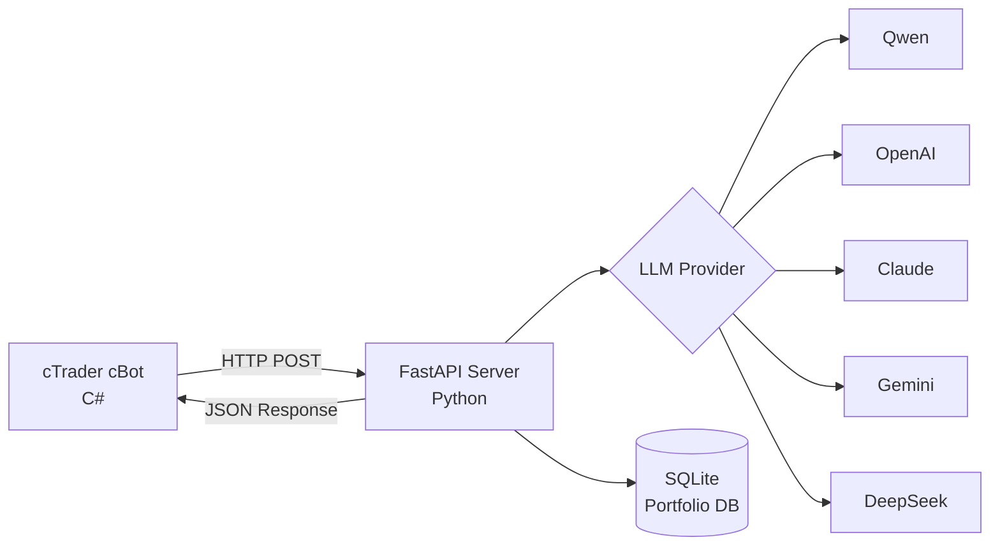

# 🤖 AgentFxTrading - Автоматизированная Торговая Система с ИИ

<div align="center">

**Автоматическая Торговля на Форекс со Стратегией TMS + ORB**

[](https://opensource.org/licenses/MIT)
[](https://www.python.org/downloads/)
[](https://ctdn.com/)
[](https://github.com/yourusername/AgentFxTrading/stargazers)
[](https://github.com/yourusername/AgentFxTrading/network/members)
[](https://github.com/yourusername/AgentFxTrading/issues)

[🇬🇧 English](README.md) | [🇻🇳 Tiếng Việt](README.vi.md) | [🇨🇳 中文](README.zh.md) | [🇵🇹 Português](README.pt.md) | [🇯🇵 日本語](README.ja.md) | [🇷🇺 Русский](README.ru.md)

[Установка](#-быстрый-старт) • [Возможности](#-возможности) • [Стратегия](#-торговая-стратегия) • [API Документация](#-api-документация) • [Вклад](#-вклад)

</div>

---

## 📋 Содержание

- [Обзор](#-обзор)
- [Возможности](#-возможности)
- [Архитектура](#-архитектура)
- [Быстрый Старт](#-быстрый-старт)
- [Торговая Стратегия](#-торговая-стратегия)
- [Конфигурация](#-конфигурация)
- [API Документация](#-api-документация)
- [Разработка](#-разработка)
- [Производительность](#-производительность)
- [Вклад](#-вклад)
- [Лицензия](#-лицензия)

---

## 🎯 Обзор

AgentFxTrading - это **автоматизированная система торговли на форекс**, которая сочетает мощность ИИ с проверенными стратегиями технического анализа. Она использует **TMS (Trend Momentum Signal)** для обнаружения тренда и **ORB (Opening Range Breakout)** для точного определения времени входа.

### Почему выбрать AgentFxTrading?

✅ **Полностью Автономный** - ИИ принимает торговые решения 24/7  
✅ **Мульти-LLM Поддержка** - Работает с Qwen, OpenAI, Claude, Gemini, DeepSeek  
✅ **Управление Рисками** - Контроль рисков на уровне портфеля для нескольких валютных пар  
✅ **Проверенная Стратегия** - Основана на профессиональной методологии TMS  
✅ **Простая Настройка** - Начните менее чем за 10 минут  
✅ **Открытый Исходный Код** - Полностью прозрачный и настраиваемый  

---

## 🚀 Возможности

### 🤖 Двойная Архитектура ИИ-Стратегий
- **1. Движок TMS + ORB (`AiAgentBot`)**: Сигналы трендового импульса (Heikin Ashi + TDI + Stochastic) в сочетании с пробоем Opening Range и динамическим определением режимов эффективности Кауфмана.
- **2. Движок Asian Range Judas Sweep (`AsianRangeJudasSweepBot`)**: Концепция Smart Money (SMC) для отлова манипулятивных ложных пробоев (Judas Swing) ликвидности азиатской сессии (00:00–06:00 UTC) в киллзонах Лондона (07:00–10:00 UTC) и Нью-Йорка (12:30–16:00 UTC) с подтверждением Order Block / FVG.
- **Мульти-LLM Поддержка**: Qwen, OpenAI GPT-4o, Claude 3.5 Sonnet, Gemini 2.0 Flash, DeepSeek V3/R1.
- **Мультитаймфрейм Анализ**: Синхронизация тренда M15 + H1 + H4, структура свингов (BSL/SSL) и фильтр новостей в реальном времени.
### 💼 Управление Портфелем
- **Мультивалютная Торговля**: Запуск нескольких ботов на разных парах
- **Контроль Валютного Экспозиции**: Предотвращение чрезмерной экспозиции к одной валюте
- **Обнаружение Корреляции**: Блокировка высококоррелированных позиций
- **Дневные Лимиты Убытков**: Автоматическая остановка торговли после максимального убытка

- **Память Позиций**: Отслеживание MFE (Maximum Favorable Excursion) на каждом тике
- **Автоматический Breakeven**: Перемещение SL в безубыток (+0.1x ATR фиксации) при прибыли $\ge 0.8\times$ ATR
- **Trailing Stop**: Динамическая корректировка SL при достижении прибыли $1.2\times$ ATR (трейлинг $0.7\times$ ATR)
- **Фиксация Прибыли и Защита Giveback**: Принудительное закрытие позиции при откате прибыли на $\ge 40\%$ от пикового MFE или $\ge 0.6\times$ ATR
- **Фильтр Избыточного Пробоя (Anti-Overextension Guard)**: Запрет входа в пробои, ушедшие дальше $2.5\times$ ATR от границы Opening Range
- **Лимит Максимального Убытка в $ (Max Dollar Risk Cap)**: Жесткое ограничение максимального убытка ($12.00) на одну сделку при минимальном объеме
- **Защита от Серии Убытков**: Блокировка входов после 3 последовательных убытков
- **Cycle Gating (Cost Gate)**: Автоматически пропускает вызовы LLM вне сессии, внутри OR, при избыточном истощении или при серии убытков — экономя 80-90% расходов на API
- **Trend TP Disabled**: Автоматическое отключение фиксированного TP в трендовом режиме (`trending`) для максимизации прибыли с помощью Trailing SL и Giveback Floor
- **Динамическая Точность Котировок (Dynamic Precision)**: Автоматическое масштабирование десятичных знаков (5 знаков для Forex, 3 для JPY пар, 2 для золота, индексов и криптовалют)
- **Нормализация ATR в Пунктах (True ATR Scaling)**: Автоматический пересчет сырой волатильности в реальные пункты для точной оценки моделью LLM
- **Мультиактивный Cycle Gate для Крипто**: Корректная классификация криптоактивов (`BTC`, `ETH`, `SOL`, `XRP`) с допустимой дистанцией пробоя до 60 000 пунктов
- **Адаптивный Фильтр Азиатского Диапазона**: Индивидуальные границы сессии (`[200p, 8000p]` для XAUUSD, `[12p, 100p]` для Forex) и подавление холостых запросов без позиций
- **Интеграция Телеметрии cBot**: cBot отправляет уведомления о сработавших внутренних гвардрейлах на FastAPI сервер через `/api/cbot_event`
### ⏰ Управление Сессиями
- **Торговые Сессии**: Настраиваемое время сессий (Лондон, Нью-Йорк, Токио)
- **Автозакрытие в Конце Дня**: Автоматическое закрытие позиций в конце сессии
- **Обнаружение Фаз**: Фазы pre-market, active, ending, closed

---

## 🏗️ Архитектура



### Детализация Компонентов

| Компонент | Технология | Ответственность |
|-----------|-----------|-----------------|
| **cBot** | C# / cTrader | Расчет индикаторов, выполнение сделок |
| **Server** | Python / FastAPI | Принятие решений ИИ, управление рисками |
| **Database** | SQLite | Отслеживание портфеля, история позиций |
| **LLM** | Несколько | Анализ торговых решений |


---

## 📊 Панель Управления (Dashboard)

Мониторинг и управление торговой системой в реальном времени через веб-интерфейс:
```
http://127.0.0.1:8000/dashboard
```

### Возможности Dashboard

- **Обновления в Реальном Времени**: Двусторонний WebSocket для мгновенной синхронизации позиций
- **Обзор Портфеля**: Открытые позиции, дневной P&L, винрейт, серия убытков и баланс счета
- **Таблица Открытых Позиций (Active Positions)**: Наглядные бейджи стратегий (`Judas SMC` фиолетовый vs `TMS+ORB` синий), имя cBot, символ, объем, цена входа и плавающий P&L
- **История Сделок (Recent Trades)**: Детали закрытых ордеров с меткой стратегии и чистой прибылью
- **График Доходности**: Визуализация дневной доходности
- **Мониторинг Гвардрейлов**: Отображение причин блокировки входов со стороны сервера и cBot

### API Эндпоинты

```
GET  /dashboard                # Веб-интерфейс дашборда
GET  /api/dashboard/summary    # KPI сводка портфеля (JSON)
GET  /api/dashboard/positions  # Активные открытые позиции (JSON)
GET  /api/dashboard/history    # История закрытых сделок (JSON)
GET  /api/dashboard/pnl-history # История P&L по дням (JSON)
GET  /api/dashboard/logs       # Логи системы в реальном времени (JSON)
POST /api/tick                 # Телеметрия котировок и эквити от cBot
POST /api/cbot_event           # Телеметрия событий и блокировок гвардрейлов
POST /portfolio/report         # Отчетность открытия/закрытия позиций
WS   /ws/dashboard             # Поток WebSocket в реальном времени
```
---

## ⚡ Быстрый Старт

### Предварительные Требования

- Python 3.9+
- cTrader 4.x+
- API ключ LLM (Qwen/OpenAI/Claude/Gemini/DeepSeek)

### 1. Установка Зависимостей Python

```bash
# Клонирование репозитория
git clone https://github.com/yourusername/AgentFxTrading.git
cd AgentFxTrading

# Установка зависимостей
pip install -r requirements.txt
```

### 2. Настройка LLM Provider

```bash
# Копирование шаблона окружения
cp .env.example .env

# Редактирование .env с вашим API ключом
# Пример для Qwen (рекомендуется):
LLM_PROVIDER=qwen
DASHSCOPE_API_KEY=sk-your-dashscope-key
LLM_MODEL=qwen-max
```

### 3. Запуск Сервера

```bash
python app/server.py
```

Сервер будет работать на `http://127.0.0.1:8000`

### 4. Настройка и Запуск cBot

Вы можете запускать cBot либо через **cTrader Desktop GUI**, либо через **Headless Docker CLI** (`ctrader-console`).

#### Вариант A: cTrader Desktop GUI

1. Открыть **cTrader** → **Automate**
2. Нажать **New** → **cBot**
3. Вставить код из `cBot/AiAgentBot.cs`
4. Нажать **Build**
5. Прикрепить к графику (рекомендуется M15 или H1)
6. Настроить параметры:
   - **Bot ID**: `xauusd_m15` (уникальный идентификатор)
   - **API URL**: `http://127.0.0.1:8000/trade`
   - **Session**: New York (13:00-21:00 UTC) / London (8:00-17:00 UTC) / Tokyo (0:00-9:00 UTC)

#### Вариант B: Headless Docker CLI (`ctrader-console`)

1. **Подготовка файла учетных данных cTID**:
   ```bash
   mkdir -p /root/ctrader_data
   echo "your_ctid_password" > /root/ctrader_data/ctid_pwd
   chmod 600 /root/ctrader_data/ctid_pwd
   ```

2. **Сборка/Компиляция пакетов `.algo`**:
   ```bash
   # 1. Сборка TMS+ORB бота (AiAgentBot)
   docker run --rm -v $(pwd):/workspace -v /root:/root \
     ghcr.io/spotware/ctrader-console:latest create cbot AiAgentBot
   cp cBot/AiAgentBot.cs /root/cAlgo/Sources/Robots/AiAgentBot/AiAgentBot/AiAgentBot.cs
   docker run --rm -v $(pwd):/workspace -v /root:/root \
     ghcr.io/spotware/ctrader-console:latest build /root/cAlgo/Sources/Robots/AiAgentBot/AiAgentBot/AiAgentBot.csproj
   cp /root/cAlgo/Sources/Robots/AiAgentBot.algo cBot/AiAgentBot.algo

   # 2. Сборка Asian Range Judas Sweep бота (AsianRangeJudasSweepBot)
   docker run --rm -v $(pwd):/workspace -v /root:/root \
     ghcr.io/spotware/ctrader-console:latest create cbot AsianRangeJudasSweepBot
   cp cBot/AsianRangeJudasSweepBot.cs /root/cAlgo/Sources/Robots/AsianRangeJudasSweepBot/AsianRangeJudasSweepBot/AsianRangeJudasSweepBot.cs
   docker run --rm -v $(pwd):/workspace -v /root:/root \
     ghcr.io/spotware/ctrader-console:latest build /root/cAlgo/Sources/Robots/AsianRangeJudasSweepBot/AsianRangeJudasSweepBot/AsianRangeJudasSweepBot.csproj
   cp /root/cAlgo/Sources/Robots/AsianRangeJudasSweepBot.algo cBot/AsianRangeJudasSweepBot.algo
   ```
3. **Запуск Docker-контейнеров для каждой пары/индекса**:

   * **XAUUSD Охота за Ликвидностью Азии (M15 - ICT Judas Sweep)**:
     ```bash
     docker run -d \
       --name cbot-xauusd-judas \
       --restart unless-stopped \
       --network host \
       -v $(pwd):/workspace \
       -v /root:/root \
       ghcr.io/spotware/ctrader-console:latest \
       run /workspace/cBot/AsianRangeJudasSweepBot.algo \
       --ctid=your_email@example.com \
       --pwd-file=/root/ctrader_data/ctid_pwd \
       --account=YOUR_ACCOUNT_ID \
       --symbol=XAUUSD \
       --period=m15 \
       --full-access \
       --BotId="cbot-xauusd-judas" \
       --label="cbot-xauusd-judas" \
       --DashboardServerUrl="http://127.0.0.1:8000" \
       --ApiUrl="http://127.0.0.1:8000/trade" \
       --AccountLabel="demo" \
       --UseDirectAiApi=false \
       --UseAiGateMode=true \
       --minAsianRangePips=200.0 \
       --maxAsianRangePips=8000.0 \
       --sweepBufferPips=30.0 \
       --AiSlMinFloorPips=200.0 \
       --breakEvenTrigger=250.0 \
       --stoplossPip=200.0 \
       --takeprofitPip=450.0 \
       --enableBreakEvenPrice=true

   * **GBPUSD Охота за Ликвидностью Азии (M15 - ICT Judas Sweep)**:
     ```bash
     docker run -d \
       --name cbot-gbpusd-judas \
       --restart unless-stopped \
       --network host \
       -v $(pwd):/workspace \
       -v /root:/root \
       ghcr.io/spotware/ctrader-console:latest \
       run /workspace/cBot/AsianRangeJudasSweepBot.algo \
       --ctid=your_email@example.com \
       --pwd-file=/root/ctrader_data/ctid_pwd \
       --account=YOUR_ACCOUNT_ID \
       --symbol=GBPUSD \
       --period=m15 \
       --full-access \
       --BotId="cbot-gbpusd-judas" \
       --label="cbot-gbpusd-judas" \
       --DashboardServerUrl="http://127.0.0.1:8000" \
       --ApiUrl="http://127.0.0.1:8000/trade" \
       --AccountLabel="demo" \
       --UseDirectAiApi=false \
       --UseAiGateMode=true \
       --minAsianRangePips=15.0 \
       --maxAsianRangePips=45.0 \
       --sweepBufferPips=3.5 \
       --AiSlMinFloorPips=15.0 \
       --breakEvenTrigger=20.0 \
       --stoplossPip=15.0 \
       --takeprofitPip=35.0 \
       --enableBreakEvenPrice=true
     ```

   * **EURUSD Охота за Ликвидностью Азии (M15 - ICT Judas Sweep)**:
     ```bash
     docker run -d \
       --name cbot-eurusd-judas \
       --restart unless-stopped \
       --network host \
       -v $(pwd):/workspace \
       -v /root:/root \
       ghcr.io/spotware/ctrader-console:latest \
       run /workspace/cBot/AsianRangeJudasSweepBot.algo \
       --ctid=your_email@example.com \
       --pwd-file=/root/ctrader_data/ctid_pwd \
       --account=YOUR_ACCOUNT_ID \
       --symbol=EURUSD \
       --period=m15 \
       --full-access \
       --BotId="cbot-eurusd-judas" \
       --label="cbot-eurusd-judas" \
       --DashboardServerUrl="http://127.0.0.1:8000" \
       --ApiUrl="http://127.0.0.1:8000/trade" \
       --AccountLabel="demo" \
       --UseDirectAiApi=false \
       --UseAiGateMode=true \
       --minAsianRangePips=15.0 \
       --maxAsianRangePips=45.0 \
       --sweepBufferPips=3.5 \
       --AiSlMinFloorPips=15.0 \
       --breakEvenTrigger=20.0 \
       --stoplossPip=15.0 \
       --takeprofitPip=35.0 \
       --enableBreakEvenPrice=true
     ```

   * **GBPJPY Охота за Ликвидностью Азии (M15 - ICT Judas Sweep)**:
     ```bash
     docker run -d \
       --name cbot-gbpjpy-judas \
       --restart unless-stopped \
       --network host \
       -v $(pwd):/workspace \
       -v /root:/root \
       ghcr.io/spotware/ctrader-console:latest \
       run /workspace/cBot/AsianRangeJudasSweepBot.algo \
       --ctid=your_email@example.com \
       --pwd-file=/root/ctrader_data/ctid_pwd \
       --account=YOUR_ACCOUNT_ID \
       --symbol=GBPJPY \
       --period=m15 \
       --full-access \
       --BotId="cbot-gbpjpy-judas" \
       --label="cbot-gbpjpy-judas" \
       --DashboardServerUrl="http://127.0.0.1:8000" \
       --ApiUrl="http://127.0.0.1:8000/trade" \
       --AccountLabel="demo" \
       --UseDirectAiApi=false \
       --UseAiGateMode=true \
       --minAsianRangePips=25.0 \
       --maxAsianRangePips=70.0 \
       --sweepBufferPips=5.0 \
       --AiSlMinFloorPips=25.0 \
       --breakEvenTrigger=30.0 \
       --stoplossPip=25.0 \
       --takeprofitPip=50.0 \
       --enableBreakEvenPrice=true
     ```

   * **EURJPY Охота за Ликвидностью Азии (M15 - ICT Judas Sweep)**:
     ```bash
     docker run -d \
       --name cbot-eurjpy-judas \
       --restart unless-stopped \
       --network host \
       -v $(pwd):/workspace \
       -v /root:/root \
       ghcr.io/spotware/ctrader-console:latest \
       run /workspace/cBot/AsianRangeJudasSweepBot.algo \
       --ctid=your_email@example.com \
       --pwd-file=/root/ctrader_data/ctid_pwd \
       --account=YOUR_ACCOUNT_ID \
       --symbol=EURJPY \
       --period=m15 \
       --full-access \
       --BotId="cbot-eurjpy-judas" \
       --label="cbot-eurjpy-judas" \
       --DashboardServerUrl="http://127.0.0.1:8000" \
       --ApiUrl="http://127.0.0.1:8000/trade" \
       --AccountLabel="demo" \
       --UseDirectAiApi=false \
       --UseAiGateMode=true \
       --minAsianRangePips=25.0 \
       --maxAsianRangePips=70.0 \
       --sweepBufferPips=5.0 \
       --AiSlMinFloorPips=25.0 \
       --breakEvenTrigger=30.0 \
       --stoplossPip=25.0 \
       --takeprofitPip=50.0 \
       --enableBreakEvenPrice=true
     ```

   * **XAUUSD TMS+ORB (M15 - Нью-Йоркская сессия)**:
     ```bash
     docker run -d \
       --name cbot-xauusd \
       --restart unless-stopped \
       --network host \
       -v $(pwd):/workspace \
       -v /root:/root \
       ghcr.io/spotware/ctrader-console:latest \
       run /workspace/cBot/AiAgentBot.algo \
       --ctid=your_email@example.com \
       --pwd-file=/root/ctrader_data/ctid_pwd \
       --account=YOUR_ACCOUNT_ID \
       --symbol=XAUUSD \
       --period=m15 \
       --full-access \
       --BotId="xauusd_m15" \
       --ApiUrl="http://127.0.0.1:8000/trade" \
       --AccountLabel="demo" \
       --SessionName="newyork" \
       --OrbStartHour=13 \
       --SessionEndHour=21 \
       --SessionDstRule="US" \
       --MinDecisiveBreakoutPips=200.0 \
       --MinOrWidthPips=400.0 \
       --OrbBufferPips=50.0 \
       --BreakevenTriggerAtr=1.2 \
       --BreakevenOffsetAtr=0.1 \
       --TrailTriggerAtr=2.0 \
       --TrailDistanceAtr=1.0 \
       --PartialCloseRatio=0.5 \
       --MinSlAtr=0.8 \
       --MaxSlAtr=3.0 \
       --MinTpAtr=1.0 \
       --MaxTpAtr=6.0 \
       --MaxGivebackAtr=1.0 \
       --EnablePostTpGate=true \
       --PostTpPullbackAtr=0.5 \
       --BounceTradeEnabled=true \
       --BounceDistanceThreshold=10 \
       --RiskPerTradePercent=0.2 \
       --TrendTpDisabled=true
     ```

   * **EURUSD (M15 - Лондонская сессия)**:
     ```bash
     docker run -d \
       --name cbot-eurusd \
       --restart unless-stopped \
       --network host \
       -v $(pwd):/workspace \
       -v /root:/root \
       ghcr.io/spotware/ctrader-console:latest \
       run /workspace/cBot/AiAgentBot.algo \
       --ctid=your_email@example.com \
       --pwd-file=/root/ctrader_data/ctid_pwd \
       --account=YOUR_ACCOUNT_ID \
       --symbol=EURUSD \
       --period=m15 \
       --full-access \
       --BotId="eurusd_m15" \
       --ApiUrl="http://127.0.0.1:8000/trade" \
       --AccountLabel="demo" \
       --TmsTimeFrame="Hour" \
       --EmaPeriod=5 \
       --SessionName="london" \
       --OrbStartHour=8 \
       --SessionEndHour=17 \
       --SessionDstRule="Europe" \
       --MinDecisiveBreakoutPips=3.0 \
       --MinOrWidthPips=6.0 \
       --OrbBufferPips=1.0 \
       --BreakevenTriggerAtr=1.2 \
       --BreakevenOffsetAtr=0.1 \
       --TrailTriggerAtr=2.0 \
       --TrailDistanceAtr=1.0 \
       --PartialCloseRatio=0.5 \
       --MinSlAtr=0.8 \
       --MaxSlAtr=3.0 \
       --MinTpAtr=1.0 \
       --MaxTpAtr=6.0 \
       --MaxGivebackAtr=1.0 \
       --EnablePostTpGate=true \
       --PostTpPullbackAtr=0.5 \
       --BounceTradeEnabled=true \
       --BounceDistanceThreshold=5 \
       --RiskPerTradePercent=0.2 \
       --TrendTpDisabled=true
     ```

   * **GBPUSD (M15 - Лондонская сессия)**:
     ```bash
     docker run -d \
       --name cbot-gbpusd \
       --restart unless-stopped \
       --network host \
       -v $(pwd):/workspace \
       -v /root:/root \
       ghcr.io/spotware/ctrader-console:latest \
       run /workspace/cBot/AiAgentBot.algo \
       --ctid=your_email@example.com \
       --pwd-file=/root/ctrader_data/ctid_pwd \
       --account=YOUR_ACCOUNT_ID \
       --symbol=GBPUSD \
       --period=m15 \
       --full-access \
       --BotId="gbpusd_m15" \
       --ApiUrl="http://127.0.0.1:8000/trade" \
       --AccountLabel="demo" \
       --TmsTimeFrame="Hour" \
       --EmaPeriod=5 \
       --SessionName="london" \
       --OrbStartHour=8 \
       --SessionEndHour=17 \
       --SessionDstRule="Europe" \
       --MinDecisiveBreakoutPips=4.5 \
       --MinOrWidthPips=10.0 \
       --OrbBufferPips=1.5 \
       --BreakevenTriggerAtr=1.2 \
       --BreakevenOffsetAtr=0.1 \
       --TrailTriggerAtr=2.0 \
       --TrailDistanceAtr=1.0 \
       --PartialCloseRatio=0.5 \
       --MinSlAtr=0.8 \
       --MaxSlAtr=3.0 \
       --MinTpAtr=1.0 \
       --MaxTpAtr=6.0 \
       --MaxGivebackAtr=1.0 \
       --EnablePostTpGate=true \
       --PostTpPullbackAtr=0.5 \
       --BounceTradeEnabled=true \
       --BounceDistanceThreshold=10 \
       --RiskPerTradePercent=0.2 \
       --TrendTpDisabled=true
     ```

   * **USDJPY (M15 - Токийская сессия)**:
     ```bash
     docker run -d \
       --name cbot-usdjpy \
       --restart unless-stopped \
       --network host \
       -v $(pwd):/workspace \
       -v /root:/root \
       ghcr.io/spotware/ctrader-console:latest \
       run /workspace/cBot/AiAgentBot.algo \
       --ctid=your_email@example.com \
       --pwd-file=/root/ctrader_data/ctid_pwd \
       --account=YOUR_ACCOUNT_ID \
       --symbol=USDJPY \
       --period=m15 \
       --full-access \
       --BotId="usdjpy_m15" \
       --ApiUrl="http://127.0.0.1:8000/trade" \
       --AccountLabel="demo" \
       --TmsTimeFrame="Hour" \
       --EmaPeriod=5 \
       --SessionName="tokyo" \
       --OrbStartHour=0 \
       --SessionEndHour=9 \
       --SessionDstRule="None" \
       --MinDecisiveBreakoutPips=4.0 \
       --MinOrWidthPips=8.0 \
       --OrbBufferPips=1.5 \
       --BreakevenTriggerAtr=1.2 \
       --BreakevenOffsetAtr=0.1 \
       --TrailTriggerAtr=2.0 \
       --TrailDistanceAtr=1.0 \
       --PartialCloseRatio=0.5 \
       --MinSlAtr=0.8 \
       --MaxSlAtr=3.0 \
       --MinTpAtr=1.0 \
       --MaxTpAtr=6.0 \
       --MaxGivebackAtr=1.0 \
       --EnablePostTpGate=true \
       --PostTpPullbackAtr=0.5 \
       --BounceTradeEnabled=true \
       --BounceDistanceThreshold=3 \
       --RiskPerTradePercent=0.2 \
       --TrendTpDisabled=true
     ```

   * **US30 (M15 - Нью-Йоркская индексная сессия)**:
     ```bash
     docker run -d \
       --name cbot-us30 \
       --restart unless-stopped \
       --network host \
       -v $(pwd):/workspace \
       -v /root:/root \
       ghcr.io/spotware/ctrader-console:latest \
       run /workspace/cBot/AiAgentBot.algo \
       --ctid=your_email@example.com \
       --pwd-file=/root/ctrader_data/ctid_pwd \
       --account=YOUR_ACCOUNT_ID \
       --symbol=US30 \
       --period=m15 \
       --full-access \
       --BotId="us30_m15" \
       --ApiUrl="http://127.0.0.1:8000/trade" \
       --AccountLabel="demo" \
       --TmsTimeFrame="Hour" \
       --EmaPeriod=5 \
       --SessionName="newyork_index" \
       --OrbStartHour=13 \
       --SessionEndHour=20 \
       --SessionDstRule="US" \
       --MinDecisiveBreakoutPips=30.0 \
       --MinOrWidthPips=80.0 \
       --OrbBufferPips=15.0 \
       --BreakevenTriggerAtr=1.2 \
       --BreakevenOffsetAtr=0.1 \
       --TrailTriggerAtr=2.0 \
       --TrailDistanceAtr=1.0 \
       --PartialCloseRatio=0.5 \
       --MinSlAtr=0.8 \
       --MaxSlAtr=3.0 \
       --MinTpAtr=1.0 \
       --MaxTpAtr=6.0 \
       --MaxGivebackAtr=1.0 \
       --EnablePostTpGate=true \
       --PostTpPullbackAtr=0.5 \
       --BounceTradeEnabled=true \
       --BounceDistanceThreshold=30 \
       --RiskPerTradePercent=0.2 \
       --TrendTpDisabled=true
     ```

   * **USTEC / NAS100 (M5 - Нью-Йоркская индексная сессия)** *(Примечание: используйте `USTEC` или `NAS100` в зависимости от брокера)*:
     ```bash
     docker run -d \
       --name cbot-ustec \
       --restart unless-stopped \
       --network host \
       -v $(pwd):/workspace \
       -v /root:/root \
       ghcr.io/spotware/ctrader-console:latest \
       run /workspace/cBot/AiAgentBot.algo \
       --ctid=your_email@example.com \
       --pwd-file=/root/ctrader_data/ctid_pwd \
       --account=YOUR_ACCOUNT_ID \
       --symbol=USTEC \
       --period=m5 \
       --full-access \
       --BotId="ustec_m5" \
       --ApiUrl="http://127.0.0.1:8000/trade" \
       --AccountLabel="demo" \
       --TmsTimeFrame="Hour" \
       --EmaPeriod=5 \
       --SessionName="newyork_index" \
       --OrbStartHour=13 \
       --SessionEndHour=20 \
       --SessionDstRule="US" \
       --MinDecisiveBreakoutPips=25.0 \
       --MinOrWidthPips=70.0 \
       --OrbBufferPips=12.0 \
       --BreakevenTriggerAtr=1.2 \
       --BreakevenOffsetAtr=0.1 \
       --TrailTriggerAtr=2.0 \
       --TrailDistanceAtr=1.0 \
       --PartialCloseRatio=0.5 \
       --MinSlAtr=0.8 \
       --MaxSlAtr=3.0 \
       --MinTpAtr=1.0 \
       --MaxTpAtr=6.0 \
       --MaxGivebackAtr=1.0 \
       --EnablePostTpGate=true \
       --PostTpPullbackAtr=0.5 \
       --BounceTradeEnabled=true \
       --BounceDistanceThreshold=25 \
       --RiskPerTradePercent=0.2 \
       --TrendTpDisabled=true
     ```

   * **GBPJPY (M15 - Лондонская сессия / Высоковолатильный кросс)**:
     ```bash
     docker run -d \
       --name cbot-gbpjpy \
       --restart unless-stopped \
       --network host \
       -v $(pwd):/workspace \
       -v /root:/root \
       ghcr.io/spotware/ctrader-console:latest \
       run /workspace/cBot/AiAgentBot.algo \
       --ctid=your_email@example.com \
       --pwd-file=/root/ctrader_data/ctid_pwd \
       --account=YOUR_ACCOUNT_ID \
       --symbol=GBPJPY \
       --period=m15 \
       --full-access \
       --BotId="gbpjpy_m15" \
       --ApiUrl="http://127.0.0.1:8000/trade" \
       --AccountLabel="demo" \
       --TmsTimeFrame="Hour" \
       --EmaPeriod=5 \
       --SessionName="london" \
       --OrbStartHour=8 \
       --SessionEndHour=17 \
       --SessionDstRule="Europe" \
       --MinDecisiveBreakoutPips=6.0 \
       --MinOrWidthPips=15.0 \
       --OrbBufferPips=2.0 \
       --BreakevenTriggerAtr=1.2 \
       --BreakevenOffsetAtr=0.1 \
       --TrailTriggerAtr=2.0 \
       --TrailDistanceAtr=1.0 \
       --PartialCloseRatio=0.5 \
       --MinSlAtr=0.8 \
       --MaxSlAtr=3.0 \
       --MinTpAtr=1.0 \
       --MaxTpAtr=6.0 \
       --MaxGivebackAtr=1.0 \
       --EnablePostTpGate=true \
       --PostTpPullbackAtr=0.5 \
       --BounceTradeEnabled=true \
       --BounceDistanceThreshold=5 \
       --RiskPerTradePercent=0.2 \
       --TrendTpDisabled=true
     ```

   * **EURJPY (M15 - Лондонская сессия / Высоковолатильный кросс)**:
     ```bash
     docker run -d \
       --name cbot-eurjpy \
       --restart unless-stopped \
       --network host \
       -v $(pwd):/workspace \
       -v /root:/root \
       ghcr.io/spotware/ctrader-console:latest \
       run /workspace/cBot/AiAgentBot.algo \
       --ctid=your_email@example.com \
       --pwd-file=/root/ctrader_data/ctid_pwd \
       --account=YOUR_ACCOUNT_ID \
       --symbol=EURJPY \
       --period=m15 \
       --full-access \
       --BotId="eurjpy_m15" \
       --ApiUrl="http://127.0.0.1:8000/trade" \
       --AccountLabel="demo" \
       --TmsTimeFrame="Hour" \
       --EmaPeriod=5 \
       --SessionName="london" \
       --OrbStartHour=8 \
       --SessionEndHour=17 \
       --SessionDstRule="Europe" \
       --MinDecisiveBreakoutPips=5.0 \
       --MinOrWidthPips=12.0 \
       --OrbBufferPips=1.5 \
       --BreakevenTriggerAtr=1.2 \
       --BreakevenOffsetAtr=0.1 \
       --TrailTriggerAtr=2.0 \
       --TrailDistanceAtr=1.0 \
       --PartialCloseRatio=0.5 \
       --MinSlAtr=0.8 \
       --MaxSlAtr=3.0 \
       --MinTpAtr=1.0 \
       --MaxTpAtr=6.0 \
       --MaxGivebackAtr=1.0 \
       --EnablePostTpGate=true \
       --PostTpPullbackAtr=0.5 \
       --BounceTradeEnabled=true \
       --BounceDistanceThreshold=5 \
       --RiskPerTradePercent=0.2 \
       --TrendTpDisabled=true
     ```

   * **USDCAD (M15 - Нью-Йоркская сессия / Сырьевой FX)**:
     ```bash
     docker run -d \
       --name cbot-usdcad \
       --restart unless-stopped \
       --network host \
       -v $(pwd):/workspace \
       -v /root:/root \
       ghcr.io/spotware/ctrader-console:latest \
       run /workspace/cBot/AiAgentBot.algo \
       --ctid=your_email@example.com \
       --pwd-file=/root/ctrader_data/ctid_pwd \
       --account=YOUR_ACCOUNT_ID \
       --symbol=USDCAD \
       --period=m15 \
       --full-access \
       --BotId="usdcad_m15" \
       --ApiUrl="http://127.0.0.1:8000/trade" \
       --AccountLabel="demo" \
       --TmsTimeFrame="Hour" \
       --EmaPeriod=5 \
       --SessionName="newyork" \
       --OrbStartHour=13 \
       --SessionEndHour=21 \
       --SessionDstRule="US" \
       --MinDecisiveBreakoutPips=4.0 \
       --MinOrWidthPips=10.0 \
       --OrbBufferPips=1.5 \
       --BreakevenTriggerAtr=1.2 \
       --BreakevenOffsetAtr=0.1 \
       --TrailTriggerAtr=2.0 \
       --TrailDistanceAtr=1.0 \
       --PartialCloseRatio=0.5 \
       --MinSlAtr=0.8 \
       --MaxSlAtr=3.0 \
       --MinTpAtr=1.0 \
       --MaxTpAtr=6.0 \
       --MaxGivebackAtr=1.0 \
       --EnablePostTpGate=true \
       --PostTpPullbackAtr=0.5 \
       --BounceTradeEnabled=true \
       --BounceDistanceThreshold=4 \
       --RiskPerTradePercent=0.2 \
       --TrendTpDisabled=true
     ```

   * **AUDUSD (M15 - Азиатская/Токийская сессия / Сырьевой FX)**:
     ```bash
     docker run -d \
       --name cbot-audusd \
       --restart unless-stopped \
       --network host \
       -v $(pwd):/workspace \
       -v /root:/root \
       ghcr.io/spotware/ctrader-console:latest \
       run /workspace/cBot/AiAgentBot.algo \
       --ctid=your_email@example.com \
       --pwd-file=/root/ctrader_data/ctid_pwd \
       --account=YOUR_ACCOUNT_ID \
       --symbol=AUDUSD \
       --period=m15 \
       --full-access \
       --BotId="audusd_m15" \
       --ApiUrl="http://127.0.0.1:8000/trade" \
       --AccountLabel="demo" \
       --TmsTimeFrame="Hour" \
       --EmaPeriod=5 \
       --SessionName="tokyo" \
       --OrbStartHour=0 \
       --SessionEndHour=9 \
       --SessionDstRule="None" \
       --MinDecisiveBreakoutPips=3.0 \
       --MinOrWidthPips=8.0 \
       --OrbBufferPips=1.0 \
       --BreakevenTriggerAtr=1.2 \
       --BreakevenOffsetAtr=0.1 \
       --TrailTriggerAtr=2.0 \
       --TrailDistanceAtr=1.0 \
       --PartialCloseRatio=0.5 \
       --MinSlAtr=0.8 \
       --MaxSlAtr=3.0 \
       --MinTpAtr=1.0 \
       --MaxTpAtr=6.0 \
       --MaxGivebackAtr=1.0 \
       --EnablePostTpGate=true \
       --PostTpPullbackAtr=0.5 \
       --BounceTradeEnabled=true \
       --BounceDistanceThreshold=3 \
       --RiskPerTradePercent=0.2 \
       --TrendTpDisabled=true
     ```

   * **DE40 / DAX40 (M5 - Европейская/Лондонская сессия / Немецкий индекс)** *(Примечание: используйте `DE40` или `GER40` в зависимости от брокера)*:
     ```bash
     docker run -d \
       --name cbot-de40 \
       --restart unless-stopped \
       --network host \
       -v $(pwd):/workspace \
       -v /root:/root \
       ghcr.io/spotware/ctrader-console:latest \
       run /workspace/cBot/AiAgentBot.algo \
       --ctid=your_email@example.com \
       --pwd-file=/root/ctrader_data/ctid_pwd \
       --account=YOUR_ACCOUNT_ID \
       --symbol=DE40 \
       --period=m15 \
       --full-access \
       --BotId="de40_m15" \
       --ApiUrl="http://127.0.0.1:8000/trade" \
       --AccountLabel="demo" \
       --TmsTimeFrame="Hour" \
       --EmaPeriod=5 \
       --SessionName="london" \
       --OrbStartHour=8 \
       --SessionEndHour=16 \
       --SessionDstRule="Europe" \
       --MinDecisiveBreakoutPips=20.0 \
       --MinOrWidthPips=60.0 \
       --OrbBufferPips=10.0 \
       --BreakevenTriggerAtr=1.2 \
       --BreakevenOffsetAtr=0.1 \
       --TrailTriggerAtr=2.0 \
       --TrailDistanceAtr=1.0 \
       --PartialCloseRatio=0.5 \
       --MinSlAtr=0.8 \
       --MaxSlAtr=3.0 \
       --MinTpAtr=1.0 \
       --MaxTpAtr=6.0 \
       --MaxGivebackAtr=1.0 \
       --EnablePostTpGate=true \
       --PostTpPullbackAtr=0.5 \
       --BounceTradeEnabled=true \
       --BounceDistanceThreshold=25 \
       --RiskPerTradePercent=0.2 \
       --TrendTpDisabled=true
     ```

   * **AUDJPY (M15 - Азиатская/Токийская сессия / Кросс-барометр риска)**:
     ```bash
     docker run -d \
       --name cbot-audjpy \
       --restart unless-stopped \
       --network host \
       -v $(pwd):/workspace \
       -v /root:/root \
       ghcr.io/spotware/ctrader-console:latest \
       run /workspace/cBot/AiAgentBot.algo \
       --ctid=your_email@example.com \
       --pwd-file=/root/ctrader_data/ctid_pwd \
       --account=YOUR_ACCOUNT_ID \
       --symbol=AUDJPY \
       --period=m15 \
       --full-access \
       --BotId="audjpy_m15" \
       --ApiUrl="http://127.0.0.1:8000/trade" \
       --AccountLabel="demo" \
       --TmsTimeFrame="Hour" \
       --EmaPeriod=5 \
       --SessionName="tokyo" \
       --OrbStartHour=0 \
       --SessionEndHour=9 \
       --SessionDstRule="None" \
       --MinDecisiveBreakoutPips=4.0 \
       --MinOrWidthPips=10.0 \
       --OrbBufferPips=1.5 \
       --BreakevenTriggerAtr=1.2 \
       --BreakevenOffsetAtr=0.1 \
       --TrailTriggerAtr=2.0 \
       --TrailDistanceAtr=1.0 \
       --PartialCloseRatio=0.5 \
       --MinSlAtr=0.8 \
       --MaxSlAtr=3.0 \
       --MinTpAtr=1.0 \
       --MaxTpAtr=6.0 \
       --MaxGivebackAtr=1.0 \
       --EnablePostTpGate=true \
       --PostTpPullbackAtr=0.5 \
       --BounceTradeEnabled=true \
       --BounceDistanceThreshold=4 \
       --RiskPerTradePercent=0.2 \
       --TrendTpDisabled=true
     ```

   * **BTCUSD (M15 - Нью-Йоркская сессия / Крипто-моментум)**:
     ```bash
     docker run -d \
       --name cbot-btcusd \
       --restart unless-stopped \
       --network host \
       -v $(pwd):/workspace \
       -v /root:/root \
       ghcr.io/spotware/ctrader-console:latest \
       run /workspace/cBot/AiAgentBot.algo \
       --ctid=your_email@example.com \
       --pwd-file=/root/ctrader_data/ctid_pwd \
       --account=YOUR_ACCOUNT_ID \
       --symbol=BTCUSD \
       --period=m15 \
       --full-access \
       --BotId="btcusd_m15" \
       --ApiUrl="http://127.0.0.1:8000/trade" \
       --AccountLabel="demo" \
       --TmsTimeFrame="Hour" \
       --EmaPeriod=5 \
       --SessionName="newyork" \
       --OrbStartHour=13 \
       --SessionEndHour=22 \
       --SessionDstRule="US" \
       --MinDecisiveBreakoutPips=150.0 \
       --MinOrWidthPips=300.0 \
       --OrbBufferPips=50.0 \
       --PartialCloseRatio=0.5 \
       --EnablePostTpGate=true \
       --BounceTradeEnabled=true \
       --BounceDistanceThreshold=1.5 \
       --RiskPerTradePercent=0.2 \
       --UseAtr=true \
       --AtrPeriod=14 \
       --AtrSlMultiplier=2.0 \
       --AtrTpMultiplier=3.5 \
       --BreakevenTriggerAtr=1.5 \
       --BreakevenOffsetAtr=0.1 \
       --TrailTriggerAtr=2.5 \
       --TrailDistanceAtr=1.5 \
       --MinSlAtr=1.0 \
       --MaxSlAtr=4.0 \
       --MinTpAtr=1.5 \
       --MaxTpAtr=8.0 \
       --MaxGivebackAtr=1.5 \
       --PostTpPullbackAtr=0.5 \
       --TrendTpDisabled=true
     ```

   * **ETHUSD (M15 - Нью-Йоркская сессия / Крипто-моментум)**:
     ```bash
     docker run -d \
       --name cbot-ethusd \
       --restart unless-stopped \
       --network host \
       -v $(pwd):/workspace \
       -v /root:/root \
       ghcr.io/spotware/ctrader-console:latest \
       run /workspace/cBot/AiAgentBot.algo \
       --ctid=your_email@example.com \
       --pwd-file=/root/ctrader_data/ctid_pwd \
       --account=YOUR_ACCOUNT_ID \
       --symbol=ETHUSD \
       --period=m15 \
       --full-access \
       --BotId="ethusd_m15" \
       --ApiUrl="http://127.0.0.1:8000/trade" \
       --AccountLabel="demo" \
       --TmsTimeFrame="Hour" \
       --EmaPeriod=5 \
       --SessionName="newyork" \
       --OrbStartHour=13 \
       --SessionEndHour=22 \
       --SessionDstRule="US" \
       --MinDecisiveBreakoutPips=80.0 \
       --MinOrWidthPips=150.0 \
       --OrbBufferPips=25.0 \
       --PartialCloseRatio=0.5 \
       --EnablePostTpGate=true \
       --BounceTradeEnabled=true \
       --BounceDistanceThreshold=1.5 \
       --RiskPerTradePercent=0.2 \
       --UseAtr=true \
       --AtrPeriod=14 \
       --AtrSlMultiplier=2.0 \
       --AtrTpMultiplier=3.5 \
       --BreakevenTriggerAtr=1.5 \
       --BreakevenOffsetAtr=0.1 \
       --TrailTriggerAtr=2.5 \
       --TrailDistanceAtr=1.5 \
       --MinSlAtr=1.0 \
       --MaxSlAtr=4.0 \
       --MinTpAtr=1.5 \
       --MaxTpAtr=8.0 \
       --MaxGivebackAtr=1.5 \
       --PostTpPullbackAtr=0.5 \
       --TrendTpDisabled=true
     ```
### 5. Начать Торговлю! 🎉

Бот будет автоматически:
- Рассчитывать индикаторы при закрытии каждого бара
- Отправлять снимок рынка на ИИ сервер
- Получать торговое решение
- Выполнять сделки с управлением рисками

---

## 📈 Торговая Стратегия

### TMS (Trend Momentum Signal)

TMS определяет **направленный bias** используя три подтверждения:

| Индикатор | Бычий Сигнал | Медвежий Сигнал |
|-----------|--------------|-----------------|
| **TDI** | Green > Red | Green < Red |
| **Heiken Ashi** | Зеленая свеча | Красная свеча |
| **Stochastic** | K > D | K < D |

**Ключевая Концепция**: Bias блокируется до следующего пересечения, предотвращая whipsaws.

### ORB (Opening Range Breakout)

ORB обеспечивает **точное время входа**:

1. **Opening Range**: High/Low первых 15 минут сессии
2. **Прорыв**: Цена закрывается за пределами границы OR
3. **Решающий Фильтр**: Прорыв должен быть решительным (≥ MinDecisiveBreakoutPips, по умолчанию 10.0 пипсов для XAUUSD)

### Определение Режима Рынка (Market Regime)

Система рассчитывает метрики эффективности в реальном времени для динамической адаптации торговли и закрытия позиций:
- **`er_session` и `er_recent`**: Коэффициент эффективности Кауфмана ($ER = \frac{|\text{Чистое Смещение}|}{\sum |\text{Движения Свечей}|}$). $1.0$ отражает чистое направленное движение, $\approx 0.0$ указывает на распил и флэт.
- **`or_flips`**: Подсчитывает количество ложных пробоев за пределы Opening Range, закрывшихся обратно внутрь.
- **4 Режима Рынка**:
  - **`trending`** ($ER \ge 0.35$): Автоматически отключает фиксированный TP (`TrendTpDisabled = true`), позволяя Trailing SL и Giveback Floor забрать все трендовое движение.
  - **`choppy`** (`or_flips \ge 5`): Высокий риск ложных пробоев и распила → Cycle Gate принудительно выбирает `HOLD`.
  - **`mixed`**: Стандартная торговая дисциплина ($R:R \ge 1.5$).
  - **`forming`**: Ранняя фаза формирования диапазона сессии ($< 6$ свечей).

### Модели Входа и Количественная Дисциплина
- **Модель 1: Прямой Импульсный Пробой (Direct Breakout)**: Цена уверенно закрывается за пределами Opening Range в пределах окна входа ($\le 5$ свечей) без избыточного истощения ($\le 2.5\times$ ATR).
- **Модель 2: Ретест Пробоя + TDI Bounce (Pullback Continuation)**: При пробое средней давности ($5 < \text{свечей} \le 10$) вход разрешен только при подтвержденном сигнале **TDI Bounce** (`tdi_bounce_bull` / `tdi_bounce_bear`), структурном подтверждении цены около 5 EMA и отсутствии избыточного истощения.
- **Правило ANTI-OVEREXTENSION**: КАТЕГОРИЧЕСКИ ЗАПРЕЩЕНО входить, если цена уже ушла слишком далеко ($> 2.5\times$ ATR, или $> 1500$ пипсов по Золоту / $\$15.00$, $> 30,000$ пипсов по BTC, $> 1500$ пипсов по Индексам, $> 50$ пипсов по Форексу) от границы OR.
- **Исключение BIAS-FRESH**: Если пересечение TDI произошло недавно ($\le 1$ свечи назад), ранний импульс пробоя считается **началом новой трендовой волны**, а не перекупленностью/перепроданностью → Приоритет отдается немедленному входу.
- **Правило ANTI-CHASE**: Если цена пробила диапазон $\ge 4$ свечей назад по старому сигналу без валидного отката/отскока, **ЗАПРЕЩЕНО догонять рынок на экстремумах** → Удержание `HOLD` и ожидание структурированного отката.
- **Шлюз Post-TP Gate (Anti-FOMO)**: После срабатывания TP или фиксации крупной прибыли повторный вход в том же направлении блокируется до полноценного отката ($\ge 0.5\times$ ATR), касания OR или смены тренда.
- **Фиксация Прибыли и Giveback Floor**: Предоставляет позиции запас хода при нормальных колебаниях. При достижении прибыли $\ge 0.8\times$ ATR откат на $\ge 40\%$ от пика MFE или затухание импульса приводит к немедленному закрытию сделки для защиты прибыли.

### 🏹 Стратегия Asian Range Judas Sweep (ICT Smart Money Concepts)

**Asian Range Judas Sweep AI Bot** реализует институциональную модель снятия ликвидности на **XAUUSD (Золото M15)**:

1. **Отслеживание Азиатской Сессии (`00:00 – 06:00 UTC`)**:
   - Формирует ключевые границы ликвидности: `Asian High` (Buy-Side Liquidity / BSL) и `Asian Low` (Sell-Side Liquidity / SSL).
   - Проверяет допустимый диапазон волатильности Азии (`50`–`350` пипсов).
2. **Золотые Киллзоны (Golden Killzones)**:
   - **Лондонская Киллзона**: `07:00 – 10:00 UTC` (Пиковое окно сбора ликвидности).
   - **Нью-Йоркская Киллзона**: `12:30 – 16:00 UTC` (Вход американских институциональных объемов).
3. **Предварительный Шлюз (Детектор Judas Swing)**:
   - **Шлюз на Продажу (`JUDAS_SWEEP_SELL`)**: Тень свечи пробивает `Asian High + sweepBufferPips (15 пипсов)` для заманивания покупателей, а тело закрывается обратно *внутри* диапазона Азии.
   - **Шлюз на Покупку (`JUDAS_SWEEP_BUY`)**: Тень свечи пробивает `Asian Low - sweepBufferPips (15 пипсов)` для заманивания продавцов, а тело закрывается обратно *внутри* диапазона Азии.
4. **Снайперское Решение ИИ-Агента**:
   - Анализирует Order Block (OB), Fair Value Gap (FVG), мультитаймфрейм структуру (M15 + H1 + H4) и последние 50 OHLCV свечей.
   - Устанавливает Stop Loss за шпильку пробоя (минимальный защитный пол `200 пипсов` / $2.00 USD по Золоту), а Take Profit — на противоположную границу Азии.
### Правила Входа

```
IF TMS_БЫЧИЙ AND ORB_ПРОРЫВ_UP AND РЕШАЮЩИЙ:
    → BUY
    
IF TMS_МЕДВЕЖИЙ AND ORB_ПРОРЫВ_DOWN AND РЕШАЮЩИЙ:
    → SELL
    
ELSE:
    → HOLD
```

### Правила Выхода

| Условие | Действие |
|---------|----------|
| Подтвержденный разворот TDI (Обратное пересечение Red / Разворот из зон OB-OS с потерей EMA) | CLOSE_ALL |
| Bias разворачивается | Автозакрытие |
| Сессия заканчивается (EOD) | Полное автозакрытие (Защитная сеть EOD Force-Flatten) |
| Прибыль $\ge 0.8\times$ ATR | Переместить SL на breakeven (+0.1x ATR фиксации) |
| Прибыль $\ge 1.2\times$ ATR | Trail SL $0.7\times$ ATR |
| Откат $\ge 40\%$ MFE или $\ge 0.6\times$ ATR | Автозакрытие (Фиксация прибыли и защита Giveback) |
---

## ⚙️ Конфигурация

### Параметры cBot

#### Настройки TMS (Мультитаймфрейм)
| Параметр | По Умолчанию | Описание |
|----------|--------------|----------|
| TMS Timeframe (Macro) | Hour (H1) | Таймфрейм макро-тренда (H1, H4, M15 и т.д.) |
| RSI Period | 6 | Период расчета RSI |
| Red Period | 6 | Период сигнальной линии |

#### Настройки Stochastic
| Параметр | По Умолчанию | Описание |
|----------|--------------|----------|
| %K Period | 6 | Быстрый стохастик |
| %D Period | 6 | Медленный стохастик |
| Slowing | 4 | Фактор сглаживания |

#### Фильтры Входа
| Параметр | По Умолчанию | Описание |
|----------|--------------|----------|
| Max Bars After Cross | 5 | Окно входа |
| Min Angle Delta | 0.0 | Фильтр угла (0=выкл) |
| Min Decisive Breakout | 10.0 пипсов | Сила прорыва (оптимизировано по умолчанию для XAUUSD) |

#### Управление выходом
| Параметр | По умолчанию | Описание |
|----------|--------------|----------|
| Flat Threshold | 0.01 | Порог затухания TDI |
| Breakeven Trigger | 0.8x ATR | Прибыль для перевода в безубыток (ATR) |
| Breakeven Offset | 0.1x ATR | Зафиксированная прибыль при безубытке (ATR) |
| Trail Trigger | 1.2x ATR | Прибыль для запуска трейлинга (ATR) |
| Trail Distance | 0.7x ATR | Дистанция трейлинг-стопа от цены (ATR) |

#### Управление рисками (Динамический сайзинг & ATR)
| Параметр | По умолчанию | Описание |
|----------|--------------|----------|
| Use ATR for SL/TP | true | Расчет динамических SL/TP на основе ATR |
| ATR Period | 14 | Период расчета ATR |
| ATR SL Multiplier | 1.5 | Множитель ATR для дистанции Stop Loss |
| ATR TP Multiplier | 2.0 | Множитель ATR для дистанции Take Profit |
| Risk per Trade (%) | 0.2 | Процент риска от баланса на сделку |
#### Сессия
| Параметр | По Умолчанию | Описание |
|----------|--------------|----------|
| Session Start Hour | 13 (UTC) | Открытие Нью-Йорка (Зимнее время UTC) |
| Session End Hour | 21 (UTC) | Закрытие Нью-Йорка (EOD принудительное закрытие) |
| Opening Range | 15 min | Окно расчета OR |
| Min OR Width | 20.0 пипсов | Минимальная ширина OR |
| ORB Buffer | 3.0 пипсов | Буфер защиты от ложных пробоев |
| DST Rule | US | Автокоррекция летнего/зимнего времени (DST) |

#### Защитные Механизмы
| Параметр | По Умолчанию | Описание |
|----------|--------------|----------|
| Min SL | 0.8x ATR | Минимальный множитель стоп-лосса |
| Max SL | 3.0x ATR | Максимальный множитель стоп-лосса |
| Min TP | 1.0x ATR | Минимальный множитель тейк-профита |
| Max TP | 6.0x ATR | Максимальный множитель тейк-профита |
| Max Giveback (ATR) | 0.6x ATR | Порог отката по ATR для принудительного закрытия |
| Max Giveback (% MFE) | 0.40 (40%) | Максимально допустимый откат от пиковой прибыли MFE |
| Max Breakout Dist | 2.5x ATR | Максимальная дистанция пробоя для разрешения входа |
| Max Dollar Risk | $12.00 | Жесткий лимит максимального убытка в $ на сделку |
| Max Loss Streak | 3 | Блокировка после N убытков подряд |
| Bias Flip Exit | true | Автозакрытие при изменении bias |
| Trend TP Disabled | true | Отключение фиксированного TP в тренде |

### Таблица Параметров Asian Range Judas Sweep

| Параметр | По Умолчанию | Описание |
|:---|:---:|:---|
| `UseDirectAiApi` | `false` | `false` = Локальный Сервер Hub (`http://127.0.0.1:8000`), `true` = Прямое Cloud API |
| `UseAiGateMode` | `true` | Двухуровневый шлюз: Judas Sweep направление → ИИ-Агент подтверждение входа |
| `AiConfidenceThreshold` | `70.0%` | Минимальный порог уверенности ИИ для исполнения сделки BUY/SELL |
| `AiSlMinFloorPips` | `200.0` | Минимальный защитный пол SL ($2.00 по Золоту) от рыночного шума |
| `asianStartHour` | `0` | Час начала Азиатской сессии (UTC) |
| `asianEndHour` | `6` | Час окончания Азиатской сессии (UTC) |
| `minAsianRangePips` | `50.0` | Минимальная ширина Азиатского диапазона |
| `maxAsianRangePips` | `350.0` | Максимальная ширина диапазона Азии (пропуск аномальных дней) |
| `londonStartHour` | `7` | Час начала Лондонской киллзоны (UTC) |
| `londonEndHour` | `10` | Час окончания Лондонской киллзоны (UTC) |
| `nyStartHour` | `12` | Час начала Нью-Йоркской киллзоны (UTC) |
| `nyEndHour` | `16` | Час окончания Нью-Йоркской киллзоны (UTC) |
| `sweepBufferPips` | `15.0` | Минимальный выход тени за пределы максимума/минимума Азии (пипсы) |
| `riskFactor` | `1.0` | Коэффициент распределения риска депозита на сделку (%) (Рекомендуется: 0.5% – 1.0%) |
| `enableBreakEvenPrice` | `true` | Автоперевод SL в безубыток при достижении цели |
| `breakEvenTrigger` | `250.0 пипсов` | Дистанция прибыли для перевода в безубыток ($2.50 по Золоту) |
### 🏹 Рекомендуемые Пресеты для Asian Range Judas Sweep

| Параметр | XAUUSD | GBPUSD | EURUSD | GBPJPY | EURJPY |
| :--- | :--- | :--- | :--- | :--- | :--- |
| **Рекомендуемый таймфрейм** | `M15` | `M15` | `M15` | `M15` | `M15` |
| **Азиатская сессия (UTC)** | `00:00 - 06:00` | `00:00 - 06:00` | `00:00 - 06:00` | `00:00 - 06:00` | `00:00 - 06:00` |
| **Киллзоны (UTC)** | `07-10h & 12:30-16h` | `07-10h & 12:30-16h` | `07-10h & 12:30-16h` | `07-10h & 12:30-16h` | `07-10h & 12:30-16h` |
| **Диапазон Азии (Min/Max)** | `50.0 / 350.0 pips` | `15.0 / 45.0 pips` | `15.0 / 45.0 pips` | `25.0 / 70.0 pips` | `25.0 / 70.0 pips` |
| **Глубина шпильки (Buffer)** | `15.0 pips` | `3.5 pips` | `3.5 pips` | `5.0 pips` | `5.0 pips` |
| **Защитный пол AI SL** | `200.0 pips` | `15.0 pips` | `15.0 pips` | `25.0 pips` | `25.0 pips` |
| **Базовый Stop Loss** | `150.0 pips` | `15.0 pips` | `15.0 pips` | `25.0 pips` | `25.0 pips` |
| **Базовый Take Profit** | `300.0 pips` | `35.0 pips` | `35.0 pips` | `50.0 pips` | `50.0 pips` |
| **Триггер безубытка (BE)** | `250.0 pips` | `20.0 pips` | `20.0 pips` | `30.0 pips` | `30.0 pips` |
| **Порог уверенности ИИ** | `70.0%` | `70.0%` | `70.0%` | `70.0%` | `70.0%` |
| **Риск на сделку** | `1.0%` | `1.0%` | `1.0%` | `1.0%` | `1.0%` |

### 📊 Рекомендуемые Пресеты для TMS + ORB (По Инструментам)
#### Cryptocurrency

| Parameter | BTCUSD | ETHUSD |
| :--- | :--- | :--- |
| **Trading Session** | New York | New York |
| **DST Rule** | `US` | `US` |
| **Min Decisive Breakout** | `150.0 pips` | `80.0 pips` |
| **Min OR Width** | `300.0 pips` | `150.0 pips` |
| **ORB Buffer** | `50.0 pips` | `25.0 pips` |
| **Breakeven Trigger** | `1.5x ATR` | `1.5x ATR` |
| **Breakeven Offset** | `0.1x ATR` | `0.1x ATR` |
| **Trail Trigger** | `2.5x ATR` | `2.5x ATR` |
| **Trail Distance** | `1.5x ATR` | `1.5x ATR` |
| **Min SL / Max SL** | `1.0x / 4.0x ATR` | `1.0x / 4.0x ATR` |
| **Min TP / Max TP** | `1.5x / 8.0x ATR` | `1.5x / 8.0x ATR` |
| **Max Giveback** | `1.5x ATR` | `1.5x ATR` |
| **Recommended Timeframe** | `M15` | `M15` |
| **EMA Period** | `5` | `5` |
| **Post-TP Gate / Pullback** | `true` (`0.5x ATR`) | `true` (`0.5x ATR`) |
| **TDI Bounce Trade** | `1.5` | `1.5` |
| **Partial Close at BE** | `0.5 (50%)` | `0.5 (50%)` |
| **Risk per Trade** | `0.2%` | `0.2%` |
| **Use ATR for SL/TP** | `true` | `true` |
| **ATR Period** | `14` | `14` |
| **ATR SL Multiplier** | `2.0x ATR` | `2.0x ATR` |
| **ATR TP Multiplier** | `3.5x ATR` | `3.5x ATR` |

#### Metals & Indices

| Parameter | XAUUSD | US30 | USTEC | DE40 |
| :--- | :--- | :--- | :--- | :--- |
| **Trading Session** | New York | New York (Index) | New York (Index) | London |
| **DST Rule** | `US` | `US` | `US` | `Europe` |
| **Min Decisive Breakout** | `100.0 pips` | `100.0 pips` | `80.0 pips` | `70.0 pips` |
| **Min OR Width** | `250.0 pips` | `300.0 pips` | `250.0 pips` | `200.0 pips` |
| **ORB Buffer** | `30.0 pips` | `50.0 pips` | `40.0 pips` | `35.0 pips` |
| **Breakeven Trigger** | `1.2x ATR` | `2.0x ATR` | `2.0x ATR` | `2.0x ATR` |
| **Breakeven Offset** | `0.1x ATR` | `0.1x ATR` | `0.1x ATR` | `0.1x ATR` |
| **Trail Trigger** | `2.0x ATR` | `3.0x ATR` | `3.0x ATR` | `3.0x ATR` |
| **Trail Distance** | `1.0x ATR` | `1.5x ATR` | `1.5x ATR` | `1.5x ATR` |
| **Min SL / Max SL** | `0.8x / 3.0x ATR` | `1.5x / 4.5x ATR` | `1.5x / 4.5x ATR` | `1.5x / 4.5x ATR` |
| **Min TP / Max TP** | `1.0x / 6.0x ATR` | `2.0x / 8.0x ATR` | `2.0x / 8.0x ATR` | `2.0x / 8.0x ATR` |
| **Max Giveback** | `1.0x ATR` | `1.5x ATR` | `1.5x ATR` | `1.5x ATR` |
| **Recommended Timeframe** | `M15` | `M15` | `M15` | `M15` |
| **EMA Period** | `5` | `5` | `5` | `5` |
| **Post-TP Gate / Pullback** | `true` (`0.5x ATR`) | `true` (`0.5x ATR`) | `true` (`0.5x ATR`) | `true` (`0.5x ATR`) |
| **TDI Bounce Trade** | `1.5` | `1.5` | `1.5` | `1.5` |
| **Partial Close at BE** | `0.5 (50%)` | `0.5 (50%)` | `0.5 (50%)` | `0.5 (50%)` |
| **Risk per Trade** | `0.2%` | `0.2%` | `0.2%` | `0.2%` |
| **Use ATR for SL/TP** | `true` | `true` | `true` | `true` |
| **ATR Period** | `14` | `14` | `14` | `14` |
| **ATR SL Multiplier** | `1.5x ATR` | `2.5x ATR` | `2.5x ATR` | `2.5x ATR` |
| **ATR TP Multiplier** | `2.0x ATR` | `3.5x ATR` | `3.5x ATR` | `3.5x ATR` |

#### Forex Majors

| Parameter | EURUSD | GBPUSD | USDJPY | USDCAD |
| :--- | :--- | :--- | :--- | :--- |
| **Trading Session** | London | London | Tokyo | New York |
| **DST Rule** | `Europe` | `Europe` | `None` | `US` |
| **Min Decisive Breakout** | `2.5 pips` | `3.5 pips` | `3.0 pips` | `3.5 pips` |
| **Min OR Width** | `5.0 pips` | `7.0 pips` | `5.0 pips` | `7.0 pips` |
| **ORB Buffer** | `1.0 pips` | `1.2 pips` | `1.0 pips` | `1.2 pips` |
| **Breakeven Trigger** | `1.2x ATR` | `1.2x ATR` | `1.2x ATR` | `1.2x ATR` |
| **Breakeven Offset** | `0.1x ATR` | `0.1x ATR` | `0.1x ATR` | `0.1x ATR` |
| **Trail Trigger** | `2.0x ATR` | `2.0x ATR` | `2.0x ATR` | `2.0x ATR` |
| **Trail Distance** | `1.0x ATR` | `1.0x ATR` | `1.0x ATR` | `1.0x ATR` |
| **Min SL / Max SL** | `0.8x / 3.0x ATR` | `0.8x / 3.0x ATR` | `0.8x / 3.0x ATR` | `0.8x / 3.0x ATR` |
| **Min TP / Max TP** | `1.0x / 6.0x ATR` | `1.0x / 6.0x ATR` | `1.0x / 6.0x ATR` | `1.0x / 6.0x ATR` |
| **Max Giveback** | `1.0x ATR` | `1.0x ATR` | `1.0x ATR` | `1.0x ATR` |
| **Recommended Timeframe** | `M15` | `M15` | `M15` | `M15` |
| **EMA Period** | `5` | `5` | `5` | `5` |
| **Post-TP Gate / Pullback** | `true` (`0.5x ATR`) | `true` (`0.5x ATR`) | `true` (`0.5x ATR`) | `true` (`0.5x ATR`) |
| **TDI Bounce Trade** | `1.5` | `1.5` | `1.5` | `1.5` |
| **Partial Close at BE** | `0.5 (50%)` | `0.5 (50%)` | `0.5 (50%)` | `0.5 (50%)` |
| **Risk per Trade** | `0.2%` | `0.2%` | `0.2%` | `0.2%` |
| **Use ATR for SL/TP** | `true` | `true` | `true` | `true` |
| **ATR Period** | `14` | `14` | `14` | `14` |
| **ATR SL Multiplier** | `1.5x ATR` | `1.5x ATR` | `1.5x ATR` | `1.5x ATR` |
| **ATR TP Multiplier** | `2.0x ATR` | `2.0x ATR` | `2.0x ATR` | `2.0x ATR` |

#### Forex Crosses

| Parameter | GBPJPY | EURJPY | AUDJPY |
| :--- | :--- | :--- | :--- |
| **Trading Session** | London | London | Tokyo |
| **DST Rule** | `Europe` | `Europe` | `None` |
| **Min Decisive Breakout** | `5.0 pips` | `4.0 pips` | `3.0 pips` |
| **Min OR Width** | `10.0 pips` | `8.0 pips` | `5.0 pips` |
| **ORB Buffer** | `1.5 pips` | `1.2 pips` | `1.0 pips` |
| **Breakeven Trigger** | `1.2x ATR` | `1.2x ATR` | `1.2x ATR` |
| **Breakeven Offset** | `0.1x ATR` | `0.1x ATR` | `0.1x ATR` |
| **Trail Trigger** | `2.0x ATR` | `2.0x ATR` | `2.0x ATR` |
| **Trail Distance** | `1.0x ATR` | `1.0x ATR` | `1.0x ATR` |
| **Min SL / Max SL** | `0.8x / 3.0x ATR` | `0.8x / 3.0x ATR` | `0.8x / 3.0x ATR` |
| **Min TP / Max TP** | `1.0x / 6.0x ATR` | `1.0x / 6.0x ATR` | `1.0x / 6.0x ATR` |
| **Max Giveback** | `1.0x ATR` | `1.0x ATR` | `1.0x ATR` |
| **Recommended Timeframe** | `M15` | `M15` | `M15` |
| **EMA Period** | `5` | `5` | `5` |
| **Post-TP Gate / Pullback** | `true` (`0.5x ATR`) | `true` (`0.5x ATR`) | `true` (`0.5x ATR`) |
| **TDI Bounce Trade** | `1.5` | `1.5` | `1.5` |
| **Partial Close at BE** | `0.5 (50%)` | `0.5 (50%)` | `0.5 (50%)` |
| **Risk per Trade** | `0.2%` | `0.2%` | `0.2%` |
| **Use ATR for SL/TP** | `true` | `true` | `true` |
| **ATR Period** | `14` | `14` | `14` |
| **ATR SL Multiplier** | `1.5x ATR` | `1.5x ATR` | `1.5x ATR` |
| **ATR TP Multiplier** | `2.0x ATR` | `2.0x ATR` | `2.0x ATR` |
### Настройки Portfolio Manager

Редактировать `app/portfolio.py`:

```python
class PortfolioConfig:
    MAX_POSITIONS = 4              # Максимум открытых позиций
    MAX_CURRENCY_EXPOSURE = 2      # Максимум позиций на валюту
    MAX_CORRELATED_POSITIONS = 2   # Максимум коррелированных позиций
    MAX_DAILY_LOSS = -200.0        # Дневной лимит убытков (USD)
    MAX_MARGIN_USAGE_PCT = 50.0    # Максимальное использование маржи
```

---

## 📡 API Документация

### POST /trade

Основной endpoint для торговых решений.

**Запрос** (от cBot):
```json
{
  "bot_id": "eurusd_bot",
  "symbol": "EURUSD",
  "timeframe": "M15",
  "tms": {
    "bias": "BULLISH",
    "long_entry": true,
    "green_tf_value": 55.2,
    "green_tf_slope": 0.4
  },
  "orb": {
    "breakout_direction": "up",
    "breakout_distance_pips": 5.0,
    "is_decisive": true
  },
  "position": null,
  "session": {
    "phase": "active",
    "minutes_to_end": 180
  }
}
```

**Ответ** (от ИИ):
```json
{
  "action": "BUY",
  "volume_lots": 0.01,
  "sl_pips": 0,
  "tp_pips": 0,
  "reason": "Бычий bias TMS подтвержден, решающий прорыв ORB UP (+5.0p), импульс растет"
}
```

### POST /portfolio/report

Сообщить об изменениях позиций для отслеживания портфеля.

### GET /portfolio/status

Получить текущий статус портфеля.

```bash
curl http://127.0.0.1:8000/portfolio/status
```

---

## 🛠️ Разработка

### Структура Проекта

```
AgentFxTrading/
├── app/
│   ├── llm_client.py      # Слой абстракции LLM
│   ├── server.py          # FastAPI сервер
│   └── portfolio.py       # Управление рисками портфеля
├── cBot/
│   └── AiAgentBot.cs      # cTrader cBot
├── .env.example           # Шаблон окружения
├── requirements.txt       # Зависимости Python
├── README.md              # Документация (6 языков)
└── portfolio.db           # База данных SQLite (автосоздание)
```

### Добавление Нового LLM Provider

1. Создать новый класс в `app/llm_client.py`
2. Обновить `create_llm_client()`

### Улучшение Промпта

Редактировать `SYSTEM_PROMPT` в `app/server.py` для настройки торговой логики.

---

## 📊 Производительность

### Результаты Бэктеста

> ⚠️ **Отказ от Ответственности**: Прошлая производительность не гарантирует будущих результатов. Всегда сначала тестируйте на демо-счете.

| Метрика | Значение |
|---------|----------|
| Винрейт | ~55-65% |
| Риск/Награда | 1:2 в среднем |
| Максимальная Просадка | ~15% |
| Коэффициент Шарпа | ~1.2 |

### Советы для Живой Торговли

1. **Начните с Демо**: Всегда сначала тестируйте стратегию
2. **Маленький Размер Позиции**: Начните с 0.01 лота
3. **Ежедневный Мониторинг**: Регулярно проверяйте статус портфеля
4. **Настройка Параметров**: Корректируйте на основе рыночных условий
5. **Управление Рисками**: Никогда не рискуйте более 2% на сделку

---

## 🤝 Вклад

Вклад приветствуется! Вот как вы можете помочь:

### Способы Внести Вклад

1. **Поставить звезду репозиторию** ⭐ - Показывает поддержку
2. **Сообщить о багах** 🐛 - Открыть issue
3. **Предложить функции** 💡 - Открыть feature request
4. **Отправить PR** 🔧 - Вклад в код
5. **Улучшить документацию** 📚 - Улучшения документации
6. **Поделиться результатами** 📈 - Поделиться результатами бэктеста/живой торговли

### Сообщество

- 💬 [Обсуждения](https://github.com/yourusername/AgentFxTrading/discussions)
- 🐛 [Проблемы](https://github.com/yourusername/AgentFxTrading/issues)
- 📧 Email: your-email@example.com

---

## 📄 Лицензия

Этот проект лицензирован под лицензией MIT - см. файл [LICENSE](LICENSE) для подробностей.

---

## 🙏 Благодарности

- **Стратегия TMS**: Основана на профессиональной методологии TMS
- **cTrader**: За предоставление отличного API
- **Сообщество Открытого Исходного Кода**: За потрясающие библиотеки и инструменты

---

## 📈 История Звезд

[](https://star-history.com/#yourusername/AgentFxTrading&Date)

---

<div align="center">

**Если вы находите этот проект полезным, пожалуйста, поставьте ⭐!**

[⬆ Наверх](#-agentfxtrading---автоматизированная-торговая-система-с-ии)

</div>
