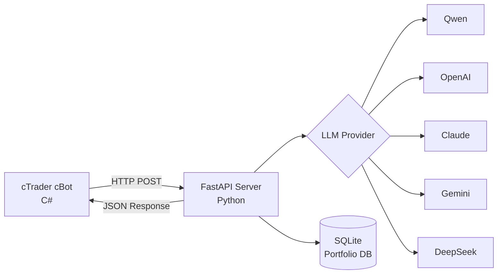

# 🤖 AgentFxTrading - Hệ Thống Giao Dịch Tự Động Với AI

<div align="center">

**Giao Dịch Forex Tự Động Với Chiến Lược TMS + ORB**

[](https://opensource.org/licenses/MIT)
[](https://www.python.org/downloads/)
[](https://ctdn.com/)
[](https://github.com/yourusername/AgentFxTrading/stargazers)
[](https://github.com/yourusername/AgentFxTrading/network/members)
[](https://github.com/yourusername/AgentFxTrading/issues)

[🇬🇧 English](README.md) | [🇻🇳 Tiếng Việt](README.vi.md) | [🇨🇳 中文](README.zh.md) | [🇵🇹 Português](README.pt.md) | [🇯🇵 日本語](README.ja.md) | [🇷🇺 Русский](README.ru.md)

[Cài Đặt](#-hướng-dẫn-cài-đặt) • [Tính Năng](#-tính-năng) • [Chiến Lược](#-chiến-lược-giao-dịch) • [API Docs](#-api-documentation) • [Đóng Góp](#-đóng-góp)

</div>

---

## 📋 Mục Lục

- [Tổng Quan](#-tổng-quan)
- [Tính Năng](#-tính-năng)
- [Kiến Trúc](#-kiến-trúc)
- [Hướng Dẫn Cài Đặt](#-hướng-dẫn-cài-đặt)
- [Chiến Lược Giao Dịch](#-chiến-lược-giao-dịch)
- [Cấu Hình](#-cấu-hình)
- [API Documentation](#-api-documentation)
- [Phát Triển](#-phát-triển)
- [Hiệu Suất](#-hiệu-suất)
- [Đóng Góp](#-đóng-góp)
- [Giấy Phép](#-giấy-phép)

---

## 🎯 Tổng Quan

AgentFxTrading là **hệ thống giao dịch forex tự động** kết hợp sức mạnh của AI với các chiến lược phân tích kỹ thuật đã được chứng minh. Hệ thống sử dụng **TMS (Trend Momentum Signal)** để phát hiện xu hướng và **ORB (Opening Range Breakout)** để xác định thời điểm vào lệnh chính xác.

### Tại Sao Chọn AgentFxTrading?

✅ **Hoàn Toàn Tự Động** - AI đưa ra quyết định giao dịch 24/7  
✅ **Hỗ Trợ Đa LLM** - Hoạt động với Qwen, OpenAI, Claude, Gemini, DeepSeek  
✅ **Quản Lý Rủi Ro** - Kiểm soát rủi ro cấp độ danh mục trên nhiều cặp tiền  
✅ **Chiến Lược Đã Chứng Minh** - Dựa trên phương pháp TMS chuyên nghiệp  
✅ **Dễ Dàng Cài Đặt** - Bắt đầu trong vòng 10 phút  
✅ **Mã Nguồn Mở** - Hoàn toàn minh bạch và tùy chỉnh được  

---

## 🚀 Tính Năng

### 🤖 Ra Quyết Định Bằng AI
- **Hỗ Trợ Đa LLM**: Qwen, OpenAI GPT-4, Claude, Gemini, DeepSeek
- **Phân Tích Theo Ngữ Cảnh**: Phân tích 3 nến dữ liệu lịch sử
- **Điểm Tin Cậy**: Chỉ giao dịch khi độ tin cậy > 70%
- **Học Thích Ứng**: Prompt engineering để cải thiện liên tục

### 📊 Phân Tích Kỹ Thuật Nâng Cao
- **Chỉ Báo TMS**: Heiken Ashi, TDI (RSI + Signal), Stochastic
- **Logic ORB**: Phát hiện Opening Range với bộ lọc breakout quyết định
- **Theo Dõi Momentum**: TF Green State với phân tích độ dốc
- **Nhận Diện Chế Độ Thị Trường (Market Regime)**: Kaufman Efficiency Ratio (`er_session`, `er_recent`) và bộ đếm bẫy phá vỡ giả (`or_flips`) để phân loại `trending`, `choppy`, `mixed`, `forming`
- **Đa Khung Thời Gian**: Hoạt động trên M15, H1, H4

### 💼 Quản Lý Danh Mục
- **Giao Dịch Đa Symbol**: Chạy nhiều bot trên các cặp tiền khác nhau
- **Kiểm Soát Phơi Nhiễm Tiền Tệ**: Ngăn chặn phơi nhiễm quá mức vào một tiền tệ
- **Phát Hiện Tương Quan**: Chặn các vị thế có tương quan cao
- **Giới Hạn Lỗ Hàng Ngày**: Tự động dừng giao dịch sau khi lỗ tối đa

### 🛡️ Quản Lý Rủi Ro
- **Bộ Nhớ Vị Thế**: Theo dõi MFE (Maximum Favorable Excursion)
- **Breakeven Tự Động**: Di chuyển SL về entry sau ngưỡng lợi nhuận
- **Trailing Stop**: Điều chỉnh SL động trong các giao dịch có lãi
- **Bảo Vệ Giveback Tối Đa**: Đóng vị thế nếu giveback vượt ngưỡng
- **Bảo Vệ Chuỗi Thua**: Chặn vào lệnh sau 3 lần thua liên tiếp
- **Cycle Gating (Cost Gate)**: Tự động bỏ qua gọi LLM khi ngoài phiên, giá trong OR hoặc đang chuỗi thua — tiết kiệm 80-90% chi phí API
- **Trend TP Disabled**: Tự động hủy TP cố định khi thị trường có xu hướng mạnh (`trending`) để gồng lời tối đa bằng Trailing SL & Giveback Floor
- **Daily Rotating Logs**: Ghi toàn bộ nhật ký suy luận của Agent, quyết định Cycle Gate và Snapshot vào file `logs/agent_YYYY-MM-DD.log` (lưu 14 ngày)

### ⏰ Quản Lý Phiên
- **Phiên Giao Dịch**: Thời gian phiên có thể cấu hình (London, NY, Tokyo)
- **Tự Động Đóng Cuối Ngày**: Tự động đóng vị thế khi kết thúc phiên
- **Phát Hiện Giai Đoạn**: Pre-market, active, ending, closed

---

## 🏗️ Kiến Trúc



### Phân Tích Component

| Component | Công Nghệ | Trách Nhiệm |
|-----------|-----------|----------------|
| **cBot** | C# / cTrader | Tính toán chỉ báo, thực thi giao dịch |
| **Server** | Python / FastAPI | Ra quyết định AI, quản lý rủi ro |
| **Database** | SQLite | Theo dõi danh mục, lịch sử vị thế |
| **LLM** | Nhiều loại | Phân tích quyết định giao dịch |

---

## ⚡ Hướng Dẫn Cài Đặt

### Yêu Cầu Hệ Thống

- Python 3.9+
- cTrader 4.x+
- API key LLM (Qwen/OpenAI/Claude/Gemini/DeepSeek)

### 1. Cài Đặt Dependencies Python

```bash
# Clone repository
git clone https://github.com/yourusername/AgentFxTrading.git
cd AgentFxTrading

# Cài đặt dependencies
pip install -r requirements.txt
```

### 2. Cấu Hình LLM Provider

```bash
# Copy template môi trường
cp .env.example .env

# Chỉnh sửa .env với API key của bạn
# Ví dụ cho Qwen (khuyến nghị):
LLM_PROVIDER=qwen
DASHSCOPE_API_KEY=sk-your-dashscope-key
LLM_MODEL=qwen-max
```

### 3. Khởi Động Server

```bash
python app/server.py
```

Server sẽ chạy tại `http://127.0.0.1:8000`

### 4. Thiết Lập & Chạy cBot

Bạn có thể chạy cBot bằng **Giao diện cTrader Desktop (GUI)** hoặc **Headless Docker CLI** (`ctrader-console`).

#### Cách A: Giao diện cTrader Desktop (GUI)

1. Mở **cTrader** → **Automate**
2. Click **New** → **cBot**
3. Dán code từ `cBot/AiAgentBot.cs`
4. Click **Build**
5. Attach vào chart (khuyến nghị M15 hoặc H1)
6. Cấu hình parameters:
   - **Bot ID**: `xauusd_m15` (identifier duy nhất)
   - **API URL**: `http://127.0.0.1:8000/trade`
   - **Session**: New York (13:00-21:00 UTC) / London (8:00-17:00 UTC) / Tokyo (0:00-9:00 UTC)

#### Cách B: Chạy Bằng Docker CLI (`ctrader-console`)

1. **Chuẩn bị File Mật khẩu cTID**:
   ```bash
   mkdir -p /root/ctrader_data
   echo "mat_khau_ctid_cua_ban" > /root/ctrader_data/ctid_pwd
   chmod 600 /root/ctrader_data/ctid_pwd
   ```

2. **Build/Biên dịch gói `.algo`**:
   ```bash
   docker run --rm -v $(pwd):/workspace -v /root:/root \
     ghcr.io/spotware/ctrader-console:latest create cbot AiAgentBot
   cp cBot/AiAgentBot.cs /root/cAlgo/Sources/Robots/AiAgentBot/AiAgentBot/AiAgentBot.cs
   docker run --rm -v $(pwd):/workspace -v /root:/root \
     ghcr.io/spotware/ctrader-console:latest build /root/cAlgo/Sources/Robots/AiAgentBot/AiAgentBot/AiAgentBot.csproj
   cp /root/cAlgo/Sources/Robots/AiAgentBot.algo cBot/AiAgentBot.algo
   ```

3. **Chạy Docker Containers cho từng cặp tiền / chỉ số**:

   * **XAUUSD (M15 - Phiên New York)**:
     ```bash
     docker run -d \
       --name cbot-xauusd \
       --restart unless-stopped \
       --network host \
       -v $(pwd):/workspace \
       -v /root:/root \
       ghcr.io/spotware/ctrader-console:latest \
       run /workspace/cBot/AiAgentBot.algo \
       --ctid=email_cua_ban@example.com \
       --pwd-file=/root/ctrader_data/ctid_pwd \
       --account=SO_TAI_KHOAN \
       --symbol=XAUUSD \
       --period=m15 \
       --full-access \
       --BotId="xauusd_m15" \
       --ApiUrl="http://127.0.0.1:8000/trade" \
       --AccountLabel="demo" \
       --TmsTimeFrame="Hour" \
       --EmaPeriod=5 \
       --SessionName="newyork" \
       --OrbStartHour=13 \
       --SessionEndHour=21 \
       --SessionDstRule="US" \
       --MinDecisiveBreakoutPips=200.0 \
       --MinOrWidthPips=400.0 \
       --OrbBufferPips=50.0 \
       --BreakevenTriggerAtr=1.2 \
       --BreakevenOffsetAtr=0.1 \
       --TrailTriggerAtr=2.0 \
       --TrailDistanceAtr=1.0 \
       --PartialCloseRatio=0.5 \
       --MinSlAtr=0.8 \
       --MaxSlAtr=3.0 \
       --MinTpAtr=1.0 \
       --MaxTpAtr=6.0 \
       --MaxGivebackAtr=1.0 \
       --EnablePostTpGate=true \
       --PostTpPullbackAtr=0.5 \
       --BounceTradeEnabled=true \
       --BounceDistanceThreshold=10 \
       --RiskPerTradePercent=0.2 \
       --TrendTpDisabled=true
     ```

   * **EURUSD (M15 - Phiên London)**:
     ```bash
     docker run -d \
       --name cbot-eurusd \
       --restart unless-stopped \
       --network host \
       -v $(pwd):/workspace \
       -v /root:/root \
       ghcr.io/spotware/ctrader-console:latest \
       run /workspace/cBot/AiAgentBot.algo \
       --ctid=email_cua_ban@example.com \
       --pwd-file=/root/ctrader_data/ctid_pwd \
       --account=SO_TAI_KHOAN \
       --symbol=EURUSD \
       --period=m15 \
       --full-access \
       --BotId="eurusd_m15" \
       --ApiUrl="http://127.0.0.1:8000/trade" \
       --AccountLabel="demo" \
       --TmsTimeFrame="Hour" \
       --EmaPeriod=5 \
       --SessionName="london" \
       --OrbStartHour=8 \
       --SessionEndHour=17 \
       --SessionDstRule="Europe" \
       --MinDecisiveBreakoutPips=3.0 \
       --MinOrWidthPips=6.0 \
       --OrbBufferPips=1.0 \
       --BreakevenTriggerAtr=1.2 \
       --BreakevenOffsetAtr=0.1 \
       --TrailTriggerAtr=2.0 \
       --TrailDistanceAtr=1.0 \
       --PartialCloseRatio=0.5 \
       --MinSlAtr=0.8 \
       --MaxSlAtr=3.0 \
       --MinTpAtr=1.0 \
       --MaxTpAtr=6.0 \
       --MaxGivebackAtr=1.0 \
       --EnablePostTpGate=true \
       --PostTpPullbackAtr=0.5 \
       --BounceTradeEnabled=true \
       --BounceDistanceThreshold=5 \
       --RiskPerTradePercent=0.2 \
       --TrendTpDisabled=true
     ```

   * **GBPUSD (M15 - Phiên London)**:
     ```bash
     docker run -d \
       --name cbot-gbpusd \
       --restart unless-stopped \
       --network host \
       -v $(pwd):/workspace \
       -v /root:/root \
       ghcr.io/spotware/ctrader-console:latest \
       run /workspace/cBot/AiAgentBot.algo \
       --ctid=email_cua_ban@example.com \
       --pwd-file=/root/ctrader_data/ctid_pwd \
       --account=SO_TAI_KHOAN \
       --symbol=GBPUSD \
       --period=m15 \
       --full-access \
       --BotId="gbpusd_m15" \
       --ApiUrl="http://127.0.0.1:8000/trade" \
       --AccountLabel="demo" \
       --TmsTimeFrame="Hour" \
       --EmaPeriod=5 \
       --SessionName="london" \
       --OrbStartHour=8 \
       --SessionEndHour=17 \
       --SessionDstRule="Europe" \
       --MinDecisiveBreakoutPips=4.5 \
       --MinOrWidthPips=10.0 \
       --OrbBufferPips=1.5 \
       --BreakevenTriggerAtr=1.2 \
       --BreakevenOffsetAtr=0.1 \
       --TrailTriggerAtr=2.0 \
       --TrailDistanceAtr=1.0 \
       --PartialCloseRatio=0.5 \
       --MinSlAtr=0.8 \
       --MaxSlAtr=3.0 \
       --MinTpAtr=1.0 \
       --MaxTpAtr=6.0 \
       --MaxGivebackAtr=1.0 \
       --EnablePostTpGate=true \
       --PostTpPullbackAtr=0.5 \
       --BounceTradeEnabled=true \
       --BounceDistanceThreshold=10 \
       --RiskPerTradePercent=0.2 \
       --TrendTpDisabled=true
     ```

   * **USDJPY (M15 - Phiên Tokyo)**:
     ```bash
     docker run -d \
       --name cbot-usdjpy \
       --restart unless-stopped \
       --network host \
       -v $(pwd):/workspace \
       -v /root:/root \
       ghcr.io/spotware/ctrader-console:latest \
       run /workspace/cBot/AiAgentBot.algo \
       --ctid=email_cua_ban@example.com \
       --pwd-file=/root/ctrader_data/ctid_pwd \
       --account=SO_TAI_KHOAN \
       --symbol=USDJPY \
       --period=m15 \
       --full-access \
       --BotId="usdjpy_m15" \
       --ApiUrl="http://127.0.0.1:8000/trade" \
       --AccountLabel="demo" \
       --TmsTimeFrame="Hour" \
       --EmaPeriod=5 \
       --SessionName="tokyo" \
       --OrbStartHour=0 \
       --SessionEndHour=9 \
       --SessionDstRule="None" \
       --MinDecisiveBreakoutPips=4.0 \
       --MinOrWidthPips=8.0 \
       --OrbBufferPips=1.5 \
       --BreakevenTriggerAtr=1.2 \
       --BreakevenOffsetAtr=0.1 \
       --TrailTriggerAtr=2.0 \
       --TrailDistanceAtr=1.0 \
       --PartialCloseRatio=0.5 \
       --MinSlAtr=0.8 \
       --MaxSlAtr=3.0 \
       --MinTpAtr=1.0 \
       --MaxTpAtr=6.0 \
       --MaxGivebackAtr=1.0 \
       --EnablePostTpGate=true \
       --PostTpPullbackAtr=0.5 \
       --BounceTradeEnabled=true \
       --BounceDistanceThreshold=3 \
       --RiskPerTradePercent=0.2 \
       --TrendTpDisabled=true
     ```

   * **US30 (M5 - Phiên New York Index)**:
     ```bash
     docker run -d \
       --name cbot-us30 \
       --restart unless-stopped \
       --network host \
       -v $(pwd):/workspace \
       -v /root:/root \
       ghcr.io/spotware/ctrader-console:latest \
       run /workspace/cBot/AiAgentBot.algo \
       --ctid=email_cua_ban@example.com \
       --pwd-file=/root/ctrader_data/ctid_pwd \
       --account=SO_TAI_KHOAN \
       --symbol=US30 \
       --period=m5 \
       --full-access \
       --BotId="us30_m5" \
       --ApiUrl="http://127.0.0.1:8000/trade" \
       --AccountLabel="demo" \
       --TmsTimeFrame="Hour" \
       --EmaPeriod=5 \
       --SessionName="newyork_index" \
       --OrbStartHour=13 \
       --SessionEndHour=20 \
       --SessionDstRule="US" \
       --MinDecisiveBreakoutPips=30.0 \
       --MinOrWidthPips=80.0 \
       --OrbBufferPips=15.0 \
       --BreakevenTriggerAtr=1.2 \
       --BreakevenOffsetAtr=0.1 \
       --TrailTriggerAtr=2.0 \
       --TrailDistanceAtr=1.0 \
       --PartialCloseRatio=0.5 \
       --MinSlAtr=0.8 \
       --MaxSlAtr=3.0 \
       --MinTpAtr=1.0 \
       --MaxTpAtr=6.0 \
       --MaxGivebackAtr=1.0 \
       --EnablePostTpGate=true \
       --PostTpPullbackAtr=0.5 \
       --BounceTradeEnabled=true \
       --BounceDistanceThreshold=30 \
       --RiskPerTradePercent=0.2 \
       --TrendTpDisabled=true
     ```

   * **USTEC / NAS100 (M5 - Phiên New York Index)** *(Lưu ý: Dùng mã `USTEC` hoặc `NAS100` tùy sàn cTrader)*:
     ```bash
     docker run -d \
       --name cbot-ustec \
       --restart unless-stopped \
       --network host \
       -v $(pwd):/workspace \
       -v /root:/root \
       ghcr.io/spotware/ctrader-console:latest \
       run /workspace/cBot/AiAgentBot.algo \
       --ctid=email_cua_ban@example.com \
       --pwd-file=/root/ctrader_data/ctid_pwd \
       --account=SO_TAI_KHOAN \
       --symbol=USTEC \
       --period=m5 \
       --full-access \
       --BotId="ustec_m5" \
       --ApiUrl="http://127.0.0.1:8000/trade" \
       --AccountLabel="demo" \
       --TmsTimeFrame="Hour" \
       --EmaPeriod=5 \
       --SessionName="newyork_index" \
       --OrbStartHour=13 \
       --SessionEndHour=20 \
       --SessionDstRule="US" \
       --MinDecisiveBreakoutPips=25.0 \
       --MinOrWidthPips=70.0 \
       --OrbBufferPips=12.0 \
       --BreakevenTriggerAtr=1.2 \
       --BreakevenOffsetAtr=0.1 \
       --TrailTriggerAtr=2.0 \
       --TrailDistanceAtr=1.0 \
       --PartialCloseRatio=0.5 \
       --MinSlAtr=0.8 \
       --MaxSlAtr=3.0 \
       --MinTpAtr=1.0 \
       --MaxTpAtr=6.0 \
       --MaxGivebackAtr=1.0 \
       --EnablePostTpGate=true \
       --PostTpPullbackAtr=0.5 \
       --BounceTradeEnabled=true \
       --BounceDistanceThreshold=25 \
       --RiskPerTradePercent=0.2 \
       --TrendTpDisabled=true
     ```

   * **GBPJPY (M15 - Phiên London / Cặp Cross Biến Động Mạnh)**:
     ```bash
     docker run -d \
       --name cbot-gbpjpy \
       --restart unless-stopped \
       --network host \
       -v $(pwd):/workspace \
       -v /root:/root \
       ghcr.io/spotware/ctrader-console:latest \
       run /workspace/cBot/AiAgentBot.algo \
       --ctid=email_cua_ban@example.com \
       --pwd-file=/root/ctrader_data/ctid_pwd \
       --account=SO_TAI_KHOAN \
       --symbol=GBPJPY \
       --period=m15 \
       --full-access \
       --BotId="gbpjpy_m15" \
       --ApiUrl="http://127.0.0.1:8000/trade" \
       --AccountLabel="demo" \
       --TmsTimeFrame="Hour" \
       --EmaPeriod=5 \
       --SessionName="london" \
       --OrbStartHour=8 \
       --SessionEndHour=17 \
       --SessionDstRule="Europe" \
       --MinDecisiveBreakoutPips=6.0 \
       --MinOrWidthPips=15.0 \
       --OrbBufferPips=2.0 \
       --BreakevenTriggerAtr=1.2 \
       --BreakevenOffsetAtr=0.1 \
       --TrailTriggerAtr=2.0 \
       --TrailDistanceAtr=1.0 \
       --PartialCloseRatio=0.5 \
       --MinSlAtr=0.8 \
       --MaxSlAtr=3.0 \
       --MinTpAtr=1.0 \
       --MaxTpAtr=6.0 \
       --MaxGivebackAtr=1.0 \
       --EnablePostTpGate=true \
       --PostTpPullbackAtr=0.5 \
       --BounceTradeEnabled=true \
       --BounceDistanceThreshold=5 \
       --RiskPerTradePercent=0.2 \
       --TrendTpDisabled=true
     ```

   * **EURJPY (M15 - Phiên London / Cặp Cross Biến Động Mạnh)**:
     ```bash
     docker run -d \
       --name cbot-eurjpy \
       --restart unless-stopped \
       --network host \
       -v $(pwd):/workspace \
       -v /root:/root \
       ghcr.io/spotware/ctrader-console:latest \
       run /workspace/cBot/AiAgentBot.algo \
       --ctid=email_cua_ban@example.com \
       --pwd-file=/root/ctrader_data/ctid_pwd \
       --account=SO_TAI_KHOAN \
       --symbol=EURJPY \
       --period=m15 \
       --full-access \
       --BotId="eurjpy_m15" \
       --ApiUrl="http://127.0.0.1:8000/trade" \
       --AccountLabel="demo" \
       --TmsTimeFrame="Hour" \
       --EmaPeriod=5 \
       --SessionName="london" \
       --OrbStartHour=8 \
       --SessionEndHour=17 \
       --SessionDstRule="Europe" \
       --MinDecisiveBreakoutPips=5.0 \
       --MinOrWidthPips=12.0 \
       --OrbBufferPips=1.5 \
       --BreakevenTriggerAtr=1.2 \
       --BreakevenOffsetAtr=0.1 \
       --TrailTriggerAtr=2.0 \
       --TrailDistanceAtr=1.0 \
       --PartialCloseRatio=0.5 \
       --MinSlAtr=0.8 \
       --MaxSlAtr=3.0 \
       --MinTpAtr=1.0 \
       --MaxTpAtr=6.0 \
       --MaxGivebackAtr=1.0 \
       --EnablePostTpGate=true \
       --PostTpPullbackAtr=0.5 \
       --BounceTradeEnabled=true \
       --BounceDistanceThreshold=5 \
       --RiskPerTradePercent=0.2 \
       --TrendTpDisabled=true
     ```

   * **USDCAD (M15 - Phiên New York / Hàng Hóa)**:
     ```bash
     docker run -d \
       --name cbot-usdcad \
       --restart unless-stopped \
       --network host \
       -v $(pwd):/workspace \
       -v /root:/root \
       ghcr.io/spotware/ctrader-console:latest \
       run /workspace/cBot/AiAgentBot.algo \
       --ctid=email_cua_ban@example.com \
       --pwd-file=/root/ctrader_data/ctid_pwd \
       --account=SO_TAI_KHOAN \
       --symbol=USDCAD \
       --period=m15 \
       --full-access \
       --BotId="usdcad_m15" \
       --ApiUrl="http://127.0.0.1:8000/trade" \
       --AccountLabel="demo" \
       --TmsTimeFrame="Hour" \
       --EmaPeriod=5 \
       --SessionName="newyork" \
       --OrbStartHour=13 \
       --SessionEndHour=21 \
       --SessionDstRule="US" \
       --MinDecisiveBreakoutPips=4.0 \
       --MinOrWidthPips=10.0 \
       --OrbBufferPips=1.5 \
       --BreakevenTriggerAtr=1.2 \
       --BreakevenOffsetAtr=0.1 \
       --TrailTriggerAtr=2.0 \
       --TrailDistanceAtr=1.0 \
       --PartialCloseRatio=0.5 \
       --MinSlAtr=0.8 \
       --MaxSlAtr=3.0 \
       --MinTpAtr=1.0 \
       --MaxTpAtr=6.0 \
       --MaxGivebackAtr=1.0 \
       --EnablePostTpGate=true \
       --PostTpPullbackAtr=0.5 \
       --BounceTradeEnabled=true \
       --BounceDistanceThreshold=4 \
       --RiskPerTradePercent=0.2 \
       --TrendTpDisabled=true
     ```

   * **AUDUSD (M15 - Phiên Châu Á/Tokyo / Hàng Hóa)**:
     ```bash
     docker run -d \
       --name cbot-audusd \
       --restart unless-stopped \
       --network host \
       -v $(pwd):/workspace \
       -v /root:/root \
       ghcr.io/spotware/ctrader-console:latest \
       run /workspace/cBot/AiAgentBot.algo \
       --ctid=email_cua_ban@example.com \
       --pwd-file=/root/ctrader_data/ctid_pwd \
       --account=SO_TAI_KHOAN \
       --symbol=AUDUSD \
       --period=m15 \
       --full-access \
       --BotId="audusd_m15" \
       --ApiUrl="http://127.0.0.1:8000/trade" \
       --AccountLabel="demo" \
       --TmsTimeFrame="Hour" \
       --EmaPeriod=5 \
       --SessionName="tokyo" \
       --OrbStartHour=0 \
       --SessionEndHour=9 \
       --SessionDstRule="None" \
       --MinDecisiveBreakoutPips=3.0 \
       --MinOrWidthPips=8.0 \
       --OrbBufferPips=1.0 \
       --BreakevenTriggerAtr=1.2 \
       --BreakevenOffsetAtr=0.1 \
       --TrailTriggerAtr=2.0 \
       --TrailDistanceAtr=1.0 \
       --PartialCloseRatio=0.5 \
       --MinSlAtr=0.8 \
       --MaxSlAtr=3.0 \
       --MinTpAtr=1.0 \
       --MaxTpAtr=6.0 \
       --MaxGivebackAtr=1.0 \
       --EnablePostTpGate=true \
       --PostTpPullbackAtr=0.5 \
       --BounceTradeEnabled=true \
       --BounceDistanceThreshold=3 \
       --RiskPerTradePercent=0.2 \
       --TrendTpDisabled=true
     ```

   * **DE40 / DAX40 (M5 - Phiên Châu Âu/London / Chỉ Số Đức)** *(Lưu ý: Dùng mã `DE40` hoặc `GER40` tùy sàn cTrader)*:
     ```bash
     docker run -d \
       --name cbot-de40 \
       --restart unless-stopped \
       --network host \
       -v $(pwd):/workspace \
       -v /root:/root \
       ghcr.io/spotware/ctrader-console:latest \
       run /workspace/cBot/AiAgentBot.algo \
       --ctid=email_cua_ban@example.com \
       --pwd-file=/root/ctrader_data/ctid_pwd \
       --account=SO_TAI_KHOAN \
       --symbol=DE40 \
       --period=m5 \
       --full-access \
       --BotId="de40_m5" \
       --ApiUrl="http://127.0.0.1:8000/trade" \
       --AccountLabel="demo" \
       --TmsTimeFrame="Hour" \
       --EmaPeriod=5 \
       --SessionName="london" \
       --OrbStartHour=8 \
       --SessionEndHour=16 \
       --SessionDstRule="Europe" \
       --MinDecisiveBreakoutPips=20.0 \
       --MinOrWidthPips=60.0 \
       --OrbBufferPips=10.0 \
       --BreakevenTriggerAtr=1.2 \
       --BreakevenOffsetAtr=0.1 \
       --TrailTriggerAtr=2.0 \
       --TrailDistanceAtr=1.0 \
       --PartialCloseRatio=0.5 \
       --MinSlAtr=0.8 \
       --MaxSlAtr=3.0 \
       --MinTpAtr=1.0 \
       --MaxTpAtr=6.0 \
       --MaxGivebackAtr=1.0 \
       --EnablePostTpGate=true \
       --PostTpPullbackAtr=0.5 \
       --BounceTradeEnabled=true \
       --BounceDistanceThreshold=25 \
       --RiskPerTradePercent=0.2 \
       --TrendTpDisabled=true
     ```

   * **AUDJPY (M15 - Phiên Châu Á/Tokyo / Cặp Đo Tâm Lý Rủi Ro)**:
     ```bash
     docker run -d \
       --name cbot-audjpy \
       --restart unless-stopped \
       --network host \
       -v $(pwd):/workspace \
       -v /root:/root \
       ghcr.io/spotware/ctrader-console:latest \
       run /workspace/cBot/AiAgentBot.algo \
       --ctid=email_cua_ban@example.com \
       --pwd-file=/root/ctrader_data/ctid_pwd \
       --account=SO_TAI_KHOAN \
       --symbol=AUDJPY \
       --period=m15 \
       --full-access \
       --BotId="audjpy_m15" \
       --ApiUrl="http://127.0.0.1:8000/trade" \
       --AccountLabel="demo" \
       --TmsTimeFrame="Hour" \
       --EmaPeriod=5 \
       --SessionName="tokyo" \
       --OrbStartHour=0 \
       --SessionEndHour=9 \
       --SessionDstRule="None" \
       --MinDecisiveBreakoutPips=4.0 \
       --MinOrWidthPips=10.0 \
       --OrbBufferPips=1.5 \
       --BreakevenTriggerAtr=1.2 \
       --BreakevenOffsetAtr=0.1 \
       --TrailTriggerAtr=2.0 \
       --TrailDistanceAtr=1.0 \
       --PartialCloseRatio=0.5 \
       --MinSlAtr=0.8 \
       --MaxSlAtr=3.0 \
       --MinTpAtr=1.0 \
       --MaxTpAtr=6.0 \
       --MaxGivebackAtr=1.0 \
       --EnablePostTpGate=true \
       --PostTpPullbackAtr=0.5 \
       --BounceTradeEnabled=true \
       --BounceDistanceThreshold=4 \
       --RiskPerTradePercent=0.2 \
       --TrendTpDisabled=true
     ```
### 5. Bắt Đầu Giao Dịch! 🎉

Bot sẽ tự động:
- Tính toán chỉ báo khi mỗi nến đóng
- Gửi snapshot thị trường đến AI server
- Nhận quyết định giao dịch
- Thực thi giao dịch với quản lý rủi ro

---

## 📈 Chiến Lược Giao Dịch

### TMS (Trend Momentum Signal)

TMS xác định **directional bias** bằng ba xác nhận:

| Chỉ Báo | Tín Hiệu Bullish | Tín Hiệu Bearish |
|----------|------------------|------------------|
| **TDI** | Green > Red | Green < Red |
| **Heiken Ashi** | Nến xanh | Nến đỏ |
| **Stochastic** | K > D | K < D |

**Khái Niệm Chính**: Bias được khóa cho đến khi có cross tiếp theo, ngăn chặn whipsaws.

### ORB (Opening Range Breakout)

ORB cung cấp **thời điểm vào lệnh chính xác**:

1. **Opening Range**: High/Low của 15 phút đầu phiên
2. **Breakout**: Giá đóng cửa vượt qua ranh giới OR
3. **Bộ Lọc Quyết Định**: Breakout phải dứt khoát (≥ MinDecisiveBreakoutPips, mặc định 10.0 pips cho XAUUSD)

### Nhận Diện Chế Độ Thị Trường (Market Regime)

Hệ thống tính toán các chỉ số hiệu suất dòng tiền thời gian thực:
- **`er_session` & `er_recent`**: Kaufman Efficiency Ratio ($ER = \frac{|\text{Net Move}|}{\sum |\text{Bar Moves}|}$). $1.0$ thể hiện xu hướng một chiều mượt mà, $\approx 0.0$ thể hiện sideway dập dình.
- **`or_flips`**: Đếm số lần phá vỡ giả ra ngoài Opening Range rồi thụt đầu đóng nến vào trong.
- **Các chế độ thị trường**:
  - **`trending`** ($ER \ge 0.35$): Tự động hủy TP cố định (`TrendTpDisabled = true`), thả trôi lệnh để Trailing SL và Giveback Floor ăn trọn con sóng lớn.
  - **`choppy`** (`or_flips \ge 5`): Nguy cơ bẫy giá cao → Cycle Gate tự động chọn `HOLD`.
  - **`mixed`**: Kỷ luật giao dịch tiêu chuẩn ($R:R \ge 1.5$).
  - **`forming`**: Giai đoạn mở phiên tích lũy ($< 6$ nến).

### Quy Tắc Xử Lý Ngoại Lệ Thực Chiến (Edge-Case Rules)
- **Ngoại lệ BIAS-FRESH**: Khi giao cắt TDI vừa mới xảy ra ($\le 1$ nến trước), xung lực bứt phá sớm được xem là **bắt đầu một con sóng mới** chứ không phải nến quá mua/quá bán → Ưu tiên vào lệnh ngay.
- **Quy tắc ANTI-CHASE**: Khi giá đã breakout $\ge 4$ nến dưới một xu hướng đã cũ mà chưa có nhịp hồi, **TUYỆT ĐỐI KHÔNG đu đỉnh/đáy** → Giữ lệnh `HOLD` chờ nhịp pullback.
- **Position Memory & Giveback Floor**: Theo dõi đỉnh lãi cao nhất ($MFE$) từng tick. Nếu lợi nhuận tụt từ đỉnh quá ngưỡng giveback, bot sẽ tự động đóng lệnh để bảo toàn thành quả.

### Quy Tắc Vào Lệnh

```
IF TMS_BULLISH AND ORB_BREAKOUT_UP AND DECISIVE:
    → BUY
    
IF TMS_BEARISH AND ORB_BREAKOUT_DOWN AND DECISIVE:
    → SELL
    
ELSE:
    → HOLD
```

### Quy Tắc Thoát Lệnh

| Điều Kiện | Hành Động |
|-----------|-----------|
| TDI Green flat/hook/checkmark | CLOSE_ALL |
| Bias đảo ngược | Tự động đóng |
| Phiên kết thúc (EOD) | Tự động đóng toàn bộ lệnh (EOD Force-Flatten safety net) |
| Lợi nhuận ≥ 1.2x ATR | Di chuyển SL về breakeven (+0.1x ATR offset) |
| Lợi nhuận ≥ 2.0x ATR | Trail SL 1.0x ATR |
| Giveback ≥ 30p | Tự động đóng (Max giveback protection) |

---

## ⚙️ Cấu Hình

### Tham Số cBot

#### Cài Đặt TMS (Đa Khung Thời Gian)
| Tham Số | Mặc Định | Mô Tả |
|---------|----------|-------|
| TMS Timeframe (Macro) | Hour (H1) | Khung thời gian xu hướng lớn (H1, H4, M15, v.v.) |
| RSI Period | 6 | Chu kỳ tính toán RSI |
| Red Period | 6 | Chu kỳ đường signal |

#### Cài Đặt Stochastic
| Tham Số | Mặc Định | Mô Tả |
|---------|----------|-------|
| %K Period | 6 | Stochastic nhanh |
| %D Period | 6 | Stochastic chậm |
| Slowing | 4 | Hệ số làm mượt |

#### Bộ Lọc Vào Lệnh
| Tham Số | Mặc Định | Mô Tả |
|---------|----------|-------|
| Max Bars After Cross | 5 | Cửa sổ vào lệnh |
| Min Angle Delta | 0.0 | Bộ lọc góc (0=tắt) |
| Min Decisive Breakout | 10.0 pips | Độ mạnh breakout (tối ưu mặc định cho XAUUSD) |

#### Quản Lý Thoát Lệnh
| Tham Số | Mặc Định | Mô Tả |
|---------|----------|-------|
| Flat Threshold | 0.01 | Độ phẳng TDI |
| Checkmark Threshold | 0.0 | Ngưỡng hook/checkmark |
| Breakeven Trigger | 1.2x ATR | Lợi nhuận (hệ số ATR) để dời SL về hòa vốn |
| Breakeven Offset | 0.1x ATR | Khoảng offset bảo toàn lợi nhuận khi về BE |
| Trail Trigger | 2.0x ATR | Lợi nhuận (hệ số ATR) để kích hoạt Trailing Stop |
| Trail Distance | 1.0x ATR | Khoảng cách SL bám theo giá (hệ số ATR) |

#### Phiên
| Tham Số | Mặc Định | Mô Tả |
|---------|----------|-------|
| Session Start Hour | 13 (UTC) | New York mở cửa (Winter UTC) |
| Session End Hour | 21 (UTC) | New York đóng cửa (EOD force-flatten) |
| Opening Range | 15 min | Cửa sổ tính toán OR |
| Min OR Width | 20.0 pips | Độ rộng OR tối thiểu |
| ORB Buffer | 3.0 pips | Vùng đệm tránh fakeout |
| DST Rule | US | Tự động điều chỉnh giờ mùa hè (DST) |

#### Quản Lý Rủi Ro (Dynamic Sizing & ATR)
| Tham Số | Mặc Định | Mô Tả |
|---------|----------|-------|
| Use ATR for SL/TP | true | Tính toán SL/TP động theo chỉ báo ATR |
| ATR Period | 14 | Chu kỳ tính toán ATR |
| ATR SL Multiplier | 1.5 | Hệ số nhân ATR cho khoảng cách Stop Loss |
| ATR TP Multiplier | 2.0 | Hệ số nhân ATR cho khoảng cách Take Profit |
| Risk per Trade (%) | 0.2 | Tỷ lệ % tài khoản chịu rủi ro mỗi lệnh |

#### Guardrails
| Tham Số | Mặc Định | Mô Tả |
|---------|----------|-------|
| Min SL | 20.0 pips | Stop loss tối thiểu |
| Max SL | 80.0 pips | Stop loss tối đa |
| Min TP | 30.0 pips | Take profit tối thiểu |
| Max TP | 250.0 pips | Take profit tối đa |
| Max Giveback | 30.0 pips | Ngưỡng giveback để đóng lệnh |
| Max Loss Streak | 3 | Chặn sau N lần thua |
| Bias Flip Exit | true | Tự động đóng khi bias thay đổi |
| Trend TP Disabled | true | Tự động hủy TP cố định khi trending |

### 📊 Recommended Presets by Symbol

#### Metals & Indices

| Parameter | XAUUSD | US30 | USTEC | DE40 |
| :--- | :--- | :--- | :--- | :--- |
| **Trading Session** | New York | New York (Index) | New York (Index) | London |
| **DST Rule** | `US` | `US` | `US` | `Europe` |
| **Min Decisive Breakout** | `200.0 pips` | `300.0 pips` | `250.0 pips` | `200.0 pips` |
| **Min OR Width** | `400.0 pips` | `800.0 pips` | `700.0 pips` | `600.0 pips` |
| **ORB Buffer** | `50.0 pips` | `150.0 pips` | `120.0 pips` | `100.0 pips` |
| **Breakeven Trigger** | `1.2x ATR` | `1.2x ATR` | `1.2x ATR` | `1.2x ATR` |
| **Breakeven Offset** | `0.1x ATR` | `0.1x ATR` | `0.1x ATR` | `0.1x ATR` |
| **Trail Trigger** | `2.0x ATR` | `2.0x ATR` | `2.0x ATR` | `2.0x ATR` |
| **Trail Distance** | `1.0x ATR` | `1.0x ATR` | `1.0x ATR` | `1.0x ATR` |
| **Min SL / Max SL** | `0.8x / 3.0x ATR` | `0.8x / 3.0x ATR` | `0.8x / 3.0x ATR` | `0.8x / 3.0x ATR` |
| **Min TP / Max TP** | `1.0x / 6.0x ATR` | `1.0x / 6.0x ATR` | `1.0x / 6.0x ATR` | `1.0x / 6.0x ATR` |
| **Max Giveback** | `1.0x ATR` | `1.0x ATR` | `1.0x ATR` | `1.0x ATR` |
| **Recommended Timeframe** | `M15` | `M5` | `M5` | `M5` |
| **EMA Period** | `5` | `5` | `5` | `5` |
| **Post-TP Gate / Pullback** | `true` (`0.5x ATR`) | `true` (`0.5x ATR`) | `true` (`0.5x ATR`) | `true` (`0.5x ATR`) |
| **TDI Bounce Trade** | `true` (`1.5`) | `true` (`1.5`) | `true` (`1.5`) | `true` (`1.5`) |
| **Partial Close at BE** | `0.5 (50%)` | `0.5 (50%)` | `0.5 (50%)` | `0.5 (50%)` |
| **Risk per Trade** | `0.2%` | `0.2%` | `0.2%` | `0.2%` |
| **Use ATR for SL/TP** | `truex ATR` | `truex ATR` | `truex ATR` | `truex ATR` |
| **ATR Period** | `14x ATR` | `14x ATR` | `14x ATR` | `14x ATR` |
| **ATR SL Multiplier** | `1.5x ATR` | `1.5x ATR` | `1.5x ATR` | `1.5x ATR` |
| **ATR TP Multiplier** | `2.0x ATR` | `2.0x ATR` | `2.0x ATR` | `2.0x ATR` |

#### Forex Majors

| Parameter | EURUSD | GBPUSD | USDJPY | USDCAD |
| :--- | :--- | :--- | :--- | :--- |
| **Trading Session** | London | London | Tokyo | New York |
| **DST Rule** | `Europe` | `Europe` | `None` | `US` |
| **Min Decisive Breakout** | `3.0 pips` | `4.5 pips` | `4.0 pips` | `4.0 pips` |
| **Min OR Width** | `6.0 pips` | `10.0 pips` | `8.0 pips` | `10.0 pips` |
| **ORB Buffer** | `1.0 pips` | `1.5 pips` | `1.5 pips` | `1.5 pips` |
| **Breakeven Trigger** | `1.2x ATR` | `1.2x ATR` | `1.2x ATR` | `1.2x ATR` |
| **Breakeven Offset** | `0.1x ATR` | `0.1x ATR` | `0.1x ATR` | `0.1x ATR` |
| **Trail Trigger** | `2.0x ATR` | `2.0x ATR` | `2.0x ATR` | `2.0x ATR` |
| **Trail Distance** | `1.0x ATR` | `1.0x ATR` | `1.0x ATR` | `1.0x ATR` |
| **Min SL / Max SL** | `0.8x / 3.0x ATR` | `0.8x / 3.0x ATR` | `0.8x / 3.0x ATR` | `0.8x / 3.0x ATR` |
| **Min TP / Max TP** | `1.0x / 6.0x ATR` | `1.0x / 6.0x ATR` | `1.0x / 6.0x ATR` | `1.0x / 6.0x ATR` |
| **Max Giveback** | `1.0x ATR` | `1.0x ATR` | `1.0x ATR` | `1.0x ATR` |
| **Recommended Timeframe** | `M15` | `M15` | `M15` | `M15` |
| **EMA Period** | `5` | `5` | `5` | `5` |
| **Post-TP Gate / Pullback** | `true` (`0.5x ATR`) | `true` (`0.5x ATR`) | `true` (`0.5x ATR`) | `true` (`0.5x ATR`) |
| **TDI Bounce Trade** | `true` (`1.5`) | `true` (`1.5`) | `true` (`1.5`) | `true` (`1.5`) |
| **Partial Close at BE** | `0.5 (50%)` | `0.5 (50%)` | `0.5 (50%)` | `0.5 (50%)` |
| **Risk per Trade** | `0.2%` | `0.2%` | `0.2%` | `0.2%` |
| **Use ATR for SL/TP** | `truex ATR` | `truex ATR` | `truex ATR` | `truex ATR` |
| **ATR Period** | `14x ATR` | `14x ATR` | `14x ATR` | `14x ATR` |
| **ATR SL Multiplier** | `1.5x ATR` | `1.5x ATR` | `1.5x ATR` | `1.5x ATR` |
| **ATR TP Multiplier** | `2.0x ATR` | `2.0x ATR` | `2.0x ATR` | `2.0x ATR` |

#### Forex Crosses

| Parameter | GBPJPY | EURJPY | AUDJPY |
| :--- | :--- | :--- | :--- |
| **Trading Session** | London | London | Tokyo |
| **DST Rule** | `Europe` | `Europe` | `None` |
| **Min Decisive Breakout** | `6.0 pips` | `5.0 pips` | `4.0 pips` |
| **Min OR Width** | `15.0 pips` | `12.0 pips` | `10.0 pips` |
| **ORB Buffer** | `2.0 pips` | `1.5 pips` | `1.5 pips` |
| **Breakeven Trigger** | `1.2x ATR` | `1.2x ATR` | `1.2x ATR` |
| **Breakeven Offset** | `0.1x ATR` | `0.1x ATR` | `0.1x ATR` |
| **Trail Trigger** | `2.0x ATR` | `2.0x ATR` | `2.0x ATR` |
| **Trail Distance** | `1.0x ATR` | `1.0x ATR` | `1.0x ATR` |
| **Min SL / Max SL** | `0.8x / 3.0x ATR` | `0.8x / 3.0x ATR` | `0.8x / 3.0x ATR` |
| **Min TP / Max TP** | `1.0x / 6.0x ATR` | `1.0x / 6.0x ATR` | `1.0x / 6.0x ATR` |
| **Max Giveback** | `1.0x ATR` | `1.0x ATR` | `1.0x ATR` |
| **Recommended Timeframe** | `M15` | `M15` | `M15` |
| **EMA Period** | `5` | `5` | `5` |
| **Post-TP Gate / Pullback** | `true` (`0.5x ATR`) | `true` (`0.5x ATR`) | `true` (`0.5x ATR`) |
| **TDI Bounce Trade** | `true` (`1.5`) | `true` (`1.5`) | `true` (`1.5`) |
| **Partial Close at BE** | `0.5 (50%)` | `0.5 (50%)` | `0.5 (50%)` |
| **Risk per Trade** | `0.2%` | `0.2%` | `0.2%` |
| **Use ATR for SL/TP** | `truex ATR` | `truex ATR` | `truex ATR` |
| **ATR Period** | `14x ATR` | `14x ATR` | `14x ATR` |
| **ATR SL Multiplier** | `1.5x ATR` | `1.5x ATR` | `1.5x ATR` |
| **ATR TP Multiplier** | `2.0x ATR` | `2.0x ATR` | `2.0x ATR` |
### Cài Đặt Portfolio Manager

Chỉnh sửa `app/portfolio.py`:

```python
class PortfolioConfig:
    MAX_POSITIONS = 4              # Số vị thế mở tối đa
    MAX_CURRENCY_EXPOSURE = 2      # Số vị thế tối đa mỗi tiền tệ
    MAX_CORRELATED_POSITIONS = 2   # Số vị thế tương quan tối đa
    MAX_DAILY_LOSS = -200.0        # Giới hạn lỗ hàng ngày (USD)
    MAX_MARGIN_USAGE_PCT = 50.0    # Sử dụng margin tối đa
```

---

## 📡 API Documentation

### POST /trade

Endpoint chính cho quyết định giao dịch.

**Request** (từ cBot):
```json
{
  "bot_id": "eurusd_bot",
  "symbol": "EURUSD",
  "timeframe": "M15",
  "ask": 1.0850,
  "bid": 1.0848,
  "bars": [
    {"ha_color": "Green", "tdi_green": 55.2, "tdi_red": 52.1, "stoch_k": 75.0, "stoch_d": 70.0},
    {"ha_color": "Green", "tdi_green": 54.8, "tdi_red": 51.9, "stoch_k": 72.0, "stoch_d": 68.0},
    {"ha_color": "Red", "tdi_green": 53.5, "tdi_red": 52.5, "stoch_k": 65.0, "stoch_d": 62.0}
  ],
  "tms": {
    "bias": "BULLISH",
    "bars_since_cross": 2,
    "long_entry": true,
    "short_entry": false,
    "green_tf_value": 55.2,
    "green_tf_slope": 0.4
  },
  "orb": {
    "or_high": 1.0845,
    "or_low": 1.0830,
    "breakout_direction": "up",
    "breakout_distance_pips": 5.0,
    "is_decisive": true,
    "bars_since_breakout": 1
  },
  "position": null,
  "session": {
    "phase": "active",
    "minutes_to_end": 180
  }
}
```

**Response** (từ AI):
```json
{
  "action": "BUY",
  "volume_lots": 0.01,
  "sl_pips": 10.0,
  "tp_pips": 20.0,
  "reason": "TMS BULLISH bias confirmed, ORB decisive breakout UP (+5.0p), momentum rising"
}
```

### POST /portfolio/report

Báo cáo thay đổi vị thế để theo dõi danh mục.

```json
{
  "bot_id": "eurusd_bot",
  "action": "open",
  "symbol": "EURUSD",
  "side": "BUY",
  "volume": 0.01,
  "entry_price": 1.0850,
  "sl_pips": 10.0,
  "tp_pips": 20.0
}
```

### GET /portfolio/status

Lấy trạng thái danh mục hiện tại.

```bash
curl http://127.0.0.1:8000/portfolio/status
```

---

## 🛠️ Phát Triển

### Cấu Trúc Dự Án

```
AgentFxTrading/
├── app/
│   ├── llm_client.py      # Lớp trừu tượng hóa LLM
│   ├── server.py          # FastAPI server
│   └── portfolio.py       # Quản lý rủi ro danh mục
├── cBot/
│   └── AiAgentBot.cs      # cTrader cBot
├── .env.example           # Template môi trường
├── requirements.txt       # Python dependencies
├── README.md              # Documentation (6 ngôn ngữ)
└── portfolio.db           # SQLite database (tự động tạo)
```

### Thêm LLM Provider Mới

1. Tạo class mới trong `app/llm_client.py`:

```python
class NewProviderClient(LLMClient):
    def __init__(self, api_key: str, model: str):
        # Khởi tạo client
        pass
    
    async def chat(self, messages: List[Dict[str, str]], **kwargs) -> str:
        # Triển khai logic chat
        pass
```

2. Cập nhật `create_llm_client()`:

```python
elif provider == "newprovider":
    return NewProviderClient(
        api_key=os.getenv("NEWPROVIDER_API_KEY"),
        model=os.getenv("LLM_MODEL")
    )
```

### Cải Thiện Prompt

Chỉnh sửa `SYSTEM_PROMPT` trong `app/server.py` để điều chỉnh logic giao dịch.

### Chạy Tests

```bash
pytest tests/
```

---

## 📊 Hiệu Suất

### Kết Quả Backtest

> ⚠️ **Lưu ý**: Hiệu suất trong quá khứ không đảm bảo kết quả tương lai. Luôn test với tài khoản demo trước.

| Metric | Giá Trị |
|--------|---------|
| Win Rate | ~55-65% |
| Risk/Reward | 1:2 trung bình |
| Max Drawdown | ~15% |
| Sharpe Ratio | ~1.2 |

### Mẹo Giao Dịch Live

1. **Bắt Đầu Với Demo**: Luôn test chiến lược trước
2. **Kích Thước Vị Thế Nhỏ**: Bắt đầu với 0.01 lots
3. **Theo Dõi Hàng Ngày**: Kiểm tra trạng thái danh mục thường xuyên
4. **Điều Chỉnh Tham Số**: Tune dựa trên điều kiện thị trường
5. **Quản Lý Rủi Ro**: Không bao giờ rủi ro quá 2% mỗi giao dịch

---

## 🤝 Đóng Góp

Mọi đóng góp đều được chào đón! Đây là cách bạn có thể giúp đỡ:

### Cách Đóng Góp

1. **Star repo** ⭐ - Thể hiện sự ủng hộ
2. **Báo cáo bugs** 🐛 - Mở issue
3. **Đề xuất tính năng** 💡 - Mở feature request
4. **Gửi PRs** 🔧 - Đóng góp code
5. **Cải thiện docs** 📚 - Cải thiện documentation
6. **Chia sẻ kết quả** 📈 - Chia sẻ kết quả backtest/live

### Hướng Dẫn Phát Triển

- Tuân theo style code hiện có
- Viết tests cho tính năng mới
- Cập nhật documentation
- Giữ PRs tập trung và nhỏ

### Cộng Đồng

- 💬 [Discussions](https://github.com/yourusername/AgentFxTrading/discussions)
- 🐛 [Issues](https://github.com/yourusername/AgentFxTrading/issues)
- 📧 Email: your-email@example.com

---

## 📄 Giấy Phép

Dự án này được cấp phép theo Giấy Phép MIT - xem file [LICENSE](LICENSE) để biết chi tiết.

---

## 🙏 Lời Cảm Ơn

- **Chiến Lược TMS**: Dựa trên phương pháp TMS chuyên nghiệp
- **cTrader**: Vì đã cung cấp API tuyệt vời
- **Cộng Đồng Mã Nguồn Mở**: Vì các thư viện và công cụ tuyệt vời

---

## 📈 Star History

[](https://star-history.com/#yourusername/AgentFxTrading&Date)

---

<div align="center">

**Nếu bạn thấy dự án này hữu ích, hãy xem xét cho nó một ⭐!**

[⬆ Lên Đầu Trang](#-agentfxtrading---hệ-thống-giao-dịch-tự-động-với-ai)

</div>
