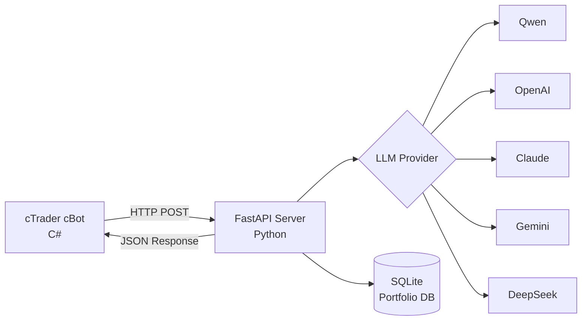

# 🤖 AgentFxTrading - AI驱动的自动交易系统

<div align="center">

**使用TMS + ORB策略的自动外汇交易**

[](https://opensource.org/licenses/MIT)
[](https://www.python.org/downloads/)
[](https://ctdn.com/)
[](https://github.com/yourusername/AgentFxTrading/stargazers)
[](https://github.com/yourusername/AgentFxTrading/network/members)
[](https://github.com/yourusername/AgentFxTrading/issues)

[🇬🇧 English](README.md) | [🇻🇳 Tiếng Việt](README.vi.md) | [🇨🇳 中文](README.zh.md) | [🇵🇹 Português](README.pt.md) | [🇯🇵 日本語](README.ja.md) | [🇷🇺 Русский](README.ru.md)

[安装](#-快速开始) • [功能](#-功能特性) • [策略](#-交易策略) • [API文档](#-api文档) • [贡献](#-贡献)

</div>

---

## 📋 目录

- [概述](#-概述)
- [功能特性](#-功能特性)
- [架构](#-架构)
- [快速开始](#-快速开始)
- [交易策略](#-交易策略)
- [配置](#-配置)
- [API文档](#-api文档)
- [开发](#-开发)
- [性能](#-性能)
- [贡献](#-贡献)
- [许可证](#-许可证)

---

## 🎯 概述

AgentFxTrading是一个**自动外汇交易系统**，结合AI的力量与经过验证的技术分析策略。它使用**TMS（趋势动量信号）**进行趋势检测，使用**ORB（开盘区间突破）**进行精确的入场时机。

### 为什么选择AgentFxTrading？

✅ **完全自主** - AI 24/7做出交易决策  
✅ **多LLM支持** - 支持Qwen、OpenAI、Claude、Gemini、DeepSeek  
✅ **风险管理** - 跨多个交易对的投资组合级风险控制  
✅ **经验证的策略** - 基于专业TMS方法论  
✅ **易于设置** - 10分钟内开始  
✅ **开源** - 完全透明且可定制  

---

## 🚀 功能特性

### 🤖 AI驱动的决策
- **多LLM支持**：Qwen、OpenAI GPT-4、Claude、Gemini、DeepSeek
- **上下文感知分析**：分析3根K线的历史数据
- **置信度评分**：仅在置信度>70%时交易
- **自适应学习**：提示工程持续改进

### 📊 高级技术分析
- **TMS指标**：Heiken Ashi、TDI（RSI + Signal）、Stochastic
- **ORB逻辑**：开盘区间检测与决定性突破过滤
- **动量追踪**：TF Green状态与斜率分析
- **市场状态识别 (Market Regime)**：Kaufman效率比率 (`er_session`, `er_recent`) 与假突破计数器 (`or_flips`)，分类 `trending`, `choppy`, `mixed`, `forming`
- **多时间框架**：适用于M15、H1、H4时间框架

### 💼 投资组合管理
- **多品种交易**：在不同交易对上运行多个机器人
- **货币敞口控制**：防止对单一货币过度敞口
- **相关性检测**：阻止高度相关的头寸
- **每日亏损限制**：达到最大亏损后自动停止交易

### 🛡️ 风险管理
- **头寸记忆**：追踪MFE（最大有利偏移）
- **自动保本**：利润达到阈值后将SL移至入场价
- **追踪止损**：在盈利交易中动态调整SL
- **最大回撤保护**：如果回撤超过阈值则关闭头寸
- **连亏保护**：连续3次亏损后阻止入场
- **周期门控 (Cost Gate)**：在时段外、开盘区间内或连亏时自动跳过LLM调用——节省80-90%的API费用
- **趋势取消固定止盈 (Trend TP Disabled)**：在强趋势 (`trending`) 状态下自动移除固定TP，配合追踪止损与回撤底线充分捕获单边行情
- **每日轮转日志**：将所有Agent推理、周期门控操作及市场快照持久化至 `logs/agent_YYYY-MM-DD.log`（保留14天）

### ⏰ 交易时段管理
- **交易时段**：可配置的时段时间（伦敦、纽约、东京）
- **日终自动平仓**：时段结束时自动平仓
- **阶段检测**：盘前、活跃、结束、关闭阶段

---

## 🏗️ 架构



---

## ⚡ 快速开始

### 前提条件

- Python 3.9+
- cTrader 4.x+
- LLM API密钥（Qwen/OpenAI/Claude/Gemini/DeepSeek）

### 1. 安装Python依赖

```bash
# 克隆仓库
git clone https://github.com/yourusername/AgentFxTrading.git
cd AgentFxTrading

# 安装依赖
pip install -r requirements.txt
```

### 2. 配置LLM Provider

```bash
# 复制环境模板
cp .env.example .env

# 编辑.env，填入您的API密钥
# Qwen示例（推荐）：
LLM_PROVIDER=qwen
DASHSCOPE_API_KEY=sk-your-dashscope-key
LLM_MODEL=qwen-max
```

### 3. 启动服务器

```bash
python app/server.py
```

服务器将在`http://127.0.0.1:8000`运行

### 4. 设置与运行 cBot

您可以通过 **cTrader 桌面 GUI** 或 **无头 Docker CLI**（`ctrader-console`）运行 cBot。

#### 选项 A：cTrader 桌面 GUI

1. 打开 **cTrader** → **Automate**
2. 点击 **New** → **cBot**
3. 粘贴 `cBot/AiAgentBot.cs` 中的代码
4. 点击 **Build**
5. 附加到图表（推荐 M15 或 H1）
6. 配置参数：
   - **Bot ID**：`xauusd_m15`（唯一标识符）
   - **API URL**：`http://127.0.0.1:8000/trade`
   - **Session**：New York（13:00-21:00 UTC）/ London（8:00-17:00 UTC）/ Tokyo（0:00-9:00 UTC）

#### 选项 B：无头 Docker CLI（`ctrader-console`）

1. **准备 cTID 凭证文件**:
   ```bash
   mkdir -p /root/ctrader_data
   echo "your_ctid_password" > /root/ctrader_data/ctid_pwd
   chmod 600 /root/ctrader_data/ctid_pwd
   ```

2. **构建/编译 `.algo` 算法包**:
   ```bash
   docker run --rm -v $(pwd):/workspace -v /root:/root \
     ghcr.io/spotware/ctrader-console:latest create cbot AiAgentBot
   cp cBot/AiAgentBot.cs /root/cAlgo/Sources/Robots/AiAgentBot/AiAgentBot/AiAgentBot.cs
   docker run --rm -v $(pwd):/workspace -v /root:/root \
     ghcr.io/spotware/ctrader-console:latest build /root/cAlgo/Sources/Robots/AiAgentBot/AiAgentBot/AiAgentBot.csproj
   cp /root/cAlgo/Sources/Robots/AiAgentBot.algo cBot/AiAgentBot.algo
   ```

3. **运行多品种 Docker 容器**:

   * **XAUUSD (M15 - 纽约时段)**:
     ```bash
     docker run -d \
       --name cbot-xauusd \
       --restart unless-stopped \
       --network host \
       -v $(pwd):/workspace \
       -v /root:/root \
       ghcr.io/spotware/ctrader-console:latest \
       run /workspace/cBot/AiAgentBot.algo \
       --ctid=your_email@example.com \
       --pwd-file=/root/ctrader_data/ctid_pwd \
       --account=YOUR_ACCOUNT_ID \
       --symbol=XAUUSD \
       --period=m15 \
       --full-access \
       --BotId="xauusd_m15" \
       --ApiUrl="http://127.0.0.1:8000/trade" \
       --AccountLabel="demo" \
       --TmsTimeFrame="Hour" \
       --EmaPeriod=5 \
       --SessionName="newyork" \
       --OrbStartHour=13 \
       --SessionEndHour=21 \
       --SessionDstRule="US" \
       --MinDecisiveBreakoutPips=10.0 \
       --MinOrWidthPips=20.0 \
       --OrbBufferPips=3.0 \
       --BreakevenTriggerPips=30.0 \
       --BreakevenOffsetPips=2.0 \
       --TrailTriggerPips=50.0 \
       --TrailDistancePips=25.0 \
       --PartialCloseRatio=0.5 \
       --MinSlPips=20.0 \
       --MaxSlPips=80.0 \
       --MinTpPips=30.0 \
       --MaxTpPips=250.0 \
       --MaxGivebackPips=30.0 \
       --EnablePostTpGate=true \
       --PostTpPullbackPips=10.0 \
       --BounceTradeEnabled=true \
       --BounceDistanceThreshold=10 \
       --RiskPerTradePercent=0.2 \
       --TrendTpDisabled=true
     ```

   * **EURUSD (M15 - 伦敦时段)**:
     ```bash
     docker run -d \
       --name cbot-eurusd \
       --restart unless-stopped \
       --network host \
       -v $(pwd):/workspace \
       -v /root:/root \
       ghcr.io/spotware/ctrader-console:latest \
       run /workspace/cBot/AiAgentBot.algo \
       --ctid=your_email@example.com \
       --pwd-file=/root/ctrader_data/ctid_pwd \
       --account=YOUR_ACCOUNT_ID \
       --symbol=EURUSD \
       --period=m15 \
       --full-access \
       --BotId="eurusd_m15" \
       --ApiUrl="http://127.0.0.1:8000/trade" \
       --AccountLabel="demo" \
       --TmsTimeFrame="Hour" \
       --EmaPeriod=5 \
       --SessionName="london" \
       --OrbStartHour=8 \
       --SessionEndHour=17 \
       --SessionDstRule="Europe" \
       --MinDecisiveBreakoutPips=3.0 \
       --MinOrWidthPips=6.0 \
       --OrbBufferPips=1.0 \
       --BreakevenTriggerPips=8.0 \
       --BreakevenOffsetPips=1.0 \
       --TrailTriggerPips=15.0 \
       --TrailDistancePips=8.0 \
       --PartialCloseRatio=0.5 \
       --MinSlPips=6.0 \
       --MaxSlPips=20.0 \
       --MinTpPips=10.0 \
       --MaxTpPips=50.0 \
       --MaxGivebackPips=8.0 \
       --EnablePostTpGate=true \
       --PostTpPullbackPips=3.0 \
       --BounceTradeEnabled=true \
       --BounceDistanceThreshold=5 \
       --RiskPerTradePercent=0.2 \
       --TrendTpDisabled=true
     ```

   * **GBPUSD (M15 - 伦敦时段)**:
     ```bash
     docker run -d \
       --name cbot-gbpusd \
       --restart unless-stopped \
       --network host \
       -v $(pwd):/workspace \
       -v /root:/root \
       ghcr.io/spotware/ctrader-console:latest \
       run /workspace/cBot/AiAgentBot.algo \
       --ctid=your_email@example.com \
       --pwd-file=/root/ctrader_data/ctid_pwd \
       --account=YOUR_ACCOUNT_ID \
       --symbol=GBPUSD \
       --period=m15 \
       --full-access \
       --BotId="gbpusd_m15" \
       --ApiUrl="http://127.0.0.1:8000/trade" \
       --AccountLabel="demo" \
       --TmsTimeFrame="Hour" \
       --EmaPeriod=5 \
       --SessionName="london" \
       --OrbStartHour=8 \
       --SessionEndHour=17 \
       --SessionDstRule="Europe" \
       --MinDecisiveBreakoutPips=4.5 \
       --MinOrWidthPips=10.0 \
       --OrbBufferPips=1.5 \
       --BreakevenTriggerPips=12.0 \
       --BreakevenOffsetPips=1.5 \
       --TrailTriggerPips=20.0 \
       --TrailDistancePips=10.0 \
       --PartialCloseRatio=0.5 \
       --MinSlPips=8.0 \
       --MaxSlPips=25.0 \
       --MinTpPips=15.0 \
       --MaxTpPips=60.0 \
       --MaxGivebackPips=10.0 \
       --EnablePostTpGate=true \
       --PostTpPullbackPips=5.0 \
       --BounceTradeEnabled=true \
       --BounceDistanceThreshold=10 \
       --RiskPerTradePercent=0.2 \
       --TrendTpDisabled=true
     ```

   * **USDJPY (M15 - 东京时段)**:
     ```bash
     docker run -d \
       --name cbot-usdjpy \
       --restart unless-stopped \
       --network host \
       -v $(pwd):/workspace \
       -v /root:/root \
       ghcr.io/spotware/ctrader-console:latest \
       run /workspace/cBot/AiAgentBot.algo \
       --ctid=your_email@example.com \
       --pwd-file=/root/ctrader_data/ctid_pwd \
       --account=YOUR_ACCOUNT_ID \
       --symbol=USDJPY \
       --period=m15 \
       --full-access \
       --BotId="usdjpy_m15" \
       --ApiUrl="http://127.0.0.1:8000/trade" \
       --AccountLabel="demo" \
       --TmsTimeFrame="Hour" \
       --EmaPeriod=5 \
       --SessionName="tokyo" \
       --OrbStartHour=0 \
       --SessionEndHour=9 \
       --SessionDstRule="None" \
       --MinDecisiveBreakoutPips=4.0 \
       --MinOrWidthPips=8.0 \
       --OrbBufferPips=1.5 \
       --BreakevenTriggerPips=12.0 \
       --BreakevenOffsetPips=1.5 \
       --TrailTriggerPips=25.0 \
       --TrailDistancePips=12.0 \
       --PartialCloseRatio=0.5 \
       --MinSlPips=8.0 \
       --MaxSlPips=25.0 \
       --MinTpPips=15.0 \
       --MaxTpPips=70.0 \
       --MaxGivebackPips=12.0 \
       --EnablePostTpGate=true \
       --PostTpPullbackPips=4.0 \
       --BounceTradeEnabled=true \
       --BounceDistanceThreshold=3 \
       --RiskPerTradePercent=0.2 \
       --TrendTpDisabled=true
     ```

   * **US30 (M5 - 纽约指数时段)**:
     ```bash
     docker run -d \
       --name cbot-us30 \
       --restart unless-stopped \
       --network host \
       -v $(pwd):/workspace \
       -v /root:/root \
       ghcr.io/spotware/ctrader-console:latest \
       run /workspace/cBot/AiAgentBot.algo \
       --ctid=your_email@example.com \
       --pwd-file=/root/ctrader_data/ctid_pwd \
       --account=YOUR_ACCOUNT_ID \
       --symbol=US30 \
       --period=m5 \
       --full-access \
       --BotId="us30_m5" \
       --ApiUrl="http://127.0.0.1:8000/trade" \
       --AccountLabel="demo" \
       --TmsTimeFrame="Hour" \
       --EmaPeriod=5 \
       --SessionName="newyork_index" \
       --OrbStartHour=13 \
       --SessionEndHour=20 \
       --SessionDstRule="US" \
       --MinDecisiveBreakoutPips=15.0 \
       --MinOrWidthPips=30.0 \
       --OrbBufferPips=5.0 \
       --BreakevenTriggerPips=50.0 \
       --BreakevenOffsetPips=5.0 \
       --TrailTriggerPips=80.0 \
       --TrailDistancePips=40.0 \
       --PartialCloseRatio=0.5 \
       --MinSlPips=30.0 \
       --MaxSlPips=120.0 \
       --MinTpPips=50.0 \
       --MaxTpPips=400.0 \
       --MaxGivebackPips=50.0 \
       --EnablePostTpGate=true \
       --PostTpPullbackPips=20.0 \
       --BounceTradeEnabled=true \
       --BounceDistanceThreshold=10 \
       --RiskPerTradePercent=0.2 \
       --TrendTpDisabled=true
     ```

   * **NAS100 (M5 - 纽约指数时段)**:
     ```bash
     docker run -d \
       --name cbot-nas100 \
       --restart unless-stopped \
       --network host \
       -v $(pwd):/workspace \
       -v /root:/root \
       ghcr.io/spotware/ctrader-console:latest \
       run /workspace/cBot/AiAgentBot.algo \
       --ctid=your_email@example.com \
       --pwd-file=/root/ctrader_data/ctid_pwd \
       --account=YOUR_ACCOUNT_ID \
       --symbol=NAS100 \
       --period=m5 \
       --full-access \
       --BotId="nas100_m5" \
       --ApiUrl="http://127.0.0.1:8000/trade" \
       --AccountLabel="demo" \
       --TmsTimeFrame="Hour" \
       --EmaPeriod=5 \
       --SessionName="newyork_index" \
       --OrbStartHour=13 \
       --SessionEndHour=20 \
       --SessionDstRule="US" \
       --MinDecisiveBreakoutPips=15.0 \
       --MinOrWidthPips=35.0 \
       --OrbBufferPips=5.0 \
       --BreakevenTriggerPips=60.0 \
       --BreakevenOffsetPips=5.0 \
       --TrailTriggerPips=100.0 \
       --TrailDistancePips=50.0 \
       --PartialCloseRatio=0.5 \
       --MinSlPips=35.0 \
       --MaxSlPips=150.0 \
       --MinTpPips=60.0 \
       --MaxTpPips=500.0 \
       --MaxGivebackPips=60.0 \
       --EnablePostTpGate=true \
       --PostTpPullbackPips=25.0 \
       --BounceTradeEnabled=true \
       --BounceDistanceThreshold=10 \
       --RiskPerTradePercent=0.2 \
       --TrendTpDisabled=true
     ```
### 5. 开始交易！🎉

机器人将自动：
- 每根K线收盘时计算指标
- 向AI服务器发送市场快照
- 接收交易决策
- 执行带风险管理的交易

---

## 📈 交易策略

### TMS（趋势动量信号）

TMS使用三个确认来识别**方向偏向**：

| 指标 | 看涨信号 | 看跌信号 |
|------|---------|---------|
| **TDI** | Green > Red | Green < Red |
| **Heiken Ashi** | 绿色K线 | 红色K线 |
| **Stochastic** | K > D | K < D |

**核心概念**：偏向被锁定直到下一次交叉，防止反复震荡。

### ORB（开盘区间突破）

ORB提供**精确的入场时机**：

1. **开盘区间**：时段开始15分钟的High/Low
2. **突破**：价格收于OR边界之外
3. **决定性过滤**：突破必须具备决定性（≥ MinDecisiveBreakoutPips，XAUUSD默认10.0 pips）

### 市场状态识别 (Market Regime)

系统计算实时资金效率指标以动态调整交易与出场行为：
- **`er_session` 与 `er_recent`**：Kaufman效率比率 ($ER = \frac{|\text{净位移}|}{\sum |\text{K线波动}|}$)。$1.0$ 代表单边强趋势，$\approx 0.0$ 代表无序震荡。
- **`or_flips`**：记录价格假突破开盘区间后又收回区间的次数（代表震荡陷阱）。
- **四种市场状态**：
  - **`trending`** ($ER \ge 0.35$)：自动取消固定TP (`TrendTpDisabled = true`)，依托追踪止损与回撤底线充分捕获大波段利润。
  - **`choppy`** (`or_flips \ge 5`)：假突破陷阱频发 → 周期门控 (Cycle Gate) 强制选择 `HOLD`。
  - **`mixed`**：标准交易纪律 ($R:R \ge 1.5$)。
  - **`forming`**：开盘初期区间形成阶段 ($< 6$ 根K线)。

### 实战量化特殊规则 (Edge-Case Rules)
- **BIAS-FRESH 新偏向例外**：当TDI交叉刚刚发生（$\le 1$ 根K线前），早期的突破冲力被视为**新趋势浪的起点**而非追高 → 优先顺势入场。
- **ANTI-CHASE 防追高规则**：当价格已在旧偏向中突破 $\ge 4$ 根K线且未出现回调时，**严禁在极值位追单** → 保持 `HOLD` 等待回调。
- **头寸记忆与回撤底线 (Position Memory & Giveback Floor)**：逐Tick追踪最高浮盈 ($MFE$)。一旦盈利从最高点回撤超过阈值，系统自动平仓锁定战果。

### 入场规则

```
IF TMS看涨 AND ORB向上突破 AND 决定性:
    → BUY
    
IF TMS看跌 AND ORB向下突破 AND 决定性:
    → SELL
    
ELSE:
    → HOLD
```

### 出场规则

| 条件 | 动作 |
|------|------|
| TDI Green走平/钩子/对号 | CLOSE_ALL |
| 偏向反转 | 自动平仓 |
| 时段结束（EOD） | 自动全平（EOD Force-Flatten安全网） |
| 利润≥30p | 移动SL至保本（+2p锁利） |
| 利润≥50p | 追踪SL 25p |
| 回撤≥30p | 自动平仓（最大回撤保护） |

---

## ⚙️ 配置

### cBot参数

#### TMS设置（多时间框架）
| 参数 | 默认值 | 描述 |
|------|--------|------|
| TMS Timeframe (Macro) | Hour (H1) | 宏观趋势偏向时间框架（H1, H4, M15等） |
| RSI Period | 6 | RSI计算周期 |
| Red Period | 6 | 信号线周期 |

#### Stochastic设置
| 参数 | 默认值 | 描述 |
|------|--------|------|
| %K Period | 6 | 快速随机指标 |
| %D Period | 6 | 慢速随机指标 |
| Slowing | 4 | 平滑因子 |

#### 入场过滤
| 参数 | 默认值 | 描述 |
|------|--------|------|
| Max Bars After Cross | 5 | 入场窗口 |
| Min Angle Delta | 0.0 | 角度过滤（0=关闭） |
| Min Decisive Breakout | 10.0 pips | 突破强度（针对XAUUSD默认优化） |

#### 出场管理
| 参数 | 默认值 | 描述 |
|------|--------|------|
| Flat Threshold | 0.01 | TDI平坦度 |
| Breakeven Trigger | 30.0 pips | 移动SL的利润 |
| Breakeven Offset | 2.0 pips | 保本锁利距离 |
| Trail Trigger | 50.0 pips | 开始追踪的利润 |
| Trail Distance | 25.0 pips | SL与价格的距离 |

#### 时段
| 参数 | 默认值 | 描述 |
|------|--------|------|
| Session Start Hour | 13 (UTC) | 纽约开盘（冬令时UTC） |
| Session End Hour | 21 (UTC) | 纽约收盘（EOD强制平仓） |
| Opening Range | 15 min | OR计算窗口 |
| Min OR Width | 20.0 pips | 最小OR宽度 |
| ORB Buffer | 3.0 pips | 假突破缓冲 |
| DST Rule | US | 自动夏令时调整 |

#### 防护栏
| 参数 | 默认值 | 描述 |
|------|--------|------|
| Min SL | 20.0 pips | 最小止损 |
| Max SL | 80.0 pips | 最大止损 |
| Min TP | 30.0 pips | 最小止盈 |
| Max TP | 250.0 pips | 最大止盈 |
| Max Giveback | 30.0 pips | 利润回撤强制平仓阈值 |
| Max Loss Streak | 3 | N次亏损后阻止 |
| Bias Flip Exit | true | 偏向变化时自动平仓 |
| Trend TP Disabled | true | 强趋势行情下自动取消固定TP |

### 📊 推荐交易品种预设参数

| 参数 | XAUUSD (黄金) | EURUSD | GBPUSD | USDJPY |
| :--- | :--- | :--- | :--- | :--- |
| **交易时段** | 纽约时段 (`13:00 - 21:00 UTC`) | 伦敦时段 (`08:00 - 17:00 UTC`) | 伦敦时段 (`08:00 - 17:00 UTC`) | 东京 / 纽约 (`00:00 - 09:00` / `13:00 - 21:00 UTC`) |
| **夏令时规则 (DST)** | `US` | `Europe` | `Europe` | `None` (东京) / `US` (纽约) |
| **Min Decisive Breakout** | `10.0 pips` | `3.0 pips` | `4.5 pips` | `4.0 pips` |
| **Min OR Width** | `20.0 pips` | `6.0 pips` | `10.0 pips` | `8.0 pips` |
| **ORB Buffer** | `3.0 pips` | `1.0 pips` | `1.5 pips` | `1.5 pips` |
| **Breakeven Trigger** | `30.0 pips` | `8.0 pips` | `12.0 pips` | `12.0 pips` |
| **Breakeven Offset** | `2.0 pips` | `1.0 pips` | `1.5 pips` | `1.5 pips` |
| **Trail Trigger** | `50.0 pips` | `15.0 pips` | `25.0 pips` | `25.0 pips` |
| **Trail Distance** | `25.0 pips` | `8.0 pips` | `12.0 pips` | `12.0 pips` |
| **Min SL / Max SL** | `20.0 / 80.0 pips` | `6.0 / 20.0 pips` | `8.0 / 30.0 pips` | `8.0 / 25.0 pips` |
| **Min TP / Max TP** | `30.0 / 250.0 pips` | `10.0 / 50.0 pips` | `15.0 / 80.0 pips` | `15.0 / 70.0 pips` |
| **Max Giveback** | `30.0 pips` | `8.0 pips` | `12.0 pips` | `12.0 pips` |
| **EMA Period** | `5` | `5` | `5` | `5` |
| **Post-TP Gate / Pullback** | `true` (`10.0 pips`) | `true` (`3.0 pips`) | `true` (`5.0 pips`) | `true` (`4.0 pips`) |
| **TDI Bounce Trade** | `true` (`1.5`) | `true` (`1.5`) | `true` (`1.5`) | `true` (`1.5`) |
| **Partial Close at BE** | `0.5 (50%)` | `0.5 (50%)` | `0.5 (50%)` | `0.5 (50%)` |
| **Risk per Trade** | `0.2%` | `0.2%` | `0.2%` | `0.2%` |
| **推荐时间框架** | `M5` 或 `M15` | `M15` | `M15` | `M15` |
### 投资组合管理器设置

编辑`app/portfolio.py`：

```python
class PortfolioConfig:
    MAX_POSITIONS = 4              # 最大开仓数量
    MAX_CURRENCY_EXPOSURE = 2      # 每货币最大头寸
    MAX_CORRELATED_POSITIONS = 2   # 最大相关头寸
    MAX_DAILY_LOSS = -200.0        # 每日亏损限制（USD）
    MAX_MARGIN_USAGE_PCT = 50.0    # 最大保证金使用
```

---

## 📡 API文档

### POST /trade

交易决策的主要端点。

**请求**（来自cBot）：
```json
{
  "bot_id": "eurusd_bot",
  "symbol": "EURUSD",
  "timeframe": "M15",
  "tms": {
    "bias": "BULLISH",
    "long_entry": true,
    "green_tf_value": 55.2,
    "green_tf_slope": 0.4
  },
  "orb": {
    "breakout_direction": "up",
    "breakout_distance_pips": 5.0,
    "is_decisive": true
  },
  "position": null,
  "session": {
    "phase": "active",
    "minutes_to_end": 180
  }
}
```

**响应**（来自AI）：
```json
{
  "action": "BUY",
  "volume_lots": 0.01,
  "sl_pips": 10.0,
  "tp_pips": 20.0,
  "reason": "TMS看涨偏向确认，ORB决定性向上突破（+5.0p），动量上升"
}
```

### POST /portfolio/report

报告头寸变化以进行投资组合追踪。

### GET /portfolio/status

获取当前投资组合状态。

```bash
curl http://127.0.0.1:8000/portfolio/status
```

---

## 🛠️ 开发

### 项目结构

```
AgentFxTrading/
├── app/
│   ├── llm_client.py      # LLM抽象层
│   ├── server.py          # FastAPI服务器
│   └── portfolio.py       # 投资组合风险管理
├── cBot/
│   └── AiAgentBot.cs      # cTrader cBot
├── .env.example           # 环境模板
├── requirements.txt       # Python依赖
├── README.md              # 文档（6种语言）
└── portfolio.db           # SQLite数据库（自动创建）
```

### 添加新的LLM Provider

1. 在`app/llm_client.py`中创建新类
2. 更新`create_llm_client()`

### 改进提示

编辑`app/server.py`中的`SYSTEM_PROMPT`以调整交易逻辑。

---

## 📊 性能

### 回测结果

> ⚠️ **免责声明**：过去的表现不能保证未来的结果。始终先用模拟账户测试。

| 指标 | 值 |
|------|-----|
| 胜率 | ~55-65% |
| 风险/回报 | 平均1:2 |
| 最大回撤 | ~15% |
| 夏普比率 | ~1.2 |

### 实盘交易提示

1. **从模拟开始**：始终先测试策略
2. **小头寸规模**：从0.01手开始
3. **每日监控**：定期检查投资组合状态
4. **调整参数**：根据市场情况进行调整
5. **风险管理**：每笔交易风险不超过2%

---

## 🤝 贡献

欢迎贡献！以下是您可以帮助的方式：

### 贡献方式

1. **Star仓库** ⭐ - 表示支持
2. **报告bug** 🐛 - 开启issue
3. **建议功能** 💡 - 开启feature request
4. **提交PR** 🔧 - 代码贡献
5. **改进文档** 📚 - 文档改进
6. **分享结果** 📈 - 分享您的回测/实盘结果

### 社区

- 💬 [讨论](https://github.com/yourusername/AgentFxTrading/discussions)
- 🐛 [问题](https://github.com/yourusername/AgentFxTrading/issues)
- 📧 邮箱：your-email@example.com

---

## 📄 许可证

本项目根据MIT许可证授权 - 详情请参见[LICENSE](LICENSE)文件。

---

## 🙏 致谢

- **TMS策略**：基于专业TMS方法论
- **cTrader**：提供优秀的API
- **开源社区**：提供出色的库和工具

---

## 📈 Star历史

[](https://star-history.com/#yourusername/AgentFxTrading&Date)

---

<div align="center">

**如果您觉得这个项目有用，请考虑给它一个⭐！**

[⬆ 返回顶部](#-agentfxtrading---ai驱动的自动交易系统)

</div>
