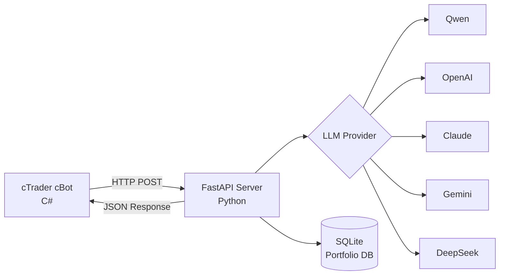

# 🤖 AgentFxTrading - AI驱动的自动交易系统

<div align="center">

**使用TMS + ORB策略的自动外汇交易**

[](https://opensource.org/licenses/MIT)
[](https://www.python.org/downloads/)
[](https://ctdn.com/)
[](https://github.com/yourusername/AgentFxTrading/stargazers)
[](https://github.com/yourusername/AgentFxTrading/network/members)
[](https://github.com/yourusername/AgentFxTrading/issues)
[](https://buymeacoffee.com/kaz126)

[🇬🇧 English](README.md) | [🇻🇳 Tiếng Việt](README.vi.md) | [🇨🇳 中文](README.zh.md) | [🇵🇹 Português](README.pt.md) | [🇯🇵 日本語](README.ja.md) | [🇷🇺 Русский](README.ru.md)

[安装](#-快速开始) • [功能](#-功能特性) • [策略](#-交易策略) • [API文档](#-api文档) • [支持与推荐经纪商](#-支持与推荐经纪商) • [贡献](#-贡献)

</div>

---

## 📋 目录

- [概述](#-概述)
- [功能特性](#-功能特性)
- [架构](#-架构)
- [快速开始](#-快速开始)
- [交易策略](#-交易策略)
- [配置](#-配置)
- [API文档](#-api文档)
- [开发](#-开发)
- [性能](#-性能)
- [支持与推荐经纪商](#-支持与推荐经纪商)
- [贡献](#-贡献)
- [许可证](#-许可证)

---

## 🎯 概述

AgentFxTrading是一个**自动外汇交易系统**，结合AI的力量与经过验证的技术分析策略。它使用**TMS（趋势动量信号）**进行趋势检测，使用**ORB（开盘区间突破）**进行精确的入场时机。

### 为什么选择AgentFxTrading？

✅ **完全自主** - AI 24/7做出交易决策  
✅ **多LLM支持** - 支持Qwen、OpenAI、Claude、Gemini、DeepSeek  
✅ **风险管理** - 跨多个交易对的投资组合级风险控制  
✅ **经验证的策略** - 基于专业TMS方法论  
✅ **易于设置** - 10分钟内开始  
✅ **开源** - 完全透明且可定制  

---

## 🚀 功能特性

### 🤖 双AI策略引擎架构
- **1. TMS + ORB 趋势突破引擎 (`AiAgentBot`)**: 结合趋势动量信号（Heikin Ashi + TDI + Stochastic）与开盘区间突破，支持动态Kaufman效率市场状态识别。
- **2. 亚洲时段流动性猎杀引擎 (`AsianRangeJudasSweepBot`)**: 基于ICT聪敏钱概念（SMC），在伦敦（07:00–10:00 UTC）及纽约重叠时段（12:30–16:00 UTC）猎杀亚洲时段高低点流动性，结合订单块 (Order Block) / 价值缺口 (FVG) 进行狙击反转。
- **多LLM大模型支持**：Qwen、OpenAI GPT-4o、Claude 3.5 Sonnet、Gemini 2.0 Flash、DeepSeek V3/R1。
- **多时间框架深度分析**：M15 + H1 + H4 多级别趋势对齐、摆动高低点结构与实时新闻过滤器。
### 💼 投资组合管理
- **多品种交易**：在不同交易对上运行多个机器人
- **货币敞口控制**：防止对单一货币过度敞口
- **相关性检测**：阻止高度相关的头寸
- **每日亏损限制**：达到最大亏损后自动停止交易

- **头寸记忆**：逐Tick追踪MFE（最大有利偏移）
- **自动保本**：利润达到 $\ge 0.8\times$ ATR 后自动将SL移至入场价（+0.1x ATR锁利）
- **追踪止损**：利润达到 $1.2\times$ ATR 时动态启动追踪止损（回撤距离 $0.7\times$ ATR）
- **利润锁定与回撤保护**：当利润回撤达到最高浮盈 (MFE) 的 $\ge 40\%$ 或 $\ge 0.6\times$ ATR 时强制平仓锁利
- **防超幅突破过滤 (Anti-Overextension Guard)**：严禁追入突破距离超过开盘区间 $2.5\times$ ATR 的极端耗竭走势
- **单笔亏损硬顶 (Max Dollar Risk Cap)**：针对最小手数波动过大的品种强制限制单笔最大金额亏损 ($12.00)
- **连亏保护**：连续3次亏损后阻止入场
- **周期门控 (Cost Gate)**：在时段外、开盘区间内、超幅耗竭或连亏时自动跳过LLM调用——节省80-90%的API费用
- **趋势取消固定止盈 (Trend TP Disabled)**：在强趋势 (`trending`) 状态下自动移除固定TP，配合追踪止损与回撤底线充分捕获单边行情
- **多资产动态精度控制 (Dynamic Precision)**：实时自动适配小数位（普通外汇5位，日元对3位，黄金/指数/加密2位），防止AI提示词中K线形态失真
- **真实ATR点数规范化 (True ATR Scaling)**：自动将各品种底层波动率数值换算为真实标准点数，确保LLM精确评估波动烈度
- **多资产智能周期门控**：精准识别加密货币分类 (`BTC`, `ETH`, `SOL`, `XRP`)，提供最高60,000点的真实突破容限
- **自适应亚洲区间过滤 (Adaptive Asian Range)**：品种专属亚洲区间边界（黄金 `[200p, 8000p]`，外汇 `[12p, 100p]`），并在无仓位且无假突破时静默抑制无用轮询
- **cBot风控遥测集成**：cBot内部风控拦截事件与警告实时通过 `/api/cbot_event` 回传至FastAPI服务端
### ⏰ 交易时段管理
- **交易时段**：可配置的时段时间（伦敦、纽约、东京）
- **日终自动平仓**：时段结束时自动平仓
- **阶段检测**：盘前、活跃、结束、关闭阶段

---

## 🏗️ 架构



---

## 📊 仪表板 (Dashboard)

通过现代化Web仪表板实时监控和管理自动化交易系统：
```
http://127.0.0.1:8000/dashboard
```

### 仪表板功能

- **实时更新**：基于WebSocket实时同步头寸与盈亏
- **投资组合概览**：活动头寸、当日P&L、胜率、连亏次数及账户资产净值
- **活动头寸表 (Active Positions)**：直观区分策略类型（`Judas SMC` 紫色徽章 vs `TMS+ORB` 青色徽章）、cBot实例标识、交易品种、方向、手数、入场价与浮动盈亏
- **交易历史记录 (Recent Trades)**：已平仓订单详情及策略来源与净盈亏
- **每日P&L图表**：历史收益可视化柱状图
- **风控事件监视**：服务端与cBot端拦截原因透明呈现

### API接口

```
GET  /dashboard                # Web仪表板前端界面
GET  /api/dashboard/summary    # 投资组合KPI汇总数据 (JSON)
GET  /api/dashboard/positions  # 活动开仓头寸列表 (JSON)
GET  /api/dashboard/history    # 已平仓交易历史 (JSON)
GET  /api/dashboard/pnl-history # 每日P&L历史记录 (JSON)
GET  /api/dashboard/logs       # 系统实时日志流 (JSON)
POST /api/tick                 # cBot报价与净值遥测
POST /api/cbot_event           # cBot拦截事件与警告遥测
POST /portfolio/report         # 头寸开平仓状态汇报
WS   /ws/dashboard             # 实时WebSocket更新通道
```
---

## ⚡ 快速开始

### 前提条件

- Python 3.9+
- cTrader 4.x+（还没有账户？推荐注册 [IC Markets cTrader](https://ic.com/?camp=95400)，享Raw Spread原始点差与超低延迟）
- LLM API密钥（Qwen/OpenAI/Claude/Gemini/DeepSeek）

### 1. 安装Python依赖

```bash
# 克隆仓库
git clone https://github.com/yourusername/AgentFxTrading.git
cd AgentFxTrading

# 安装依赖
pip install -r requirements.txt
```

### 2. 配置LLM Provider

```bash
# 复制环境模板
cp .env.example .env

# 编辑.env，填入您的API密钥
# Qwen示例（推荐）：
LLM_PROVIDER=qwen
DASHSCOPE_API_KEY=sk-your-dashscope-key
LLM_MODEL=qwen-max
```

### 3. 启动服务器

```bash
python app/server.py
```

服务器将在`http://127.0.0.1:8000`运行

### 4. 设置与运行 cBot

您可以通过 **cTrader 桌面 GUI** 或 **无头 Docker CLI**（`ctrader-console`）运行 cBot。

#### 选项 A：cTrader 桌面 GUI

1. 打开 **cTrader** → **Automate**
2. 点击 **New** → **cBot**
3. 粘贴 `cBot/AiAgentBot.cs` 中的代码
4. 点击 **Build**
5. 附加到图表（推荐 M15 或 H1）
6. 配置参数：
   - **Bot ID**：`xauusd_m15`（唯一标识符）
   - **API URL**：`http://127.0.0.1:8000/trade`
   - **Session**：New York（13:00-21:00 UTC）/ London（8:00-17:00 UTC）/ Tokyo（0:00-9:00 UTC）

#### 选项 B：无头 Docker CLI（`ctrader-console`）

1. **准备 cTID 凭证文件**:
   ```bash
   mkdir -p /root/ctrader_data
   echo "your_ctid_password" > /root/ctrader_data/ctid_pwd
   chmod 600 /root/ctrader_data/ctid_pwd
   ```

2. **构建/编译 `.algo` 算法包**:
   ```bash
   # 1. 编译 TMS+ORB 机器人 (AiAgentBot)
   docker run --rm -v $(pwd):/workspace -v /root:/root \
     ghcr.io/spotware/ctrader-console:latest create cbot AiAgentBot
   cp cBot/AiAgentBot.cs /root/cAlgo/Sources/Robots/AiAgentBot/AiAgentBot/AiAgentBot.cs
   docker run --rm -v $(pwd):/workspace -v /root:/root \
     ghcr.io/spotware/ctrader-console:latest build /root/cAlgo/Sources/Robots/AiAgentBot/AiAgentBot/AiAgentBot.csproj
   cp /root/cAlgo/Sources/Robots/AiAgentBot.algo cBot/AiAgentBot.algo

   # 2. 编译 Asian Range Judas Sweep 机器人 (AsianRangeJudasSweepBot)
   docker run --rm -v $(pwd):/workspace -v /root:/root \
     ghcr.io/spotware/ctrader-console:latest create cbot AsianRangeJudasSweepBot
   cp cBot/AsianRangeJudasSweepBot.cs /root/cAlgo/Sources/Robots/AsianRangeJudasSweepBot/AsianRangeJudasSweepBot/AsianRangeJudasSweepBot.cs
   docker run --rm -v $(pwd):/workspace -v /root:/root \
     ghcr.io/spotware/ctrader-console:latest build /root/cAlgo/Sources/Robots/AsianRangeJudasSweepBot/AsianRangeJudasSweepBot/AsianRangeJudasSweepBot.csproj
   cp /root/cAlgo/Sources/Robots/AsianRangeJudasSweepBot.algo cBot/AsianRangeJudasSweepBot.algo
   ```
3. **运行多品种 Docker 容器**:

   * **XAUUSD 亚洲流动性猎杀 (M15 - ICT Judas Sweep)**:
     ```bash
     docker run -d \
       --name cbot-xauusd-judas \
       --restart unless-stopped \
       --network host \
       -v $(pwd):/workspace \
       -v /root:/root \
       ghcr.io/spotware/ctrader-console:latest \
       run /workspace/cBot/AsianRangeJudasSweepBot.algo \
       --ctid=your_email@example.com \
       --pwd-file=/root/ctrader_data/ctid_pwd \
       --account=YOUR_ACCOUNT_ID \
       --symbol=XAUUSD \
       --period=m15 \
       --full-access \
       --BotId="cbot-xauusd-judas" \
       --label="cbot-xauusd-judas" \
       --DashboardServerUrl="http://127.0.0.1:8000" \
       --ApiUrl="http://127.0.0.1:8000/trade" \
       --AccountLabel="demo" \
       --UseDirectAiApi=false \
       --UseAiGateMode=true \
       --minAsianRangePips=200.0 \
       --maxAsianRangePips=8000.0 \
       --sweepBufferPips=30.0 \
       --AiSlMinFloorPips=200.0 \
       --breakEvenTrigger=250.0 \
       --stoplossPip=200.0 \
       --takeprofitPip=450.0 \
       --enableBreakEvenPrice=true

   * **GBPUSD 亚洲流动性猎杀 (M15 - ICT Judas Sweep)**:
     ```bash
     docker run -d \
       --name cbot-gbpusd-judas \
       --restart unless-stopped \
       --network host \
       -v $(pwd):/workspace \
       -v /root:/root \
       ghcr.io/spotware/ctrader-console:latest \
       run /workspace/cBot/AsianRangeJudasSweepBot.algo \
       --ctid=your_email@example.com \
       --pwd-file=/root/ctrader_data/ctid_pwd \
       --account=YOUR_ACCOUNT_ID \
       --symbol=GBPUSD \
       --period=m15 \
       --full-access \
       --BotId="cbot-gbpusd-judas" \
       --label="cbot-gbpusd-judas" \
       --DashboardServerUrl="http://127.0.0.1:8000" \
       --ApiUrl="http://127.0.0.1:8000/trade" \
       --AccountLabel="demo" \
       --UseDirectAiApi=false \
       --UseAiGateMode=true \
       --minAsianRangePips=15.0 \
       --maxAsianRangePips=45.0 \
       --sweepBufferPips=3.5 \
       --AiSlMinFloorPips=15.0 \
       --breakEvenTrigger=20.0 \
       --stoplossPip=15.0 \
       --takeprofitPip=35.0 \
       --enableBreakEvenPrice=true
     ```

   * **EURUSD 亚洲流动性猎杀 (M15 - ICT Judas Sweep)**:
     ```bash
     docker run -d \
       --name cbot-eurusd-judas \
       --restart unless-stopped \
       --network host \
       -v $(pwd):/workspace \
       -v /root:/root \
       ghcr.io/spotware/ctrader-console:latest \
       run /workspace/cBot/AsianRangeJudasSweepBot.algo \
       --ctid=your_email@example.com \
       --pwd-file=/root/ctrader_data/ctid_pwd \
       --account=YOUR_ACCOUNT_ID \
       --symbol=EURUSD \
       --period=m15 \
       --full-access \
       --BotId="cbot-eurusd-judas" \
       --label="cbot-eurusd-judas" \
       --DashboardServerUrl="http://127.0.0.1:8000" \
       --ApiUrl="http://127.0.0.1:8000/trade" \
       --AccountLabel="demo" \
       --UseDirectAiApi=false \
       --UseAiGateMode=true \
       --minAsianRangePips=15.0 \
       --maxAsianRangePips=45.0 \
       --sweepBufferPips=3.5 \
       --AiSlMinFloorPips=15.0 \
       --breakEvenTrigger=20.0 \
       --stoplossPip=15.0 \
       --takeprofitPip=35.0 \
       --enableBreakEvenPrice=true
     ```

   * **GBPJPY 亚洲流动性猎杀 (M15 - ICT Judas Sweep)**:
     ```bash
     docker run -d \
       --name cbot-gbpjpy-judas \
       --restart unless-stopped \
       --network host \
       -v $(pwd):/workspace \
       -v /root:/root \
       ghcr.io/spotware/ctrader-console:latest \
       run /workspace/cBot/AsianRangeJudasSweepBot.algo \
       --ctid=your_email@example.com \
       --pwd-file=/root/ctrader_data/ctid_pwd \
       --account=YOUR_ACCOUNT_ID \
       --symbol=GBPJPY \
       --period=m15 \
       --full-access \
       --BotId="cbot-gbpjpy-judas" \
       --label="cbot-gbpjpy-judas" \
       --DashboardServerUrl="http://127.0.0.1:8000" \
       --ApiUrl="http://127.0.0.1:8000/trade" \
       --AccountLabel="demo" \
       --UseDirectAiApi=false \
       --UseAiGateMode=true \
       --minAsianRangePips=25.0 \
       --maxAsianRangePips=70.0 \
       --sweepBufferPips=5.0 \
       --AiSlMinFloorPips=25.0 \
       --breakEvenTrigger=30.0 \
       --stoplossPip=25.0 \
       --takeprofitPip=50.0 \
       --enableBreakEvenPrice=true
     ```

   * **EURJPY 亚洲流动性猎杀 (M15 - ICT Judas Sweep)**:
     ```bash
     docker run -d \
       --name cbot-eurjpy-judas \
       --restart unless-stopped \
       --network host \
       -v $(pwd):/workspace \
       -v /root:/root \
       ghcr.io/spotware/ctrader-console:latest \
       run /workspace/cBot/AsianRangeJudasSweepBot.algo \
       --ctid=your_email@example.com \
       --pwd-file=/root/ctrader_data/ctid_pwd \
       --account=YOUR_ACCOUNT_ID \
       --symbol=EURJPY \
       --period=m15 \
       --full-access \
       --BotId="cbot-eurjpy-judas" \
       --label="cbot-eurjpy-judas" \
       --DashboardServerUrl="http://127.0.0.1:8000" \
       --ApiUrl="http://127.0.0.1:8000/trade" \
       --AccountLabel="demo" \
       --UseDirectAiApi=false \
       --UseAiGateMode=true \
       --minAsianRangePips=25.0 \
       --maxAsianRangePips=70.0 \
       --sweepBufferPips=5.0 \
       --AiSlMinFloorPips=25.0 \
       --breakEvenTrigger=30.0 \
       --stoplossPip=25.0 \
       --takeprofitPip=50.0 \
       --enableBreakEvenPrice=true
     ```

   * **BTCUSD 亚洲流动性猎杀 (M15 - ICT Judas Sweep)**:
     ```bash
     docker run -d \
       --name cbot-btcusd-judas \
       --restart unless-stopped \
       --network host \
       -v $(pwd):/workspace \
       -v /root:/root \
       ghcr.io/spotware/ctrader-console:latest \
       run /workspace/cBot/AsianRangeJudasSweepBot.algo \
       --ctid=your_email@example.com \
       --pwd-file=/root/ctrader_data/ctid_pwd \
       --account=YOUR_ACCOUNT_ID \
       --symbol=BTCUSD \
       --period=m15 \
       --full-access \
       --BotId="cbot-btcusd-judas" \
       --label="cbot-btcusd-judas" \
       --DashboardServerUrl="http://127.0.0.1:8000" \
       --ApiUrl="http://127.0.0.1:8000/trade" \
       --AccountLabel="demo" \
       --UseDirectAiApi=false \
       --UseAiGateMode=true \
       --minAsianRangePips=10000.0 \
       --maxAsianRangePips=400000.0 \
       --sweepBufferPips=1500.0 \
       --AiSlMinFloorPips=20000.0 \
       --breakEvenTrigger=25000.0 \
       --stoplossPip=25000.0 \
       --takeprofitPip=60000.0 \
       --enableBreakEvenPrice=true \
       --riskFactor=1.0
     ```

   * **ETHUSD 亚洲流动性猎杀 (M15 - ICT Judas Sweep)**:
     ```bash
     docker run -d \
       --name cbot-ethusd-judas \
       --restart unless-stopped \
       --network host \
       -v $(pwd):/workspace \
       -v /root:/root \
       ghcr.io/spotware/ctrader-console:latest \
       run /workspace/cBot/AsianRangeJudasSweepBot.algo \
       --ctid=your_email@example.com \
       --pwd-file=/root/ctrader_data/ctid_pwd \
       --account=YOUR_ACCOUNT_ID \
       --symbol=ETHUSD \
       --period=m15 \
       --full-access \
       --BotId="cbot-ethusd-judas" \
       --label="cbot-ethusd-judas" \
       --DashboardServerUrl="http://127.0.0.1:8000" \
       --ApiUrl="http://127.0.0.1:8000/trade" \
       --AccountLabel="demo" \
       --UseDirectAiApi=false \
       --UseAiGateMode=true \
       --minAsianRangePips=800.0 \
       --maxAsianRangePips=35000.0 \
       --sweepBufferPips=150.0 \
       --AiSlMinFloorPips=1500.0 \
       --breakEvenTrigger=2000.0 \
       --stoplossPip=2000.0 \
       --takeprofitPip=5000.0 \
       --enableBreakEvenPrice=true \
       --riskFactor=1.0
     ```

   * **XAUUSD TMS+ORB (M15 - 纽约时段)**:
     ```bash
     docker run -d \
       --name cbot-xauusd \
       --restart unless-stopped \
       --network host \
       -v $(pwd):/workspace \
       -v /root:/root \
       ghcr.io/spotware/ctrader-console:latest \
       run /workspace/cBot/AiAgentBot.algo \
       --ctid=your_email@example.com \
       --pwd-file=/root/ctrader_data/ctid_pwd \
       --account=YOUR_ACCOUNT_ID \
       --symbol=XAUUSD \
       --period=m15 \
       --full-access \
       --BotId="xauusd_m15" \
       --ApiUrl="http://127.0.0.1:8000/trade" \
       --AccountLabel="demo" \
       --SessionName="newyork" \
       --OrbStartHour=13 \
       --SessionEndHour=21 \
       --SessionDstRule="US" \
       --MinDecisiveBreakoutPips=200.0 \
       --MinOrWidthPips=400.0 \
       --OrbBufferPips=50.0 \
       --BreakevenTriggerAtr=1.2 \
       --BreakevenOffsetAtr=0.1 \
       --TrailTriggerAtr=2.0 \
       --TrailDistanceAtr=1.0 \
       --PartialCloseRatio=0.5 \
       --MinSlAtr=0.8 \
       --MaxSlAtr=3.0 \
       --MinTpAtr=1.0 \
       --MaxTpAtr=6.0 \
       --MaxGivebackAtr=1.0 \
       --EnablePostTpGate=true \
       --PostTpPullbackAtr=0.5 \
       --BounceTradeEnabled=true \
       --BounceDistanceThreshold=10 \
       --RiskPerTradePercent=0.2 \
       --TrendTpDisabled=true
     ```

   * **EURUSD (M15 - 伦敦时段)**:
     ```bash
     docker run -d \
       --name cbot-eurusd \
       --restart unless-stopped \
       --network host \
       -v $(pwd):/workspace \
       -v /root:/root \
       ghcr.io/spotware/ctrader-console:latest \
       run /workspace/cBot/AiAgentBot.algo \
       --ctid=your_email@example.com \
       --pwd-file=/root/ctrader_data/ctid_pwd \
       --account=YOUR_ACCOUNT_ID \
       --symbol=EURUSD \
       --period=m15 \
       --full-access \
       --BotId="eurusd_m15" \
       --ApiUrl="http://127.0.0.1:8000/trade" \
       --AccountLabel="demo" \
       --TmsTimeFrame="Hour" \
       --EmaPeriod=5 \
       --SessionName="london" \
       --OrbStartHour=8 \
       --SessionEndHour=17 \
       --SessionDstRule="Europe" \
       --MinDecisiveBreakoutPips=3.0 \
       --MinOrWidthPips=6.0 \
       --OrbBufferPips=1.0 \
       --BreakevenTriggerAtr=1.2 \
       --BreakevenOffsetAtr=0.1 \
       --TrailTriggerAtr=2.0 \
       --TrailDistanceAtr=1.0 \
       --PartialCloseRatio=0.5 \
       --MinSlAtr=0.8 \
       --MaxSlAtr=3.0 \
       --MinTpAtr=1.0 \
       --MaxTpAtr=6.0 \
       --MaxGivebackAtr=1.0 \
       --EnablePostTpGate=true \
       --PostTpPullbackAtr=0.5 \
       --BounceTradeEnabled=true \
       --BounceDistanceThreshold=5 \
       --RiskPerTradePercent=0.2 \
       --TrendTpDisabled=true
     ```

   * **GBPUSD (M15 - 伦敦时段)**:
     ```bash
     docker run -d \
       --name cbot-gbpusd \
       --restart unless-stopped \
       --network host \
       -v $(pwd):/workspace \
       -v /root:/root \
       ghcr.io/spotware/ctrader-console:latest \
       run /workspace/cBot/AiAgentBot.algo \
       --ctid=your_email@example.com \
       --pwd-file=/root/ctrader_data/ctid_pwd \
       --account=YOUR_ACCOUNT_ID \
       --symbol=GBPUSD \
       --period=m15 \
       --full-access \
       --BotId="gbpusd_m15" \
       --ApiUrl="http://127.0.0.1:8000/trade" \
       --AccountLabel="demo" \
       --TmsTimeFrame="Hour" \
       --EmaPeriod=5 \
       --SessionName="london" \
       --OrbStartHour=8 \
       --SessionEndHour=17 \
       --SessionDstRule="Europe" \
       --MinDecisiveBreakoutPips=4.5 \
       --MinOrWidthPips=10.0 \
       --OrbBufferPips=1.5 \
       --BreakevenTriggerAtr=1.2 \
       --BreakevenOffsetAtr=0.1 \
       --TrailTriggerAtr=2.0 \
       --TrailDistanceAtr=1.0 \
       --PartialCloseRatio=0.5 \
       --MinSlAtr=0.8 \
       --MaxSlAtr=3.0 \
       --MinTpAtr=1.0 \
       --MaxTpAtr=6.0 \
       --MaxGivebackAtr=1.0 \
       --EnablePostTpGate=true \
       --PostTpPullbackAtr=0.5 \
       --BounceTradeEnabled=true \
       --BounceDistanceThreshold=10 \
       --RiskPerTradePercent=0.2 \
       --TrendTpDisabled=true
     ```

   * **USDJPY (M15 - 东京时段)**:
     ```bash
     docker run -d \
       --name cbot-usdjpy \
       --restart unless-stopped \
       --network host \
       -v $(pwd):/workspace \
       -v /root:/root \
       ghcr.io/spotware/ctrader-console:latest \
       run /workspace/cBot/AiAgentBot.algo \
       --ctid=your_email@example.com \
       --pwd-file=/root/ctrader_data/ctid_pwd \
       --account=YOUR_ACCOUNT_ID \
       --symbol=USDJPY \
       --period=m15 \
       --full-access \
       --BotId="usdjpy_m15" \
       --ApiUrl="http://127.0.0.1:8000/trade" \
       --AccountLabel="demo" \
       --TmsTimeFrame="Hour" \
       --EmaPeriod=5 \
       --SessionName="tokyo" \
       --OrbStartHour=0 \
       --SessionEndHour=9 \
       --SessionDstRule="None" \
       --MinDecisiveBreakoutPips=4.0 \
       --MinOrWidthPips=8.0 \
       --OrbBufferPips=1.5 \
       --BreakevenTriggerAtr=1.2 \
       --BreakevenOffsetAtr=0.1 \
       --TrailTriggerAtr=2.0 \
       --TrailDistanceAtr=1.0 \
       --PartialCloseRatio=0.5 \
       --MinSlAtr=0.8 \
       --MaxSlAtr=3.0 \
       --MinTpAtr=1.0 \
       --MaxTpAtr=6.0 \
       --MaxGivebackAtr=1.0 \
       --EnablePostTpGate=true \
       --PostTpPullbackAtr=0.5 \
       --BounceTradeEnabled=true \
       --BounceDistanceThreshold=3 \
       --RiskPerTradePercent=0.2 \
       --TrendTpDisabled=true
     ```

   * **US30 (M15 - 纽约指数时段)**:
     ```bash
     docker run -d \
       --name cbot-us30 \
       --restart unless-stopped \
       --network host \
       -v $(pwd):/workspace \
       -v /root:/root \
       ghcr.io/spotware/ctrader-console:latest \
       run /workspace/cBot/AiAgentBot.algo \
       --ctid=your_email@example.com \
       --pwd-file=/root/ctrader_data/ctid_pwd \
       --account=YOUR_ACCOUNT_ID \
       --symbol=US30 \
       --period=m15 \
       --full-access \
       --BotId="us30_m15" \
       --ApiUrl="http://127.0.0.1:8000/trade" \
       --AccountLabel="demo" \
       --TmsTimeFrame="Hour" \
       --EmaPeriod=5 \
       --SessionName="newyork_index" \
       --OrbStartHour=13 \
       --SessionEndHour=20 \
       --SessionDstRule="US" \
       --MinDecisiveBreakoutPips=30.0 \
       --MinOrWidthPips=80.0 \
       --OrbBufferPips=15.0 \
       --BreakevenTriggerAtr=1.2 \
       --BreakevenOffsetAtr=0.1 \
       --TrailTriggerAtr=2.0 \
       --TrailDistanceAtr=1.0 \
       --PartialCloseRatio=0.5 \
       --MinSlAtr=0.8 \
       --MaxSlAtr=3.0 \
       --MinTpAtr=1.0 \
       --MaxTpAtr=6.0 \
       --MaxGivebackAtr=1.0 \
       --EnablePostTpGate=true \
       --PostTpPullbackAtr=0.5 \
       --BounceTradeEnabled=true \
       --BounceDistanceThreshold=30 \
       --RiskPerTradePercent=0.2 \
       --TrendTpDisabled=true
     ```

   * **USTEC / NAS100 (M5 - 纽约指数时段)** *(注意：根据平台代码使用 `USTEC` 或 `NAS100`)*:
     ```bash
     docker run -d \
       --name cbot-ustec \
       --restart unless-stopped \
       --network host \
       -v $(pwd):/workspace \
       -v /root:/root \
       ghcr.io/spotware/ctrader-console:latest \
       run /workspace/cBot/AiAgentBot.algo \
       --ctid=your_email@example.com \
       --pwd-file=/root/ctrader_data/ctid_pwd \
       --account=YOUR_ACCOUNT_ID \
       --symbol=USTEC \
       --period=m5 \
       --full-access \
       --BotId="ustec_m5" \
       --ApiUrl="http://127.0.0.1:8000/trade" \
       --AccountLabel="demo" \
       --TmsTimeFrame="Hour" \
       --EmaPeriod=5 \
       --SessionName="newyork_index" \
       --OrbStartHour=13 \
       --SessionEndHour=20 \
       --SessionDstRule="US" \
       --MinDecisiveBreakoutPips=25.0 \
       --MinOrWidthPips=70.0 \
       --OrbBufferPips=12.0 \
       --BreakevenTriggerAtr=1.2 \
       --BreakevenOffsetAtr=0.1 \
       --TrailTriggerAtr=2.0 \
       --TrailDistanceAtr=1.0 \
       --PartialCloseRatio=0.5 \
       --MinSlAtr=0.8 \
       --MaxSlAtr=3.0 \
       --MinTpAtr=1.0 \
       --MaxTpAtr=6.0 \
       --MaxGivebackAtr=1.0 \
       --EnablePostTpGate=true \
       --PostTpPullbackAtr=0.5 \
       --BounceTradeEnabled=true \
       --BounceDistanceThreshold=25 \
       --RiskPerTradePercent=0.2 \
       --TrendTpDisabled=true
     ```

   * **GBPJPY (M15 - 伦敦时段 / 高波动交叉盘)**:
     ```bash
     docker run -d \
       --name cbot-gbpjpy \
       --restart unless-stopped \
       --network host \
       -v $(pwd):/workspace \
       -v /root:/root \
       ghcr.io/spotware/ctrader-console:latest \
       run /workspace/cBot/AiAgentBot.algo \
       --ctid=your_email@example.com \
       --pwd-file=/root/ctrader_data/ctid_pwd \
       --account=YOUR_ACCOUNT_ID \
       --symbol=GBPJPY \
       --period=m15 \
       --full-access \
       --BotId="gbpjpy_m15" \
       --ApiUrl="http://127.0.0.1:8000/trade" \
       --AccountLabel="demo" \
       --TmsTimeFrame="Hour" \
       --EmaPeriod=5 \
       --SessionName="london" \
       --OrbStartHour=8 \
       --SessionEndHour=17 \
       --SessionDstRule="Europe" \
       --MinDecisiveBreakoutPips=6.0 \
       --MinOrWidthPips=15.0 \
       --OrbBufferPips=2.0 \
       --BreakevenTriggerAtr=1.2 \
       --BreakevenOffsetAtr=0.1 \
       --TrailTriggerAtr=2.0 \
       --TrailDistanceAtr=1.0 \
       --PartialCloseRatio=0.5 \
       --MinSlAtr=0.8 \
       --MaxSlAtr=3.0 \
       --MinTpAtr=1.0 \
       --MaxTpAtr=6.0 \
       --MaxGivebackAtr=1.0 \
       --EnablePostTpGate=true \
       --PostTpPullbackAtr=0.5 \
       --BounceTradeEnabled=true \
       --BounceDistanceThreshold=5 \
       --RiskPerTradePercent=0.2 \
       --TrendTpDisabled=true
     ```

   * **EURJPY (M15 - 伦敦时段 / 高波动交叉盘)**:
     ```bash
     docker run -d \
       --name cbot-eurjpy \
       --restart unless-stopped \
       --network host \
       -v $(pwd):/workspace \
       -v /root:/root \
       ghcr.io/spotware/ctrader-console:latest \
       run /workspace/cBot/AiAgentBot.algo \
       --ctid=your_email@example.com \
       --pwd-file=/root/ctrader_data/ctid_pwd \
       --account=YOUR_ACCOUNT_ID \
       --symbol=EURJPY \
       --period=m15 \
       --full-access \
       --BotId="eurjpy_m15" \
       --ApiUrl="http://127.0.0.1:8000/trade" \
       --AccountLabel="demo" \
       --TmsTimeFrame="Hour" \
       --EmaPeriod=5 \
       --SessionName="london" \
       --OrbStartHour=8 \
       --SessionEndHour=17 \
       --SessionDstRule="Europe" \
       --MinDecisiveBreakoutPips=5.0 \
       --MinOrWidthPips=12.0 \
       --OrbBufferPips=1.5 \
       --BreakevenTriggerAtr=1.2 \
       --BreakevenOffsetAtr=0.1 \
       --TrailTriggerAtr=2.0 \
       --TrailDistanceAtr=1.0 \
       --PartialCloseRatio=0.5 \
       --MinSlAtr=0.8 \
       --MaxSlAtr=3.0 \
       --MinTpAtr=1.0 \
       --MaxTpAtr=6.0 \
       --MaxGivebackAtr=1.0 \
       --EnablePostTpGate=true \
       --PostTpPullbackAtr=0.5 \
       --BounceTradeEnabled=true \
       --BounceDistanceThreshold=5 \
       --RiskPerTradePercent=0.2 \
       --TrendTpDisabled=true
     ```

   * **USDCAD (M15 - 纽约时段 / 商品货币)**:
     ```bash
     docker run -d \
       --name cbot-usdcad \
       --restart unless-stopped \
       --network host \
       -v $(pwd):/workspace \
       -v /root:/root \
       ghcr.io/spotware/ctrader-console:latest \
       run /workspace/cBot/AiAgentBot.algo \
       --ctid=your_email@example.com \
       --pwd-file=/root/ctrader_data/ctid_pwd \
       --account=YOUR_ACCOUNT_ID \
       --symbol=USDCAD \
       --period=m15 \
       --full-access \
       --BotId="usdcad_m15" \
       --ApiUrl="http://127.0.0.1:8000/trade" \
       --AccountLabel="demo" \
       --TmsTimeFrame="Hour" \
       --EmaPeriod=5 \
       --SessionName="newyork" \
       --OrbStartHour=13 \
       --SessionEndHour=21 \
       --SessionDstRule="US" \
       --MinDecisiveBreakoutPips=4.0 \
       --MinOrWidthPips=10.0 \
       --OrbBufferPips=1.5 \
       --BreakevenTriggerAtr=1.2 \
       --BreakevenOffsetAtr=0.1 \
       --TrailTriggerAtr=2.0 \
       --TrailDistanceAtr=1.0 \
       --PartialCloseRatio=0.5 \
       --MinSlAtr=0.8 \
       --MaxSlAtr=3.0 \
       --MinTpAtr=1.0 \
       --MaxTpAtr=6.0 \
       --MaxGivebackAtr=1.0 \
       --EnablePostTpGate=true \
       --PostTpPullbackAtr=0.5 \
       --BounceTradeEnabled=true \
       --BounceDistanceThreshold=4 \
       --RiskPerTradePercent=0.2 \
       --TrendTpDisabled=true
     ```

   * **AUDUSD (M15 - 亚洲/东京时段 / 商品货币)**:
     ```bash
     docker run -d \
       --name cbot-audusd \
       --restart unless-stopped \
       --network host \
       -v $(pwd):/workspace \
       -v /root:/root \
       ghcr.io/spotware/ctrader-console:latest \
       run /workspace/cBot/AiAgentBot.algo \
       --ctid=your_email@example.com \
       --pwd-file=/root/ctrader_data/ctid_pwd \
       --account=YOUR_ACCOUNT_ID \
       --symbol=AUDUSD \
       --period=m15 \
       --full-access \
       --BotId="audusd_m15" \
       --ApiUrl="http://127.0.0.1:8000/trade" \
       --AccountLabel="demo" \
       --TmsTimeFrame="Hour" \
       --EmaPeriod=5 \
       --SessionName="tokyo" \
       --OrbStartHour=0 \
       --SessionEndHour=9 \
       --SessionDstRule="None" \
       --MinDecisiveBreakoutPips=3.0 \
       --MinOrWidthPips=8.0 \
       --OrbBufferPips=1.0 \
       --BreakevenTriggerAtr=1.2 \
       --BreakevenOffsetAtr=0.1 \
       --TrailTriggerAtr=2.0 \
       --TrailDistanceAtr=1.0 \
       --PartialCloseRatio=0.5 \
       --MinSlAtr=0.8 \
       --MaxSlAtr=3.0 \
       --MinTpAtr=1.0 \
       --MaxTpAtr=6.0 \
       --MaxGivebackAtr=1.0 \
       --EnablePostTpGate=true \
       --PostTpPullbackAtr=0.5 \
       --BounceTradeEnabled=true \
       --BounceDistanceThreshold=3 \
       --RiskPerTradePercent=0.2 \
       --TrendTpDisabled=true
     ```

   * **DE40 / DAX40 (M5 - 欧洲/伦敦时段 / 德国股指)** *(注意：根据平台代码使用 `DE40` 或 `GER40`)*:
     ```bash
     docker run -d \
       --name cbot-de40 \
       --restart unless-stopped \
       --network host \
       -v $(pwd):/workspace \
       -v /root:/root \
       ghcr.io/spotware/ctrader-console:latest \
       run /workspace/cBot/AiAgentBot.algo \
       --ctid=your_email@example.com \
       --pwd-file=/root/ctrader_data/ctid_pwd \
       --account=YOUR_ACCOUNT_ID \
       --symbol=DE40 \
       --period=m15 \
       --full-access \
       --BotId="de40_m15" \
       --ApiUrl="http://127.0.0.1:8000/trade" \
       --AccountLabel="demo" \
       --TmsTimeFrame="Hour" \
       --EmaPeriod=5 \
       --SessionName="london" \
       --OrbStartHour=8 \
       --SessionEndHour=16 \
       --SessionDstRule="Europe" \
       --MinDecisiveBreakoutPips=20.0 \
       --MinOrWidthPips=60.0 \
       --OrbBufferPips=10.0 \
       --BreakevenTriggerAtr=1.2 \
       --BreakevenOffsetAtr=0.1 \
       --TrailTriggerAtr=2.0 \
       --TrailDistanceAtr=1.0 \
       --PartialCloseRatio=0.5 \
       --MinSlAtr=0.8 \
       --MaxSlAtr=3.0 \
       --MinTpAtr=1.0 \
       --MaxTpAtr=6.0 \
       --MaxGivebackAtr=1.0 \
       --EnablePostTpGate=true \
       --PostTpPullbackAtr=0.5 \
       --BounceTradeEnabled=true \
       --BounceDistanceThreshold=25 \
       --RiskPerTradePercent=0.2 \
       --TrendTpDisabled=true
     ```

   * **AUDJPY (M15 - 亚洲/东京时段 / 风险情绪交叉盘)**:
     ```bash
     docker run -d \
       --name cbot-audjpy \
       --restart unless-stopped \
       --network host \
       -v $(pwd):/workspace \
       -v /root:/root \
       ghcr.io/spotware/ctrader-console:latest \
       run /workspace/cBot/AiAgentBot.algo \
       --ctid=your_email@example.com \
       --pwd-file=/root/ctrader_data/ctid_pwd \
       --account=YOUR_ACCOUNT_ID \
       --symbol=AUDJPY \
       --period=m15 \
       --full-access \
       --BotId="audjpy_m15" \
       --ApiUrl="http://127.0.0.1:8000/trade" \
       --AccountLabel="demo" \
       --TmsTimeFrame="Hour" \
       --EmaPeriod=5 \
       --SessionName="tokyo" \
       --OrbStartHour=0 \
       --SessionEndHour=9 \
       --SessionDstRule="None" \
       --MinDecisiveBreakoutPips=4.0 \
       --MinOrWidthPips=10.0 \
       --OrbBufferPips=1.5 \
       --BreakevenTriggerAtr=1.2 \
       --BreakevenOffsetAtr=0.1 \
       --TrailTriggerAtr=2.0 \
       --TrailDistanceAtr=1.0 \
       --PartialCloseRatio=0.5 \
       --MinSlAtr=0.8 \
       --MaxSlAtr=3.0 \
       --MinTpAtr=1.0 \
       --MaxTpAtr=6.0 \
       --MaxGivebackAtr=1.0 \
       --EnablePostTpGate=true \
       --PostTpPullbackAtr=0.5 \
       --BounceTradeEnabled=true \
       --BounceDistanceThreshold=4 \
       --RiskPerTradePercent=0.2 \
       --TrendTpDisabled=true
     ```

### 5. 开始交易！🎉

机器人将自动：
- 每根K线收盘时计算指标
- 向AI服务器发送市场快照
- 接收交易决策
- 执行带风险管理的交易

---

## 📈 交易策略

### TMS（趋势动量信号）

TMS使用三个确认来识别**方向偏向**：

| 指标 | 看涨信号 | 看跌信号 |
|------|---------|---------|
| **TDI** | Green > Red | Green < Red |
| **Heiken Ashi** | 绿色K线 | 红色K线 |
| **Stochastic** | K > D | K < D |

**核心概念**：偏向被锁定直到下一次交叉，防止反复震荡。

### ORB（开盘区间突破）

ORB提供**精确的入场时机**：

1. **开盘区间**：时段开始15分钟的High/Low
2. **突破**：价格收于OR边界之外
3. **决定性过滤**：突破必须具备决定性（≥ MinDecisiveBreakoutPips，XAUUSD默认10.0 pips）

### 市场状态识别 (Market Regime)

系统计算实时资金效率指标以动态调整交易与出场行为：
- **`er_session` 与 `er_recent`**：Kaufman效率比率 ($ER = \frac{|\text{净位移}|}{\sum |\text{K线波动}|}$)。$1.0$ 代表单边强趋势，$\approx 0.0$ 代表无序震荡。
- **`or_flips`**：记录价格假突破开盘区间后又收回区间的次数（代表震荡陷阱）。
- **四种市场状态**：
  - **`trending`** ($ER \ge 0.35$)：自动取消固定TP (`TrendTpDisabled = true`)，依托追踪止损与回撤底线充分捕获大波段利润。
  - **`choppy`** (`or_flips \ge 5`)：假突破陷阱频发 → 周期门控 (Cycle Gate) 强制选择 `HOLD`。
  - **`mixed`**：标准交易纪律 ($R:R \ge 1.5$)。
  - **`forming`**：开盘初期区间形成阶段 ($< 6$ 根K线)。

### 入场模型与量化纪律 (Entry Models)
- **Model 1: 直接动量突破 (Direct Momentum Breakout)**: 价格在入场窗口期内（$\le 5$ 根K线）以强劲动量决定性突破开盘区间边界，且突破距离未超幅（$\le 2.5\times$ ATR）。
- **Model 2: 突破回踩 + TDI反弹 (Pullback Continuation)**: 当突破时间较久（$5 < \text{K线} \le 10$），仅在出现经过验证的 **TDI Bounce**（`tdi_bounce_bull` / `tdi_bounce_bear`）且价格在结构上贴近5 EMA、且未超幅时才允许入场，杜绝在极值衰竭点追单。
- **防超幅规则 (ANTI-OVEREXTENSION)**：当价格已突破过远（$> 2.5\times$ ATR，或黄金 $> 1500$ pips / $\$15.00$、BTC $> 30,000$ pips、股指 $> 1500$ pips、外汇 $> 50$ pips）时，**严禁追单** → 强制 `HOLD`。
- **BIAS-FRESH 新偏向例外**：当TDI交叉刚刚发生（$\le 1$ 根K线前），早期的突破冲力被视为**新趋势浪的起点**而非追高 → 优先顺势入场。
- **ANTI-CHASE 防追高规则**：当价格已在旧偏向中突破 $\ge 4$ 根K线且未出现有效回调/反弹时，**严禁在极值位追单** → 保持 `HOLD` 等待结构化回调。
- **止盈后门控 (Post-TP Gate Anti-FOMO)**：在订单止盈或大幅获利平仓后，严禁立即同向再入场，必须等待实质性回调（$\ge 0.5\times$ ATR）、触碰OR边界或偏向反转后方可解锁。
- **利润锁定与回撤底线 (Profit Lock-In & Giveback Floor)**：为持仓在短期正常波动中提供呼吸空间。当浮盈达到 $\ge 0.8\times$ ATR 后，若回撤达最高浮盈的 $\ge 40\%$ 或动量减速，立即平仓锁定利润。

### 🏹 亚洲时段流动性猎杀策略 (ICT Asian Range Judas Sweep)

**Asian Range Judas Sweep AI Bot** 在 **XAUUSD (黄金 M15)** 上实现了机构级流动性猎杀反转模型：

1. **亚洲时段区间追踪 (`00:00 – 06:00 UTC`)**:
   - 确立关键流动性边界：`Asian High`（买方流动性 / BSL）与 `Asian Low`（卖方流动性 / SSL）。
   - 校验亚盘波动范围处于合理区间（`50` 至 `350` pips）。
2. **黄金猎杀时段 (Golden Killzones)**:
   - **伦敦开盘猎杀时段 (London Open Killzone)**: `07:00 – 10:00 UTC`（流动性扫荡高发期）。
   - **纽约重叠猎杀时段 (New York Overlap Killzone)**: `12:30 – 16:00 UTC`（美盘机构资金入场）。
3. **前置门控 (Judas Swing 扫荡检测)**:
   - **做空信号门控 (`JUDAS_SWEEP_SELL`)**: 价格向上刺穿 `Asian High + sweepBufferPips (15 pips)` 诱多，随后收盘回落至亚盘区间 *内部*。
   - **做多信号门控 (`JUDAS_SWEEP_BUY`)**: 价格向下刺穿 `Asian Low - sweepBufferPips (15 pips)` 诱空，随后收盘回升至亚盘区间 *内部*。
4. **AI Agent 狙击决策**:
   - 深度分析订单块 (OB)、价值缺口 (FVG)、多级别结构（M15 + H1 + H4）与近50根OHLCV K线。
   - 止损置于扫荡引线极值外侧（最低保底地板 `200 pips` / 黄金 $2.00 USD），止盈目标设于亚盘对侧边界。
### 入场规则

```
IF TMS看涨 AND ORB向上突破 AND 决定性:
    → BUY
    
IF TMS看跌 AND ORB向下突破 AND 决定性:
    → SELL
    
ELSE:
    → HOLD
```

### 出场规则

| 条件 | 动作 |
|------|------|
| 确认TDI反转（反向穿越Red线 / 超买超卖反转跌破EMA） | CLOSE_ALL |
| 偏向反转 | 自动平仓 |
| 时段结束（EOD） | 自动全平（EOD Force-Flatten安全网） |
| 利润 $\ge 0.8\times$ ATR | 移动SL至保本（+0.1x ATR锁利） |
| 利润 $\ge 1.2\times$ ATR | 追踪SL $0.7\times$ ATR |
| 利润回撤 $\ge 40\%$ MFE 或 $\ge 0.6\times$ ATR | 自动平仓（利润锁定保护） |
---

## ⚙️ 配置

### cBot参数

#### TMS设置（多时间框架）
| 参数 | 默认值 | 描述 |
|------|--------|------|
| TMS Timeframe (Macro) | Hour (H1) | 宏观趋势偏向时间框架（H1, H4, M15等） |
| RSI Period | 6 | RSI计算周期 |
| Red Period | 6 | 信号线周期 |

#### Stochastic设置
| 参数 | 默认值 | 描述 |
|------|--------|------|
| %K Period | 6 | 快速随机指标 |
| %D Period | 6 | 慢速随机指标 |
| Slowing | 4 | 平滑因子 |

#### 入场过滤
| 参数 | 默认值 | 描述 |
|------|--------|------|
| Max Bars After Cross | 5 | 入场窗口 |
| Min Angle Delta | 0.0 | 角度过滤（0=关闭） |
| Min Decisive Breakout | 10.0 pips | 突破强度（针对XAUUSD默认优化） |

#### 出场管理
| 参数 | 默认值 | 描述 |
|------|--------|------|
| Flat Threshold | 0.01 | TDI平坦度 |
| Breakeven Trigger | 0.8x ATR | 移动SL至保本的利润 |
| Breakeven Offset | 0.1x ATR | 保本锁利距离 |
| Trail Trigger | 1.2x ATR | 开始追踪的利润 |
| Trail Distance | 0.7x ATR | SL与价格的距离 |
#### 时段
| 参数 | 默认值 | 描述 |
|------|--------|------|
| Session Start Hour | 13 (UTC) | 纽约开盘（冬令时UTC） |
| Session End Hour | 21 (UTC) | 纽约收盘（EOD强制平仓） |
| Opening Range | 15 min | OR计算窗口 |
| Min OR Width | 20.0 pips | 最小OR宽度 |
| ORB Buffer | 3.0 pips | 假突破缓冲 |
| DST Rule | US | 自动夏令时调整 |

#### 风险管理 (动态仓位 & ATR)
| 参数 | 默认值 | 描述 |
|------|--------|------|
| Use ATR for SL/TP | true | 基于 ATR 计算动态止损/止盈 |
| ATR Period | 14 | ATR 计算周期 |
| ATR SL Multiplier | 1.5 | ATR 止损距离倍数 |
| ATR TP Multiplier | 2.0 | ATR 止盈距离倍数 |
| Risk per Trade (%) | 0.2 | 每笔交易风险资金占比 (%) |

#### 防护栏
| 参数 | 默认值 | 描述 |
|------|--------|------|
| Min SL | 0.8x ATR | 最小止损倍数 |
| Max SL | 3.0x ATR | 最大止损倍数 |
| Min TP | 1.0x ATR | 最小止盈倍数 |
| Max TP | 6.0x ATR | 最大止盈倍数 |
| Max Giveback (ATR) | 0.6x ATR | 基于 ATR 的利润回撤平仓阈值 |
| Max Giveback (% MFE) | 0.40 (40%) | 允许从最高浮盈回撤的最大比例 |
| Max Breakout Dist | 2.5x ATR | 允许入场的最大突破距离 |
| Max Dollar Risk | $12.00 | 每笔交易最大亏损金额硬顶 |
| Max Loss Streak | 3 | N次连亏后阻止 |
| Bias Flip Exit | true | 偏向变化时自动平仓 |
| Trend TP Disabled | true | 强趋势行情下自动取消固定TP |

### 亚洲时段流动性猎杀参数表

| 参数 | 默认值 | 描述与优化建议 |
|:---|:---:|:---|
| `UseDirectAiApi` | `false` | `false` = 本地服务器Hub (`http://127.0.0.1:8000`), `true` = 直连云端API |
| `UseAiGateMode` | `true` | 二级门控：Judas Sweep定向门控 → AI Agent精细入场确认 |
| `enableIndicatorCloseInAiMode` | `false` | 在AI Gate模式下禁用EMA 9/21死叉提前平仓，将仓位生命周期完全交由TP/SL、保本、移动止损及AI决策（`CLOSE_ALL` / `ADJUST`）管理 |
| `AiConfidenceThreshold` | `70.0%` | 执行 BUY/SELL 需满足的最低 AI 置信度评分 |
| `AiSlMinFloorPips` | `200.0` | 最低止损地板（黄金 $2.00），防止被突发点差/引线扫损 |
| `asianStartHour` | `0` | 亚盘开始时间（UTC Hour） |
| `asianEndHour` | `6` | 亚盘结束时间（UTC Hour） |
| `minAsianRangePips` | `50.0` | 有效亚盘形态所需的最小波动幅度 |
| `maxAsianRangePips` | `350.0` | 亚盘最大波动限制（过滤已提前大幅单边的交易日） |
| `londonStartHour` | `7` | 伦敦猎杀时段开始时间（UTC） |
| `londonEndHour` | `10` | 伦敦猎杀时段结束时间（UTC） |
| `nyStartHour` | `12` | 纽约猎杀时段开始时间（UTC） |
| `nyEndHour` | `16` | 纽约猎杀时段结束时间（UTC） |
| `sweepBufferPips` | `15.0` | 刺穿亚盘高低点的最小引线幅度（pips） |
| `enableNewsFilter` | `true` | 具备货币自动匹配的ForexFactory高影响新闻盾（黄金/指数/加密货币对齐USD，外汇对齐EUR/USD/GBP/JPY） |
| `pauseBeforeNewsMins` | `30` | 红色高影响新闻发布前暂停信号检测与入场（分钟） |
| `pauseAfterNewsMins` | `30` | 红色高影响新闻发布后暂停信号检测与入场（分钟） |
| `highImpactOnly` | `true` | 仅过滤红色重大新闻（High Impact News） |
| `closePositionsBeforeNews` | `false` | 重大新闻发布前强制平掉所有持仓 |
| `riskFactor` | `1.0` | 每笔交易风险资金分配系数 (%) (建议 0.5% – 1.0%) |
| `enableBreakEvenPrice` | `true` | 盈利达到目标后自动将止损移至保本 |
| `breakEvenTrigger` | `250.0 pips` | 触发保本的盈利距离（黄金 $2.50） |
### 🏹 亚洲时段流动性猎杀推荐预设参数表 (Asian Range Judas Sweep)

| 参数 | XAUUSD | GBPUSD | EURUSD | GBPJPY | EURJPY | BTCUSD | ETHUSD |
| :--- | :--- | :--- | :--- | :--- | :--- | :--- | :--- |
| **推荐时间框架** | `M15` | `M15` | `M15` | `M15` | `M15` | `M15` | `M15` |
| **亚盘时段 (UTC)** | `00:00 - 06:00` | `00:00 - 06:00` | `00:00 - 06:00` | `00:00 - 06:00` | `00:00 - 06:00` | `00:00 - 06:00` | `00:00 - 06:00` |
| **猎杀时段 (Killzones)** | `07-10h & 12:30-16h` | `07-10h & 12:30-16h` | `07-10h & 12:30-16h` | `07-10h & 12:30-16h` | `07-10h & 12:30-16h` | `07-10h & 12:30-16h` | `07-10h & 12:30-16h` |
| **亚盘幅度限制 (Min/Max)** | `200.0 / 8000.0 pips` | `15.0 / 45.0 pips` | `15.0 / 45.0 pips` | `25.0 / 70.0 pips` | `25.0 / 70.0 pips` | `10000.0 / 400000.0 pips` | `800.0 / 35000.0 pips` |
| **扫荡引线深度 (Buffer)** | `30.0 pips` | `3.5 pips` | `3.5 pips` | `5.0 pips` | `5.0 pips` | `1500.0 pips` | `150.0 pips` |
| **AI SL 保底地板 (Floor)** | `200.0 pips` | `15.0 pips` | `15.0 pips` | `25.0 pips` | `25.0 pips` | `20000.0 pips` | `1500.0 pips` |
| **默认止损 (Stop Loss)** | `350.0 pips` | `15.0 pips` | `15.0 pips` | `25.0 pips` | `25.0 pips` | `25000.0 pips` | `2000.0 pips` |
| **默认止盈 (Take Profit)** | `700.0 pips` | `35.0 pips` | `35.0 pips` | `50.0 pips` | `50.0 pips` | `60000.0 pips` | `5000.0 pips` |
| **保本触发点 (BE Trigger)** | `250.0 pips` | `20.0 pips` | `20.0 pips` | `30.0 pips` | `30.0 pips` | `25000.0 pips` | `2000.0 pips` |
| **最低 AI 置信度评分** | `70.0%` | `70.0%` | `70.0%` | `70.0%` | `70.0%` | `70.0%` | `70.0%` |
| **单笔风险占比** | `1.0%` | `1.0%` | `1.0%` | `1.0%` | `1.0%` | `1.0%` | `1.0%` |

### 📊 TMS + ORB 推荐预设参数表 (按品种)
#### Metals & Indices

| Parameter | XAUUSD | US30 | USTEC | DE40 |
| :--- | :--- | :--- | :--- | :--- |
| **Trading Session** | New York | New York (Index) | New York (Index) | London |
| **DST Rule** | `US` | `US` | `US` | `Europe` |
| **Min Decisive Breakout** | `100.0 pips` | `100.0 pips` | `80.0 pips` | `70.0 pips` |
| **Min OR Width** | `250.0 pips` | `300.0 pips` | `250.0 pips` | `200.0 pips` |
| **ORB Buffer** | `30.0 pips` | `50.0 pips` | `40.0 pips` | `35.0 pips` |
| **Breakeven Trigger** | `1.2x ATR` | `2.0x ATR` | `2.0x ATR` | `2.0x ATR` |
| **Breakeven Offset** | `0.1x ATR` | `0.1x ATR` | `0.1x ATR` | `0.1x ATR` |
| **Trail Trigger** | `2.0x ATR` | `3.0x ATR` | `3.0x ATR` | `3.0x ATR` |
| **Trail Distance** | `1.0x ATR` | `1.5x ATR` | `1.5x ATR` | `1.5x ATR` |
| **Min SL / Max SL** | `0.8x / 3.0x ATR` | `1.5x / 4.5x ATR` | `1.5x / 4.5x ATR` | `1.5x / 4.5x ATR` |
| **Min TP / Max TP** | `1.0x / 6.0x ATR` | `2.0x / 8.0x ATR` | `2.0x / 8.0x ATR` | `2.0x / 8.0x ATR` |
| **Max Giveback** | `1.0x ATR` | `1.5x ATR` | `1.5x ATR` | `1.5x ATR` |
| **Recommended Timeframe** | `M15` | `M15` | `M15` | `M15` |
| **EMA Period** | `5` | `5` | `5` | `5` |
| **Post-TP Gate / Pullback** | `true` (`0.5x ATR`) | `true` (`0.5x ATR`) | `true` (`0.5x ATR`) | `true` (`0.5x ATR`) |
| **TDI Bounce Trade** | `1.5` | `1.5` | `1.5` | `1.5` |
| **Partial Close at BE** | `0.5 (50%)` | `0.5 (50%)` | `0.5 (50%)` | `0.5 (50%)` |
| **Risk per Trade** | `0.2%` | `0.2%` | `0.2%` | `0.2%` |
| **Use ATR for SL/TP** | `true` | `true` | `true` | `true` |
| **ATR Period** | `14` | `14` | `14` | `14` |
| **ATR SL Multiplier** | `1.5x ATR` | `2.5x ATR` | `2.5x ATR` | `2.5x ATR` |
| **ATR TP Multiplier** | `2.0x ATR` | `3.5x ATR` | `3.5x ATR` | `3.5x ATR` |

#### Forex Majors

| Parameter | EURUSD | GBPUSD | USDJPY | USDCAD |
| :--- | :--- | :--- | :--- | :--- |
| **Trading Session** | London | London | Tokyo | New York |
| **DST Rule** | `Europe` | `Europe` | `None` | `US` |
| **Min Decisive Breakout** | `2.5 pips` | `3.5 pips` | `3.0 pips` | `3.5 pips` |
| **Min OR Width** | `5.0 pips` | `7.0 pips` | `5.0 pips` | `7.0 pips` |
| **ORB Buffer** | `1.0 pips` | `1.2 pips` | `1.0 pips` | `1.2 pips` |
| **Breakeven Trigger** | `1.2x ATR` | `1.2x ATR` | `1.2x ATR` | `1.2x ATR` |
| **Breakeven Offset** | `0.1x ATR` | `0.1x ATR` | `0.1x ATR` | `0.1x ATR` |
| **Trail Trigger** | `2.0x ATR` | `2.0x ATR` | `2.0x ATR` | `2.0x ATR` |
| **Trail Distance** | `1.0x ATR` | `1.0x ATR` | `1.0x ATR` | `1.0x ATR` |
| **Min SL / Max SL** | `0.8x / 3.0x ATR` | `0.8x / 3.0x ATR` | `0.8x / 3.0x ATR` | `0.8x / 3.0x ATR` |
| **Min TP / Max TP** | `1.0x / 6.0x ATR` | `1.0x / 6.0x ATR` | `1.0x / 6.0x ATR` | `1.0x / 6.0x ATR` |
| **Max Giveback** | `1.0x ATR` | `1.0x ATR` | `1.0x ATR` | `1.0x ATR` |
| **Recommended Timeframe** | `M15` | `M15` | `M15` | `M15` |
| **EMA Period** | `5` | `5` | `5` | `5` |
| **Post-TP Gate / Pullback** | `true` (`0.5x ATR`) | `true` (`0.5x ATR`) | `true` (`0.5x ATR`) | `true` (`0.5x ATR`) |
| **TDI Bounce Trade** | `1.5` | `1.5` | `1.5` | `1.5` |
| **Partial Close at BE** | `0.5 (50%)` | `0.5 (50%)` | `0.5 (50%)` | `0.5 (50%)` |
| **Risk per Trade** | `0.2%` | `0.2%` | `0.2%` | `0.2%` |
| **Use ATR for SL/TP** | `true` | `true` | `true` | `true` |
| **ATR Period** | `14` | `14` | `14` | `14` |
| **ATR SL Multiplier** | `1.5x ATR` | `1.5x ATR` | `1.5x ATR` | `1.5x ATR` |
| **ATR TP Multiplier** | `2.0x ATR` | `2.0x ATR` | `2.0x ATR` | `2.0x ATR` |

#### Forex Crosses

| Parameter | GBPJPY | EURJPY | AUDJPY |
| :--- | :--- | :--- | :--- |
| **Trading Session** | London | London | Tokyo |
| **DST Rule** | `Europe` | `Europe` | `None` |
| **Min Decisive Breakout** | `5.0 pips` | `4.0 pips` | `3.0 pips` |
| **Min OR Width** | `10.0 pips` | `8.0 pips` | `5.0 pips` |
| **ORB Buffer** | `1.5 pips` | `1.2 pips` | `1.0 pips` |
| **Breakeven Trigger** | `1.2x ATR` | `1.2x ATR` | `1.2x ATR` |
| **Breakeven Offset** | `0.1x ATR` | `0.1x ATR` | `0.1x ATR` |
| **Trail Trigger** | `2.0x ATR` | `2.0x ATR` | `2.0x ATR` |
| **Trail Distance** | `1.0x ATR` | `1.0x ATR` | `1.0x ATR` |
| **Min SL / Max SL** | `0.8x / 3.0x ATR` | `0.8x / 3.0x ATR` | `0.8x / 3.0x ATR` |
| **Min TP / Max TP** | `1.0x / 6.0x ATR` | `1.0x / 6.0x ATR` | `1.0x / 6.0x ATR` |
| **Max Giveback** | `1.0x ATR` | `1.0x ATR` | `1.0x ATR` |
| **Recommended Timeframe** | `M15` | `M15` | `M15` |
| **EMA Period** | `5` | `5` | `5` |
| **Post-TP Gate / Pullback** | `true` (`0.5x ATR`) | `true` (`0.5x ATR`) | `true` (`0.5x ATR`) |
| **TDI Bounce Trade** | `1.5` | `1.5` | `1.5` |
| **Partial Close at BE** | `0.5 (50%)` | `0.5 (50%)` | `0.5 (50%)` |
| **Risk per Trade** | `0.2%` | `0.2%` | `0.2%` |
| **Use ATR for SL/TP** | `true` | `true` | `true` |
| **ATR Period** | `14` | `14` | `14` |
| **ATR SL Multiplier** | `1.5x ATR` | `1.5x ATR` | `1.5x ATR` |
| **ATR TP Multiplier** | `2.0x ATR` | `2.0x ATR` | `2.0x ATR` |
### 投资组合管理器设置

编辑`app/portfolio.py`：

```python
class PortfolioConfig:
    MAX_POSITIONS = 4              # 最大开仓数量
    MAX_CURRENCY_EXPOSURE = 2      # 每货币最大头寸
    MAX_CORRELATED_POSITIONS = 2   # 最大相关头寸
    MAX_DAILY_LOSS = -200.0        # 每日亏损限制（USD）
    MAX_MARGIN_USAGE_PCT = 50.0    # 最大保证金使用
```

---

## 📡 API文档

### POST /trade

交易决策的主要端点。

**请求**（来自cBot）：
```json
{
  "bot_id": "eurusd_bot",
  "symbol": "EURUSD",
  "timeframe": "M15",
  "tms": {
    "bias": "BULLISH",
    "long_entry": true,
    "green_tf_value": 55.2,
    "green_tf_slope": 0.4
  },
  "orb": {
    "breakout_direction": "up",
    "breakout_distance_pips": 5.0,
    "is_decisive": true
  },
  "position": null,
  "session": {
    "phase": "active",
    "minutes_to_end": 180
  }
}
```

**响应**（来自AI）：
```json
{
  "action": "BUY",
  "volume_lots": 0.01,
  "sl_pips": 0,
  "tp_pips": 0,
  "reason": "TMS看涨偏向确认，ORB决定性向上突破（+5.0p），动量上升"
}
```

### POST /portfolio/report

报告头寸变化以进行投资组合追踪。

### GET /portfolio/status

获取当前投资组合状态。

```bash
curl http://127.0.0.1:8000/portfolio/status
```

---

## 🛠️ 开发

### 项目结构

```
AgentFxTrading/
├── app/
│   ├── llm_client.py      # LLM抽象层
│   ├── server.py          # FastAPI服务器
│   └── portfolio.py       # 投资组合风险管理
├── cBot/
│   └── AiAgentBot.cs      # cTrader cBot
├── .env.example           # 环境模板
├── requirements.txt       # Python依赖
├── README.md              # 文档（6种语言）
└── portfolio.db           # SQLite数据库（自动创建）
```

### 添加新的LLM Provider

1. 在`app/llm_client.py`中创建新类
2. 更新`create_llm_client()`

### 改进提示

编辑`app/server.py`中的`SYSTEM_PROMPT`以调整交易逻辑。

---

## 📊 性能

### 回测结果

> ⚠️ **免责声明**：过去的表现不能保证未来的结果。始终先用模拟账户测试。

| 指标 | 值 |
|------|-----|
| 胜率 | ~55-65% |
| 风险/回报 | 平均1:2 |
| 最大回撤 | ~15% |
| 夏普比率 | ~1.2 |

### 实盘交易提示

1. **从模拟开始**：始终先测试策略
2. **小头寸规模**：从0.01手开始
3. **每日监控**：定期检查投资组合状态
4. **调整参数**：根据市场情况进行调整
5. **风险管理**：每笔交易风险不超过2%

---

## ☕ 支持与推荐经纪商

如果您觉得 **AgentFxTrading** 对您的量化交易有所帮助，欢迎支持本项目持续发展：

- ☕ **Buy Me a Coffee**: 请作者喝杯咖啡，支持开发、服务器与AI模型测试成本：[buymeacoffee.com/kaz126](https://buymeacoffee.com/kaz126)。

  [](https://buymeacoffee.com/kaz126)

- 📈 **推荐 cTrader 经纪商**:  
  需要稳定低延迟的经纪商来运行 cBot 自动策略？欢迎通过合作链接开户：**[注册 IC Markets cTrader 账户](https://ic.com/?camp=95400)**。  
  *特点：0.0 点差起 Raw Spread、机构级流动性、毫秒级超低延迟执行，完美支持 cTrader 与量化交易。*

---
## 🤝 贡献

欢迎贡献！以下是您可以帮助的方式：

### 贡献方式

1. **Star仓库** ⭐ - 表示支持
2. **报告bug** 🐛 - 开启issue
3. **建议功能** 💡 - 开启feature request
4. **提交PR** 🔧 - 代码贡献
5. **改进文档** 📚 - 文档改进
6. **分享结果** 📈 - 分享您的回测/实盘结果

### 社区

- 💬 [讨论](https://github.com/yourusername/AgentFxTrading/discussions)
- 🐛 [问题](https://github.com/yourusername/AgentFxTrading/issues)
- 📧 邮箱：your-email@example.com

---

## 📄 许可证

本项目根据MIT许可证授权 - 详情请参见[LICENSE](LICENSE)文件。

---

## 🙏 致谢

- **TMS策略**：基于专业TMS方法论
- **cTrader**：提供优秀的API
- **开源社区**：提供出色的库和工具

---

## 📈 Star历史

[](https://star-history.com/#yourusername/AgentFxTrading&Date)

---

<div align="center">

**如果您觉得这个项目有用，请考虑给它一个⭐并[请作者喝杯咖啡](https://buymeacoffee.com/kaz126)！**

[⬆ 返回顶部](#-agentfxtrading---ai驱动的自动交易系统)

</div>
